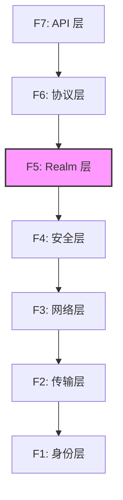

# 背景与决策 (Context)

> 回答"为什么做"：需求来源、参考研究、关键决策

---

## 目录结构

```
01_context/
├── README.md            # 本文件
├── requirements/        # 需求文档（功能/非功能需求）
│   ├── README.md        # 需求管理规范
│   ├── registry.md      # 需求注册表（全索引）
│   ├── functional/      # 功能需求（按层级分类）
│   │   ├── F1_identity/ # 身份层需求
│   │   ├── F2_transport/# 传输层需求
│   │   ├── F3_network/  # 网络层需求
│   │   ├── F4_security/ # 安全层需求
│   │   ├── F5_realm/    # Realm 层需求（DeP2P 特有）
│   │   ├── F6_protocol/ # 协议层需求
│   │   └── F7_api/      # API 层需求
│   └── non_functional/  # 非功能需求
├── references/          # 参考研究（竞品分析）
│   ├── individual/      # 单产品深度分析
│   └── comparison/      # 跨产品对比分析
└── decisions/           # 架构决策记录（ADR）
```

## 子目录说明

| 目录 | 职责 | 内容 |
|------|------|------|
| `requirements/` | 需求定义与追溯 | 功能需求、非功能需求、需求索引 |
| `references/` | 参考研究 | iroh/libp2p/torrent 分析、六维对比 |
| `decisions/` | ADR 架构决策记录 | 关键设计决策及其背景 |

---

## 需求分层体系

基于 P2P 网络分层模型，功能需求分为七层：



| 层级 | 编号前缀 | 说明 |
|------|----------|------|
| F1 | REQ-ID | 身份与密钥 |
| F2 | REQ-TRANS | 传输与连接 |
| F3 | REQ-NET | 发现、NAT、Relay |
| F4 | REQ-SEC | 加密与认证 |
| F5 | REQ-REALM | **Realm 隔离（DeP2P 特有）** |
| F6 | REQ-PROTO | 协议命名与消息 |
| F7 | REQ-API | Node API 设计 |
| NF | REQ-PERF/SCALE/OPS | 非功能需求 |

---

## ADR 编号体系

**格式**：`ADR-<编号>-<描述>.md`

- 编号：4 位数字，从 0001 开始
- 描述：简短的决策描述（使用短横线连接）

示例：
- `ADR-0001-identity-first.md`
- `ADR-0002-realm-isolation.md`

---

## 快速链接

| 文档 | 说明 |
|------|------|
| [requirements/](requirements/) | 需求文档 |
| [references/](references/) | 参考研究 |
| [decisions/](decisions/) | 架构决策 |

---

**最后更新**：2026-01-13
