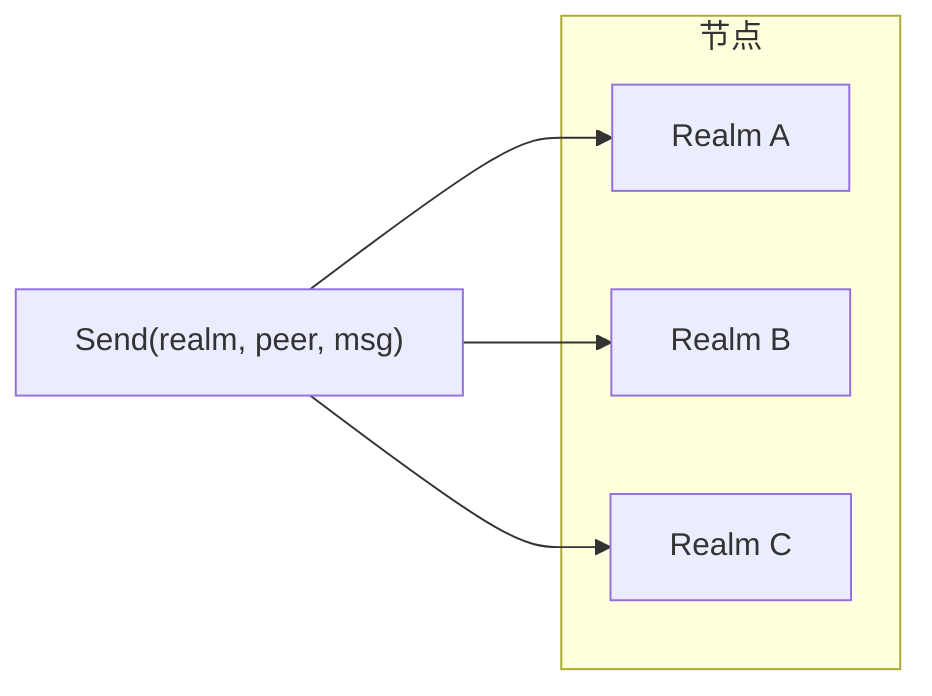
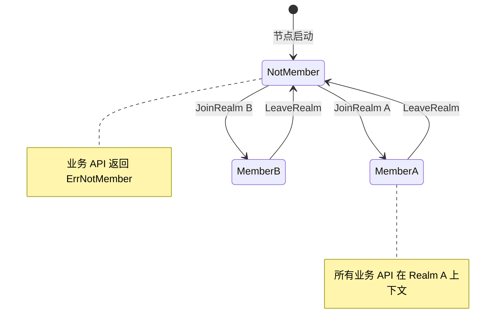
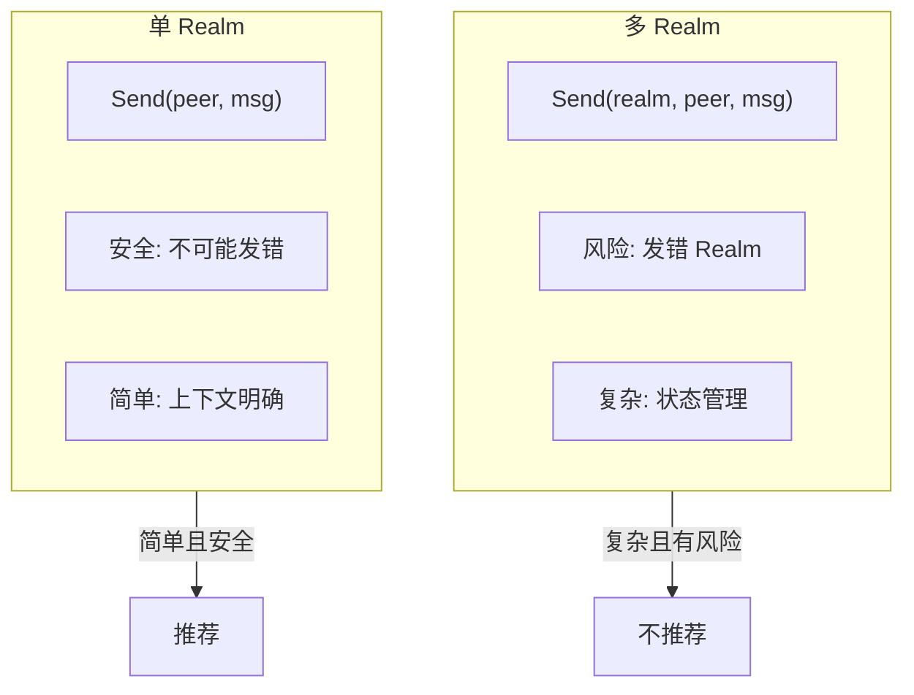
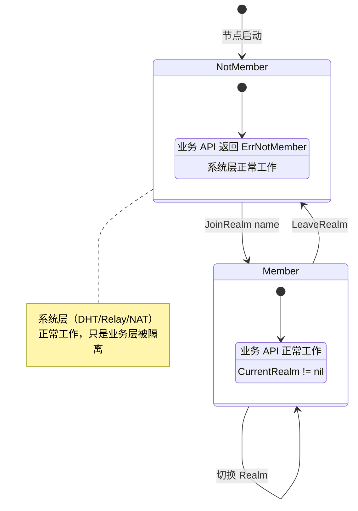
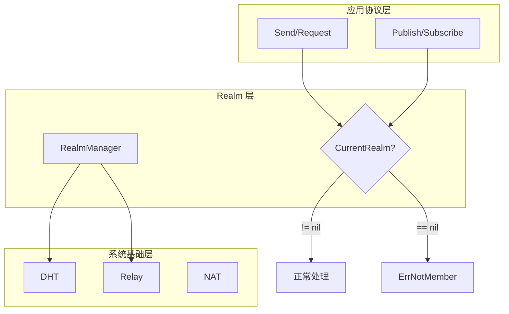

# ADR-0002: Realm 隔离设计

## 元数据

| 属性 | 值 |
|------|-----|
| **ID** | ADR-0002 |
| **标题** | Realm 隔离设计 (Strict Single Realm Isolation) |
| **状态** | accepted |
| **决策日期** | 2024-01-15 |
| **更新日期** | 2026-01-11 |
| **决策者** | DeP2P 核心团队 |
| **关联 ADR** | [ADR-0001](ADR-0001-identity-first.md) |
| **关联需求** | [REQ-REALM-001](../requirements/functional/F5_realm/REQ-REALM-001.md) |

---

## 上下文

在设计 DeP2P 的业务隔离机制时，我们需要决定节点如何管理多个业务网络（Realm）的成员资格。

### 问题背景

P2P 应用通常需要业务隔离：

- 聊天应用的不同房间
- 游戏的不同服务器
- 文件共享的不同组

如何管理节点在这些"业务网络"中的成员资格？

### 决策驱动因素

- **简单性**：用户 API 应该简单直观
- **安全性**：业务之间应该隔离，防止信息泄露
- **清晰性**：节点的业务上下文应该明确
- **可预测性**：业务 API 的行为应该可预测

---

## 考虑的选项

### 选项 1: 多 Realm 同时加入

节点可以同时加入多个 Realm，业务 API 需要指定目标 Realm。



**优点**:
- 灵活性高
- 可以同时参与多个业务

**缺点**:
- API 复杂：每个调用需要指定 Realm
- 容易混淆：消息可能发到错误的 Realm
- 状态管理复杂：需要管理多个 Realm 的状态
- 安全风险：可能意外泄露信息

### 选项 2: 严格单 Realm 模型

节点同一时间只能加入一个 Realm，切换需要显式 Leave 再 Join。



**优点**:
- API 简单：无需每次指定 Realm
- 上下文明确：`CurrentRealm()` 总是清晰
- 安全性高：无法意外发送到错误 Realm
- 可预测性：业务行为容易理解

**缺点**:
- 灵活性低：不能同时参与多个业务
- 切换成本：需要 Leave 再 Join
- 不适合某些场景：如跨 Realm 代理

---

## 决策结果

选择 **选项 2: 严格单 Realm 模型**。

### 核心决策

> **每个节点同一时间只能加入一个 Realm，Join 前业务层零交互。**

### 决策理由

1. **简单性优先**
   ```go
   // 简单的 API，无需每次指定 Realm
   node.Send(ctx, peer, proto, data)
   
   // vs 复杂的 API
   node.Send(ctx, realm, peer, proto, data)
   ```

2. **安全性保证**
   - 不可能意外发送消息到错误的 Realm
   - 业务隔离是强制的，不是可选的

3. **上下文清晰**
   - `CurrentRealm()` 总是返回明确的值
   - 不存在"当前 Realm 是哪个"的困惑

4. **错误处理简单**
   - 未加入 Realm 时，业务 API 返回 `ErrNotMember`
   - 行为可预测



---

## 后果

### 正面后果

1. **API 简洁**
   ```go
   // 业务 API 无需指定 Realm
   node.Send(ctx, peer, "/app/chat", []byte("hello"))
   node.Request(ctx, peer, "/app/query", data)
   node.Publish(ctx, "/app/events", data)
   ```

2. **安全边界清晰**
   - Realm 成员资格在连接级别验证
   - 非成员的业务消息被拒绝

3. **状态管理简单**
   - 只需管理一个 Realm 的状态
   - `CurrentRealm()` 总是明确

4. **错误处理一致**
   - `ErrNotMember`: 未加入 Realm 时调用业务 API
   - `ErrAlreadyJoined`: 已加入时再次 Join

### 负面后果

1. **不支持同时多 Realm**
   - 某些场景可能需要跨 Realm 操作
   - 需要显式切换

2. **切换有开销**
   - Leave + Join 需要网络操作
   - 可能导致短暂的服务中断

3. **代理场景复杂**
   - 跨 Realm 代理需要多个节点
   - 或者需要特殊的代理模式

### 缓解措施

| 负面后果 | 缓解措施 |
|----------|----------|
| 不支持多 Realm | 使用多个节点实例，或快速切换 |
| 切换开销 | 优化 Join/Leave 流程，支持快速切换 |
| 代理场景 | 未来可能添加专门的代理模式（新 ADR） |

---

## Realm 状态机



---

## 系统不变量

此决策产生以下系统不变量：

> **[INV-002: Realm 成员资格](invariants/INV-002-realm-membership.md)**
> 
> 业务 API（Send/Request/Publish/Subscribe）在 `CurrentRealm() == nil` 时 MUST 返回 `ErrNotMember`。

### 层次边界

| 层次 | 需要 Realm | 说明 |
|------|-----------|------|
| 系统层 | 否 | DHT/Relay/NAT 始终可用 |
| Realm 层 | - | JoinRealm/LeaveRealm 管理状态 |
| 应用层 | 是 | 业务 API 需要 Realm |

### 违反后果

| 场景 | 后果 |
|------|------|
| 未加入 Realm 发送消息 | 返回 `ErrNotMember` |
| 业务消息泄露 | 安全边界被破坏 |
| 跨 Realm 通信 | 被拒绝 |

详细规范请参阅 [INV-002: Realm 成员资格](invariants/INV-002-realm-membership.md)

---

## 代码示例

### 正确使用

```go
// 创建节点
node, _ := dep2p.NewNode(ctx, dep2p.WithPreset(dep2p.PresetDesktop))
defer node.Close()

// 此时 CurrentRealm() == nil
// 业务 API 将返回 ErrNotMember

// 加入 Realm
err := node.JoinRealm(ctx, realmID, psk)
if err != nil {
    log.Fatal(err)
}

// 现在 CurrentRealm() != nil
// 业务 API 正常工作

// 发送消息
err = node.Send(ctx, peerID, "/app/chat", []byte("hello"))

// 切换 Realm
node.LeaveRealm()
node.JoinRealm(ctx, anotherRealmID, anotherPSK)
```

### 错误处理

```go
// 未加入 Realm 时调用业务 API
err := node.Send(ctx, peerID, []byte("hello"))
if errors.Is(err, dep2p.ErrNotMember) {
    // 需要先 JoinRealm
    log.Warn("请先加入 Realm")
}

// 已加入时再次 Join
err := node.JoinRealm(ctx, anotherRealmID, psk)
if errors.Is(err, dep2p.ErrAlreadyJoined) {
    // 需要先 LeaveRealm
    log.Warn("请先离开当前 Realm")
}
```

---

## 与架构的关系



---

## 相关文档

| 类型 | 链接 |
|------|------|
| **不变量** | [INV-002](invariants/INV-002-realm-membership.md): Realm 成员资格 |
| **需求** | [REQ-REALM-001](../requirements/functional/F5_realm/REQ-REALM-001.md): Realm 强制隔离 |
| **ADR** | [ADR-0001](ADR-0001-identity-first.md): 身份优先设计 |

---

## 备注

### 与其他 P2P 系统的对比

| 系统 | 业务隔离方式 |
|------|--------------|
| libp2p | 无内置 Realm，需自行实现 |
| IPFS | 通过 pubsub topic 隔离 |
| DeP2P | 严格单 Realm 模型 |

DeP2P 的严格单 Realm 模型提供了更强的隔离保证和更简单的 API。

### 未来演进

如果需要支持同时加入多个 Realm，应该：

1. 创建新的 ADR 讨论此需求
2. 考虑使用 "Multi-Realm Node" 模式
3. 保持向后兼容性
4. 不影响现有的单 Realm 行为

---

## 变更历史

| 日期 | 版本 | 变更说明 |
|------|------|----------|
| 2024-01-15 | 1.0 | 初始版本 |
| 2026-01-11 | 1.1 | 迁移到新文档结构，更新关联链接 |
