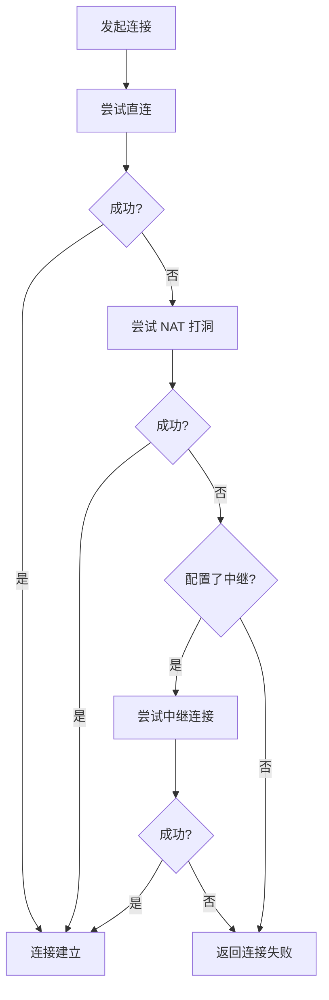
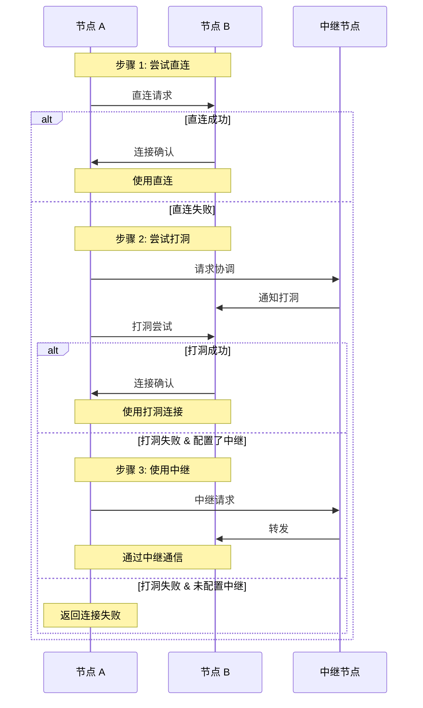

# ADR-0003: 惰性中继策略

## 元数据

| 属性 | 值 |
|------|-----|
| **ID** | ADR-0003 |
| **标题** | 惰性中继策略 (Lazy Relay Strategy) |
| **状态** | accepted |
| **决策日期** | 2024-01-20 |
| **更新日期** | 2026-01-24 |
| **决策者** | DeP2P 核心团队 |
| **关联 ADR** | [ADR-0001](ADR-0001-identity-first.md) |
| **关联需求** | [REQ-NET-003](../requirements/functional/F3_network/REQ-NET-003.md) |

---

## 上下文

在设计 DeP2P 的连接策略时，我们需要决定如何处理 NAT 环境下的节点连接。

### 问题背景

互联网上大多数设备位于 NAT 后面：

- 家庭路由器
- 企业防火墙
- 移动网络

NAT 使得节点间直接连接变得困难。P2P 系统需要解决这个问题。

### 核心认知

```
┌─────────────────────────────────────────────────────────────────────────────┐
│                         P2P 网络的核心价值                                   │
├─────────────────────────────────────────────────────────────────────────────┤
│                                                                             │
│  • P2P 的核心是【点对点直连】                                               │
│  • 中继是【辅助能力】，不是常态                                              │
│  • 中继是【业务兜底】，不应该过度设计                                        │
│                                                                             │
└─────────────────────────────────────────────────────────────────────────────┘
```

```
┌─────────────────────────────────────────────────────────────────────────────┐
│                    核心理念：中继是"系统能力"，不是"地址类型"                 │
├─────────────────────────────────────────────────────────────────────────────┤
│                                                                             │
│  用户视角：                                                                  │
│  ──────────                                                                 │
│  • 用户只需要: node.Connect(ctx, targetNodeID)                             │
│  • 用户不需要知道连接是否走中继                                             │
│  • 中继对用户完全透明                                                       │
│                                                                             │
│  系统视角：                                                                  │
│  ──────────                                                                 │
│  • 自动检测网络环境                                                         │
│  • 自动发现 Realm 内的中继候选                                              │
│  • 自动选择最优连接路径                                                     │
│  • 自动建立中继电路（如需要）                                               │
│                                                                             │
└─────────────────────────────────────────────────────────────────────────────┘
```

### 决策驱动因素

- **P2P 本质**：直连是核心，中继是辅助
- **用户体验**：中继对用户完全透明，简化 API
- **资源效率**：避免不必要的中继资源消耗
- **自动化**：Realm 内自动发现中继候选

---

## 考虑的选项

### 选项 1: 中继优先，直连升级 ❌ 不采用

首先通过中继建立连接，然后在后台尝试升级到直连。

**优点**:
- 连接总是快速成功
- 用户体验一致

**缺点**:
- 违背 P2P 本质 - 所有连接默认走中继
- 浪费中继资源 - 大多数情况直连可行
- 依赖中继基础设施
- 增加延迟

### 选项 2: 直连优先，中继兜底 ✅ 采用

首先尝试直接连接和 NAT 穿透，失败后才使用中继。

**优点**:
- 符合 P2P 本质 - 直连为主
- 资源效率最高 - 只在必要时使用中继
- 减少中继依赖
- 最优延迟

**缺点**:
- 某些 NAT 环境下首次连接可能较慢
- 需要合理的超时设置

---

## 决策结果

选择 **选项 2: 直连优先，中继兜底**（惰性中继策略）。

### 核心决策

> **连接首先尝试直连，失败后尝试 NAT 打洞，都失败时才使用中继（如果配置了）。中继是最后手段，不是默认选项。**

### v2.0 补充：地址解析来源

> **v2.0 核心原则**：直连前的地址解析以 **DHT 权威记录**为准，Relay 地址簿仅作为缓存回退

地址解析优先级：
```
Peerstore（本地缓存） → MemberList → DHT（★权威） → Relay 地址簿（缓存回退）
```

### 连接优先级

```
┌─────────────────────────────────────────────────────────────────────────────┐
│                         连接策略优先级                                       │
├─────────────────────────────────────────────────────────────────────────────┤
│                                                                             │
│    0. 地址解析（从 DHT 获取签名 PeerRecord）← v2.0 新增                      │
│       ↓                                                                     │
│    1. 直连（Direct Connection）                                             │
│       ↓ 失败                                                                │
│    2. NAT 打洞（Hole Punching）                                             │
│       ↓ 失败                                                                │
│    3. 中继（Relay）← 仅当配置了中继时                                        │
│       ↓ 未配置或失败                                                        │
│    4. 返回连接失败错误                                                       │
│                                                                             │
└─────────────────────────────────────────────────────────────────────────────┘
```

### ★ 打洞需要信令通道（BUG-27 澄清）

```
┌─────────────────────────────────────────────────────────────────────────────┐
│                    打洞流程详解（★ 关键理解）                                 │
├─────────────────────────────────────────────────────────────────────────────┤
│                                                                             │
│  ★ 打洞需要信令通道来协调双方同时发包                                        │
│  ★ 信令通道通常是 Relay 连接（NAT 后节点首先能建立的连接）                   │
│                                                                             │
│  Swarm.DialPeer 实际流程：                                                   │
│  ══════════════════════════                                                 │
│                                                                             │
│  1. 尝试直连（使用 Peerstore 的 directAddrs）                                │
│     ↓ 失败                                                                  │
│  2. 建立 Relay 连接（作为信令通道 + 数据兜底）                               │
│     ↓ 成功                                                                  │
│  3. 在 Relay 连接上进行打洞协商（DCUtR）                                     │
│     • 交换双方的 ShareableAddrs（观测地址）                                 │
│     • 同时向对方地址发包打洞                                                │
│     ↓                                                                       │
│  4. 打洞结果                                                                 │
│     • 成功 → 返回新建立的直连连接                                            │
│     • 失败 → 返回步骤 2 建立的 Relay 连接（兜底）                            │
│                                                                             │
│  ═══════════════════════════════════════════════════════════════════════   │
│  ★ 关键洞察：                                                               │
│  ═══════════════════════════════════════════════════════════════════════   │
│                                                                             │
│  1. Relay 连接是打洞的前提条件                                              │
│     • 打洞需要信令通道来交换地址                                            │
│     • 没有 Relay 连接就无法进行打洞协商                                     │
│                                                                             │
│  2. 打洞不依赖 Peerstore 的 directAddrs（BUG-27 修复）                       │
│     • NAT 节点的 PeerRecord 只有 relay_addrs，没有 direct_addrs            │
│     • 打洞时双方通过 CONNECT 消息交换当前的 ShareableAddrs（观测地址）      │
│     • ShareableAddrs 包含 STUN 观测地址、Relay 地址等                      │
│                                                                             │
│  3. 打洞失败时 Relay 连接自动兜底                                           │
│     • 步骤 2 建立的 Relay 连接不会被浪费                                    │
│     • 打洞失败后直接返回这个 Relay 连接                                     │
│                                                                             │
└─────────────────────────────────────────────────────────────────────────────┘
```

### 决策理由

1. **P2P 本质**
   - P2P 网络的核心价值是节点直连
   - 中继只是解决特殊情况的辅助手段
   - 不应该让辅助手段成为默认路径

2. **资源效率**
   - 大多数情况下直连是可行的
   - 不必要的中继连接浪费资源
   - 中继应该留给真正需要的场景

3. **用户责任**
   - 用户应该确保自己有可连接的网络环境
   - 公网 IP 或正确配置的 NAT
   - 中继不是免费的网络修复方案

4. **简单设计**
   - 中继作为兜底，逻辑简单
   - 不需要复杂的升级策略
   - 不需要维护大量中继连接

---

## 连接流程





---

## 后果

### 正面后果

1. **符合 P2P 本质**
   - 直连是主要路径
   - 中继只是例外情况

2. **资源效率**
   - 只在必要时使用中继
   - 减少中继服务器负载

3. **简单设计**
   - 不需要复杂的连接升级
   - 逻辑清晰，易于维护

4. **用户明确**
   - 用户知道中继是可选的
   - 鼓励用户改善网络环境

### 负面后果

1. **特定场景连接失败**
   - 双 NAT 且未配置中继时可能失败
   - 需要用户配置中继

2. **需要合理超时**
   - 直连和打洞需要适当超时
   - 避免等待过长

### 缓解措施

| 负面后果 | 缓解措施 |
|----------|----------|
| 连接失败 | 提供清晰的错误信息，引导用户配置中继 |
| 超时问题 | 使用合理的默认超时，支持用户配置 |

---

## 打洞后 Relay 保留策略

> **决策**：打洞成功后保留 Relay 连接，降级为备用状态。

### 理由

| 原因 | 说明 |
|------|------|
| **其他节点需要** | A-B 打洞成功，但 A-C、A-D 可能仍需借助 Relay |
| **信令通道** | Relay 连接用于打洞协调信令 |
| **网络变化** | 直连可能因网络变化断开，Relay 作为 fallback |
| **重建成本** | 重建 Relay 连接有成本（握手、预留） |

### 连接状态机

```
RelayOnly → [打洞成功] → DirectPrimary + RelayBackup
                              │
                              ↓ [直连断开]
                          RelayOnly → [重试打洞]
```

### 实现建议

- 打洞成功后，将 Relay 连接降级为"备用"状态
- 备用连接仍维护保活，但不主动使用
- 直连失败时自动切换到 Relay
- 可配置是否保留（高级用户可选择关闭以节省资源）

详见 [概念澄清文档 §17.3](../_discussions/20260123-nat-relay-concept-clarification.md)。

---

## NAT 类型指导打洞

> **决策**：NAT 类型检测值得实现，用于优化打洞决策。

### 打洞决策矩阵

| 发起方 NAT ╲ 目标方 NAT | Full Cone | Restricted | Symmetric |
|------------------------|-----------|------------|-----------|
| **Full Cone** | 直连优先 | 打洞优先 | 打洞尝试 |
| **Restricted** | 打洞优先 | 打洞尝试 | Relay |
| **Symmetric** | 打洞尝试 | Relay | **Relay** |

### 关键优化

1. **双 Symmetric NAT 直接 Relay**
   - 双方都是 Symmetric NAT 时，直接使用 Relay
   - 不浪费时间进行注定失败的打洞尝试
   - 节省 5-30 秒的无效等待

2. **根据 NAT 类型设置超时**
   - Full Cone: 短超时（5s），高成功率
   - Restricted: 中等超时（10s）
   - Symmetric 对 Cone: 长超时（15s），可能需要端口预测

详见 [概念澄清文档 §17.4](../_discussions/20260123-nat-relay-concept-clarification.md)。

---

## 连接成功的层级定义

为避免"连接成功但无法通信"的问题，明确连接成功的层级：

| 层级 | 名称 | 含义 | 检查内容 |
|------|------|------|---------|
| L1 | 传输层连接 | QUIC 连接建立 | 握手完成 |
| L2 | 协议层连接 | DeP2P 协议协商完成 | 版本兼容、身份验证 |
| L3 | 应用层连接 | Realm 认证通过 | PSK 验证、成员检查 |

**Connect API 语义**：

```go
// Connect() 返回成功时，应保证：
// 1. 传输层连接已建立（L1）
// 2. 协议层协商完成（L2）
// 3. 如果目标是 Realm 内成员，Realm 认证已通过（L3）
//
// 即：连接成功 = 可通信
err := node.Connect(ctx, targetID)
```

**设计原则**：
- 连接失败应尽早暴露，不应存在"连接成功但发消息失败"的中间状态
- 如果需要 Realm 认证，应在 Connect 内完成，而非延迟到首次消息

详见 [概念澄清文档 §15.1](../_discussions/20260123-nat-relay-concept-clarification.md)。

---

## 中继配置原则

### 配置方式

```go
// Relay：node 级别，启动时配置
node, _ := dep2p.NewNode(ctx,
    dep2p.WithRelay("/ip4/relay.dep2p.io/tcp/4001/p2p/QmRelay..."),
)

// Relay：realm 级别，加入时可选配置
realm, _ := node.JoinRealm(ctx, realmID, psk,
    dep2p.WithRelay("/ip4/1.2.3.4/tcp/4001/p2p/QmRelay..."),
)
```

### 配置 ≠ 连接

```
┌─────────────────────────────────────────────────────────────────────────────┐
│                    配置 ≠ 连接                                               │
├─────────────────────────────────────────────────────────────────────────────┤
│                                                                             │
│  SetRelay(addr) 做什么：                                                    │
│  1. 验证地址格式                                                             │
│  2. 过滤自身（不能配置自己为中继）                                           │
│  3. 保存配置                                                                 │
│  4. 【不立即连接】                                                           │
│                                                                             │
│  何时连接：                                                                  │
│  • 直连失败 + 打洞失败 → 自动连接中继                                       │
│  • 用户手动调用 ConnectRelay() → 主动连接                                   │
│                                                                             │
└─────────────────────────────────────────────────────────────────────────────┘
```

---

## 代码示例

### 基本用法（中继透明）

```go
// 发起连接 - 用户完全不需要关心中继
// 系统自动: 直连 → 打洞 → Realm 内中继 → 公共中继
err := node.Connect(ctx, targetID)
if err != nil {
    log.Error("连接失败", "error", err)
}

// 用户不需要知道底层是直连还是中继
```

### Realm 内消息（中继完全透明）

```go
// Realm 内通信 - 中继自动发现和使用
realm.Messaging().Send(ctx, targetID, []byte("hello"))

// 系统内部自动处理:
// 1. 尝试直连
// 2. 尝试 NAT 打洞
// 3. 查询 Realm 内中继候选（自动发现的公网节点）
// 4. 选择最优中继，建立电路
// 5. 用户完全无感
```

### 检查连接类型（可选，调试用）

```go
// 用户通常不需要检查连接类型
// 但调试时可以查看
conn := node.Connection(targetID)
if conn != nil {
    switch conn.Type() {
    case dep2p.ConnTypeDirect:
        log.Info("直接连接")
    case dep2p.ConnTypeHolePunch:
        log.Info("打洞连接")
    case dep2p.ConnTypeRelay:
        log.Info("中继连接（用户无感）")
    }
}
```

### 高级用户：手动配置专用中继（可选）

```go
// 对于需要精确控制的高级用户
// 可以手动配置专用 Relay
node.SetRelay("/ip4/relay.dep2p.io/tcp/4001/p2p/QmRelay...")

// 或主动成为 Realm 中继提供者
realm.BecomeRelay(ctx)
```

---

## 性能数据

基于测试数据：

| 场景 | 直连优先 | 中继优先 |
|------|----------|----------|
| 双方公网 | 100ms ✓ | 150ms |
| 一方 NAT (可打洞) | 300ms ✓ | 200ms |
| 双方 NAT (可打洞) | 500ms ✓ | 200ms |
| 双方 NAT (不可打洞) | 失败/使用中继 | 200ms |

**分析**：
- 大多数场景下直连优先性能更好
- 只有双 NAT 且不可打洞时才真正需要中继
- 这种场景应该使用中继，但不应该让所有场景都走中继

---

## 相关文档

| 类型 | 链接 |
|------|------|
| **概念澄清** | [NAT/Relay 概念澄清](../_discussions/20260123-nat-relay-concept-clarification.md) |
| **需求** | [REQ-NET-003](../requirements/functional/F3_network/REQ-NET-003.md): Relay 中继 |
| **需求** | [REQ-NET-002](../requirements/functional/F3_network/REQ-NET-002.md): NAT 穿透 |
| **ADR** | [ADR-0005](ADR-0005-relay-deployment-models.md): Relay 部署模型 |
| **ADR** | [ADR-0010](ADR-0010-relay-explicit-config.md): Relay 明确配置 |

---

## 备注

### 与其他 P2P 系统的对比

| 系统 | 连接策略 |
|------|----------|
| WebRTC | ICE 框架，多候选并行 |
| libp2p | 可配置，默认直连优先 |
| IPFS | 使用 libp2p，直连优先 |
| DeP2P | 直连优先，中继兜底（惰性中继） |

DeP2P 的惰性中继策略符合 P2P 的本质，与主流 P2P 系统保持一致。

---

## 变更历史

| 日期 | 版本 | 变更说明 |
|------|------|----------|
| 2024-01-20 | 1.0 | 初始版本（中继优先策略） |
| 2026-01-11 | 2.0 | **重大变更**：改为惰性中继策略（直连优先，中继兜底） |
| 2026-01-23 | 2.1 | 根据概念澄清文档同步：补充打洞后 Relay 保留策略、NAT 类型指导打洞决策矩阵、连接成功层级定义 |
| 2026-01-24 | 2.2 | **v2.0 DHT 权威模型对齐**：补充地址解析来源说明（DHT 权威优先于 Relay 缓存） |
