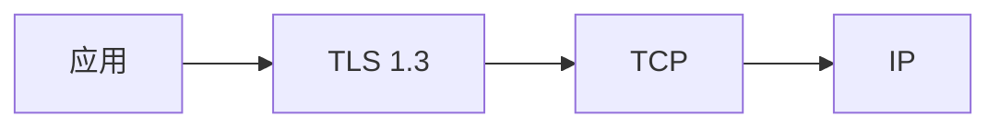
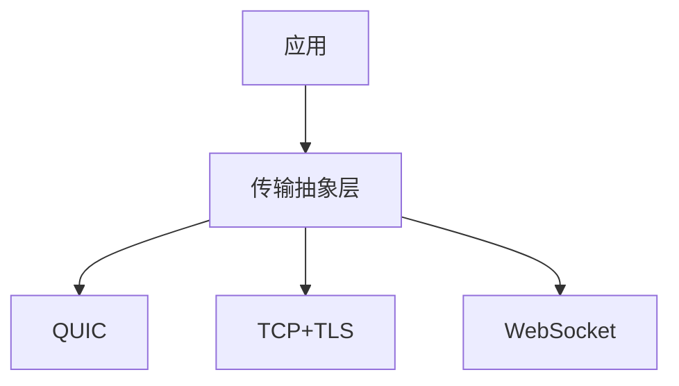
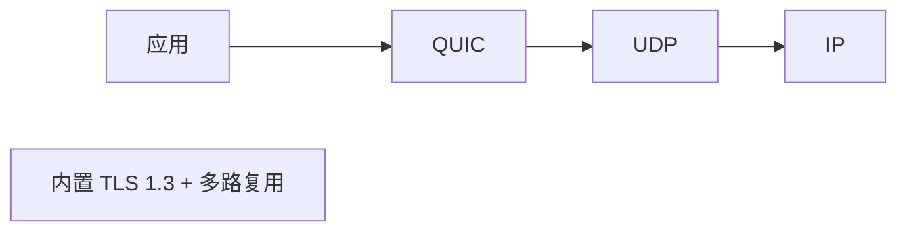
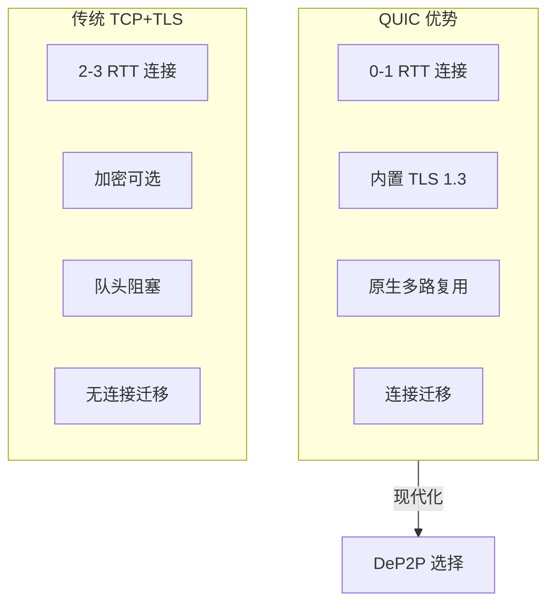
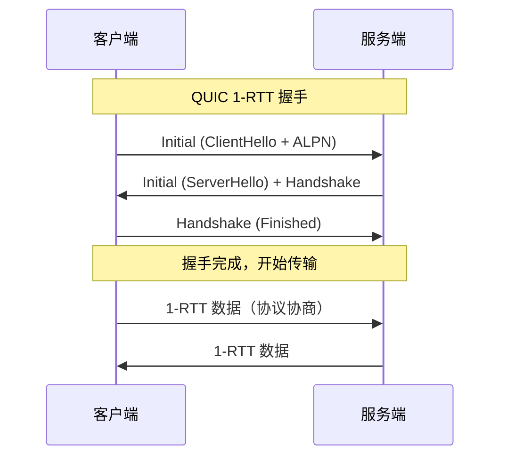
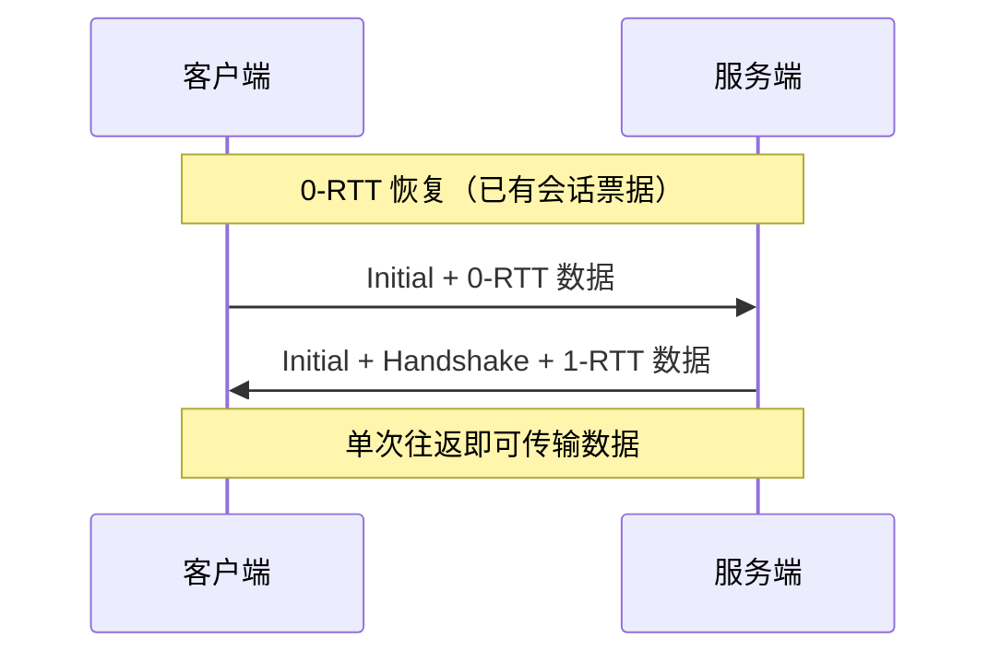
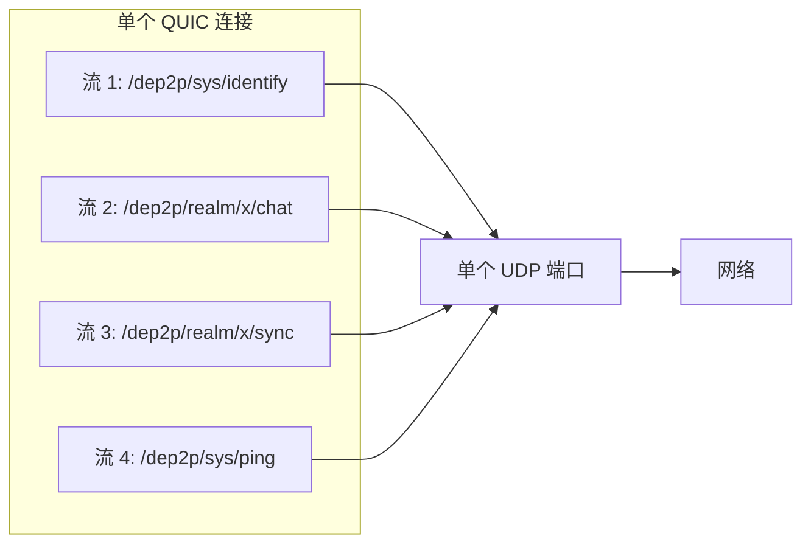
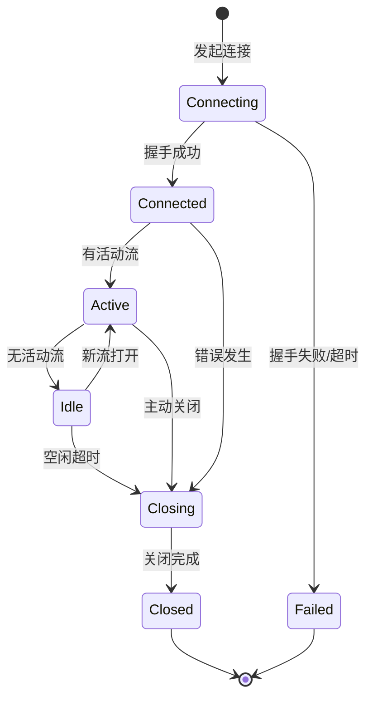
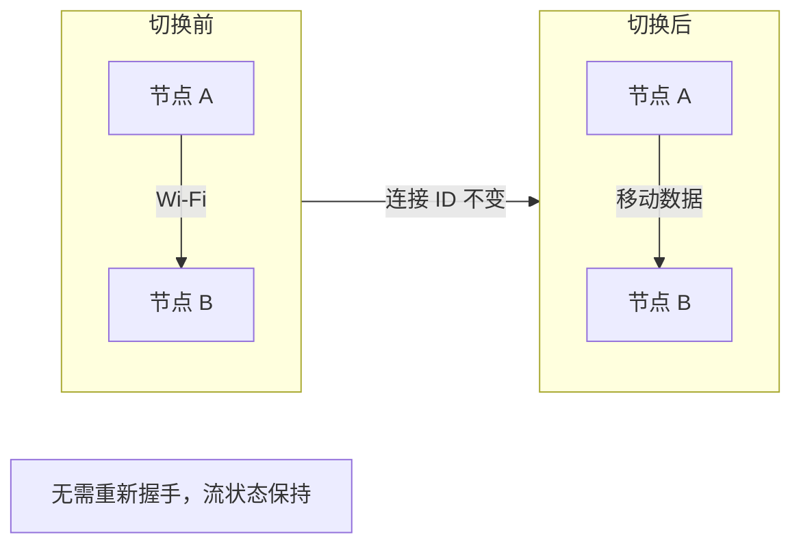
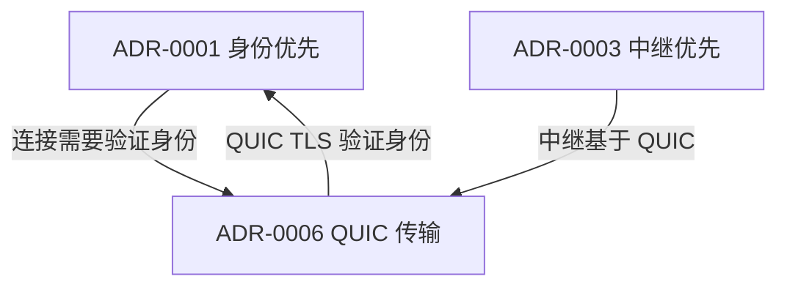

# ADR-0006: QUIC 传输选择

## 元数据

| 属性 | 值 |
|------|-----|
| **ID** | ADR-0006 |
| **标题** | QUIC 传输选择 (QUIC as Primary Transport) |
| **状态** | accepted |
| **决策日期** | 2026-01-11 |
| **更新日期** | 2026-01-23 |
| **决策者** | DeP2P 核心团队 |
| **关联 ADR** | [ADR-0003](ADR-0003-relay-first-connect.md) |
| **关联需求** | [REQ-TRANS-001](../requirements/functional/F2_transport/REQ-TRANS-001.md) |

---

## 上下文

在设计 DeP2P 的传输层时，我们需要决定采用哪种传输协议作为核心。这个选择将影响连接性能、安全性和实现复杂度。

### 问题背景

传统 P2P 系统面临多种传输选择：

- **TCP + TLS**：成熟但连接慢
- **QUIC**：现代但相对较新
- **多传输并存**：灵活但复杂

### 决策驱动因素

- **性能**：低延迟连接建立
- **安全**：内置加密
- **移动性**：支持连接迁移
- **简单性**：减少实现复杂度
- **多路复用**：无队头阻塞

---

## 竞品分析

| 产品 | 传输策略 | 实现 | 特点 |
|------|----------|------|------|
| **iroh** | QUIC 优先 | quinn (Rust) | 无 TCP，纯 QUIC |
| **go-libp2p** | 多传输 | quic-go + TCP | 可插拔，灵活 |
| **torrent** | TCP/uTP | 自定义 | 无 QUIC 支持 |

### iroh 的设计理念

iroh 采用"QUIC-only"策略：

```go
// iroh 不提供 TCP 选项
endpoint := iroh.NewEndpoint()  // 仅 QUIC
```

优点：
- 简化实现
- 一致的行为
- 现代化架构

### libp2p 的设计理念

libp2p 采用"多传输可插拔"策略：

```go
// libp2p 支持多种传输
host.NewHost(
    libp2p.Transport(quic.NewTransport),
    libp2p.Transport(tcp.NewTransport),
    libp2p.Transport(ws.NewTransport),
)
```

优点：
- 高度灵活
- 兼容性好

缺点：
- 实现复杂
- 行为不一致

---

## 考虑的选项

### 选项 1: TCP + TLS 传统方案

使用传统的 TCP 作为基础，加上 TLS 1.3 加密。



**优点**:
- 成熟稳定
- 广泛支持
- 工具链完善

**缺点**:
- 连接建立慢（2-3 RTT）
- 队头阻塞
- 无连接迁移
- 需要额外多路复用层（yamux）

### 选项 2: 多传输并存

同时支持 TCP、QUIC、WebSocket 等多种传输。



**优点**:
- 高度灵活
- 最大兼容性
- 适应各种网络环境

**缺点**:
- 实现复杂度高
- 行为不一致
- 维护成本高
- 测试矩阵爆炸

### 选项 3: QUIC 优先（采用）

以 QUIC 作为核心传输协议，暂不支持其他传输。



**优点**:
- 0-1 RTT 连接建立
- 内置 TLS 1.3 加密
- 原生多路复用，无队头阻塞
- 连接迁移支持
- 实现简单一致

**缺点**:
- UDP 可能被阻止（极少数网络）
- 相对较新
- 库生态不如 TCP 成熟

---

## 决策结果

选择 **选项 3: QUIC 优先**。

### 核心决策

> **DeP2P 以 QUIC 作为核心传输协议，不支持 TCP 回退。**

### 决策理由

1. **性能优势明显**

   | 特性 | TCP+TLS | QUIC |
   |------|---------|------|
   | 连接建立 | 2-3 RTT | 0-1 RTT |
   | 队头阻塞 | 有 | 无 |
   | 连接迁移 | 不支持 | 支持 |
   | 加密 | 可选 | 强制 |

2. **简化实现**
   - 单一传输路径
   - 行为一致
   - 测试简单

3. **现代化趋势**
   - HTTP/3 使用 QUIC
   - 主流浏览器支持
   - iroh 验证了可行性

4. **P2P 场景契合**
   - NAT 环境下 UDP 穿透更好
   - 移动设备需要连接迁移
   - 多流场景普遍



---

## 后果

### 正面后果

1. **低延迟连接**
   - 首次连接 1 RTT
   - 会话恢复 0 RTT

2. **安全性内置**
   - 所有连接自动加密
   - 无需额外配置

3. **无队头阻塞**
   - 多流独立
   - 单流丢包不影响其他流

4. **连接迁移**
   - 网络切换不断连
   - 移动设备友好

5. **实现简洁**
   ```go
   // 单一传输，简单直接
   transport := quic.NewTransport(config)
   ```

### 负面后果

1. **UDP 阻止场景**
   - 极少数企业网络阻止 UDP
   - 这种情况下无法连接

2. **库成熟度**
   - Go 的 quic-go 较成熟
   - 但不如 TCP 生态完善

3. **调试工具**
   - Wireshark 等工具对 QUIC 支持不如 TCP
   - 需要专门的 QUIC 调试方法

### 缓解措施

| 负面后果 | 缓解措施 |
|----------|----------|
| UDP 阻止 | 通过 Relay 中继（Relay 可能部署在允许 UDP 的位置） |
| 库成熟度 | 选择成熟的 quic-go 库，持续关注更新 |
| 调试 | 内置完善的日志和指标系统 |

---

## 技术细节

### 连接握手流程



### 0-RTT 恢复

对于已知节点，支持 0-RTT 快速恢复：



### 流多路复用



---

## QUIC 配置

### 核心参数

| 参数 | 默认值 | 描述 |
|------|--------|------|
| `MaxIncomingStreams` | 256 | 最大入站并发流 |
| `MaxIncomingUniStreams` | 256 | 最大入站单向流 |
| `MaxIdleTimeout` | 30s | 空闲超时 |
| `KeepAlivePeriod` | 15s | 保活间隔 |
| `InitialStreamReceiveWindow` | 512KB | 初始流接收窗口 |
| `MaxStreamReceiveWindow` | 6MB | 最大流接收窗口 |
| `Allow0RTT` | true | 启用 0-RTT |

### 推荐配置

```go
// QUIC 传输配置
type QUICConfig struct {
    MaxIncomingStreams    int64         // 最大入站流
    MaxIncomingUniStreams int64         // 最大入站单向流
    MaxIdleTimeout        time.Duration // 空闲超时
    KeepAlivePeriod       time.Duration // 保活间隔 ★ 必需配置
    Allow0RTT             bool          // 启用 0-RTT
}

// 默认配置
var DefaultQUICConfig = &QUICConfig{
    MaxIncomingStreams:    256,
    MaxIncomingUniStreams: 256,
    MaxIdleTimeout:        30 * time.Second,
    KeepAlivePeriod:       15 * time.Second,  // ★ 必需：防止空闲断连
    Allow0RTT:             true,
}
```

> **⚠️ 实现注意**：`KeepAlivePeriod` 是**必需**配置。如果不设置，QUIC 连接会在
> `MaxIdleTimeout` 后自动断开，导致节点通信中断。推荐值为 `MaxIdleTimeout / 2`。

### ALPN 协商

```go
// 使用 ALPN 进行协议协商
tlsConfig := &tls.Config{
    NextProtos: []string{
        "dep2p/1.0.0",
    },
    // 证书绑定 NodeID
    Certificates: []tls.Certificate{cert},
}
```

### 连接生命周期



### 连接迁移

当节点网络切换（如 Wi-Fi → 移动数据）时，QUIC 支持无缝迁移：



### QUIC 对 NAT 穿透的影响

QUIC 基于 UDP，这对 NAT 穿透有重要影响：

| 特性 | UDP (QUIC) | TCP |
|------|-----------|-----|
| 打洞成功率 | 较高（~70%） | 较低（~30%） |
| NAT 映射保持 | ~30 秒 | 更短 |
| 打洞实现 | 中等复杂度 | 高（需 simultaneous open） |

**DeP2P 的 NAT 穿透策略**：

1. **仅实现 UDP 打洞**：基于 QUIC 传输，不实现 TCP 打洞
2. **连接迁移优势**：NAT 重新映射时，QUIC 连接可无缝迁移
3. **打洞失败时**：降级到 Relay 中继

详见 [概念澄清文档 §8.1.1](../_discussions/20260123-nat-relay-concept-clarification.md) 和 [REQ-NET-002](../requirements/functional/F3_network/REQ-NET-002.md)。

---

## 与其他 ADR 的关系



---

## 相关文档

| 类型 | 链接 |
|------|------|
| **概念澄清** | [NAT/Relay 概念澄清](../_discussions/20260123-nat-relay-concept-clarification.md) |
| **需求** | [REQ-TRANS-001](../requirements/functional/F2_transport/REQ-TRANS-001.md): QUIC 传输 |
| **需求** | [REQ-NET-002](../requirements/functional/F3_network/REQ-NET-002.md): NAT 穿透 |
| **需求** | [REQ-SEC-001](../requirements/functional/F4_security/REQ-SEC-001.md): 传输加密 |
| **竞品** | [传输协议对比](../references/comparison/transport/01-transport-protocols.md) |
| **竞品** | [iroh 分析](../references/individual/iroh.md) |

---

## 未来演进

1. **WebTransport 支持**
   - 浏览器场景可能需要 WebTransport
   - 作为 QUIC 的补充，而非替代

2. **TCP Fallback（可选）**
   - 如果用户强烈需求
   - 作为可选配置，不影响默认行为

3. **QUIC v2**
   - 关注 QUIC 协议演进
   - 适时升级

---

## 变更历史

| 日期 | 版本 | 变更说明 |
|------|------|----------|
| 2026-01-11 | 1.0 | 初始版本，基于竞品分析创建 |
| 2026-01-18 | 1.1 | 增加 KeepAlivePeriod 必需配置说明，关联问题追踪文档 |
| 2026-01-23 | 1.2 | 根据概念澄清文档同步：补充 QUIC 对 NAT 穿透的影响（UDP vs TCP 打洞差异） |
