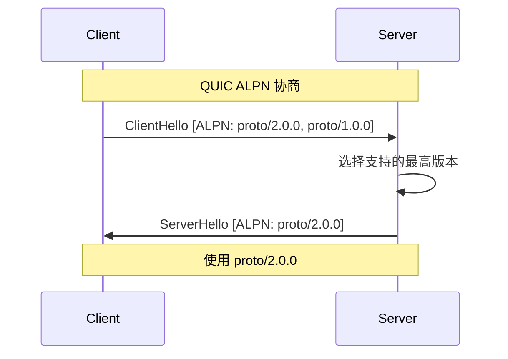

# ADR-0007: 协议命名规范

## 元数据

| 属性 | 值 |
|------|-----|
| **ID** | ADR-0007 |
| **标题** | 协议命名规范 (Protocol Naming Convention) |
| **状态** | accepted |
| **决策日期** | 2026-01-11 |
| **更新日期** | 2026-01-11 |
| **决策者** | DeP2P 核心团队 |
| **关联 ADR** | [ADR-0002](ADR-0002-realm-isolation.md) |
| **关联需求** | [REQ-PROTO-001](../requirements/functional/F6_protocol/REQ-PROTO-001.md) |

---

## 上下文

在设计 DeP2P 的协议层时，我们需要定义协议的命名规范。这个规范将影响协议的可识别性、隔离性和版本管理。

### 问题背景

P2P 系统中存在多种协议：

- **系统协议**：DHT、Relay、打洞等
- **应用协议**：业务自定义的通信协议
- **Realm 协议**：特定 Realm 内的协议

如何命名和组织这些协议，使其：
- 易于识别和管理
- 支持版本控制
- 与 Realm 隔离配合

### 决策驱动因素

- **可读性**：协议 ID 应该人类可读
- **唯一性**：避免协议冲突
- **隔离性**：与 Realm 隔离机制配合
- **版本化**：支持协议演进
- **协商**：支持 ALPN 等协商机制

---

## 竞品分析

| 产品 | 命名格式 | 示例 | 特点 |
|------|----------|------|------|
| **libp2p** | 路径格式 | `/ipfs/kad/1.0.0` | 层次化，可读 |
| **iroh** | ALPN 字节 | `n0/iroh-net/0` | 简洁，高效 |
| **gRPC** | 包名.服务名 | `package.Service/Method` | 结构化 |

### libp2p 的协议命名

```go
// libp2p 风格
"/ipfs/kad/1.0.0"      // DHT 协议
"/libp2p/circuit/relay/0.2.0"  // 中继协议
"/my-app/chat/1.0.0"   // 应用协议
```

优点：
- 人类可读
- 层次清晰
- 版本明确

### iroh 的 ALPN 命名

```rust
// iroh 使用简短的 ALPN 标识
"n0/iroh-net/0"
"n0/iroh-sync/2"
```

优点：
- 简洁高效
- 减少握手开销

---

## 考虑的选项

### 选项 1: 简单字符串

使用简单的字符串标识协议。

```go
"dht"
"relay"
"chat"
```

**优点**:
- 简单

**缺点**:
- 无版本管理
- 容易冲突
- 无层次结构

### 选项 2: ALPN 风格

使用简短的 ALPN 风格标识。

```go
"dep2p/0"
"dep2p-dht/1"
```

**优点**:
- 简洁高效
- 低开销

**缺点**:
- 可读性差
- 不支持复杂层次

### 选项 3: 层次化路径格式（采用）

采用 libp2p 风格的层次化路径格式，增加 Realm 支持。

```go
"/dep2p/{domain}/{protocol}/{version}"
```

**优点**:
- 人类可读
- 层次清晰
- 支持 Realm 隔离
- 版本明确

**缺点**:
- 稍长
- 需要解析

---

## 决策结果

选择 **选项 3: 层次化路径格式**。

### 核心决策

> **DeP2P 采用层次化协议命名：`/dep2p/{domain}/{protocol}/{version}`**

### 命名格式

```
/dep2p/<domain>/<protocol>/<version>
```

| 组件 | 说明 | 示例 |
|------|------|------|
| `dep2p` | 固定前缀 | `dep2p` |
| `domain` | 域（sys/app/realm） | `sys`, `app`, `realm/xxx` |
| `protocol` | 协议名 | `relay`, `dht`, `chat` |
| `version` | 语义化版本 | `1.0.0`, `2.1.0` |

---

## 协议分类

### 系统协议 (/dep2p/sys/*)

系统级协议，用于基础设施。

```go
// 系统协议示例
"/dep2p/relay/1.0.0/{hop,stop}"      // 中继
"/dep2p/sys/discovery/1.0.0"  // 发现
"/dep2p/sys/holepunch/1.0.0"  // 打洞
"/dep2p/sys/ping/1.0.0"       // 心跳
"/dep2p/sys/identity/1.0.0"   // 身份交换
```

特点：
- 任何节点都可使用
- 不受 Realm 限制
- 由 DeP2P 内部管理

### 应用协议 (/dep2p/app/*)

应用自定义协议。

```go
// 应用协议示例
"/dep2p/app/myapp/chat/1.0.0"
"/dep2p/app/myapp/sync/2.0.0"
"/dep2p/app/game/state/1.0.0"
```

特点：
- 应用自行定义
- 可在任何 Realm 中使用

### Realm 协议 (/dep2p/realm/<id>/*)

特定 Realm 内的协议。

```go
// Realm 协议示例
"/dep2p/realm/my-app/msg/1.0.0"
"/dep2p/realm/my-app/sync/1.0.0"
"/dep2p/realm/game-server/state/1.0.0"
```

特点：
- 绑定到特定 Realm
- 只能在对应 Realm 内使用
- 配合统一 Relay 架构

---

## 协议分层图

```mermaid
flowchart TB
    subgraph Namespace[协议命名空间]
        SYS[系统协议<br/>/dep2p/sys/*]
        APP[应用协议<br/>/dep2p/app/*]
        REALM[Realm 协议<br/>/dep2p/realm/id/*]
    end
    
    SYS --> S1[/dep2p/relay/1.0.0/{hop,stop}]
    SYS --> S2[/dep2p/sys/discovery/1.0.0]
    SYS --> S3[/dep2p/sys/holepunch/1.0.0]
    
    APP --> A1[/dep2p/app/myapp/chat/1.0.0]
    
    REALM --> R1[/dep2p/realm/my-realm/msg/1.0.0]
```

---

## 版本协商

### QUIC ALPN 协商



### 版本匹配规则

```go
// 版本匹配策略
// 1. 精确匹配优先
// 2. 主版本相同，选择最高次版本
// 3. 无匹配则拒绝

func MatchProtocol(requested []string, supported []string) (string, bool) {
    // 尝试精确匹配
    for _, r := range requested {
        for _, s := range supported {
            if r == s {
                return r, true
            }
        }
    }
    // 尝试兼容匹配
    // ...
    return "", false
}
```

---

## 实现示例

### 协议注册

```go
// 注册系统协议
node.RegisterHandler("/dep2p/sys/ping/1.0.0", pingHandler)

// 注册应用协议
node.RegisterHandler("/dep2p/app/chat/msg/1.0.0", msgHandler)

// 注册 Realm 协议（需要先 JoinRealm）
node.JoinRealm(ctx, "my-app", psk)
node.RegisterHandler("/dep2p/realm/my-app/msg/1.0.0", realmMsgHandler)
```

### 协议调用

```go
// 打开流时指定协议
stream, err := conn.OpenStream(ctx, "/dep2p/app/chat/msg/1.0.0")
if err != nil {
    if errors.Is(err, ErrProtocolNotSupported) {
        // 对端不支持此协议
    }
}
```

---

## 与 Realm 隔离的配合

### 协议路由规则

| 协议域 | 允许的 Relay | 说明 |
|--------|--------------|------|
| `/dep2p/sys/*` | Relay | 系统层，公共基础设施 |
| `/dep2p/app/*` | 任意 | 应用协议，无特殊限制 |
| `/dep2p/realm/<id>/*` | Relay（成员认证） | 严格隔离 |

### 验证逻辑

```go
// Relay 对系统协议校验
func (r *Relay) validateSysProtocol(proto string) error {
    if !strings.HasPrefix(proto, "/dep2p/sys/") {
        return ErrProtocolNotAllowed
    }
    return nil
}

// Relay 对 Realm 协议校验
func (r *Relay) validateRealmProtocol(proto string) error {
    prefix := fmt.Sprintf("/dep2p/realm/%s/", r.realmID)
    if !strings.HasPrefix(proto, prefix) {
        return ErrProtocolNotAllowed
    }
    return nil
}
```

---

## 后果

### 正面后果

1. **清晰的层次结构**
   - 系统/应用/Realm 明确分离
   - 协议归属一目了然

2. **版本管理**
   - 语义化版本
   - 支持协议演进

3. **Realm 隔离支持**
   - 协议前缀天然支持隔离
   - 与统一 Relay 配合良好

4. **人类可读**
   - 日志和调试友好
   - 易于理解

### 负面后果

1. **协议 ID 较长**
   - 增加少量网络开销
   - 可接受

2. **需要解析**
   - 增加少量 CPU 开销
   - 可接受

---

## 相关文档

| 类型 | 链接 |
|------|------|
| **需求** | [REQ-PROTO-001](../requirements/functional/F6_protocol/REQ-PROTO-001.md): 协议命名空间 |
| **ADR** | [ADR-0002](ADR-0002-realm-isolation.md): Realm 隔离设计 |
| **竞品** | [协议设计对比](../references/comparison/protocol/01-protocol-design.md) |

---

## 变更历史

| 日期 | 版本 | 变更说明 |
|------|------|----------|
| 2026-01-11 | 1.0 | 初始版本，基于竞品分析创建 |
