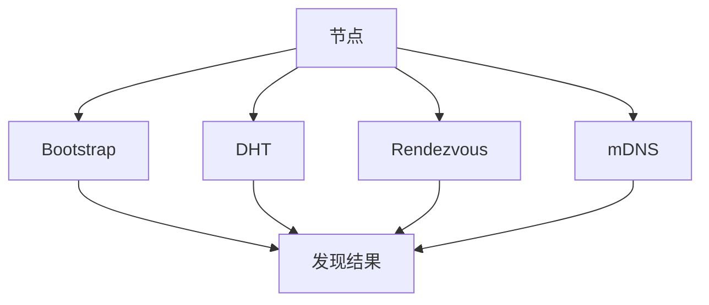
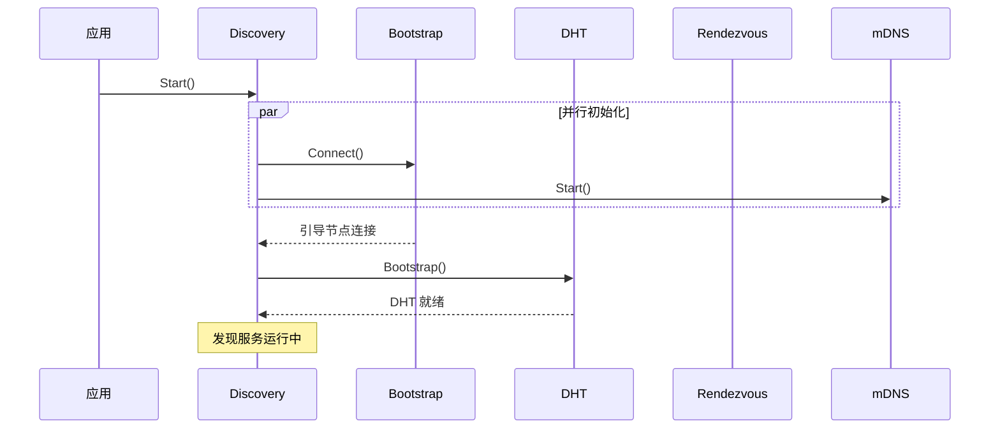
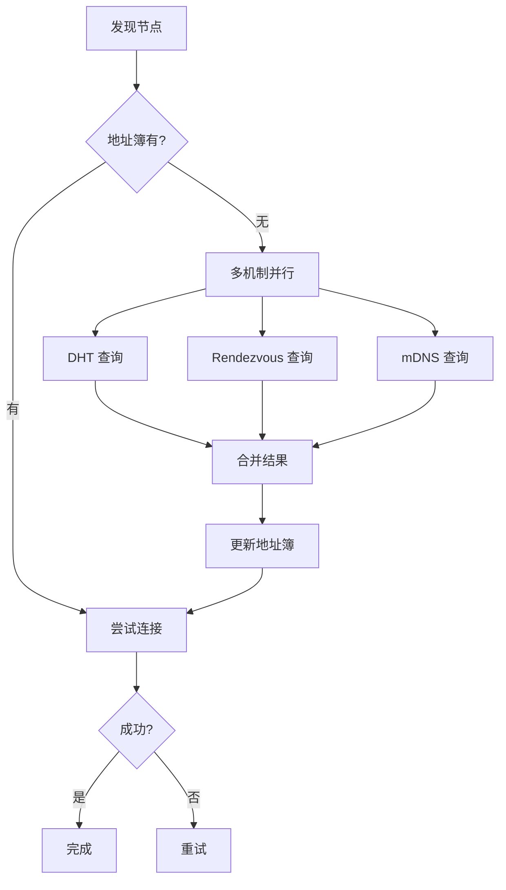
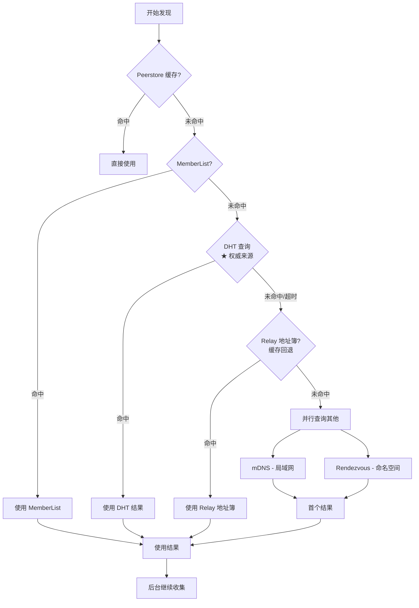
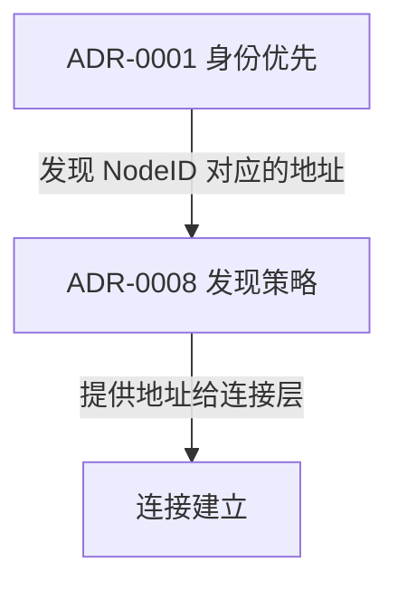

# ADR-0008: 多机制发现策略

## 元数据

| 属性 | 值 |
|------|-----|
| **ID** | ADR-0008 |
| **标题** | 多机制发现策略 (Multi-Mechanism Discovery Strategy) |
| **状态** | accepted |
| **决策日期** | 2026-01-11 |
| **更新日期** | 2026-01-23 |
| **决策者** | DeP2P 核心团队 |
| **关联 ADR** | [ADR-0001](ADR-0001-identity-first.md) |
| **关联需求** | [REQ-NET-001](../requirements/functional/F3_network/REQ-NET-001.md) |

---

## 上下文

在设计 DeP2P 的节点发现机制时，我们需要决定采用哪些发现方式以及如何组合它们。

### 问题背景

P2P 网络中的节点发现面临多种挑战：

- **冷启动**：新节点如何找到网络入口
- **动态地址**：节点 IP 可能变化
- **不同场景**：公网、局域网、私有网络
- **可靠性**：单一机制可能失效

### 决策驱动因素

- **可靠性**：发现应该总能成功
- **速度**：快速找到目标节点
- **去中心化**：减少对中心化服务的依赖
- **灵活性**：适应不同网络环境

---

## 竞品分析

| 产品 | 发现机制 | 组合策略 |
|------|----------|----------|
| **iroh** | DNS + DHT (Pkarr) + mDNS | DNS 优先，DHT 补充 |
| **go-libp2p** | DHT + mDNS + Rendezvous | 可插拔，并行 |
| **torrent** | Tracker + DHT + PEX + LSD | 多机制并行 |

### iroh 的发现策略（重点参考）

iroh 实现了真正的"仅 ID 连接"——只需知道目标节点的公钥（EndpointId），无需任何 IP 地址。

#### 核心机制：发布-发现（Publish-Resolve）

```
┌─────────────────────────────────────────────────────────────────────────────┐
│                    iroh 发现架构                                             │
├─────────────────────────────────────────────────────────────────────────────┤
│                                                                             │
│  发布端（启动时）              发现服务                查询端（连接时）        │
│  ─────────────────            ──────────              ─────────────────      │
│                                                                             │
│  EndpointInfo ──────► PkarrPublisher ──────► pkarr relay                   │
│  {id, relay, addrs}           │               (dns.iroh.link/pkarr)        │
│                               │                        │                    │
│                               ▼                        ▼                    │
│                          DNS server ◄─────────── DnsDiscovery              │
│                               │               (DNS TXT 查询)                │
│                               │                        │                    │
│                               └────────────────────────┘                   │
│                                        │                                    │
│                                        ▼                                    │
│                              DiscoveryItem {endpoint_info}                 │
│                                        │                                    │
│                                        ▼                                    │
│                              MagicSock.connect()                           │
│                                                                             │
└─────────────────────────────────────────────────────────────────────────────┘
```

#### Discovery Trait 设计

```rust
pub trait Discovery: Send + Sync + 'static {
    /// 发布：节点启动时将自己的地址信息发布到发现服务
    fn publish(&self, _data: &EndpointData) {}
    
    /// 解析：连接时根据 EndpointId 查询目标地址
    fn resolve(&self, _endpoint_id: EndpointId) 
        -> Option<BoxStream<Result<DiscoveryItem, DiscoveryError>>>;
}
```

#### 关键实现细节

| 组件 | 功能 | 说明 |
|------|------|------|
| **PkarrPublisher** | 发布地址 | HTTP PUT 到 `dns.iroh.link/pkarr/<z32-id>` |
| **DnsDiscovery** | DNS 查询 | 查询 `_iroh.<z32-id>.dns.iroh.link` TXT 记录 |
| **ConcurrentDiscovery** | 并行发现 | 同时查询多个服务，合并结果 |
| **SignedPacket** | 签名验证 | 使用 SecretKey 签名，防止伪造 |

#### 优点

- **真正的身份优先**：只需 EndpointId 即可连接
- **DNS 解析快速**：利用现有 DNS 基础设施
- **签名验证安全**：pkarr 记录经过签名，防伪造
- **Relay 保底**：发布 Relay URL，确保总能连接

### libp2p 的发现策略

```go
// libp2p 可插拔发现
host.NewHost(
    libp2p.Routing(dht.NewDHT),
    libp2p.Discovery(mdns.NewMDNS),
    libp2p.Discovery(rendezvous.NewRendezvous),
)
```

优点：
- 高度灵活
- 可按需组合

### torrent 的发现策略

- **Tracker**：中心化，快速
- **DHT**：分布式，可靠
- **PEX**：Peer Exchange，已连接节点交换
- **LSD**：Local Service Discovery，局域网

优点：
- 多机制并行，容错性强

---

## 考虑的选项

### 选项 1: 单一 DHT

仅使用 DHT 作为发现机制。


**优点**:
- 实现简单
- 完全去中心化

**缺点**:
- 冷启动问题
- DHT 引导慢
- 局域网效率低

### 选项 2: Bootstrap + DHT

使用 Bootstrap 节点引导 DHT。


**优点**:
- 解决冷启动
- 去中心化

**缺点**:
- Bootstrap 依赖
- 局域网效率低

### 选项 3: 多机制组合（采用）

组合多种发现机制，并行或分层使用。



**优点**:
- 高可靠性
- 适应多种场景
- 容错性强

**缺点**:
- 实现复杂度高
- 需要协调多个机制

---

## 决策结果

选择 **选项 3: 多机制组合**。

### 核心决策

> **DeP2P 采用 Bootstrap + DHT + Rendezvous + mDNS 组合发现策略，多机制并行工作，任一成功即可。**

### 发现机制

| 机制 | 用途 | 场景 | 独立开关 |
|------|------|------|:--------:|
| **Bootstrap** | 广域网入口 | 冷启动 | ✓ |
| **mDNS** | 局域网发现 | 本地网络 | ✓ |
| **DHT** | 分布式路由 | 通用发现 | - |
| **Rendezvous** | 命名空间发现 | Realm 成员发现 | - |

### Bootstrap 与 mDNS 独立性

```
┌─────────────────────────────────────────────────────────────────────────────┐
│                    发现机制独立性                                             │
├─────────────────────────────────────────────────────────────────────────────┤
│                                                                             │
│  Bootstrap 与 mDNS 是完全独立的两个机制：                                   │
│                                                                             │
│  Bootstrap（广域网入口）           mDNS（局域网发现）                        │
│  ─────────────────────            ─────────────────                         │
│  • 范围：互联网                    • 范围：局域网                            │
│  • 依赖：预配置地址                • 依赖：本地广播                          │
│  • 场景：跨网络                    • 场景：同一网络内                        │
│                                                                             │
│  独立开关组合：                                                              │
│  • 只开 mDNS：局域网内纯 P2P                                                │
│  • 只开 Bootstrap：广域网发现                                               │
│  • 都开：局域网优先，广域网兜底（推荐）                                     │
│  • 都关：必须手动指定地址                                                    │
│                                                                             │
└─────────────────────────────────────────────────────────────────────────────┘
```

### Bootstrap 分层设计

```
┌─────────────────────────────────────────────────────────────────────────────┐
│                    Bootstrap 分层                                            │
├─────────────────────────────────────────────────────────────────────────────┤
│                                                                             │
│  System Bootstrap（需要）                                                   │
│  • 用于加入 DHT 网络                                                        │
│  • 项目方提供默认值，用户可覆盖                                              │
│  • 启动时并行连接所有配置的节点                                              │
│                                                                             │
│  Realm Bootstrap（不需要）                                                  │
│  • Realm 是私有隔离域                                                        │
│  • 公开的 Realm Bootstrap 会破坏隔离性                                      │
│  • 用户加入 Realm 时应已知至少一个成员地址                                  │
│  • Realm 成员发现通过 Rendezvous 或成员列表交换                             │
│                                                                             │
└─────────────────────────────────────────────────────────────────────────────┘
```

---

## 发现流程

### 启动流程



### 节点发现流程



---

## 各机制详解

### Bootstrap 发现

```go
// 启动时配置
node, _ := dep2p.NewNode(ctx,
    dep2p.EnableBootstrap(true),
    dep2p.WithBootstrapPeers(
        "/dnsaddr/bootstrap1.dep2p.io/p2p/Qm...",
        "/dnsaddr/bootstrap2.dep2p.io/p2p/Qm...",
    ),
)

// 运行时添加
node.AddBootstrapPeer("/ip4/1.2.3.4/tcp/4001/p2p/Qm...")

// 手动触发
node.Bootstrap(ctx)
```

**设计原则**：
- Bootstrap 是冷启动兜底能力
- 如果已知目标地址，可以不使用 Bootstrap
- 用户只需配置地址列表，DeP2P 内部管理连接

**连接策略**：
- 并行连接所有配置的节点
- 保持 N 个活跃连接
- 失败自动切换备份

**自身过滤**：
- Bootstrap 列表包含自身时静默忽略（方便批量配置）

**成为 Bootstrap 节点**：
- 需要公网可达地址
- 具备特殊能力：大容量存储、存活探测、主动发现

用途：
- 广域网入口点
- DHT 引导
- 冷启动解决方案

### DHT 发现

```go
// DHT 模式
type DHTMode int

const (
    DHTModeClient DHTMode = iota // 仅查询，不提供路由
    DHTModeServer                 // 提供路由服务
    DHTModeAuto                   // 自动选择
)

// 配置
dep2p.WithDHT(DHTModeAuto)
```

用途：
- 分布式节点路由
- 通用节点查找
- 内容寻址（可选）

### Rendezvous 发现

```go
// Rendezvous 用于命名空间发现
rendezvous.Register(ctx, "dep2p/realm/my-app", 1*time.Hour)
rendezvous.Discover(ctx, "dep2p/realm/my-app", 100)
```

用途：
- Realm 成员发现
- 服务发现
- 主题发现

### mDNS 发现

```go
// mDNS 配置
dep2p.WithMDNS(true)
```

用途：
- 局域网节点发现
- 无需互联网
- 低延迟

---

## 优先级策略（v2.0 更新）

### 地址来源优先级

> **v2.0 核心变化**：DHT 是权威目录，Relay 地址簿是缓存加速层

地址发现时按以下优先级获取：

| 优先级 | 来源 | 说明 | 时效性 | 权威性 |
|--------|------|------|--------|--------|
| 1 | 本地缓存 (Peerstore) | 最近验证过的地址 | 高 | 缓存 |
| 2 | MemberList | Gossip 同步的成员信息 | 中 | 缓存 |
| 3 | **DHT（★ 权威）** | 签名 PeerRecord | 中（TTL 内有效） | **权威** |
| 4 | mDNS | 局域网发现 | 实时 | 本地 |
| 5 | **Relay 地址簿（缓存回退）** | 仅在 DHT 失败时使用 | 实时 | 缓存 |
| 6 | Rendezvous | 命名空间发现 | 中 | 缓存 |

**v2.0 三层架构**：
- **Layer 1: DHT（权威目录）**：存储签名 PeerRecord，支持跨 Relay 解析
- **Layer 2: 缓存加速层**：Peerstore / MemberList / Relay 地址簿
- **Layer 3: 连接策略**：直连 → 打洞 → Relay 兜底

**Relay 地址簿的定位（v2.0）**：
- Relay 地址簿是**本地缓存**，不是权威目录
- 仅缓存连接到该 Relay 的成员地址
- **DHT 失败或超时时才回退到 Relay 地址簿**
- 详见 [REQ-NET-003 §4.6](../requirements/functional/F3_network/REQ-NET-003.md)

### 发现优先级（v2.0 更新）



> **关键变化**：DHT 查询优先于 Relay 地址簿（DHT 是权威，Relay 是缓存回退）

### 结果合并（v2.0 更新）

```go
// 多来源结果合并
type DiscoveryResult struct {
    NodeID  NodeID
    Addrs   []Multiaddr
    Source  DiscoverySource  // DHT, mDNS, Rendezvous, RelayBook
    TTL     time.Duration
}

// 合并策略（v2.0）
// 1. 同一节点多来源地址合并
// 2. 本地地址优先（mDNS）
// 3. ★ DHT 权威结果优先（签名验证）
// 4. Relay 地址簿仅作为 DHT 失败时的回退
// 5. 最近验证的优先
```

---

## DHT 发布生命周期（v2.0 更新）

### PeerRecord 模型（v2.0 新增）

```go
// v2.0 签名 PeerRecord
type PeerRecord struct {
    NodeID       NodeID      // 节点身份
    RealmID      RealmID     // Realm 标识（用于 DHT Key 隔离）
    RelayAddrs   []Multiaddr // Relay 地址（稳定，主路径）
    DirectAddrs  []Multiaddr // 直连地址（需验证后才发布）
    NATType      NATType     // NAT 类型
    Reachability Reachability// 可达性状态
    Seq          uint64      // 递增序号（防重放）
    Timestamp    int64       // 时间戳
    TTL          time.Duration
    Signature    []byte      // Ed25519 签名
}
```

### TTL 与续期

| 参数 | 值 | 说明 |
|------|-----|------|
| DHT 记录 TTL | **1-4 小时** | 根据 NAT 稳定性动态调整 |
| 续期间隔 | **TTL / 2** | 定期续期 |
| 发布重试 | 3 次 | 失败后重试次数 |

**动态 TTL 策略（v2.0）**：

| NAT 类型 | TTL | 续期间隔 | 原因 |
|----------|-----|---------|------|
| 公网/无 NAT | 4h | 2h | 地址稳定 |
| Full Cone | 2h | 1h | 地址较稳定 |
| Restricted | 1h | 30min | 地址可能变化 |
| Symmetric | 30min | 15min | 地址频繁变化 |

**与 Relay 预留 TTL 的区别**：

| 类型 | TTL | 续期间隔 | 原因 |
|------|-----|---------|------|
| DHT PeerRecord | 1-4h (动态) | TTL/2 | 权威目录，根据 NAT 类型调整 |
| Relay 预留 | 1h | 30min | 内存状态，资源释放优先 |

### 发布内容（v2.0 更新）

DHT 发布的 PeerRecord 必须**签名**且地址经过**验证**：

```go
// v2.0 发布策略
// 1. ★ 记录必须用 NodeID 私钥签名（防投毒）
// 2. 默认只发布 relay_addrs（稳定、可达）
// 3. direct_addrs 仅在通过 AutoNAT/dialback 验证后才发布
// 4. 包含递增 seq 防止重放攻击
// 5. DHT 验证：只接受合法签名 + 最新序号
```

**DHT Key 格式（Realm 隔离）**：
```
/dep2p/v2/realm/<H(RealmID)>/peer/<NodeID>
```
- RealmID 哈希到 DHT Key，实现 Realm 间命名空间隔离
- 不同 Realm 的节点无法互相发现

**DHT 发布地址 vs 打洞交换地址**：

| 场景 | 地址来源 | 说明 |
|------|---------|------|
| DHT 发布 (PeerRecord) | 已验证直连 + Relay | ★ 权威目录，签名验证 |
| 打洞交换 | 观察地址 + STUN | 临时，用于打洞协调 |

详见 [概念澄清文档 §6.2.1](../_discussions/20260123-nat-relay-concept-clarification.md)。

---

## 配置选项

```go
// 发现配置
dep2p.WithDiscovery(dep2p.DiscoveryConfig{
    // Bootstrap
    BootstrapPeers: []string{...},
    
    // DHT
    EnableDHT: true,
    DHTMode:   dep2p.DHTModeAuto,
    
    // Rendezvous
    EnableRendezvous: true,
    RendezvousServers: []string{...},
    
    // mDNS
    EnableMDNS: true,
    
    // 地址簿
    AddressTTL: 1 * time.Hour,
    
    // 并行度
    MaxParallel: 10,
})
```

---

## 后果

### 正面后果

1. **高可靠性**
   - 多机制容错
   - 任一成功即可

2. **适应多场景**
   - 公网：DHT + Rendezvous
   - 局域网：mDNS
   - 混合：全部

3. **快速发现**
   - 并行查询
   - 首个结果即可使用

4. **去中心化**
   - 不依赖单一服务
   - DHT 分布式

### 负面后果

1. **实现复杂**
   - 多机制协调
   - 结果合并

2. **资源消耗**
   - 多机制并行运行
   - 网络开销

### 缓解措施

| 负面后果 | 缓解措施 |
|----------|----------|
| 实现复杂 | 模块化设计，可选启用 |
| 资源消耗 | 智能调度，按需启用 |

---

## 与其他 ADR 的关系



---

## 相关文档

| 类型 | 链接 |
|------|------|
| **概念澄清** | [NAT/Relay 概念澄清](../_discussions/20260123-nat-relay-concept-clarification.md) |
| **需求** | [REQ-NET-001](../requirements/functional/F3_network/REQ-NET-001.md): 节点发现 |
| **需求** | [REQ-NET-003](../requirements/functional/F3_network/REQ-NET-003.md): Relay 中继（地址簿） |
| **ADR** | [ADR-0001](ADR-0001-identity-first.md): 身份优先设计 |
| **竞品** | [节点发现对比](../references/comparison/network/01-discovery.md) |
| **竞品** | [iroh 分析](../references/individual/iroh.md) |
| **竞品** | [libp2p 分析](../references/individual/libp2p.md) |

---

## 未来演进

### Phase 1: DNS/Pkarr 发现（参考 iroh）

借鉴 iroh 的 pkarr 机制实现"仅 ID 连接"：

```
┌─────────────────────────────────────────────────────────────────────────────┐
│                    DeP2P DNS 发现设计（规划中）                               │
├─────────────────────────────────────────────────────────────────────────────┤
│                                                                             │
│  核心组件：                                                                  │
│  ──────────                                                                 │
│  • NodeInfoPublisher - 发布节点信息到 DNS/pkarr 服务                        │
│  • DnsDiscovery - 通过 DNS 查询节点信息                                     │
│                                                                             │
│  发布内容：                                                                  │
│  ──────────                                                                 │
│  • NodeID (必需)                                                            │
│  • Relay URL (推荐) - 确保总能连接                                          │
│  • 直连地址 (可选) - 加速连接                                               │
│                                                                             │
│  查询格式：                                                                  │
│  ──────────                                                                 │
│  _dep2p.<base32-node-id>.discovery.dep2p.io → TXT 记录                     │
│                                                                             │
│  与 iroh 的差异：                                                            │
│  ────────────────                                                           │
│  • 支持 Realm 级别的私有发现                                                │
│  • 可选的中心化发现服务 vs 纯 DHT                                           │
│                                                                             │
└─────────────────────────────────────────────────────────────────────────────┘
```

### Phase 2: 智能调度

- 基于网络环境自动选择机制
- 减少不必要的查询
- 缓存热点节点地址

### Phase 3: 机器学习优化

- 预测发现成功率
- 优化查询顺序
- 根据历史数据预加载

---

## 变更历史

| 日期 | 版本 | 变更说明 |
|------|------|----------|
| 2026-01-11 | 1.0 | 初始版本，基于竞品分析创建 |
| 2026-01-16 | 1.1 | 添加 iroh pkarr/DNS 发现机制详解，更新 DNS 发现规划 |
| 2026-01-23 | 1.2 | 根据概念澄清文档同步：补充 Relay 地址簿作为发现来源、DHT 发布生命周期（24h TTL, 12h 续期）、地址来源优先级 |
| 2026-01-24 | **2.0** | **v2.0 DHT 权威模型对齐**：调整地址来源优先级（DHT 权威优先于 Relay 缓存）、新增 PeerRecord 签名模型、更新动态 TTL 策略、添加三层架构说明 |
