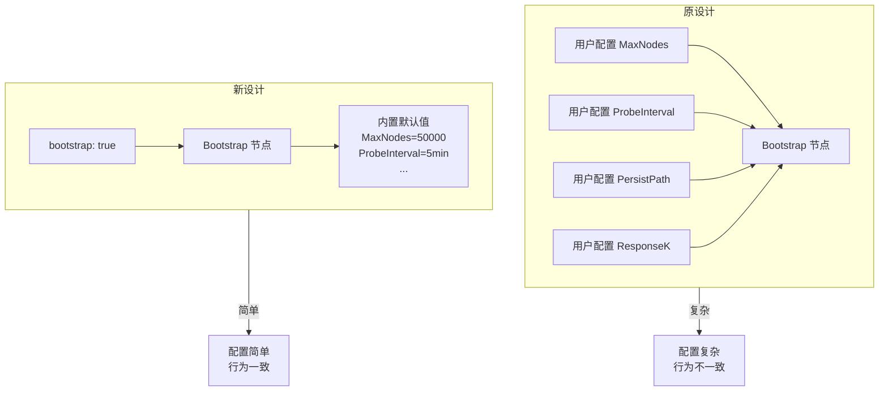

# ADR-0009: Bootstrap 极简配置设计

## 元数据

| 属性 | 值 |
|------|-----|
| **ID** | ADR-0009 |
| **标题** | Bootstrap 极简配置设计 (Bootstrap Simplified Configuration) |
| **状态** | accepted |
| **决策日期** | 2026-01-16 |
| **更新日期** | 2026-01-16 |
| **决策者** | DeP2P 核心团队 |
| **关联 ADR** | [ADR-0008](ADR-0008-discovery-strategy.md) |
| **关联需求** | [REQ-NET-001](../requirements/functional/F3_network/REQ-NET-001.md) |

---

## 上下文

### 问题背景

Bootstrap 节点是 P2P 网络的冷启动入口，帮助新节点加入 DHT 网络。在原设计中，Bootstrap 节点允许用户配置多个参数：

```go
// 原设计：复杂配置
type BootstrapConfig struct {
    MaxNodes        int           // 最大存储节点数
    PersistPath     string        // 持久化路径
    ProbeInterval   time.Duration // 探测间隔
    DiscoveryInterval time.Duration // 发现间隔
    NodeExpireTime  time.Duration // 节点过期时间
    ResponseK       int           // 返回节点数
}

node, _ := dep2p.NewNode(ctx,
    dep2p.WithBootstrapConfig(BootstrapConfig{
        MaxNodes:      10000,
        PersistPath:   "/data/bootstrap.db",
        ProbeInterval: 3 * time.Minute,
        // ...
    }),
)
```

这种设计存在以下问题：

1. **配置复杂**：用户需要理解每个参数的含义和合理取值
2. **行为不一致**：不同 Bootstrap 节点配置不同，导致网络行为差异
3. **错误配置风险**：不合理的参数可能导致网络问题
4. **违反去中心化精神**：参数应该是协议的一部分，不应因节点而异

### 决策驱动因素

- **简单性**：用户应该只需决定"是否启用"
- **一致性**：所有 Bootstrap 节点应该有相同的行为
- **可靠性**：内置默认值经过验证，减少配置错误
- **去中心化**：协议参数不应该因部署者而异

---

## 考虑的选项

### 选项 1: 保持复杂配置

维持原有的多参数配置方式，允许用户完全自定义 Bootstrap 行为。

```go
// 保持原设计
node, _ := dep2p.NewNode(ctx,
    dep2p.WithBootstrapConfig(BootstrapConfig{
        MaxNodes:      config.Get("bootstrap.max_nodes"),
        PersistPath:   config.Get("bootstrap.persist_path"),
        ProbeInterval: config.Get("bootstrap.probe_interval"),
        // ...更多参数
    }),
)
```

**优点**:
- 高级用户有完全控制权
- 可以针对特殊场景优化

**缺点**:
- 配置复杂，用户学习成本高
- 不同节点行为不一致
- 错误配置风险高
- 难以调试网络问题

### 选项 2: 极简配置（能力开关）

将配置简化为单一开关，所有参数使用内置默认值。

```go
// 极简设计：单一开关
node, _ := dep2p.NewNode(ctx, dep2p.EnableBootstrap(true))

// 或配置文件
{
  "bootstrap": true
}

// 或环境变量
DEP2P_BOOTSTRAP=true
```

**优点**:
- 极简用户体验
- 所有 Bootstrap 节点行为一致
- 内置参数经过验证
- 符合去中心化精神

**缺点**:
- 高级用户无法自定义参数
- 特殊场景无法优化

---

## 决策结果

选择 **选项 2: 极简配置（能力开关）**。

### 核心决策

> **Bootstrap 配置简化为单一开关 `true/false`，所有参数使用内置默认值，不对外暴露。**

### 决策理由

1. **简化用户体验**
   - 用户不需要理解 MaxNodes、ProbeInterval 等参数的含义
   - 只需决定"是否启用 Bootstrap 能力"

2. **保证网络一致性**
   - 所有 Bootstrap 节点行为一致，便于调试和问题定位
   - 避免因配置差异导致的网络问题

3. **避免错误配置**
   - 内置默认值经过验证，是最佳实践
   - 不合理的配置（如 MaxNodes=10）可能导致网络不稳定

4. **符合去中心化精神**
   - 参数是协议的一部分，不应因节点而异
   - 用户配置多个 Bootstrap 节点时，期望它们行为一致

### API 设计

```go
// ============================================================================
//                          用户 API（极简设计）
// ============================================================================

// 启动时配置
node, _ := dep2p.NewNode(ctx, dep2p.EnableBootstrap(true))

// 运行时 API
err := node.EnableBootstrap(ctx)   // 启用（无参数）
err := node.DisableBootstrap(ctx)  // 禁用
enabled := node.IsBootstrapEnabled() // 查询状态

// 配置文件
{
  "bootstrap": true
}

// 环境变量
DEP2P_BOOTSTRAP=true
```

### 内置默认值

以下参数是内置默认值，用户不可配置：

| 参数 | 默认值 | 说明 |
|------|--------|------|
| MaxNodes | 50000 | 最大存储节点数 |
| PersistPath | `${DataDir}/bootstrap.db` | 持久化路径 |
| ProbeInterval | 5 分钟 | 存活探测间隔 |
| DiscoveryInterval | 10 分钟 | 主动发现间隔 |
| NodeExpireTime | 24 小时 | 节点过期时间 |
| ResponseK | 20 | FIND_NODE 返回节点数 |



---

## 后果

### 正面后果

1. **简化用户体验**
   ```go
   // 之前：需要理解多个参数
   dep2p.WithBootstrapConfig(BootstrapConfig{...})
   
   // 之后：一行搞定
   dep2p.EnableBootstrap(true)
   ```

2. **保证网络一致性**
   - 所有 Bootstrap 节点使用相同参数
   - 网络行为可预测
   - 问题定位更容易

3. **减少配置错误**
   - 不会出现 MaxNodes=10 或 ProbeInterval=1s 这样的错误配置
   - 内置参数是最佳实践

4. **文档简化**
   - 不需要解释每个参数的含义
   - 用户文档只需说明"启用/禁用"

### 负面后果

1. **高级用户无法自定义**
   - 特殊场景（超大规模网络）无法调整参数
   - 无法针对特定环境优化

2. **参数变更需要发布新版本**
   - 如果需要调整默认值，必须发布新版本
   - 无法通过配置热更新

### 缓解措施

| 负面后果 | 缓解措施 |
|----------|----------|
| 无法自定义 | 内置默认值已覆盖 99% 场景；极端场景可考虑 Fork |
| 参数变更需发布版本 | 内置参数经过充分验证，变更频率低 |

---

## 概念变更：能力开关 vs 节点角色

### 移除"节点角色"概念

原设计引入了"节点角色"概念（Bootstrap Node、Relay Node），这暗示节点有固定的身份。

新设计改为"能力开关"：

```mermaid
flowchart TB
    subgraph OldModel[原模型："节点角色"]
        ON[普通节点]
        BN[Bootstrap 节点]
        RN[Relay 节点]
        ON -.->|"成为"| BN
        ON -.->|"成为"| RN
    end
    
    subgraph NewModel[新模型："能力开关"]
        Node[普通节点]
        Node -->|EnableBootstrap| Cap1["+ Bootstrap 能力"]
        Node -->|EnableRelay| Cap2["+ Relay 能力"]
        Node -->|EnableRelay| Cap3["+ Relay 能力"]
    end
```

### 为什么移除"角色"概念？

1. **语义更准确**
   - "启用 Bootstrap 能力" vs "成为 Bootstrap 节点"
   - 前者表示可开可关，后者暗示固定身份

2. **避免互斥误解**
   - "节点角色"可能让人误以为角色互斥
   - 实际上一个节点可以同时启用多个能力

3. **简化心智模型**
   - 用户只需理解"开关"，不需要理解"角色转换"

---

## 前置条件

启用 Bootstrap 能力的唯一硬性条件：

| 条件 | 类型 | 说明 |
|------|------|------|
| 公网可达 | 硬性 | 必须有公网 IP 或域名 |

```go
func (n *Node) EnableBootstrap(ctx context.Context) error {
    // 唯一硬性条件
    if !n.isPubliclyReachable() {
        return ErrNotPubliclyReachable
    }
    // ...
}
```

---

## 相关文档

| 类型 | 链接 |
|------|------|
| **关联 ADR** | [ADR-0008: 多机制发现策略](ADR-0008-discovery-strategy.md) |
| **行为流程** | [discovery_flow.md](../../03_architecture/L3_behavioral/discovery_flow.md) |

---

## 变更历史

| 日期 | 版本 | 变更说明 |
|------|------|----------|
| 2026-01-16 | 1.0 | 初始版本 |
