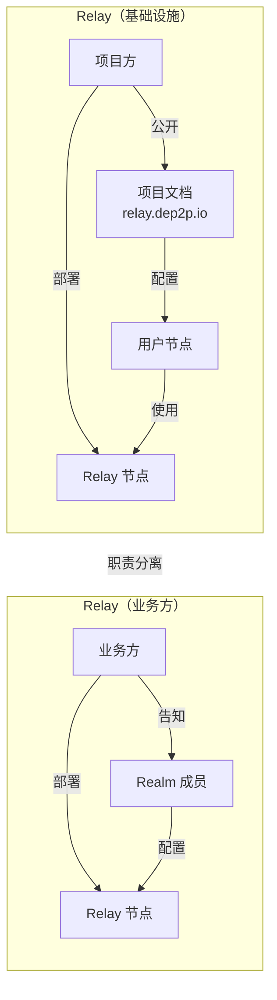

# ADR-0010: Relay 明确配置设计

## 元数据

| 属性 | 值 |
|------|-----|
| **ID** | ADR-0010 |
| **标题** | Relay 明确配置设计 (Relay Explicit Configuration) |
| **状态** | accepted |
| **决策日期** | 2026-01-16 |
| **更新日期** | 2026-01-24 |
| **决策者** | DeP2P 核心团队 |
| **关联 ADR** | [ADR-0009](ADR-0009-bootstrap-simplified.md) |
| **关联需求** | [REQ-NET-002](../requirements/functional/F3_network/REQ-NET-002.md) |

---

## 上下文

> **统一 Relay 注记**：本文仅保留 Relay 单一概念，不使用分层命名。

### 问题背景

DeP2P 采用统一 Relay 架构：

| 层级 | 类型 | 服务范围 | 使用场景 |
|------|------|----------|----------|
| 统一 | Relay | 全网节点 / Realm 成员 | **缓存加速层** + **打洞协调信令** + **数据转发兜底** |

> **v2.0 核心变化**：DHT 是权威目录，Relay 地址簿是本地缓存加速层
>
> **Relay 的三大职责**（v2.0 更新，详见 [概念澄清文档 §9](../_discussions/20260123-nat-relay-concept-clarification.md)）：
> 1. **缓存加速层**：维护连接成员的地址信息（地址簿），作为 DHT 的本地缓存
> 2. **打洞协调信令**：提供打洞协调的信令通道
> 3. **数据转发兜底**：打洞失败时作为数据中继
>
> **三层架构**：
> - Layer 1: **DHT（权威目录）** — 存储签名 PeerRecord
> - Layer 2: **缓存加速层** — Peerstore / MemberList / Relay 地址簿
> - Layer 3: **连接策略** — 直连 → 打洞 → Relay 兜底

原设计中，Relay 包含**自动发现机制**：

```go
// 原设计：自动发现 Relay
type RelayDiscoveryConfig struct {
    Strategy       string        // "latency" | "xor_distance" | "round_robin"
    CandidateCount int           // 候选数量
    HealthCheckInterval time.Duration
    FailoverTimeout time.Duration
}

// 加入 Realm 时自动发现
realm.Join(ctx, realmID, psk)
// 内部：自动查找公网可达的成员作为 Relay 候选
```

这种设计存在以下问题：

1. **选择算法复杂**：多种策略（延迟优先、XOR 距离、轮询）导致行为不可预测
2. **难以定位问题**：出现中继问题时，不知道当前使用的是哪个 Relay
3. **信任问题**：自动选择的 Relay 可能不受信任
4. **违反兜底原则**：兜底机制应该简单可靠，不应该复杂化

### 决策驱动因素

- **明确性**：用户应该明确知道"中继是谁"
- **可追溯性**：出现问题时能快速定位
- **简单可靠**：兜底机制不应复杂化
- **信任边界**：中继涉及流量转发，应由可信方提供

---

## 考虑的选项

### 选项 1: 保持自动发现

维持原有的自动发现机制，支持多种选择策略。

```go
// 原设计：复杂的自动发现
realm, _ := node.JoinRealm(ctx, realmID, psk,
    dep2p.WithRelayDiscoveryStrategy("latency"),
    dep2p.WithRelayCandidateCount(3),
    dep2p.WithRelayHealthCheckInterval(30 * time.Second),
)
```

**优点**:
- 全自动，无需手动配置
- 可以根据网络状况动态切换

**缺点**:
- 不知道当前使用的是哪个 Relay
- 选择算法复杂，行为不可预测
- 自动选择的 Relay 可能不受信任
- 违反"兜底机制应简单"原则

### 选项 2: 明确配置（移除自动发现）

移除自动发现机制，要求明确配置 Relay 地址。

```go
// 新设计：明确配置
// Relay（项目方配置）
node, _ := dep2p.NewNode(ctx, dep2p.EnableRelay(true))
// 或作为客户端使用
node, _ := dep2p.NewNode(ctx, 
    dep2p.WithRelayAddr("/ip4/relay.dep2p.io/tcp/4001/p2p/Qm..."),
)

// Relay（业务方配置）
realm.EnableRelay(ctx)  // 作为服务端
realm.SetRelay("/ip4/1.2.3.4/tcp/4001/p2p/QmRelay...")  // 作为客户端
```

**优点**:
- 明确知道中继是谁
- 问题定位简单
- 中继由可信方提供
- 符合兜底机制的简单原则

**缺点**:
- 需要手动配置
- 无法动态切换（实际上这也是优点）

---

## 决策结果

选择 **选项 2: 明确配置（移除自动发现）**。

### 核心决策

> **移除 Relay 自动发现机制。Relay 由项目方或业务方部署和配置，用户明确知道中继是谁。**

### 决策理由

1. **明确知道中继是谁**
   - Relay（项目方）：地址公开在项目文档中
   - Relay（业务方）：地址明确告知 Realm 成员
   - 不存在"不知道当前使用哪个 Relay"的问题

2. **便于问题定位**
   ```
   问题排查路径：
   1. 业务方："我们使用的 Relay 是 /ip4/1.2.3.4/..."
   2. 运维检查该 Relay 的状态
   3. 快速定位问题
   
   vs 自动发现：
   1. 业务方："我不知道当前用的是哪个 Relay"
   2. 需要检查日志，找出自动选择的 Relay
   3. 问题定位困难
   ```

3. **信任边界清晰**
   - 中继会转发流量，必须由可信方提供
   - 自动发现可能选择不受信任的节点
   - 明确配置确保中继来源可信

4. **符合兜底原则**
   - 中继是"兜底"机制，只在直连和打洞都失败时使用
   - 兜底机制应该**简单可靠**，不应该有复杂的选择算法
   - 配置一个已知可靠的地址比"自动选择"更符合兜底精神

### 配置责任



| 层级 | 部署方 | 配置方式 | 地址获取 |
|------|--------|----------|----------|
| Relay（项目方） | 项目方 | `EnableRelay(true)` | 项目文档公开 |
| Relay（业务方） | 业务方 | `realm.EnableRelay(ctx)` | 业务方告知成员 |

---

## API 设计

### Relay（Node 级别）

```go
// ============================================================================
//                      Relay API（项目方）
// ============================================================================

// === 作为 Relay 服务端 ===

// 启动时配置
node, _ := dep2p.NewNode(ctx, dep2p.EnableRelay(true))

// 运行时 API
err := node.EnableRelay(ctx)   // 启用（无参数，使用内置默认值）
err := node.DisableRelay(ctx)  // 禁用
enabled := node.IsRelayEnabled() // 查询状态

// 配置文件
{
  "relay": true
}

// === 作为 Relay 客户端 ===

// 配置 Relay 地址（使用中继）
node, _ := dep2p.NewNode(ctx,
    dep2p.WithRelayAddr("/ip4/relay.dep2p.io/tcp/4001/p2p/Qm..."),
)

// 运行时设置
node.SetRelayAddr("/ip4/relay.dep2p.io/tcp/4001/p2p/Qm...")
node.RemoveRelayAddr()  // 移除配置
```

### Relay（Realm 级别）

```go
// ============================================================================
//                      Relay API（业务方）
// ============================================================================

// === 作为 Relay 服务端 ===

// 运行时 API
err := realm.EnableRelay(ctx)   // 启用（无参数，使用内置默认值）
err := realm.DisableRelay(ctx)  // 禁用
enabled := realm.IsRelayEnabled() // 查询状态

// === 作为 Relay 客户端 ===

// 配置 Relay 地址（使用中继）
realm.SetRelay("/ip4/1.2.3.4/tcp/4001/p2p/QmRelay...")

// 查询和移除
addr := realm.GetRelay()   // 获取当前配置的 Relay 地址
realm.RemoveRelay()        // 移除配置
```

### 内置默认值

与 Bootstrap 一样，Relay 的参数也是内置默认值，用户不可配置：

**Relay（项目方）默认值**:

| 参数 | 默认值 | 说明 |
|------|--------|------|
| MaxReservations | 100 | 最大预留连接数 |
| MaxDuration | 60s | 单次中继最大时长 |
| MaxDataRate | 10KB/s | 最大数据速率 |
| IdleTimeout | 30s | 空闲超时 |

**Relay（业务方）默认值**:

| 参数 | 默认值 | 说明 |
|------|--------|------|
| MaxMembers | 1000 | 最大成员数 |
| MaxDataRate | 无限制 | 数据速率（业务方决定） |
| MemberTTL | 24h | 成员信息过期时间 |
| AddressBookSize | 10000 | 地址簿大小 |

---

## 后果

### 正面后果

1. **明确知道中继是谁**
   ```
   Relay（项目方）: relay.dep2p.io  （项目方提供）
   Relay（业务方）:  1.2.3.4        （业务方提供）
   ```

2. **问题定位简单**
   - 出现中继问题时，直接检查已知的 Relay 地址
   - 不需要翻日志找"自动选择了哪个 Relay"

3. **信任边界清晰**
   - Relay（项目方）：项目方负责，用户信任项目方
   - Relay（业务方）：业务方负责，成员信任业务方
   - 不存在"被自动选择到不信任的节点"的问题

4. **符合兜底原则**
   - 兜底机制应该简单可靠
   - 一个已知可靠的地址 > 复杂的自动选择算法

### 负面后果

1. **需要手动配置**
   - 用户需要获取并配置 Relay 地址
   - 无法"开箱即用"自动发现

2. **无法动态切换**
   - 如果配置的 Relay 下线，需要手动切换
   - 无法自动 Failover

### 缓解措施

| 负面后果 | 缓解措施 |
|----------|----------|
| 需要手动配置 | 项目方在文档中提供默认 Relay 地址；SDK 可内置默认地址 |
| 无法动态切换 | 支持配置多个 Relay 地址，按顺序尝试（简单 Failover） |

### 简单 Failover 机制

虽然移除了"自动发现"，但可以支持配置多个地址的简单 Failover：

```go
// 配置多个 Relay 地址
node, _ := dep2p.NewNode(ctx,
    dep2p.WithRelayAddrs(
        "/ip4/relay1.dep2p.io/tcp/4001/p2p/Qm1...",
        "/ip4/relay2.dep2p.io/tcp/4001/p2p/Qm2...", // 备用
    ),
)

// 配置多个 Relay 地址
realm.SetRelays(
    "/ip4/1.2.3.4/tcp/4001/p2p/QmRelay1...",
    "/ip4/5.6.7.8/tcp/4001/p2p/QmRelay2...", // 备用
)
```

Failover 逻辑：
1. 按配置顺序尝试连接
2. 第一个成功的作为当前 Relay
3. 当前 Relay 失败时，尝试下一个
4. 所有都失败时，返回错误

这是**简单的列表 Failover**，不是"自动发现"。地址列表由用户明确提供。

---

## Relay 地址簿功能（v2.0 定位：缓存层）

> **v2.0 核心变化**：Relay 地址簿是**本地缓存加速层**，不是权威目录。DHT 是权威目录。

### 地址簿结构

```go
// AddressBookEntry 地址簿条目
type AddressBookEntry struct {
    NodeID      NodeID         // 节点标识
    DirectAddrs []Multiaddr    // 直连地址列表
    NATType     NATType        // NAT 类型
    Online      bool           // 在线状态
    LastSeen    time.Time      // 最后活跃时间
}
```

### 协议消息

```go
const (
    RelayMsgAddressRegister  = 0x10 // 注册/更新地址
    RelayMsgAddressQuery     = 0x11 // 查询成员地址
    RelayMsgAddressResponse  = 0x12 // 返回地址信息
    RelayMsgAddressUpdate    = 0x13 // 地址变更通知
)
```

### 用途（v2.0 更新）

1. **缓存加速**：缓存连接到本 Relay 的成员地址，加速本地查询
2. **打洞协调**：交换打洞所需的地址信息
3. **在线状态**：快速判断成员是否在线
4. **DHT 回退**：仅在 DHT 查询失败时作为回退来源

### 与 DHT 的关系

| 特性 | Relay 地址簿 | DHT |
|------|-------------|-----------|
| 权威性 | **缓存层** | **★ 权威目录** |
| 范围 | 仅本 Relay 连接的成员 | 全 Realm |
| 跨 Relay | ❌ 不支持 | ✅ 支持 |
| 签名验证 | 无 | ✅ PeerRecord 签名 |

详见 [REQ-NET-003 §Relay 地址簿](../requirements/functional/F3_network/REQ-NET-003.md)。

---

## 多 Relay 选择原则

**核心原则**：发布地址时选择的 Relay = 连接时使用的 Relay

```
DHT 发布的 Relay 地址格式：
/p2p/QmRelay.../p2p-circuit/p2p/QmTarget

→ 连接方按此地址连接，必须经过指定的 Relay
→ 目标节点只在该 Relay 上有预留
```

### 选择策略

| 步骤 | 操作 |
|------|------|
| 1 | 启动时向所有配置的 Relay 发送探测包，测量 RTT |
| 2 | 选择 RTT 最低的 Relay 作为"主 Relay" |
| 3 | 在主 Relay 上建立预留 |
| 4 | 在 DHT 发布主 Relay 的地址 |
| 5 | 可选在备用 Relay 建立预留（高可用） |

详见 [概念澄清文档 §17.6](../_discussions/20260123-nat-relay-concept-clarification.md)。

---

## 概念变更：能力开关 vs 自动发现

```mermaid
flowchart TB
    subgraph OldModel[原模型："自动发现"]
        Join[加入 Realm] --> Discover[自动发现 Relay]
        Discover --> Select[选择算法]
        Select --> Latency[延迟优先?]
        Select --> XOR[XOR 距离?]
        Select --> RR[轮询?]
        Latency & XOR & RR --> Unknown["使用某个 Relay<br/>（不确定是哪个）"]
    end
    
    subgraph NewModel[新模型："明确配置"]
        Config[业务方配置] --> KnownAddr["已知地址<br/>/ip4/1.2.3.4/..."]
        KnownAddr --> UseRelay["使用该 Relay<br/>（明确知道是谁）"]
    end
    
    OldModel -->|复杂| Complex["不知道中继是谁<br/>难以调试"]
    NewModel -->|简单| Simple["明确知道中继是谁<br/>问题易定位"]
```

---

## 前置条件

启用 Relay 能力的条件：

| 条件 | 适用于 | 类型 | 说明 |
|------|--------|------|------|
| 公网可达 | Relay（项目方） | 硬性 | 必须有公网 IP |
| 公网可达 | Relay（业务方） | 硬性 | 必须有公网 IP |
| 已加入 Realm | Relay（业务方） | 硬性 | 必须是 Realm 成员 |

```go
func (n *Node) EnableRelay(ctx context.Context) error {
    if !n.isPubliclyReachable() {
        return ErrNotPubliclyReachable
    }
    // ...
}

func (r *Realm) EnableRelay(ctx context.Context) error {
    if !r.node.isPubliclyReachable() {
        return ErrNotPubliclyReachable
    }
    if !r.isJoined() {
        return ErrNotJoinedRealm
    }
    // ...
}
```

---

## 联合部署

一个节点可以同时启用多个能力：

```go
// 同时启用 Bootstrap + Relay
node, _ := dep2p.NewNode(ctx,
    dep2p.EnableBootstrap(true),
    dep2p.EnableRelay(true),
)

// 同时启用 Relay（基础设施） + Relay（业务方）
node, _ := dep2p.NewNode(ctx, dep2p.EnableRelay(true))
realm := node.CreateRealm(ctx, "business")
realm.EnableRelay(ctx)
```

各能力之间逻辑隔离，共享底层资源（Liveness Service、BadgerDB）。

详见 [ADR-0009](ADR-0009-bootstrap-simplified.md) 中的"能力开关"概念。

---

## 相关文档

| 类型 | 链接 |
|------|------|
| **概念澄清** | [NAT/Relay 概念澄清](../_discussions/20260123-nat-relay-concept-clarification.md) |
| **关联 ADR** | [ADR-0003: 惰性中继策略](ADR-0003-relay-first-connect.md) |
| **关联 ADR** | [ADR-0009: Bootstrap 极简配置](ADR-0009-bootstrap-simplified.md) |
| **需求** | [REQ-NET-003: Relay 中继](../requirements/functional/F3_network/REQ-NET-003.md) |
| **行为流程** | [relay_flow.md](../../03_architecture/L3_behavioral/relay_flow.md) |

---

## 变更历史

| 日期 | 版本 | 变更说明 |
|------|------|----------|
| 2026-01-16 | 1.0 | 初始版本 |
| 2026-01-23 | 1.1 | 根据概念澄清文档同步：补充 Relay 三重作用（地址发现中心+打洞协调+数据转发）、Relay 地址簿功能、多 Relay 选择原则（发布=使用） |
| 2026-01-24 | **2.0** | **v2.0 DHT 权威模型对齐**：更新 Relay 职责定位（从"地址发现中心"改为"缓存加速层"）、添加三层架构说明、明确 DHT 是权威目录 |
