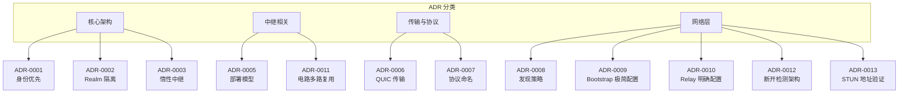
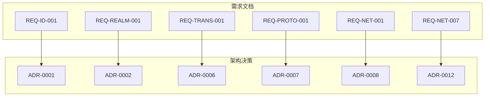
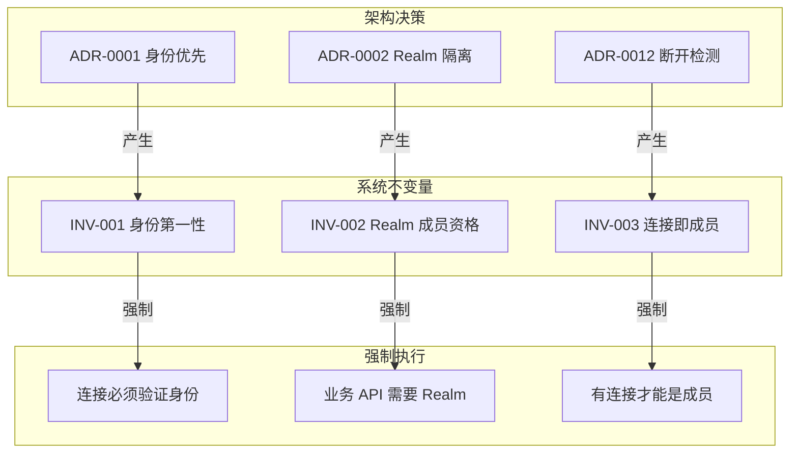

# 架构决策记录 (ADR)

> 记录重要的架构决策及其背景、考虑因素和后果

---

## 什么是 ADR？

ADR（Architecture Decision Record）是记录重要架构决策的文档。每个 ADR 描述：

- **上下文**：决策的背景和驱动因素
- **决策**：做出的具体决策
- **后果**：决策带来的影响

---

## ADR 状态

| 状态 | 说明 |
|------|------|
| `proposed` | 提议中，待讨论 |
| `accepted` | 已接受 |
| `deprecated` | 已废弃 |
| `superseded` | 被替代（指向新 ADR） |

---

## ADR 索引

### 核心决策

| ID | 标题 | 状态 | 日期 |
|----|------|------|------|
| [ADR-0001](ADR-0001-identity-first.md) | 身份优先设计 | accepted | 2024-01 |
| [ADR-0002](ADR-0002-realm-isolation.md) | Realm 隔离设计 | accepted | 2024-01 |
| [ADR-0003](ADR-0003-relay-first-connect.md) | 惰性中继策略 | accepted | 2024-01 |

### 中继相关

| ID | 标题 | 状态 | 日期 |
|----|------|------|------|
| [ADR-0005](ADR-0005-relay-deployment-models.md) | Relay 部署模型 | accepted | 2025-12 |
| [ADR-0011](ADR-0011-relay-circuit-muxer.md) | 中继电路多路复用架构 | accepted | 2026-01 |

### 传输与协议

| ID | 标题 | 状态 | 日期 |
|----|------|------|------|
| [ADR-0006](ADR-0006-quic-transport.md) | QUIC 传输选择 | accepted | 2026-01 |
| [ADR-0007](ADR-0007-protocol-naming.md) | 协议命名规范 | accepted | 2026-01 |

### 网络层

| ID | 标题 | 状态 | 日期 |
|----|------|------|------|
| [ADR-0008](ADR-0008-discovery-strategy.md) | 多机制发现策略 | accepted | 2026-01 |
| [ADR-0009](ADR-0009-bootstrap-simplified.md) | Bootstrap 极简配置 | accepted | 2026-01 |
| [ADR-0010](ADR-0010-relay-explicit-config.md) | Relay 明确配置 | accepted | 2026-01 |
| [ADR-0012](ADR-0012-disconnect-detection.md) | **多层次断开检测架构** | accepted | 2026-01 |
| [ADR-0013](ADR-0013-stun-address-verification.md) | **STUN 地址验证策略** | accepted | 2026-01 |

---

## 系统不变量

不变量是系统必须始终满足的约束条件，由 ADR 决策产生。详见 [invariants/](invariants/)。

| ID | 名称 | 关联 ADR |
|----|------|----------|
| [INV-001](invariants/INV-001-identity-first.md) | 身份第一性 | [ADR-0001](ADR-0001-identity-first.md) |
| [INV-002](invariants/INV-002-realm-membership.md) | Realm 成员资格 | [ADR-0002](ADR-0002-realm-isolation.md) |
| [INV-003](invariants/INV-003-connection-membership.md) | **连接即成员** | [ADR-0012](ADR-0012-disconnect-detection.md) |

---

## 按类别分类



---

## 核心设计决策摘要

### ADR-0001: 身份优先设计

**决策**：每个节点必须先生成密钥对，NodeID = 公钥哈希

**影响**：
- 所有操作基于可验证身份
- 简化信任模型
- 支持端到端加密

### ADR-0002: Realm 隔离设计

**决策**：使用 Realm 实现逻辑网络隔离，PSK 作为成员认证

**影响**：
- 多租户隔离
- 简化访问控制
- 减少广播风暴

### ADR-0003: 惰性中继策略

**决策**：直连优先，中继兜底（直连 → 打洞 → 中继）

**影响**：
- 符合 P2P 本质：直连是主要路径
- 资源效率：只在必要时使用中继
- 中继透明：用户无需关心底层连接方式

### ADR-0006: QUIC 传输选择

**决策**：以 QUIC 作为核心传输协议，不支持 TCP 回退

**影响**：
- 0-1 RTT 连接
- 内置加密和多路复用
- 连接迁移支持

### ADR-0007: 协议命名规范

**决策**：采用层次化协议命名 `/dep2p/{domain}/{protocol}/{version}`

**影响**：
- 清晰的协议层次
- 与 Realm 隔离配合
- 版本管理

### ADR-0008: 多机制发现策略

**决策**：Bootstrap + DHT + Rendezvous + mDNS 组合发现

**影响**：
- 高可靠性发现
- 适应多种网络环境
- 容错性强

### ADR-0009: Bootstrap 极简配置

**决策**：Bootstrap 配置简化为单一开关 `true/false`，所有参数使用内置默认值

**影响**：
- 简化用户体验：只需决定"是否启用"
- 保证网络一致性：所有 Bootstrap 节点行为一致
- 移除"节点角色"概念，改为"能力开关"

### ADR-0010: Relay 明确配置

**决策**：移除 Relay 自动发现机制，要求明确配置 Relay 地址

**影响**：
- 明确知道中继是谁：Relay 由项目方或业务方提供
- 便于问题定位：出现问题时直接检查已知的 Relay
- 符合兜底原则：兜底机制应简单可靠

### ADR-0011: 中继电路多路复用架构

**决策**：在 STOP 流上叠加 yamux Muxer 实现多路复用，流的生命周期独立于电路的生命周期

**影响**：
- 真正实现"透明隧道"语义：流关闭不影响电路
- 资源效率提升：减少重复建立中继电路的开销
- 与直连语义一致：RelayCircuit 实现 Connection 接口

### ADR-0012: 多层次断开检测架构

**决策**：采用四层检测架构（QUIC Keep-Alive + MemberLeave + Witness + Liveness）结合重连宽限期和震荡抑制

**影响**：
- 检测延迟大幅降低：直连 <10s，非直连 <20s
- 误判率可控：多数确认 + 宽限期 + 震荡抑制
- 连接即成员原则：成员状态与连接状态强绑定（INV-003）
- 见证人机制：消除跨节点检测延迟差异

### ADR-0013: STUN 地址验证策略

**决策**：STUN 协议本身即为第三方验证机制，STUN 发现的地址直接标记为已验证

**影响**：
- 解决冷启动"鸡和蛋"问题：无需其他节点协助即可发布地址
- 简化架构：移除不必要的 dial-back 验证依赖
- 新增 `PrioritySTUNDiscovered(75)` 优先级，介于 Relay 和 VerifiedDirect 之间
- dial-back 验证作为可选增强，提升地址优先级到 100

---

## ADR 与需求的关联



---

## 如何创建新 ADR

1. 复制现有 ADR 作为模板
2. 分配下一个可用编号
3. 填写所有必填字段
4. 提交 PR 进行评审

### ADR 模板结构

```markdown
# ADR-XXXX: [决策标题]

## 元数据
| 属性 | 值 |
|------|-----|
| ID | ADR-XXXX |
| 状态 | proposed / accepted / deprecated / superseded |
| 决策日期 | YYYY-MM-DD |
| 关联 ADR | [相关 ADR 链接] |
| 关联需求 | [相关需求链接] |

## 上下文
[描述问题背景和为什么需要做这个决策]

## 考虑的选项
### 选项 1
[描述和优缺点]
### 选项 2
[描述和优缺点]

## 决策结果
选择 **选项 X**，因为 [理由]。

## 后果
### 正面后果
### 负面后果
### 缓解措施

## 相关文档
```

---

## ADR 与不变量的关系



---

## 相关文档

| 文档 | 说明 |
|------|------|
| [不变量文档](invariants/) | 系统必须满足的约束 |
| [需求文档](../requirements/) | 功能和非功能需求 |
| [竞品分析](../references/) | 参考研究 |
| [架构设计](../../03_architecture/) | 系统架构 |

---

**最后更新**：2026-01-29（新增 ADR-0013 STUN 地址验证策略）
