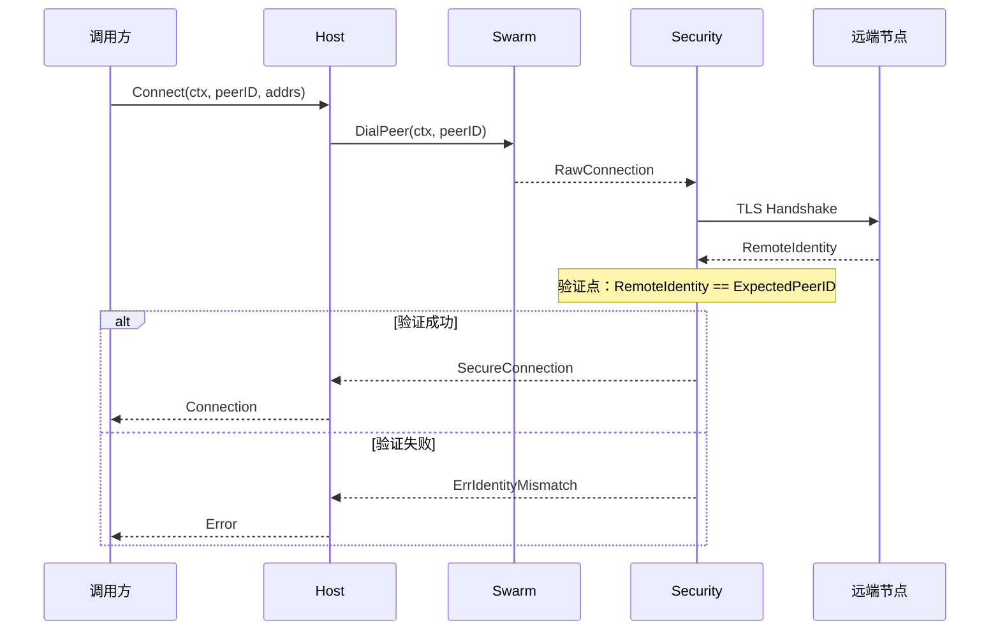
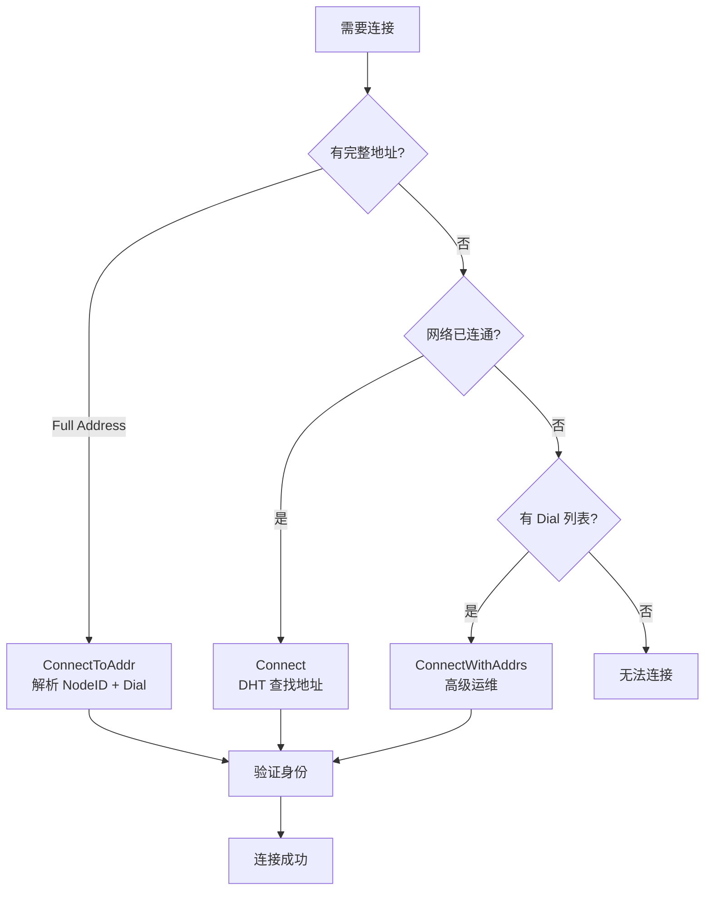
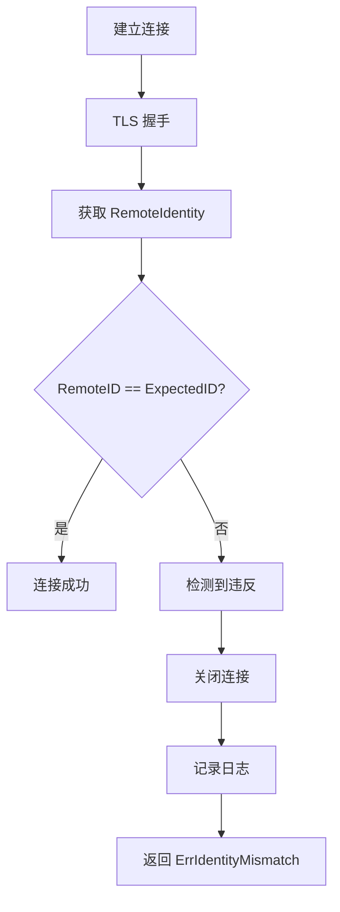
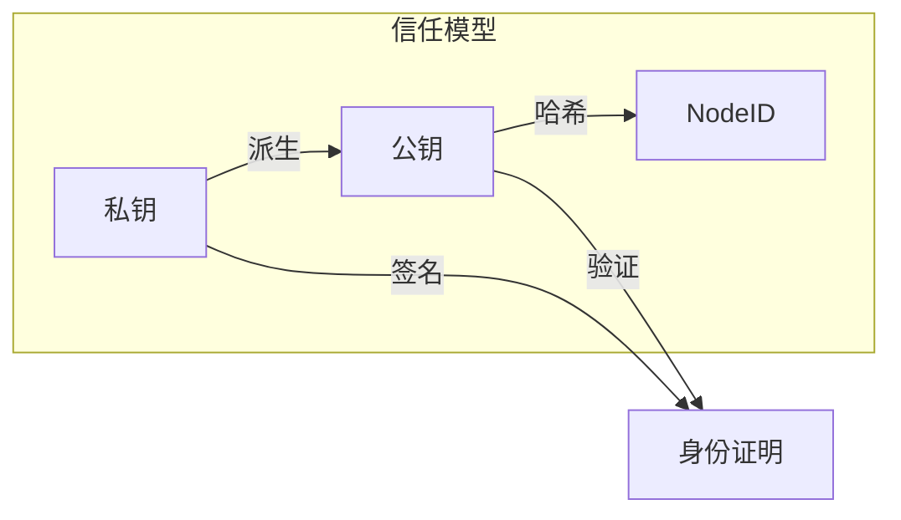

# INV-001: 身份第一性

## 元数据

| 属性 | 值 |
|------|-----|
| **ID** | INV-001 |
| **名称** | 身份第一性（Identity First） |
| **状态** | active |
| **关联 ADR** | [ADR-0001](../ADR-0001-identity-first.md) |
| **关联需求** | [REQ-ID-001](../../requirements/functional/F1_identity/REQ-ID-001.md) |

---

## 不变量陈述

> **任何连接都 MUST 绑定 Expected NodeID，并在握手后验证 RemoteIdentity == ExpectedNodeID。**

这是 DeP2P 最核心的不变量，定义了系统的基本连接语义。

---

## 规范说明

### 核心断言

```
┌─────────────────────────────────────────────────────────────────────────────┐
│                      INV-001：身份第一性                                     │
├─────────────────────────────────────────────────────────────────────────────┤
│                                                                              │
│   在 DeP2P 中不存在"纯 IP 连接"这件事                                       │
│   只能存在"按身份（NodeID）连接"，IP/端口只是 Dial Address（拨号提示）       │
│                                                                              │
│   连接目标：永远是 NodeID（公钥身份）                                        │
│   地址角色：永远只是 Dial Address（或 Relay Circuit Address）                │
│   验证要求：RemoteIdentity == ExpectedNodeID（MUST）                         │
│                                                                              │
└─────────────────────────────────────────────────────────────────────────────┘
```

### 正确与错误表述

| 类型 | 表述 |
|------|------|
| ✅ 正确 | "连接到 NodeID，使用 Dial Address 作为拨号路径" |
| ✅ 正确 | "身份连接 + 地址提示" |
| ✅ 正确 | "NodeID 连接 + 多地址尝试" |
| ❌ 错误 | "连接到 IP:Port" |
| ❌ 错误 | "无身份连接" |
| ❌ 错误 | "纯地址连接" |

---

## 验证时机

### 验证流程



### 关键验证点

| 验证点 | 时机 | 条件 | 失败行为 |
|--------|------|------|----------|
| TLS 握手后 | 安全连接建立后 | `RemoteIdentity == ExpectedNodeID` | 关闭连接，返回 `ErrIdentityMismatch` |

---

## 代码约束

### MUST 要求

```go
// MUST: 所有连接建立都包含身份验证
func (h *Host) Connect(ctx context.Context, peerID string, addrs []string) error {
    // 获取或发现地址
    if len(addrs) == 0 {
        addrs = h.Peerstore().Addrs(peerID)
    }
    if len(addrs) == 0 {
        return ErrNoAddresses
    }
    
    // 通过 Swarm 建立连接（内部会进行安全握手）
    conn, err := h.swarm.DialPeer(ctx, peerID)
    if err != nil {
        return err
    }
    
    // INV-001 验证点 - Security 层已验证
    // TLS 握手时会验证 RemotePeerID == ExpectedPeerID
    if conn.RemotePeer() != peerID {
        conn.Close()
        return ErrIdentityMismatch
    }
    
    return nil
}
```

### MUST NOT 要求

```go
// MUST NOT: 不存在无身份目标的连接
func (h *Host) ConnectToIP(addr string) error {
    // 此方法不应该存在！
    // 违反 INV-001：没有 Expected PeerID
}

// MUST NOT: 不跳过身份验证
func (h *Host) Connect(ctx context.Context, peerID string, addrs []string) error {
    conn, err := h.swarm.DialAddr(ctx, addrs[0])
    if err != nil {
        return err
    }
    // 缺少身份验证！违反 INV-001
    return nil
}
```

---

## 三条连接语义

基于 INV-001，DeP2P 定义三条确定性连接语义：



| 语义 | API | 输入 | 用户可见 |
|------|-----|------|---------|
| DialByNodeID | `Connect(nodeID)` | NodeID | 推荐 |
| DialByFullAddress | `ConnectToAddr(fullAddr)` | Full Address | 推荐 |
| DialByNodeIDWithDialAddrs | `ConnectWithAddrs(nodeID, addrs)` | NodeID + Dial Address | 隐藏 |

> **所有三条语义都以 NodeID 为目标，地址只是拨号路径。**

---

## 测试要求

### 必须覆盖的场景

| 场景 | 测试名称 | 期望结果 |
|------|----------|----------|
| 正常连接 | `TestINV001_ValidConnection` | 连接成功 |
| 身份不匹配 | `TestINV001_IdentityMismatch` | 返回 `ErrIdentityMismatch`，连接关闭 |
| 无 Expected ID | `TestINV001_NoExpectedID` | 编译错误或 panic |
| 中间人攻击 | `TestINV001_MITM` | 连接失败 |

### 测试示例

```go
func TestINV001_IdentityMismatch(t *testing.T) {
    nodeA := createTestNode(t)
    nodeB := createTestNode(t)
    nodeC := createTestNode(t) // 假冒节点
    
    // 尝试用 nodeB 的 ID 连接到 nodeC
    _, err := nodeA.Connect(context.Background(), nodeB.ID())
    
    // 期望：身份验证失败
    assert.ErrorIs(t, err, ErrIdentityMismatch)
}

func TestINV001_ValidConnection(t *testing.T) {
    nodeA := createTestNode(t)
    nodeB := createTestNode(t)
    
    conn, err := nodeA.Connect(context.Background(), nodeB.ID())
    
    assert.NoError(t, err)
    assert.Equal(t, nodeB.ID(), conn.RemoteID())
}
```

---

## 违反后果

### 检测违反



### 错误处理

```go
var (
    // ErrIdentityMismatch 表示远端身份与预期不匹配
    ErrIdentityMismatch = errors.New("remote identity does not match expected")
)

func handleIdentityMismatch(conn net.Conn, expected, actual NodeID) error {
    conn.Close()
    
    log.Warn("identity mismatch detected",
        "expected", expected,
        "actual", actual,
        "remote_addr", conn.RemoteAddr(),
    )
    
    return fmt.Errorf("%w: expected %s, got %s", ErrIdentityMismatch, expected, actual)
}
```

---

## 安全意义

### 防护能力

| 威胁 | INV-001 防护 |
|------|-------------|
| 中间人攻击 | 攻击者无法伪造 NodeID |
| DNS 欺骗 | 即使 IP 被篡改，身份验证仍会失败 |
| IP 欺骗 | IP 不是连接目标，NodeID 才是 |
| 节点冒充 | 没有对应私钥无法通过验证 |

### 信任模型



---

## 相关文档

| 类型 | 链接 |
|------|------|
| **ADR** | [ADR-0001](../ADR-0001-identity-first.md): 身份优先设计 |
| **需求** | [REQ-ID-001](../../requirements/functional/F1_identity/REQ-ID-001.md): NodeID 设计 |
| **需求** | [REQ-SEC-002](../../requirements/functional/F4_security/REQ-SEC-002.md): 身份验证 |

---

## 变更历史

| 日期 | 版本 | 变更说明 |
|------|------|----------|
| 2024-01 | 1.0 | 初始版本 |
| 2026-01-11 | 1.1 | 迁移到新文档结构 |
