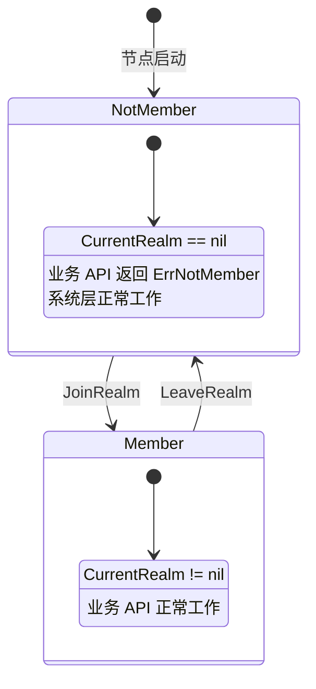
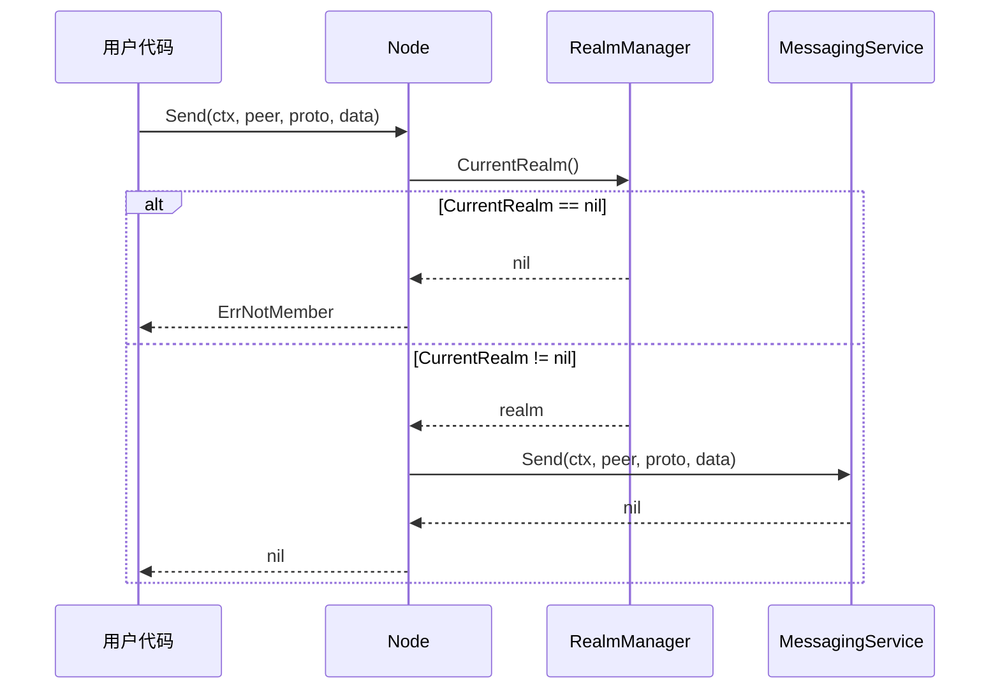
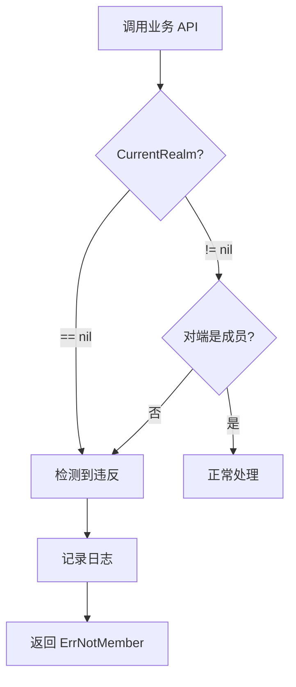
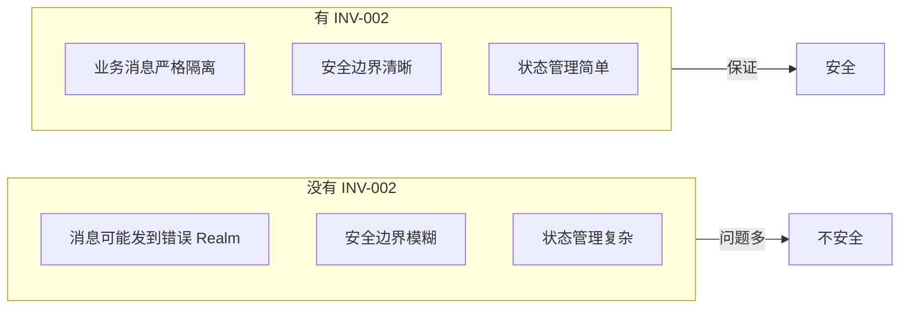

# INV-002: Realm 成员资格

## 元数据

| 属性 | 值 |
|------|-----|
| **ID** | INV-002 |
| **名称** | Realm 成员资格（Realm Membership） |
| **状态** | active |
| **关联 ADR** | [ADR-0002](../ADR-0002-realm-isolation.md) |
| **关联需求** | [REQ-REALM-001](../../requirements/functional/F5_realm/REQ-REALM-001.md) |

---

## 不变量陈述

> **业务 API（Send/Request/Publish/Subscribe）在 `CurrentRealm() == nil` 时 MUST 返回 `ErrNotMember`。**

这是 DeP2P Realm 隔离的核心不变量，确保业务层的安全边界。

---

## 规范说明

### 核心断言

```
┌─────────────────────────────────────────────────────────────────────────────┐
│                      INV-002：Realm 成员资格                                 │
├─────────────────────────────────────────────────────────────────────────────┤
│                                                                              │
│   节点同一时间只能属于一个 Realm，Join 前业务层零交互                        │
│                                                                              │
│   成员状态：                                                                 │
│   ─────────                                                                  │
│   CurrentRealm() == nil  → 未加入任何 Realm，业务 API 不可用                │
│   CurrentRealm() != nil  → 已加入 Realm，业务 API 可用                      │
│                                                                              │
│   业务 API 边界：                                                            │
│   ─────────────                                                              │
│   Send()      → 需要 Realm 成员资格                                         │
│   Request()   → 需要 Realm 成员资格                                         │
│   Publish()   → 需要 Realm 成员资格                                         │
│   Subscribe() → 需要 Realm 成员资格                                         │
│                                                                              │
│   系统层不受影响：                                                           │
│   ───────────────                                                            │
│   DHT、Relay、NAT、Bootstrap 等系统层功能始终可用                           │
│                                                                              │
└─────────────────────────────────────────────────────────────────────────────┘
```

### 层次边界

| 层次 | 需要 Realm? | 说明 |
|------|-------------|------|
| 系统层 | 否 | DHT/Relay/NAT 始终可用 |
| Realm 层 | - | JoinRealm/LeaveRealm 管理状态 |
| 应用层 | 是 | 业务 API 需要 Realm |

---

## 验证时机

### 状态机



### 验证流程



---

## 代码约束

### MUST 要求

```go
// MUST: 业务 API 必须检查 Realm 状态
func (n *Node) Send(ctx context.Context, to NodeID, proto string, data []byte) error {
    // INV-002 检查点 - 必须存在
    realm := n.CurrentRealm()
    if realm == nil {
        return ErrNotMember
    }
    
    return realm.Messaging().Send(ctx, to, proto, data)
}

// MUST: 通过 Realm 对象获取服务
realm := node.CurrentRealm()
if realm == nil {
    return ErrNotMember
}
messaging := realm.Messaging()
pubsub := realm.PubSub()
```

### MUST NOT 要求

```go
// MUST NOT: 跳过 Realm 检查
func (n *Node) Send(ctx context.Context, to NodeID, proto string, data []byte) error {
    // 缺少 Realm 检查！违反 INV-002
    return n.messaging.Send(ctx, to, proto, data)
}

// MUST NOT: 允许未加入 Realm 时发送消息
func (n *Node) SendAnyway(...) error {
    // 此方法不应该存在！违反 INV-002
}
```

---

## 受影响的 API

### 需要 Realm 的 API（应用层）

| API | 需要 Realm | 说明 |
|-----|-----------|------|
| `Send(peer, proto, data)` | 是 | 单向消息 |
| `Request(peer, proto, data)` | 是 | 请求响应 |
| `Publish(topic, data)` | 是 | 发布消息 |
| `Subscribe(topic)` | 是 | 订阅主题 |
| `SetMessageHandler(proto, handler)` | 是 | 注册处理器 |

### 不需要 Realm 的 API（系统层）

| API | 需要 Realm | 说明 |
|-----|-----------|------|
| `Connect(nodeID)` | 否 | 连接节点 |
| `ConnectToAddr(addr)` | 否 | 连接地址 |
| `JoinRealm(name, psk)` | 否 | 加入 Realm |
| `LeaveRealm()` | 否 | 离开 Realm |
| `ID()` | 否 | 获取节点 ID |
| `ListenAddrs()` | 否 | 获取监听地址 |

---

## 测试要求

### 必须覆盖的场景

| 场景 | 测试名称 | 期望结果 |
|------|----------|----------|
| 未加入时 Send | `TestINV002_Send_NotMember` | 返回 `ErrNotMember` |
| 未加入时 Request | `TestINV002_Request_NotMember` | 返回 `ErrNotMember` |
| 未加入时 Publish | `TestINV002_Publish_NotMember` | 返回 `ErrNotMember` |
| 加入后 Send | `TestINV002_Send_Member` | 成功 |
| 离开后再 Send | `TestINV002_Send_AfterLeave` | 返回 `ErrNotMember` |

### 测试示例

```go
func TestINV002_Send_NotMember(t *testing.T) {
    node := createTestNode(t)
    defer node.Close()
    
    // 未加入 Realm
    assert.Nil(t, node.CurrentRealm())
    
    // 尝试发送消息
    err := node.Send(context.Background(), somePeerID, "/app/msg", []byte("hello"))
    
    // 期望：返回 ErrNotMember
    assert.ErrorIs(t, err, ErrNotMember)
}

func TestINV002_Send_Member(t *testing.T) {
    node := createTestNode(t)
    defer node.Close()
    
    // 加入 Realm
    psk := generatePSK()
    err := node.JoinRealm(context.Background(), "test-realm", psk)
    require.NoError(t, err)
    
    // 验证已加入
    assert.NotNil(t, node.CurrentRealm())
    
    // 现在可以发送消息
    err = node.Send(context.Background(), memberPeerID, "/app/msg", []byte("hello"))
    assert.NoError(t, err)
}

func TestINV002_Send_AfterLeave(t *testing.T) {
    node := createTestNode(t)
    defer node.Close()
    
    // 加入然后离开
    node.JoinRealm(ctx, "test-realm", psk)
    node.LeaveRealm()
    
    // 验证已离开
    assert.Nil(t, node.CurrentRealm())
    
    // 尝试发送消息
    err := node.Send(ctx, somePeerID, "/app/msg", []byte("hello"))
    
    // 期望：返回 ErrNotMember
    assert.ErrorIs(t, err, ErrNotMember)
}
```

---

## 违反后果

### 检测违反



### 错误处理

```go
var (
    ErrNotMember     = errors.New("not a member of any realm")
    ErrAlreadyJoined = errors.New("already joined a realm")
)

func handleBusinessLogic(node *Node, peer NodeID, data []byte) error {
    err := node.Send(context.Background(), peer, "/app/msg", data)
    
    if errors.Is(err, ErrNotMember) {
        log.Warn("请先加入 Realm")
        return err
    }
    
    return err
}
```

---

## 设计理由

### 为什么需要这个不变量



---

## 相关文档

| 类型 | 链接 |
|------|------|
| **ADR** | [ADR-0002](../ADR-0002-realm-isolation.md): Realm 隔离设计 |
| **需求** | [REQ-REALM-001](../../requirements/functional/F5_realm/REQ-REALM-001.md): Realm 强制隔离 |

---

## 变更历史

| 日期 | 版本 | 变更说明 |
|------|------|----------|
| 2024-01 | 1.0 | 初始版本 |
| 2026-01-11 | 1.1 | 迁移到新文档结构 |
