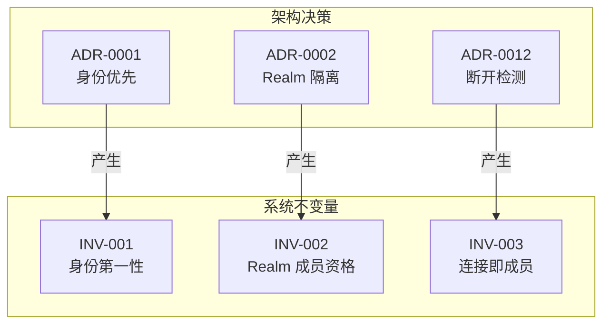

# 系统不变量 (System Invariants)

> 定义 DeP2P 必须始终保持的核心约束条件

---

## 什么是不变量？

不变量是系统必须始终满足的约束条件。违反不变量将导致：
- 安全漏洞
- 系统行为不可预测
- 功能失效

---

## 不变量索引

| ID | 名称 | 关联 ADR | 说明 |
|----|------|----------|------|
| [INV-001](INV-001-identity-first.md) | 身份第一性 | [ADR-0001](../ADR-0001-identity-first.md) | 连接必须验证身份 |
| [INV-002](INV-002-realm-membership.md) | Realm 成员资格 | [ADR-0002](../ADR-0002-realm-isolation.md) | 业务 API 需要 Realm |
| [INV-003](INV-003-connection-membership.md) | **连接即成员** | [ADR-0012](../ADR-0012-disconnect-detection.md) | **有连接才能是在线成员** |

---

## 不变量与 ADR 的关系

---

## 不变量验证

每个不变量都定义了：

1. **验证时机**：何时进行验证
2. **验证条件**：必须满足的条件
3. **失败行为**：违反时的处理

---

## 相关文档

- [架构决策](../README.md)
- [需求文档](../../requirements/)

---

**最后更新**：2026-01-28（新增 INV-003 连接即成员）
