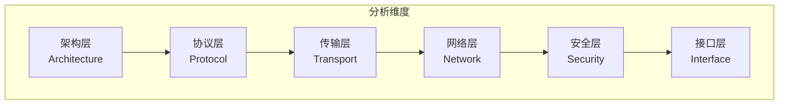

# 参考研究与竞品分析（References）

本目录存放对外部 P2P 网络库的分析、研究和参考文档，为 DeP2P 的设计决策提供依据。

---

## 目录结构

```
references/
├── README.md                       # 本文件 - 参考研究规范
├── individual/                     # 单产品深度分析（P2P 库）
│   ├── README.md                   # 产品索引
│   ├── iroh.md                     # iroh 分析（n0）
│   ├── libp2p.md                   # go-libp2p 分析（IPFS）
│   └── torrent.md                  # anacrolix/torrent 分析
├── comparison/                     # 跨产品对比分析（P2P 库）
│   ├── README.md                   # 对比分析索引
│   ├── architecture/               # 架构层对比
│   ├── protocol/                   # 协议层对比
│   ├── transport/                  # 传输层对比
│   ├── network/                    # 网络层对比
│   ├── security/                   # 安全层对比
│   └── interface/                  # 接口层对比
└── blockchain/                     # 区块链场景分析 ⭐ 新增
    ├── README.md                   # 区块链分析索引
    ├── individual/                 # 单项目分析
    │   ├── ethereum.md             # go-ethereum devp2p
    │   ├── fabric.md               # Fabric gossip
    │   └── bitcoin.md              # btcd wire
    ├── comparison/                 # 对比分析
    │   └── blockchain-p2p.md       # 区块链 P2P 横向对比
    └── requirements/               # 需求提炼
        └── blockchain-scenario.md  # 区块链场景需求
```

---

## 定位与目标

### 定位

| 维度 | 说明 |
|------|------|
| **性质** | 内部研究资料，不对外发布 |
| **目的** | 为 DeP2P 设计决策提供参考依据 |
| **来源** | 开源项目代码、文档、论文、社区讨论 |
| **输出** | 产品分析、跨产品对比、对 DeP2P 的启示 |

### 目标

1. **系统性分析**：对主流 P2P 网络库进行结构化分析
2. **多维度对比**：跨产品的架构、协议、传输、网络、安全、接口对比
3. **支撑决策**：为 ADR 和设计提案提供依据
4. **避免重复**：学习业界已验证的解决方案

---

## 待分析产品

| 产品 | 路径 | 语言 | 类型 | 关注点 |
|------|------|------|------|--------|
| **iroh** | `iroh-main/` | Rust | P2P 网络库 | QUIC、Relay、现代设计 |
| **go-libp2p** | `go-libp2p-master/` | Go | P2P 协议栈 | 模块化、协议抽象、成熟度 |
| **torrent** | `torrent-master/` | Go | BitTorrent | DHT、Peer 发现、数据传输 |

---

## 分析维度体系

### 六大分析维度



### 维度详解

#### 1. 架构层（Architecture）

| 子维度 | 分析内容 | 关键问题 |
|--------|----------|----------|
| **整体架构** | 分层设计、模块划分、依赖关系 | 如何组织代码？有几层抽象？ |
| **代码组织** | 目录结构、包划分、命名规范 | 目录布局？公开/私有边界？ |
| **设计模式** | 接口抽象、生命周期、依赖注入 | 用了哪些设计模式？ |
| **可扩展性** | 插件机制、协议扩展、配置化 | 如何扩展新功能？ |

#### 2. 协议层（Protocol）

| 子维度 | 分析内容 | 关键问题 |
|--------|----------|----------|
| **协议命名** | 协议 ID 规范、版本控制 | 协议如何命名？如何版本化？ |
| **协议协商** | 多协议支持、协议选择 | 如何协商使用哪个协议？ |
| **消息格式** | 序列化、编码、帧格式 | 消息如何编码？用 Protobuf 还是其他？ |
| **协议扩展** | 扩展点、向后兼容 | 如何添加新协议？ |

#### 3. 传输层（Transport）

| 子维度 | 分析内容 | 关键问题 |
|--------|----------|----------|
| **传输协议** | TCP/QUIC/WebSocket/WebRTC | 支持哪些传输协议？ |
| **连接管理** | 连接池、多路复用、保活 | 如何管理连接生命周期？ |
| **流控制** | 背压、流量控制、优先级 | 如何处理拥塞？ |
| **中继机制** | Relay 设计、代理转发 | 如何实现中继？ |

#### 4. 网络层（Network）

| 子维度 | 分析内容 | 关键问题 |
|--------|----------|----------|
| **节点发现** | DHT、Rendezvous、mDNS | 如何发现其他节点？ |
| **NAT 穿透** | STUN/TURN/ICE、打洞 | 如何穿透 NAT？ |
| **地址管理** | 地址格式、地址发布 | 如何管理多地址？ |
| **路由策略** | 路径选择、负载均衡 | 如何选择最优路径？ |

#### 5. 安全层（Security）

| 子维度 | 分析内容 | 关键问题 |
|--------|----------|----------|
| **身份认证** | 密钥格式、节点 ID、证书 | 如何标识节点身份？ |
| **加密传输** | TLS/Noise、握手协议 | 如何加密通信？ |
| **访问控制** | 权限模型、连接过滤 | 如何控制谁能连接？ |
| **隐私保护** | 匿名性、元数据保护 | 是否保护隐私？ |

#### 6. 接口层（Interface）

| 子维度 | 分析内容 | 关键问题 |
|--------|----------|----------|
| **API 设计** | 公开接口、易用性 | API 是否友好？ |
| **配置管理** | 配置方式、默认值 | 如何配置？ |
| **可观测性** | 指标、日志、追踪 | 如何监控？ |
| **错误处理** | 错误码、错误恢复 | 错误如何处理？ |

---

## 对比矩阵模板

### 整体对比

| 特性 | iroh | go-libp2p | torrent | **DeP2P** |
|------|------|-----------|---------|-----------|
| **语言** | Rust | Go | Go | Go |
| **主要协议** | QUIC | 多协议 | BitTorrent | QUIC |
| **节点发现** | DNS+DHT | DHT+mDNS+Rendezvous | DHT+Tracker | Rendezvous |
| **NAT 穿透** | Relay | AutoNAT+Relay | - | Relay+STUN |
| **安全模型** | TLS | Noise/TLS | - | TLS+PSK |

---

## 单产品分析模板

每个产品分析文档覆盖以下标准结构：

```markdown
# {产品名} 分析

## 1. 项目概述
- 基本信息（仓库、许可、版本、维护状态）
- 定位与特点
- 关键特性

## 2. 架构分析
- 整体架构（分层图）
- 核心模块
- 设计模式

## 3. 协议设计
- 协议栈
- 消息格式
- 协议扩展

## 4. 传输层
- 支持的传输
- 连接管理
- 中继机制

## 5. 网络层
- 节点发现
- NAT 穿透
- 地址管理

## 6. 安全机制
- 身份认证
- 加密传输
- 访问控制

## 7. 接口设计
- API 风格
- 配置方式
- 可观测性

## 8. 对 DeP2P 的启示
- 可借鉴点
- 主要差异
- 相关决策
```

---

## 引用来源

### 主要参考项目

| 项目 | 路径 | 说明 |
|------|------|------|
| iroh | `/Users/qinglong/go/src/chaincodes/p2p/iroh-main` | n0 团队的现代化 P2P 库 |
| go-libp2p | `/Users/qinglong/go/src/chaincodes/p2p/go-libp2p-master` | IPFS 团队的 P2P 协议栈 |
| torrent | `/Users/qinglong/go/src/chaincodes/p2p/torrent-master` | BitTorrent Go 实现 |

### 引用规范

1. **明确来源**：每个分析必须标注来源（代码路径、文档链接、版本）
2. **尊重许可**：遵守开源许可证，仅用于内部学习参考
3. **避免复制**：分析和提炼，而非直接复制
4. **版本标注**：标注分析时的源项目版本

---

## 与 ADR 的关联

```
产品分析 ──→ 对比分析 ──→ 设计提案 ──→ 架构决策（ADR） ──→ 需求/实现
```

### 关联示例

```markdown
## ADR-0003: Relay 优先连接

### 背景

基于对 iroh 和 go-libp2p 的 Relay 设计对比分析...

### 参考

- [iroh 分析](./individual/iroh.md)
- [Relay 对比](./comparison/transport/relay.md)
```

---

## 快速导航

### 单产品分析

| 产品 | 文档 | 语言 | 状态 |
|------|------|------|------|
| iroh | [iroh.md](./individual/iroh.md) | Rust | ✅ 已完成 |
| go-libp2p | [libp2p.md](./individual/libp2p.md) | Go | ✅ 已完成 |
| torrent | [torrent.md](./individual/torrent.md) | Go | ✅ 已完成 |

### 跨产品对比

| 层级 | 索引 | 状态 |
|------|------|------|
| 传输层 | [transport/](./comparison/transport/) | ✅ Relay 对比 |
| 网络层 | [network/](./comparison/network/) | ✅ 发现、NAT 对比 |
| 安全层 | [security/](./comparison/security/) | ✅ 身份对比 |

### 区块链场景分析

| 项目 | 文档 | 类型 | 状态 |
|------|------|------|------|
| go-ethereum | [ethereum.md](./blockchain/individual/ethereum.md) | 公链 | ✅ 已完成 |
| Fabric | [fabric.md](./blockchain/individual/fabric.md) | 联盟链 | ✅ 已完成 |
| btcd | [bitcoin.md](./blockchain/individual/bitcoin.md) | 公链 | ✅ 已完成 |
| 横向对比 | [blockchain-p2p.md](./blockchain/comparison/blockchain-p2p.md) | 对比 | ✅ 已完成 |
| 场景需求 | [blockchain-scenario.md](./blockchain/requirements/blockchain-scenario.md) | 需求 | ✅ 已完成 |

---

## 相关文档

- [需求文档](../requirements/)
- [架构决策](../decisions/)
- [架构设计](../../03_architecture/)

---

**最后更新**：2026-01-13
