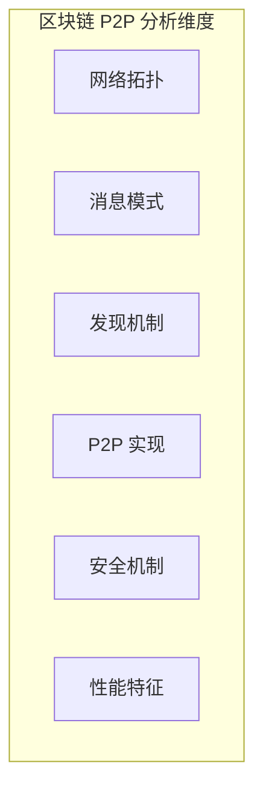

# 区块链 P2P 网络分析

> **目标**：分析主流区块链项目的 P2P 网络实现，提炼区块链场景对 P2P 网络的需求，指导 DeP2P 更好地支持区块链应用场景。

---

## 目录结构

```
blockchain/
├── README.md                      # 本文件 - 区块链分析索引
├── individual/                    # 单项目分析
│   ├── ethereum.md                # go-ethereum devp2p
│   ├── fabric.md                  # Hyperledger Fabric gossip
│   └── bitcoin.md                 # btcd P2P
├── comparison/                    # 对比分析
│   └── blockchain-p2p.md          # 区块链 P2P 横向对比
└── requirements/                  # 需求提炼
    └── blockchain-scenario.md     # 区块链场景需求
```

---

## 定位说明

### 与 P2P 库分析的区别

| 维度 | P2P 库分析 (individual/) | 区块链分析 (blockchain/) |
|------|--------------------------|-------------------------|
| **分析对象** | iroh、libp2p、torrent | ethereum、fabric、bitcoin |
| **视角** | "如何实现 P2P" | "如何使用 P2P" |
| **目标** | 学习 P2P 设计模式 | 提炼区块链场景需求 |
| **输出** | 技术对比 | 场景需求 + 技术实现 |

### 分析目标

1. **需求提炼**：区块链对 P2P 网络有什么特殊需求？
2. **实现分析**：各区块链如何实现 P2P 网络？
3. **Gap 分析**：DeP2P 如何更好支持区块链？

---

## 分析维度



### 维度详解

| 维度 | 分析内容 | 关键问题 |
|------|----------|----------|
| **网络拓扑** | 节点类型、角色划分 | 有几种节点？如何分工？ |
| **消息模式** | 区块广播、交易传播、共识消息 | 消息如何传播？什么模式？ |
| **发现机制** | Bootstrap、DHT、静态节点 | 如何发现其他节点？ |
| **P2P 实现** | 自研 vs libp2p、协议栈 | 用什么 P2P 库？ |
| **安全机制** | 身份认证、权限控制 | 如何验证节点身份？ |
| **性能特征** | 延迟要求、吞吐需求 | 性能指标是什么？ |

---

## 分析项目

### 项目列表

| 项目 | 类型 | P2P 实现 | 分析优先级 |
|------|------|----------|------------|
| **go-ethereum** | 公链 (PoS) | 自研 devp2p | 高 |
| **Fabric** | 联盟链 | gossip + gRPC | 高 |
| **btcd** | 公链 (PoW) | 自研 wire | 中 |
| **Solana** | 公链 (PoH) | 基于 libp2p | 低（可选） |

### 源码路径

| 项目 | 源码路径 | 关键目录 |
|------|----------|----------|
| go-ethereum | `区块链/ethereum/go-ethereum-master` | `p2p/` |
| fabric | `区块链/fabric/fabric-main` | `gossip/` |
| btcd | `区块链/比特币/btcd-master` | `peer/`, `wire/` |
| solana | `区块链/solana-labs/solana-master` | `gossip/` |

---

## 分析模板

每个区块链项目按以下标准结构分析：

```markdown
# {项目名} P2P 网络分析

## 1. 项目概述
- 基本信息（类型、共识、语言）
- P2P 网络定位

## 2. 网络拓扑
- 节点类型（全节点/轻节点/验证者）
- 角色划分
- 网络结构图

## 3. 消息模式
- 消息类型（区块、交易、共识、状态）
- 传播方式（广播、请求-响应、流）
- 消息格式

## 4. P2P 实现
- 技术栈（自研/libp2p）
- 协议设计
- 连接管理

## 5. 发现机制
- Bootstrap 节点
- DHT / 静态节点
- 节点发现流程

## 6. 安全机制
- 身份认证
- 权限控制
- 加密传输

## 7. 性能特征
- 延迟要求
- 吞吐需求
- 扩展性

## 8. 对 DeP2P 的启示
- 需求映射
- 设计参考
- Realm 应用场景
```

---

## 区块链消息模式

### 消息类型分类

| 消息类型 | 说明 | 传播方式 | 优先级 |
|----------|------|----------|--------|
| **区块广播** | 新区块通知 | Gossip 广播 | 高 |
| **交易传播** | 未确认交易 | Gossip 广播 | 中 |
| **共识消息** | 投票、提议 | 定向发送 | 最高 |
| **状态同步** | 区块/状态下载 | 请求-响应 | 中 |
| **节点发现** | 节点地址交换 | 请求-响应 | 低 |

### 消息模式映射

```
区块链消息模式 → DeP2P 服务映射：

  区块广播      → PubSub (GossipSub)
  交易传播      → PubSub (GossipSub)
  共识消息      → Messaging (定向发送)
  状态同步      → Streams (双向流)
  节点发现      → 系统层 (DHT)
```

---

## 与 DeP2P 的关联

### Realm 在区块链中的应用

| 区块链概念 | DeP2P 映射 | 说明 |
|------------|-----------|------|
| **主网/测试网** | 不同 Realm | 网络隔离 |
| **Fabric Channel** | Realm | 业务隔离 |
| **分片网络** | 多 Realm | 分片隔离 |
| **私有交易** | Realm 内通信 | 隐私保护 |

### 需求映射

| 区块链需求 | DeP2P 特性 | 状态 |
|------------|-----------|------|
| 区块广播 | PubSub | 支持 |
| 交易传播 | PubSub | 支持 |
| 点对点请求 | Messaging | 支持 |
| 状态同步流 | Streams | 支持 |
| 网络隔离 | Realm | 核心特性 |
| 权限控制 | PSK 认证 | 核心特性 |

---

## 文档索引

### 单项目分析

| 项目 | 文档 | 状态 |
|------|------|------|
| go-ethereum | [ethereum.md](individual/ethereum.md) | ✅ 已完成 |
| Fabric | [fabric.md](individual/fabric.md) | ✅ 已完成 |
| btcd | [bitcoin.md](individual/bitcoin.md) | ✅ 已完成 |

### 对比与需求

| 文档 | 内容 | 状态 |
|------|------|------|
| [blockchain-p2p.md](comparison/blockchain-p2p.md) | 横向对比 | ✅ 已完成 |
| [blockchain-scenario.md](requirements/blockchain-scenario.md) | 场景需求 | ✅ 已完成 |

---

## 相关文档

| 文档 | 说明 |
|------|------|
| [../individual/](../individual/) | P2P 库分析 |
| [../comparison/](../comparison/) | P2P 库对比 |
| [../../requirements/](../../requirements/) | 需求文档 |

---

**最后更新**：2026-01-11
