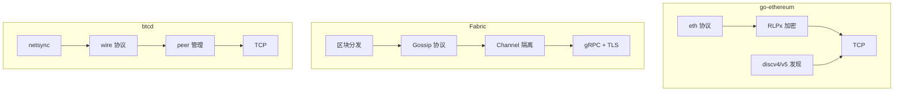

# 区块链 P2P 网络横向对比

> **对比对象**：go-ethereum、Fabric、btcd  
> **分析目的**：提炼区块链场景对 P2P 网络的共性需求

---

## 1. 总体对比

### 基本信息

| 属性 | go-ethereum | Fabric | btcd |
|------|-------------|--------|------|
| **类型** | 公链 (PoS) | 联盟链 | 公链 (PoW) |
| **语言** | Go | Go | Go |
| **P2P 实现** | 自研 devp2p | 自研 gossip | 自研 wire |
| **传输协议** | TCP + RLPx | gRPC + TLS | TCP |
| **加密** | ECIES + AES | TLS 双向 | 无 |
| **发现** | Kademlia DHT | Anchor Peer | DNS Seeds |

### 架构对比



---

## 2. 消息模式对比

### 消息类型

| 消息类型 | go-ethereum | Fabric | btcd |
|----------|-------------|--------|------|
| **区块广播** | NewBlockMsg | DataMsg | inv + block |
| **交易广播** | TransactionsMsg | - | inv + tx |
| **区块请求** | GetBlockHeadersMsg | Pull | getdata |
| **状态同步** | snap 协议 | StateInfoMsg | getheaders |
| **心跳** | Ping | AliveMsg | ping/pong |
| **节点发现** | discv4 FindNode | MembershipRequest | getaddr |

### 传播方式

| 项目 | 广播方式 | 请求-响应 |
|------|----------|-----------|
| **go-ethereum** | 直接推送 + 随机选择 | 有 |
| **Fabric** | Gossip (Push + Pull) | 有 |
| **btcd** | inv 通告 + 请求 | 有 |

### 消息格式

| 项目 | 编码格式 | 压缩 |
|------|----------|------|
| **go-ethereum** | RLP | Snappy |
| **Fabric** | Protobuf | 无 |
| **btcd** | 自定义二进制 | 无 |

---

## 3. 节点发现对比

### 发现机制

| 项目 | 主要机制 | 辅助机制 |
|------|----------|----------|
| **go-ethereum** | Kademlia DHT (discv4/v5) | DNS 发现 |
| **Fabric** | Anchor Peer + Gossip | 配置静态节点 |
| **btcd** | DNS Seeds | addr 消息交换 |

### 节点标识

| 项目 | NodeID 格式 | 计算方式 |
|------|-------------|----------|
| **go-ethereum** | 64 字节 | Keccak256(PublicKey)[12:] |
| **Fabric** | PKIid | SHA256(Certificate) |
| **btcd** | IP:Port | 无密码学标识 |

### 对比总结

```
节点发现演进：

  btcd (简单)
    ↓
  DNS Seeds + addr 交换
    ↓
  无密码学身份
  
  go-ethereum (中等)
    ↓
  Kademlia DHT
    ↓
  ECDSA 密钥身份
  
  Fabric (复杂)
    ↓
  MSP + 证书
    ↓
  Channel 隔离发现
```

---

## 4. 网络隔离对比

### 隔离机制

| 项目 | 隔离方式 | 实现 |
|------|----------|------|
| **go-ethereum** | NetworkID | 版本握手检查 |
| **Fabric** | Channel | MSP + 证书验证 |
| **btcd** | Magic Number | 消息头检查 |

### 与 DeP2P Realm 对比

| 特性 | Ethereum NetworkID | Fabric Channel | btcd Magic | **DeP2P Realm** |
|------|-------------------|----------------|------------|-----------------|
| **隔离粒度** | 全网 | 业务级 | 全网 | 业务级 |
| **成员验证** | 无 | 证书 | 无 | PSK |
| **动态加入** | 否 | 配置驱动 | 否 | 代码驱动 |
| **中继隔离** | 无 | 无 | 无 | 有 (Relay) |

---

## 5. 安全机制对比

### 传输安全

| 项目 | 加密 | 认证 |
|------|------|------|
| **go-ethereum** | ECIES + AES-256-CTR | 公钥验证 |
| **Fabric** | TLS 1.2+ | 双向证书 |
| **btcd** | 无 | 无 |

### 消息安全

| 项目 | 签名 | 完整性 |
|------|------|--------|
| **go-ethereum** | 交易签名 | MAC |
| **Fabric** | 消息签名 | Protobuf |
| **btcd** | 交易签名 | Checksum |

### 访问控制

| 项目 | 节点准入 | 消息过滤 |
|------|----------|----------|
| **go-ethereum** | 开放 | 无 |
| **Fabric** | MSP 策略 | Channel 成员 |
| **btcd** | 开放 | 无 |

---

## 6. 性能特征对比

### 默认参数

| 参数 | go-ethereum | Fabric | btcd |
|------|-------------|--------|------|
| **最大连接** | 50 | 无限制 | 125 |
| **消息大小** | 10 MB | 无固定限制 | 32 MB |
| **心跳间隔** | 15s | 5s | 2min |
| **超时时间** | 30s | 25s | 5min |

### 同步策略

| 项目 | 初始同步 | 增量同步 |
|------|----------|----------|
| **go-ethereum** | snap + 全同步 | 区块头优先 |
| **Fabric** | 状态拉取 | Leader 推送 |
| **btcd** | Headers-First | inv 通告 |

---

## 7. 共性需求提炼

### 消息模式需求

| 需求 | 说明 | DeP2P 支持 |
|------|------|-----------|
| **区块广播** | 高效传播新区块 | PubSub |
| **交易广播** | 传播未确认交易 | PubSub |
| **点对点请求** | 请求特定数据 | Messaging |
| **流式同步** | 批量数据传输 | Streams |

### 发现需求

| 需求 | 说明 | DeP2P 支持 |
|------|------|-----------|
| **初始发现** | Bootstrap 节点 | Bootstrap |
| **持续发现** | 动态发现新节点 | DHT |
| **隔离发现** | 只发现同域节点 | Realm + Rendezvous |

### 安全需求

| 需求 | 说明 | DeP2P 支持 |
|------|------|-----------|
| **身份验证** | 验证节点身份 | NodeID |
| **传输加密** | 保护通信内容 | TLS 1.3 |
| **成员准入** | 控制谁能加入 | PSK 认证 |

### 隔离需求

| 需求 | 说明 | DeP2P 支持 |
|------|------|-----------|
| **网络隔离** | 主网/测试网分离 | Realm |
| **业务隔离** | 不同业务分离 | Realm |
| **中继隔离** | 业务数据不泄露 | Relay |

---

## 8. 对 DeP2P 的启示

### 优势对标

| 区块链设计 | DeP2P 优势 |
|------------|-----------|
| Fabric Channel | **Realm 更轻量**（无需 PKI） |
| Ethereum RLPx | **QUIC 更现代**（内置加密） |
| btcd 简洁 | **更高安全性**（默认加密） |

### 差距补充

| 区块链需求 | DeP2P 需考虑 |
|------------|-------------|
| 大区块传输 | 流式传输优化 |
| 快速广播 | GossipSub 调优 |
| 轻节点支持 | 差分同步 |

### 设计建议

```
区块链场景建议：

  1. 消息模式
     - 区块/交易广播 → PubSub (Topic 隔离)
     - 数据请求 → Messaging (请求-响应)
     - 批量同步 → Streams (双向流)
     
  2. 网络隔离
     - 主网/测试网 → 不同 Realm
     - 分片 → 每分片一个 Realm
     
  3. 性能优化
     - 关键消息优先级
     - 大消息分片传输
     - 节点负载均衡
```

---

## 相关文档

| 文档 | 说明 |
|------|------|
| [ethereum.md](../individual/ethereum.md) | go-ethereum 分析 |
| [fabric.md](../individual/fabric.md) | Fabric 分析 |
| [bitcoin.md](../individual/bitcoin.md) | btcd 分析 |
| [blockchain-scenario.md](../requirements/blockchain-scenario.md) | 场景需求 |

---

**最后更新**：2026-01-11
