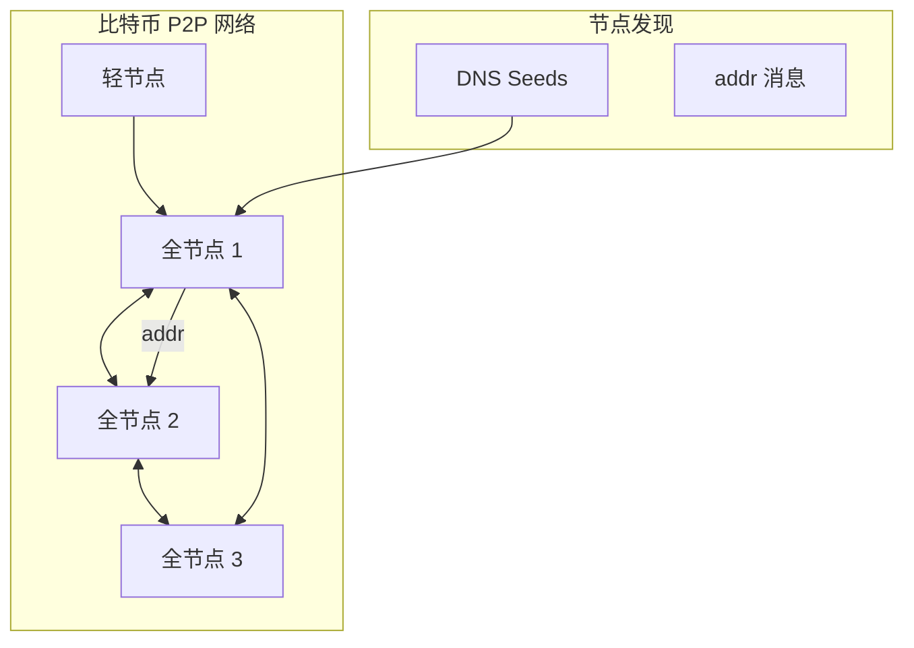
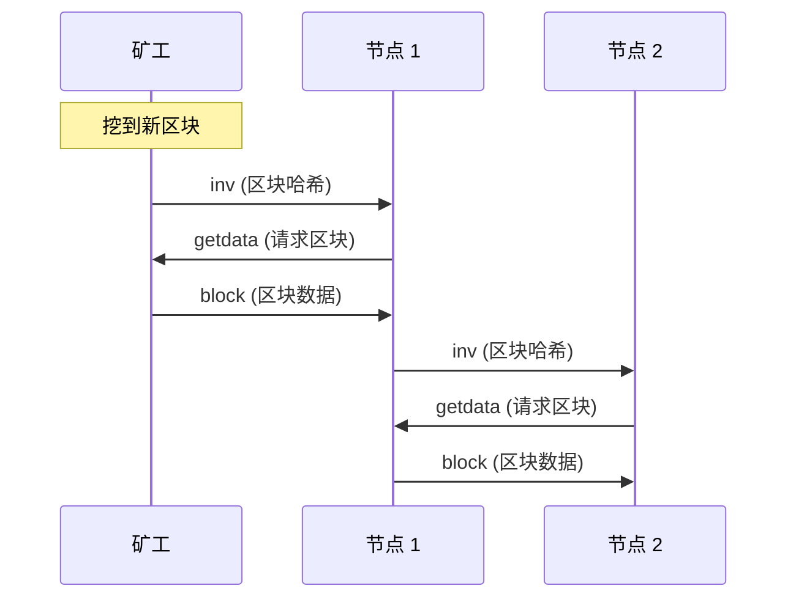
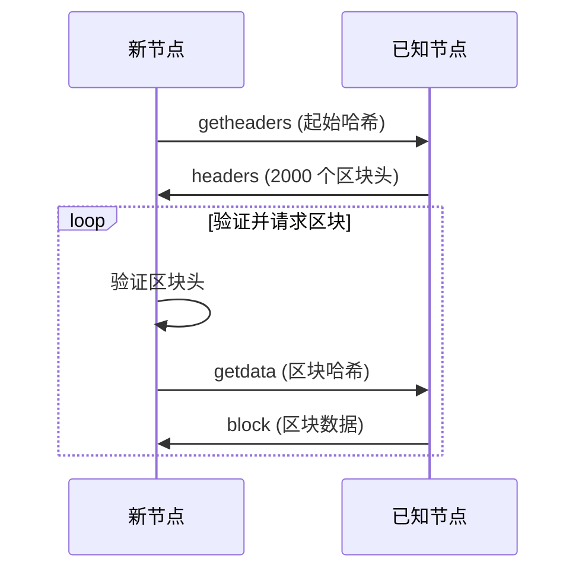
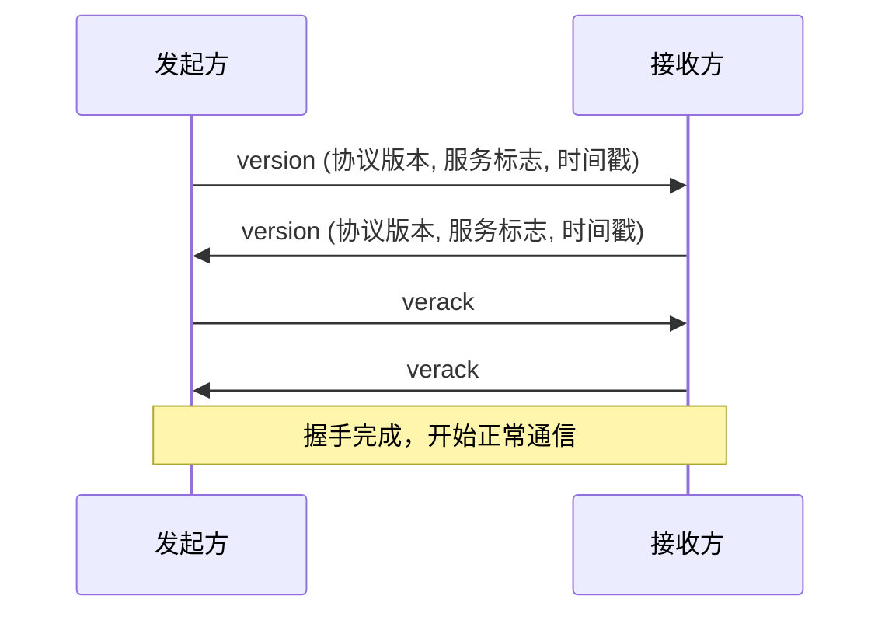
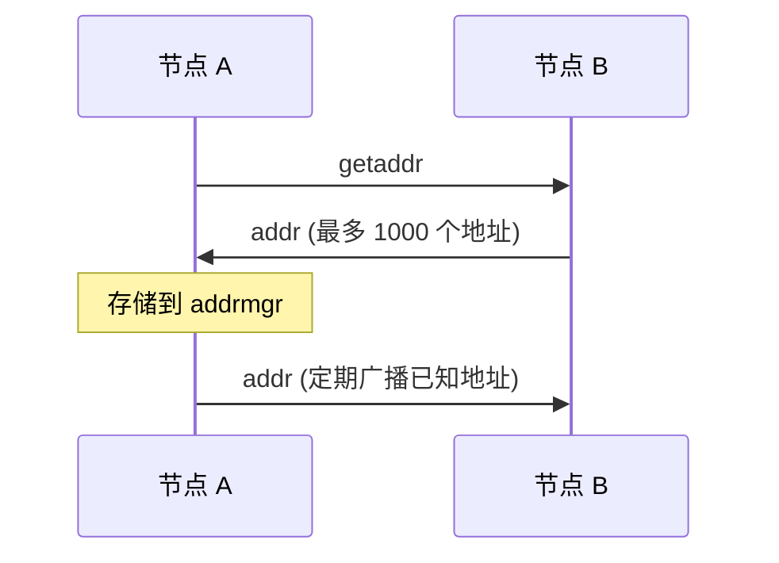

# btcd (Bitcoin) P2P 网络分析

> **分析对象**：btcd (Bitcoin Go 实现)  
> **版本**：最新 master  
> **源码路径**：`区块链/比特币/btcd-master/`

---

## 1. 项目概述

### 基本信息

| 属性 | 值 |
|------|-----|
| **项目** | btcd |
| **类型** | 公链（PoW） |
| **语言** | Go |
| **P2P 实现** | 自研 wire 协议 |
| **传输协议** | TCP |
| **发现协议** | DNS Seeds + addr 消息 |

### P2P 网络定位

btcd 的 P2P 网络负责：
- **区块传播**：广播新区块和区块头
- **交易传播**：广播未确认交易
- **节点发现**：DNS Seeds 和节点地址交换
- **区块同步**：下载历史区块

---

## 2. 网络拓扑

### 节点类型

| 节点类型 | ServiceFlag | 说明 |
|----------|-------------|------|
| **全节点** | SFNodeNetwork | 存储完整区块链 |
| **轻节点** | SFNodeBloom | 仅验证交易 |
| **裁剪节点** | SFNodeNetworkLimited | 保留最近 288 个区块 |
| **见证节点** | SFNodeWitness | 支持隔离见证 |

### 网络结构



### 连接管理

```
默认配置：

  MaxPeers = 125           // 最大连接数
  MaxOutbound = 8          // 最大出站连接
  TargetOutbound = 8       // 目标出站连接
  
连接类型：
  - 出站连接（主动连接）
  - 入站连接（被动接受）
  - 持久连接（配置的固定节点）
```

---

## 3. 消息模式

### 消息头格式

```
消息头 (24 字节)：

  +----------+----------+----------+----------+
  |  Magic   | Command  |  Length  | Checksum |
  | (4 bytes)| (12 bytes)| (4 bytes)| (4 bytes)|
  +----------+----------+----------+----------+
  
Magic: 网络标识（mainnet: 0xD9B4BEF9）
Command: 命令名（如 "version", "block"）
Length: 消息体长度
Checksum: SHA256(SHA256(payload))[:4]
```

### 消息类型

| 命令 | 说明 | 传播方式 |
|------|------|----------|
| **version** | 版本握手 | 请求-响应 |
| **verack** | 版本确认 | 响应 |
| **getaddr** | 请求节点地址 | 请求 |
| **addr/addrv2** | 节点地址 | 广播/响应 |
| **inv** | 库存通告 | 广播 |
| **getdata** | 请求数据 | 请求 |
| **block** | 区块数据 | 响应 |
| **tx** | 交易数据 | 广播/响应 |
| **getblocks** | 请求区块列表 | 请求 |
| **getheaders** | 请求区块头 | 请求 |
| **headers** | 区块头列表 | 响应 |
| **ping/pong** | 心跳检测 | 请求-响应 |

### 区块传播流程



### Headers-First 同步



---

## 4. P2P 实现

### 协议栈

```
┌─────────────────────────────────────────────────────────────────────────┐
│                         btcd P2P 协议栈                                  │
├─────────────────────────────────────────────────────────────────────────┤
│                                                                         │
│  应用层                                                                  │
│  ─────────                                                              │
│  区块同步 (netsync)                                                      │
│  交易池 (mempool)                                                        │
│                                                                         │
│  节点层                                                                  │
│  ─────────                                                              │
│  Peer 管理、消息处理                                                      │
│                                                                         │
│  协议层 (wire)                                                           │
│  ──────────────                                                         │
│  消息编解码、协议版本                                                     │
│                                                                         │
│  连接层 (connmgr)                                                        │
│  ────────────────                                                       │
│  连接管理、重连策略                                                       │
│                                                                         │
│  地址层 (addrmgr)                                                        │
│  ────────────────                                                       │
│  节点地址存储、选择                                                       │
│                                                                         │
│  网络层                                                                  │
│  ─────────                                                              │
│  TCP                                                                    │
│                                                                         │
└─────────────────────────────────────────────────────────────────────────┘
```

### 核心组件

| 组件 | 路径 | 职责 |
|------|------|------|
| **wire** | `wire/` | 消息编解码 |
| **peer** | `peer/` | 节点连接管理 |
| **connmgr** | `connmgr/` | 连接池管理 |
| **addrmgr** | `addrmgr/` | 地址管理 |
| **netsync** | `netsync/` | 区块同步 |

### 版本握手



---

## 5. 发现机制

### DNS Seeds

```
DNS 种子节点：

  主网 DNS Seeds:
  - seed.bitcoin.sipa.be
  - dnsseed.bluematt.me
  - dnsseed.bitcoin.dashjr.org
  - seed.bitcoinstats.com
  - seed.bitcoin.jonasschnelli.ch
  - seed.btc.petertodd.org
  
查询流程：
  1. DNS 查询种子域名
  2. 返回节点 IP 列表
  3. 连接这些节点
```

### 地址交换



### 地址管理 (addrmgr)

```
地址存储策略：

  新地址桶 (New Bucket):
    - 未经验证的地址
    - 按来源分组
    
  尝试地址桶 (Tried Bucket):
    - 已成功连接过的地址
    - 按地址分组
    
地址选择：
  - 优先选择 Tried 桶中的地址
  - 随机选择，避免确定性攻击
```

---

## 6. 安全机制

### 无加密传输

| 特性 | 说明 |
|------|------|
| **传输** | 明文 TCP |
| **认证** | 无节点身份验证 |
| **隐私** | 依赖 Tor 等外部工具 |

### 消息校验

```
消息完整性：

  1. Checksum = SHA256(SHA256(payload))[:4]
  2. 验证消息长度不超过限制
  3. 验证消息格式正确
```

### 防护机制

| 攻击类型 | 防护措施 |
|----------|----------|
| **Eclipse 攻击** | 多样化地址来源 |
| **Sybil 攻击** | 限制同 IP 连接 |
| **DoS 攻击** | 消息大小限制、速率限制 |

---

## 7. 性能特征

### 默认参数

| 参数 | 值 |
|------|-----|
| MaxProtocolVersion | 70016 |
| MaxMessagePayload | 32 MB |
| MaxBlockPayload | 4 MB |
| DefaultTrickleInterval | 10s |
| PingInterval | 2min |
| IdleTimeout | 5min |

### 消息限制

| 消息类型 | 限制 |
|----------|------|
| addr | 最多 1000 个地址 |
| inv | 最多 50000 个条目 |
| headers | 最多 2000 个区块头 |

### 网络带宽

```
典型带宽消耗：

  区块传播：~1-2 MB/区块
  交易广播：~10-100 KB/s
  初始同步：~100 MB/小时（取决于带宽）
```

---

## 8. 对 DeP2P 的启示

### 需求映射

| 比特币特性 | DeP2P 映射 |
|------------|-----------|
| 区块广播 (inv) | PubSub |
| 交易广播 (inv) | PubSub |
| 区块/交易请求 | Streams (请求-响应) |
| 地址交换 | DHT 发现 |
| Headers-First | 流式同步 |

### 设计参考

| 方面 | btcd 设计 | DeP2P 借鉴 |
|------|-----------|-----------|
| **消息格式** | wire 协议 | Protobuf |
| **传输** | TCP | QUIC |
| **加密** | 无 | TLS 1.3 |
| **发现** | DNS + addr | DHT + Rendezvous |

### 简洁设计借鉴

| 特性 | 说明 |
|------|------|
| **简单协议** | 消息格式清晰直接 |
| **inv 机制** | 先通告再请求，减少带宽 |
| **Headers-First** | 先同步头再同步体，加速验证 |
| **地址桶策略** | 新/旧地址分离，增强安全性 |

### 关键差异

| 方面 | btcd | DeP2P |
|------|------|-------|
| **加密** | 无 | TLS 默认 |
| **身份** | 无 NodeID | 强身份 |
| **隔离** | 网络隔离（Magic） | Realm 隔离 |
| **NAT** | 有限支持 | Relay + 打洞 |

---

## 协议版本演进

| 版本 | 特性 |
|------|------|
| 60000 | ping/pong nonce |
| 60002 | mempool |
| 70001 | Bloom filter |
| 70002 | reject |
| 70012 | sendheaders |
| 70013 | feefilter |
| 70016 | addrv2 (Tor v3 等) |

---

## 相关链接

- [Bitcoin Protocol](https://en.bitcoin.it/wiki/Protocol_documentation)
- [btcd 文档](https://github.com/btcsuite/btcd)
- [BIP-0037 Bloom Filter](https://github.com/bitcoin/bips/blob/master/bip-0037.mediawiki)

---

**最后更新**：2026-01-11
