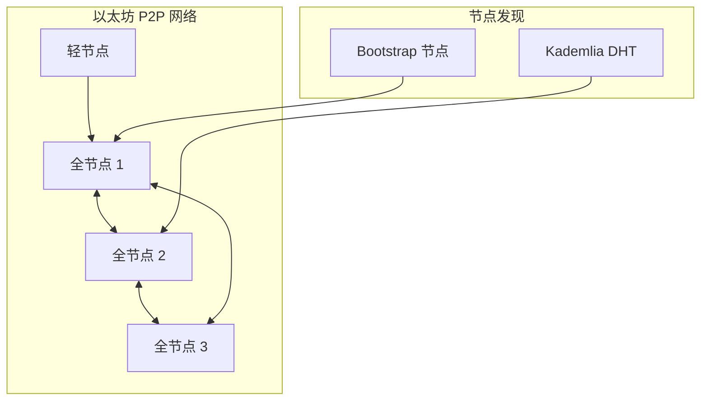
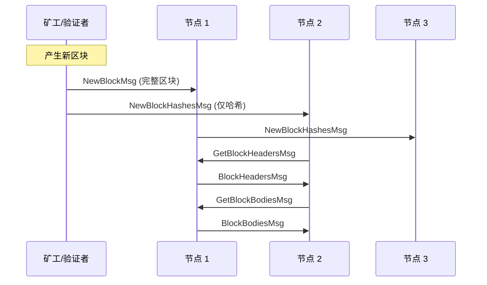
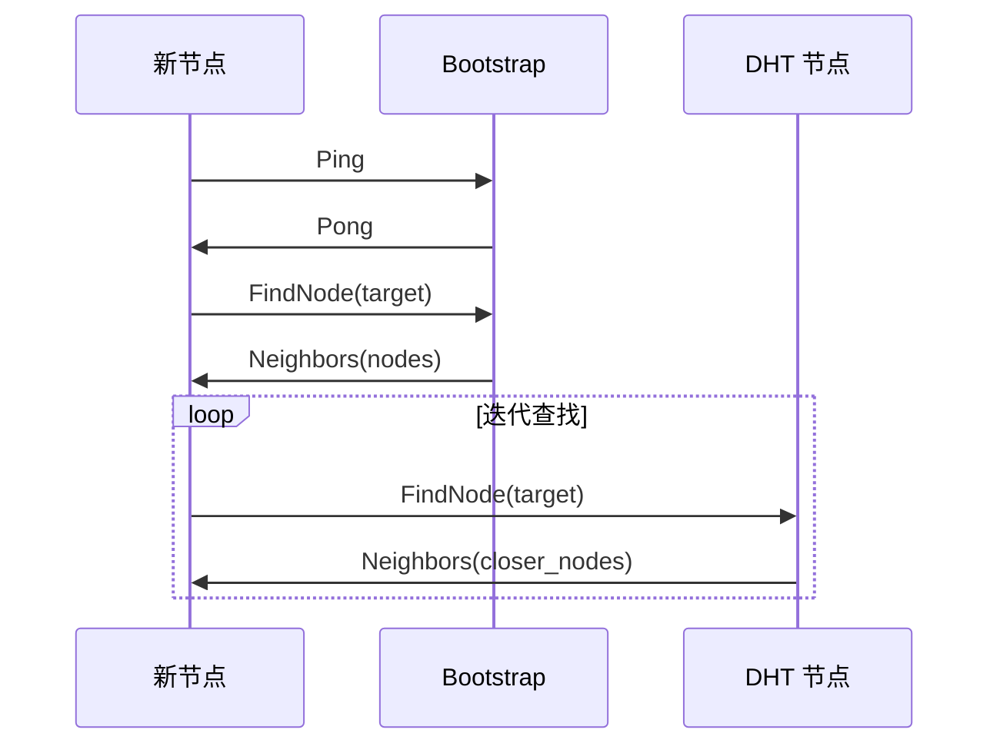
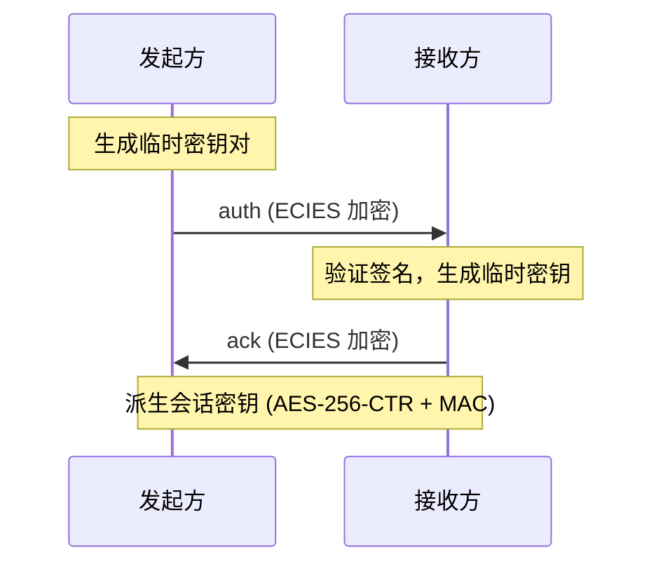

# go-ethereum P2P 网络分析

> **分析对象**：go-ethereum (geth)  
> **版本**：最新 master  
> **源码路径**：`区块链/ethereum/go-ethereum-master/p2p/`

---

## 1. 项目概述

### 基本信息

| 属性 | 值 |
|------|-----|
| **项目** | go-ethereum (geth) |
| **类型** | 公链（PoS，原 PoW） |
| **语言** | Go |
| **P2P 实现** | 自研 devp2p |
| **传输协议** | TCP + RLPx |
| **发现协议** | discv4 / discv5 (UDP) |

### P2P 网络定位

go-ethereum 的 P2P 网络负责：
- **区块同步**：获取和传播新区块
- **交易传播**：广播未确认交易
- **节点发现**：发现和连接其他节点
- **状态同步**：snap 协议快速同步状态

---

## 2. 网络拓扑

### 节点类型

| 节点类型 | 说明 | 连接数 |
|----------|------|--------|
| **全节点** | 存储完整区块链 | 默认 50 |
| **轻节点** | 仅存储区块头 | 默认 100 |
| **归档节点** | 存储所有历史状态 | 默认 50 |

### 网络结构



### 连接管理

```
默认配置：

  MaxPeers = 50           // 最大连接数
  MaxPendingPeers = 50    // 最大待连接数
  DialRatio = 3           // 出站/入站比例
  
连接类型：
  - 动态连接（DHT 发现）
  - 静态连接（配置指定）
  - 可信连接（白名单）
```

---

## 3. 消息模式

### 消息类型

| 消息码 | 名称 | 说明 | 传播方式 |
|--------|------|------|----------|
| 0x00 | StatusMsg | 握手状态 | 请求-响应 |
| 0x01 | NewBlockHashesMsg | 新区块哈希 | 广播 |
| 0x02 | TransactionsMsg | 交易广播 | 广播 |
| 0x03 | GetBlockHeadersMsg | 请求区块头 | 请求-响应 |
| 0x04 | BlockHeadersMsg | 区块头响应 | 响应 |
| 0x05 | GetBlockBodiesMsg | 请求区块体 | 请求-响应 |
| 0x06 | BlockBodiesMsg | 区块体响应 | 响应 |
| 0x07 | NewBlockMsg | 完整新区块 | 广播 |
| 0x08 | NewPooledTransactionHashesMsg | 交易哈希 | 广播 |
| 0x09 | GetPooledTransactionsMsg | 请求交易 | 请求-响应 |
| 0x0a | PooledTransactionsMsg | 交易响应 | 响应 |

### 消息传播流程



### 消息格式

```
RLP 编码：

  消息结构：
    [code, payload]
    
  code: 单字节消息类型
  payload: RLP 编码的消息体
  
示例 (StatusMsg)：
  StatusPacket {
    ProtocolVersion: uint32
    NetworkID:       uint64
    TD:              *big.Int
    Head:            common.Hash
    Genesis:         common.Hash
    ForkID:          forkid.ID
  }
```

---

## 4. P2P 实现

### 协议栈

```
┌─────────────────────────────────────────────────────────────────────────┐
│                         go-ethereum P2P 协议栈                           │
├─────────────────────────────────────────────────────────────────────────┤
│                                                                         │
│  应用层 (eth 协议)                                                       │
│  ─────────────────                                                      │
│  eth/68, eth/69 - 区块/交易同步                                          │
│  snap/1 - 快速状态同步                                                   │
│                                                                         │
│  传输层 (RLPx)                                                          │
│  ─────────────                                                          │
│  加密握手 (ECIES + AES-256-CTR)                                          │
│  帧协议 (Snappy 压缩)                                                    │
│  多协议复用                                                              │
│                                                                         │
│  发现层 (discv4/discv5)                                                  │
│  ──────────────────────                                                 │
│  Kademlia DHT (UDP)                                                     │
│  ENR 节点记录                                                            │
│  DNS 发现                                                                │
│                                                                         │
│  网络层                                                                  │
│  ──────────                                                             │
│  TCP (数据传输)                                                          │
│  UDP (节点发现)                                                          │
│                                                                         │
└─────────────────────────────────────────────────────────────────────────┘
```

### 核心组件

| 组件 | 路径 | 职责 |
|------|------|------|
| **Server** | `p2p/server.go` | P2P 服务器，管理所有连接 |
| **Peer** | `p2p/peer.go` | 单个节点连接 |
| **Protocol** | `p2p/protocol.go` | 子协议定义 |
| **RLPx** | `p2p/rlpx/` | 加密传输协议 |
| **discover** | `p2p/discover/` | 节点发现（discv4/v5） |
| **enode** | `p2p/enode/` | 节点标识和记录 |

### 子协议机制

```
协议协商：

  1. 连接建立后进行 RLPx 握手
  2. 交换支持的协议列表 (Caps)
  3. 选择双方都支持的最高版本
  
协议定义 (Cap)：
  - Name: "eth"     // 协议名称
  - Version: 68     // 协议版本
  
协议注册：
  Protocol {
    Name:    "eth"
    Version: 68
    Length:  17        // 消息数量
    Run:     handler   // 消息处理函数
  }
```

---

## 5. 发现机制

### discv4 (经典 Kademlia)

| 消息类型 | 说明 |
|----------|------|
| **Ping** | 探测节点存活 |
| **Pong** | Ping 响应 |
| **FindNode** | 查找接近目标的节点 |
| **Neighbors** | FindNode 响应 |

### discv5 (增强版)

| 特性 | 说明 |
|------|------|
| **ENR** | 可扩展节点记录 |
| **TALK** | 任意协议请求 |
| **加密** | 会话密钥加密 |

### 节点发现流程



### 节点标识

```
enode URL 格式：

  enode://<pubkey>@<ip>:<tcpport>[?discport=<udpport>]
  
示例：
  enode://6f8a80d14311c39f35...@52.16.188.185:30303
  
NodeID 计算：
  NodeID = Keccak256(PublicKey)[12:]  // 64 字节公钥的哈希后 20 字节
```

---

## 6. 安全机制

### RLPx 加密握手



### 加密参数

| 参数 | 值 |
|------|-----|
| **密钥交换** | ECDH (secp256k1) |
| **加密** | AES-256-CTR |
| **MAC** | HMAC-SHA256 |
| **压缩** | Snappy |

### 身份验证

- **NodeID 绑定**：连接时验证对端公钥
- **签名验证**：握手消息包含签名
- **无 PKI**：点对点直接验证

---

## 7. 性能特征

### 默认参数

| 参数 | 值 |
|------|-----|
| MaxPeers | 50 |
| DialTimeout | 15s |
| FrameReadTimeout | 30s |
| FrameWriteTimeout | 20s |
| maxMessageSize | 10 MB |

### 消息限制

| 协议 | 限制 |
|------|------|
| 区块头 | 最多 1024 个 |
| 区块体 | 最多 128 个 |
| 交易 | 单消息最大 10 MB |

### 网络带宽

```
典型带宽消耗：

  区块广播：~2 MB/区块（完整区块）
  交易广播：~100 KB/s（正常负载）
  状态同步：~10 MB/s（snap 同步）
```

---

## 8. 对 DeP2P 的启示

### 需求映射

| 以太坊特性 | DeP2P 映射 |
|------------|-----------|
| 区块广播 | PubSub (GossipSub) |
| 交易广播 | PubSub (GossipSub) |
| 区块/状态请求 | Streams (请求-响应) |
| 子协议机制 | 协议命名空间 |
| 节点发现 | DHT + Bootstrap |

### 设计参考

| 方面 | 以太坊设计 | DeP2P 借鉴 |
|------|-----------|-----------|
| **协议协商** | Cap 机制 | Protocol ID 协商 |
| **消息编码** | RLP | Protobuf |
| **加密握手** | ECIES | TLS 1.3 |
| **节点发现** | Kademlia | Kademlia + Rendezvous |

### Realm 应用场景

| 场景 | 说明 |
|------|------|
| **主网/测试网** | 不同 Realm 隔离不同网络 |
| **私有链** | Realm 实现准入控制 |
| **分片网络** | 每个分片一个 Realm |

### 关键差异

| 方面 | go-ethereum | DeP2P |
|------|-------------|-------|
| **传输** | TCP + RLPx | QUIC |
| **NAT 穿透** | 有限支持 | Relay + 打洞 |
| **网络隔离** | NetworkID | Realm |
| **权限控制** | 无 | PSK 认证 |

---

## 相关链接

- [以太坊 devp2p 规范](https://github.com/ethereum/devp2p)
- [RLPx 协议](https://github.com/ethereum/devp2p/blob/master/rlpx.md)
- [discv5 规范](https://github.com/ethereum/devp2p/blob/master/discv5/discv5.md)

---

**最后更新**：2026-01-11
