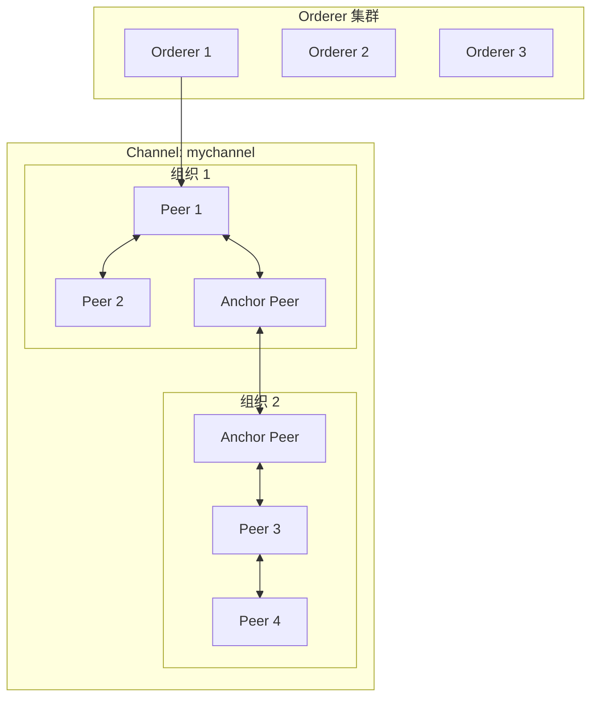
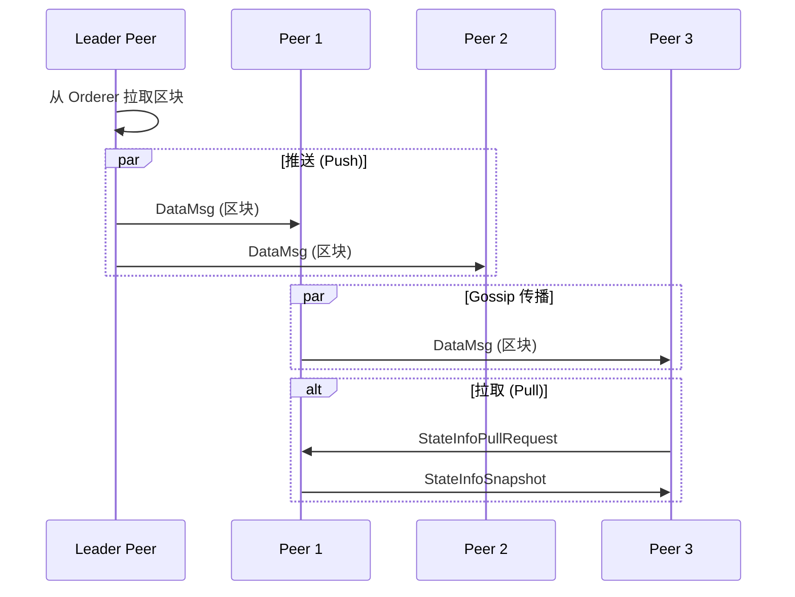
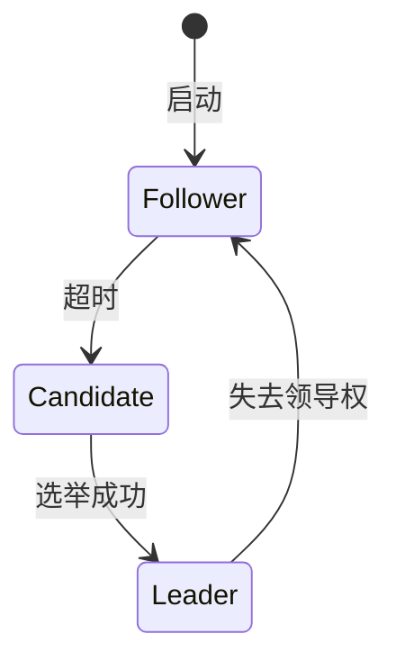
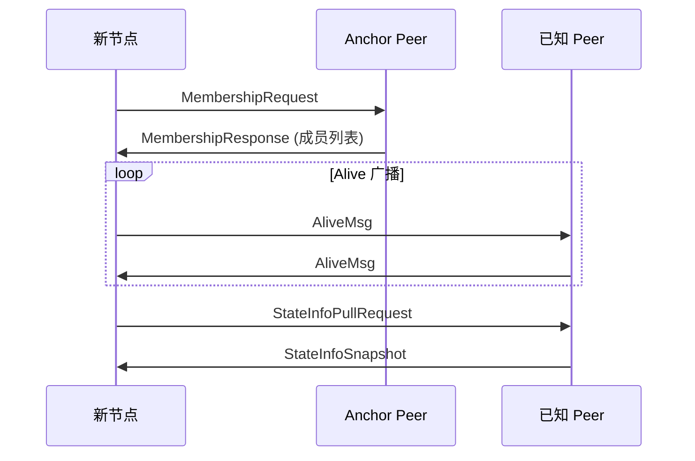
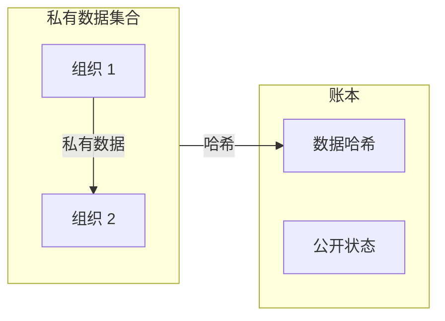

# Hyperledger Fabric Gossip 网络分析

> **分析对象**：Hyperledger Fabric  
> **版本**：最新 main  
> **源码路径**：`区块链/fabric/fabric-main/gossip/`

---

## 1. 项目概述

### 基本信息

| 属性 | 值 |
|------|-----|
| **项目** | Hyperledger Fabric |
| **类型** | 联盟链（许可链） |
| **语言** | Go |
| **P2P 实现** | 自研 Gossip |
| **传输协议** | gRPC (TLS) |
| **发现协议** | Gossip + Anchor Peers |

### P2P 网络定位

Fabric 的 Gossip 网络负责：
- **区块分发**：从 Orderer 获取区块并分发到 Peer
- **私有数据传播**：在授权节点间传播私有数据
- **成员发现**：发现 Channel 内的其他 Peer
- **状态同步**：同步账本状态信息

---

## 2. 网络拓扑

### 节点类型

| 节点类型 | 说明 | 职责 |
|----------|------|------|
| **Peer** | 账本节点 | 执行交易、维护账本 |
| **Orderer** | 排序节点 | 交易排序、出块 |
| **Anchor Peer** | 锚节点 | 跨组织发现入口 |
| **Leader Peer** | 领导节点 | 从 Orderer 拉取区块 |

### 网络结构



### Channel 隔离

```
Channel 概念：

  - Channel 是 Fabric 的核心隔离机制
  - 每个 Channel 有独立的账本和成员
  - 组织通过 Anchor Peer 跨组织发现
  - Channel 内 Gossip 传播区块和私有数据
  
与 DeP2P Realm 对比：
  - Channel ≈ Realm
  - Anchor Peer ≈ Bootstrap 节点
  - 组织成员 ≈ Realm 成员
```

---

## 3. 消息模式

### 消息类型

| 消息类型 | 说明 | 传播方式 |
|----------|------|----------|
| **AliveMsg** | 心跳存活 | Gossip 广播 |
| **MembershipRequest** | 成员请求 | 请求-响应 |
| **MembershipResponse** | 成员响应 | 响应 |
| **DataMsg** | 区块数据 | Gossip 广播 |
| **StateInfoMsg** | 状态信息 | Gossip 广播 |
| **StateInfoPullRequestMsg** | 状态拉取 | 请求-响应 |
| **PvtDataMsg** | 私有数据 | 定向发送 |

### Gossip 传播算法



### 消息格式 (Protobuf)

```
GossipMessage {
  nonce:     uint64
  channel:   bytes      // Channel ID
  tag:       Tag        // 消息标签
  
  oneof content {
    AliveMessage      alive_msg
    MembershipRequest mem_req
    MembershipResponse mem_res
    DataMessage       data_msg
    StateInfo         state_info
    ...
  }
}

SignedGossipMessage {
  GossipMessage  message
  bytes          signature
}
```

---

## 4. P2P 实现

### 协议栈

```
┌─────────────────────────────────────────────────────────────────────────┐
│                         Fabric Gossip 协议栈                             │
├─────────────────────────────────────────────────────────────────────────┤
│                                                                         │
│  应用层                                                                  │
│  ─────────                                                              │
│  区块分发、私有数据、状态同步                                             │
│                                                                         │
│  Channel 层                                                             │
│  ───────────                                                            │
│  Channel 隔离、成员验证、消息过滤                                         │
│                                                                         │
│  Gossip 层                                                               │
│  ───────────                                                            │
│  Push/Pull 算法、消息存储、去重                                          │
│                                                                         │
│  发现层                                                                  │
│  ─────────                                                              │
│  成员发现、Alive 检测、Anchor Peer                                       │
│                                                                         │
│  通信层 (gRPC)                                                           │
│  ──────────────                                                         │
│  双向流、TLS 加密、身份验证                                               │
│                                                                         │
└─────────────────────────────────────────────────────────────────────────┘
```

### 核心组件

| 组件 | 路径 | 职责 |
|------|------|------|
| **GossipService** | `service/gossip_service.go` | 服务入口 |
| **GossipChannel** | `gossip/channel/channel.go` | Channel 管理 |
| **Discovery** | `discovery/discovery.go` | 成员发现 |
| **Comm** | `comm/comm.go` | gRPC 通信 |
| **Election** | `election/election.go` | Leader 选举 |
| **PrivData** | `privdata/` | 私有数据处理 |

### Leader 选举



```
Leader 职责：
  - 从 Orderer 拉取新区块
  - 在 Channel 内分发区块
  - 每个 Channel 有独立 Leader
```

---

## 5. 发现机制

### 发现流程



### Anchor Peer

```
Anchor Peer 作用：

  - 每个组织配置 Anchor Peer
  - 跨组织发现入口点
  - 配置在 Channel 配置中
  
配置示例：
  AnchorPeers:
    - Host: peer0.org1.example.com
      Port: 7051
```

### 成员状态

| 状态字段 | 说明 |
|----------|------|
| **Endpoint** | 节点地址 |
| **PKIid** | 节点身份哈希 |
| **Metadata** | 节点元数据 |
| **Properties** | 链码信息、账本高度 |

---

## 6. 安全机制

### 身份体系

```
Fabric 身份体系：

  MSP (Membership Service Provider)
    ↓
  X.509 证书
    ↓
  PKIid = SHA256(证书)
```

### TLS 认证

| 层级 | 认证方式 |
|------|----------|
| **传输层** | gRPC + 双向 TLS |
| **消息层** | 签名验证 |
| **Channel 层** | 成员资格验证 |

### 消息签名

```
消息签名验证：

  1. 验证签名者证书有效
  2. 验证签名者属于正确组织
  3. 验证签名者有权限发送该类型消息
  4. 验证消息签名
```

### 私有数据隔离



---

## 7. 性能特征

### 默认参数

| 参数 | 默认值 |
|------|--------|
| PublishStateInfoInterval | 4s |
| PullInterval | 4s |
| RequestStateInfoInterval | 4s |
| AliveTimeInterval | 5s |
| AliveExpirationTimeout | 25s |

### 传播参数

| 参数 | 默认值 | 说明 |
|------|--------|------|
| PropagateIterations | 1 | 每轮传播次数 |
| PropagatePeerNum | 3 | 每次传播节点数 |
| PullPeerNum | 3 | 拉取请求节点数 |

### 消息存储

```
消息存储策略：

  区块消息：保留最近 100 个
  状态信息：过期清理 (默认 20s)
  成员信息：TTL 过期 (默认 25s)
```

---

## 8. 对 DeP2P 的启示

### 需求映射

| Fabric 特性 | DeP2P 映射 |
|-------------|-----------|
| Channel 隔离 | **Realm 隔离** |
| 组织成员 | Realm 成员 |
| Anchor Peer | Bootstrap + Rendezvous |
| Leader 选举 | 应用层实现 |
| 私有数据 | Realm 内消息 |
| 成员发现 | DHT + Gossip |

### 设计参考

| 方面 | Fabric 设计 | DeP2P 借鉴 |
|------|------------|-----------|
| **隔离机制** | Channel | Realm |
| **成员验证** | MSP + 证书 | PSK 认证 |
| **消息传播** | Gossip | GossipSub |
| **传输协议** | gRPC | QUIC |

### Realm 对标 Channel

```
Channel 与 Realm 对比：

  Channel:
    - 基于 MSP 和 X.509 证书
    - 组织级别隔离
    - 需要 CA 基础设施
    - 配置驱动（Channel Config）
    
  Realm:
    - 基于 PSK 共享密钥
    - 应用级别隔离
    - 无需 PKI
    - 代码驱动（JoinRealm）
    
  共同点：
    - 网络隔离
    - 成员验证
    - 消息只在成员间传播
```

### 关键启示

| 启示 | 说明 |
|------|------|
| **隔离是核心** | Channel 证明隔离机制的重要性 |
| **成员验证** | 每条消息都需验证发送者身份 |
| **Anchor 机制** | 需要入口点进行跨域发现 |
| **私有数据** | 支持选择性数据共享 |
| **Leader 选举** | 可在应用层实现 |

---

## 相关链接

- [Fabric 官方文档](https://hyperledger-fabric.readthedocs.io/)
- [Gossip 协议设计](https://hyperledger-fabric.readthedocs.io/en/latest/gossip.html)
- [私有数据](https://hyperledger-fabric.readthedocs.io/en/latest/private-data/private-data.html)

---

**最后更新**：2026-01-11
