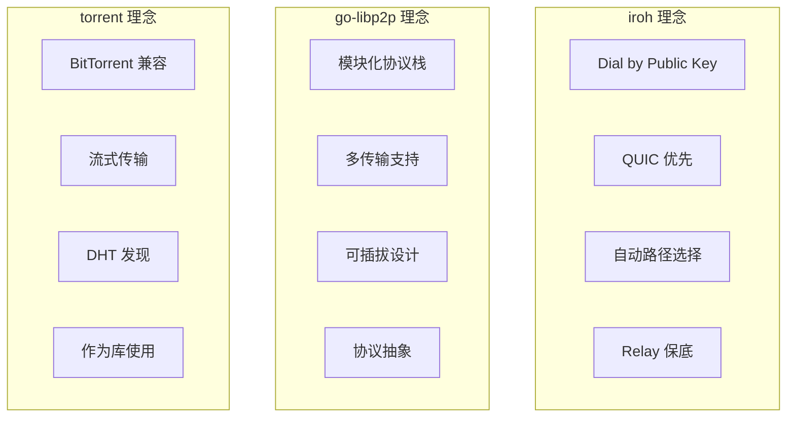
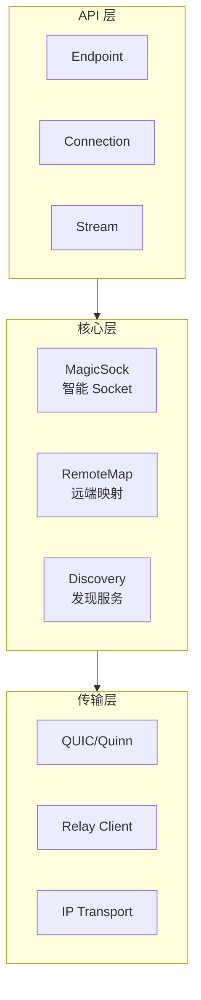
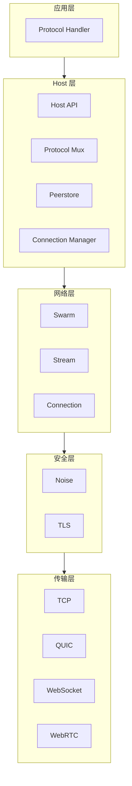
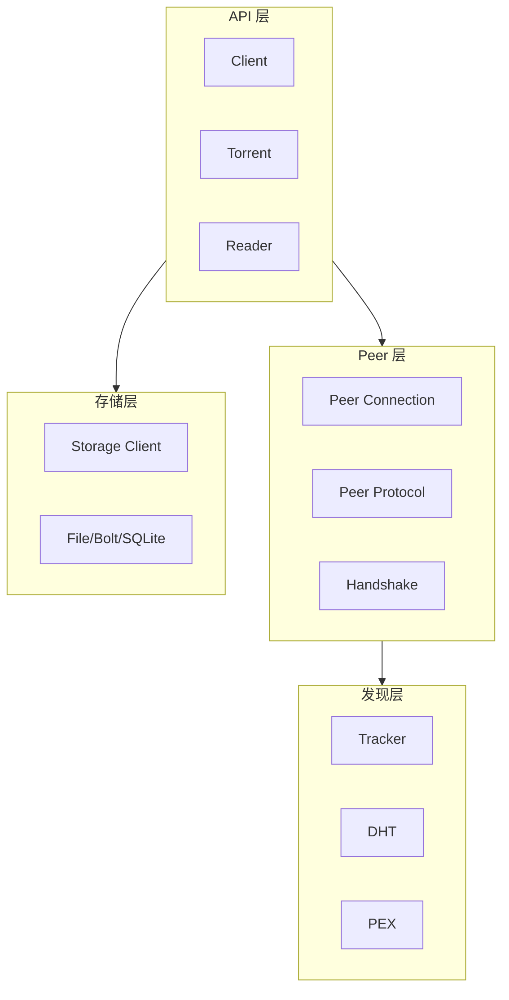
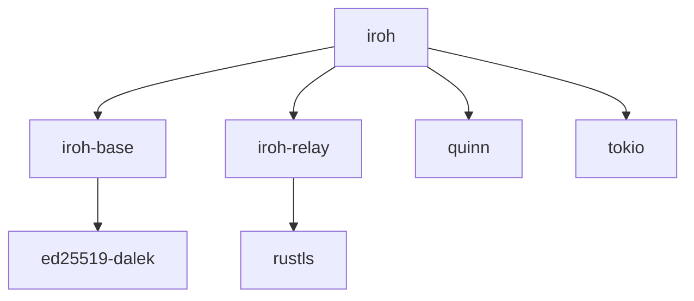
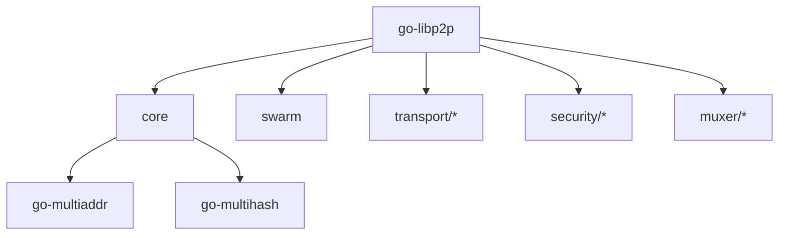
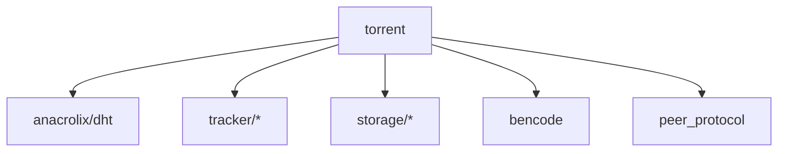
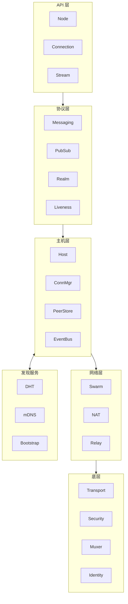
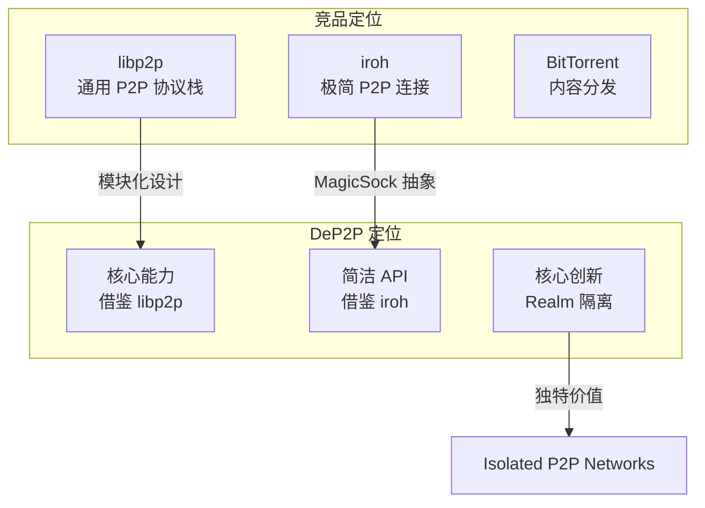

# 跨产品对比：整体架构

> **对比产品**: iroh、go-libp2p、torrent  
> **分析日期**: 2026-01-11

---

## 1. 概述

本文对比分析三个 P2P 产品的整体架构设计，包括分层模型、模块组织、设计理念等。

---

## 2. 产品定位对比

### 2.1 定位矩阵

| 维度 | iroh | go-libp2p | torrent |
|------|------|-----------|---------|
| **定位** | 现代 P2P 网络库 | 模块化 P2P 协议栈 | BitTorrent 客户端库 |
| **语言** | Rust | Go | Go |
| **组织** | n0 (Number 0) | Protocol Labs | @anacrolix |
| **许可** | MIT/Apache-2.0 | MIT | MIT |
| **成熟度** | 较新（2022+） | 成熟（2016+） | 成熟（2014+） |
| **社区** | 活跃 | 非常活跃 | 活跃 |

### 2.2 设计理念



---

## 3. 分层架构对比

### 3.1 iroh 架构



**特点**：
- 三层简洁架构
- MagicSock 统一抽象传输
- 自动路径选择

### 3.2 go-libp2p 架构



**特点**：
- 五层清晰分层
- 高度模块化
- 可插拔组件

### 3.3 torrent 架构



**特点**：
- 四层架构
- 以 Torrent 为中心
- 可插拔存储

---

## 4. 领域模型/架构划分对比

### 4.1 go-libp2p：技术层次架构

go-libp2p 采用**技术层次架构**，按照网络协议栈的自然层次划分：

```
┌─────────────────────────────────────────────────────────────┐
│                      p2p/ 目录结构                           │
├─────────────────────────────────────────────────────────────┤
│                                                             │
│  ┌─────────────────────────────────────────────────────┐   │
│  │ protocol/     协议层                                  │   │
│  │   identify/  ping/  circuitv2/  holepunch/  autonat/ │   │
│  └─────────────────────────────────────────────────────┘   │
│                                                             │
│  ┌─────────────────────────────────────────────────────┐   │
│  │ host/        主机层                                   │   │
│  │   basic/  autonat/  autorelay/  peerstore/           │   │
│  │   eventbus/  resource-manager/  routed/               │   │
│  └─────────────────────────────────────────────────────┘   │
│                                                             │
│  ┌─────────────────────────────────────────────────────┐   │
│  │ net/         网络层                                   │   │
│  │   swarm/  connmgr/  nat/  upgrader/  conngater/       │   │
│  └─────────────────────────────────────────────────────┘   │
│                                                             │
│  ┌─────────────────────────────────────────────────────┐   │
│  │ muxer/       多路复用层                               │   │
│  │   yamux/                                              │   │
│  └─────────────────────────────────────────────────────┘   │
│                                                             │
│  ┌─────────────────────────────────────────────────────┐   │
│  │ security/    安全层                                   │   │
│  │   noise/  tls/  insecure/                            │   │
│  └─────────────────────────────────────────────────────┘   │
│                                                             │
│  ┌─────────────────────────────────────────────────────┐   │
│  │ transport/   传输层                                   │   │
│  │   tcp/  quic/  websocket/  webrtc/  webtransport/    │   │
│  └─────────────────────────────────────────────────────┘   │
│                                                             │
│  ┌─────────────────────────────────────────────────────┐   │
│  │ discovery/   发现（辅助服务）                         │   │
│  │   mdns/  routing/  backoff/                           │   │
│  └─────────────────────────────────────────────────────┘   │
│                                                             │
└─────────────────────────────────────────────────────────────┘
```

**核心特点**：
- **按网络协议栈分层**：从底层传输 → 安全 → 复用 → 网络 → 主机 → 协议
- **无"业务域"概念**：只有技术关注点，不包含业务逻辑
- **发现作为辅助服务**：不是独立的"域"，而是支撑功能

### 4.2 iroh：功能聚焦架构

iroh 采用**功能聚焦架构**，更加精简：

```
┌─────────────────────────────────────────────────────────────┐
│                      iroh 架构                               │
├─────────────────────────────────────────────────────────────┤
│                                                             │
│  ┌─────────────────────────────────────────────────────┐   │
│  │ endpoint/     端点（入口门面）                        │   │
│  │   connection/  hooks/  presets/  quic/               │   │
│  └─────────────────────────────────────────────────────┘   │
│                          ↓                                  │
│  ┌────────────────────┬────────────────────────────────┐   │
│  │ discovery/          │ magicsock/                      │   │
│  │   dns/  mdns/       │   transports/  remote_map/     │   │
│  │   pkarr/            │   （传输抽象+NAT穿透）          │   │
│  └────────────────────┴────────────────────────────────┘   │
│                          ↓                                  │
│  ┌─────────────────────────────────────────────────────┐   │
│  │ tls/  net_report/  protocol/                          │   │
│  │       （安全、网络报告、协议定义）                     │   │
│  └─────────────────────────────────────────────────────┘   │
│                                                             │
│  ════════════════════════════════════════════════════════  │
│                                                             │
│  ┌─────────────────────────────────────────────────────┐   │
│  │ 独立服务                                              │   │
│  │   iroh-relay/  iroh-dns-server/  iroh-base/          │   │
│  └─────────────────────────────────────────────────────┘   │
│                                                             │
└─────────────────────────────────────────────────────────────┘
```

**核心特点**：
- **极简设计**：核心只做连接建立（hole punching + relay fallback）
- **Endpoint 中心化**：单一入口，所有功能通过 Endpoint 暴露
- **功能组合**：高级功能（blobs, gossip, docs）作为独立库组合

### 4.3 torrent：扁平模块化架构

torrent 采用**扁平模块化架构**：

```
┌─────────────────────────────────────────────────────────────┐
│                      torrent 架构                            │
├─────────────────────────────────────────────────────────────┤
│                                                             │
│  ┌─────────────────────────────────────────────────────┐   │
│  │ Client (client.go)                                    │   │
│  │        ↓ 聚合所有功能                                  │   │
│  └─────────────────────────────────────────────────────┘   │
│                                                             │
│  ┌──────────┬──────────┬──────────┬──────────┬─────────┐   │
│  │ torrent/ │ peer     │ tracker/ │ storage/ │ metainfo│   │
│  │ 种子管理 │ 对等连接  │ 追踪器   │ 存储后端 │  元信息  │   │
│  └──────────┴──────────┴──────────┴──────────┴─────────┘   │
│                                                             │
│  ┌──────────┬──────────┬──────────┬──────────┐             │
│  │   dht    │ peer_    │webtorrent│ bencode  │             │
│  │  DHT发现 │ protocol │ WebRTC   │  编解码  │             │
│  └──────────┴──────────┴──────────┴──────────┘             │
│                                                             │
└─────────────────────────────────────────────────────────────┘
```

**核心特点**：
- **扁平结构**：没有明确的层次划分
- **功能导向**：按 BitTorrent 协议需求组织模块
- **Client 聚合**：单一 Client 对象聚合所有功能

### 4.4 业界常见架构模式对比

| 项目 | 架构模式 | 核心理念 |
|------|----------|----------|
| **go-libp2p** | 技术层次栈 | 按网络协议栈分层，可插拔组件 |
| **iroh** | 功能聚焦 | 极简核心 + 独立协议库组合 |
| **torrent** | 扁平模块 | 围绕 BitTorrent 协议的功能模块 |
| **DeP2P** | 四域架构 | 混合技术层次、业务概念、用户API |

---

## 5. DeP2P 四域架构问题分析

### 5.1 当前架构回顾

DeP2P 当前采用四域架构：**应用域、业务域、核心域、发现域**

### 5.2 问题分析

| 维度 | 问题描述 |
|------|----------|
| **"业务域"概念** | Realm 是 DeP2P 特有功能，不是通用 P2P 概念。业界无此划分，更像是应用层特性 |
| **核心域过于庞大** | 混合了 Transport/Security/Muxer（底层）和 Host/ConnMgr/Relay/NAT（中高层） |
| **发现域定位** | 发现通常作为辅助服务而非独立域，与核心域的依赖关系是单向的 |
| **应用域混淆** | Messaging/PubSub/Streams 实际是协议，不是"应用" |
| **与业界惯例不符** | go-libp2p/iroh 都不使用"四域"概念 |

### 5.3 与业界对比

| 对比维度 | go-libp2p | iroh | DeP2P |
|----------|-----------|------|-------|
| **是否有"业务域"** | ❌ 无 | ❌ 无 | ✅ 有 (Realm) |
| **是否有"应用域"** | ❌ 无（应用层协议） | ❌ 无（独立库） | ✅ 有 |
| **发现的定位** | 辅助服务 | 可插拔服务 | 独立域 |
| **核心的粒度** | 按技术层次细分 | 极简聚焦 | 混合多层 |

---

## 6. 核心模块对比

### 6.1 模块组织

| 模块类型 | iroh | go-libp2p | torrent |
|----------|------|-----------|---------|
| **入口** | `Endpoint` | `Host` | `Client` |
| **连接** | `Connection` | `Conn` | `PeerConn` |
| **流** | `Stream` | `Stream` | - |
| **发现** | `Discovery` trait | `Discovery` interface | `Tracker`, `DHT` |
| **传输** | `MagicSock` | `Transport` interface | `net.Conn` |
| **安全** | TLS (QUIC 内置) | `SecureTransport` | MSE (可选) |
| **存储** | - | - | `Storage` interface |

### 6.2 依赖关系

#### iroh 依赖图



#### go-libp2p 依赖图



#### torrent 依赖图



---

## 7. 代码组织对比

### 7.1 目录结构

| 层级 | iroh | go-libp2p | torrent |
|------|------|-----------|---------|
| **顶层** | `iroh/`, `iroh-base/`, `iroh-relay/` | `core/`, `p2p/` | 扁平结构 |
| **核心** | `src/endpoint.rs`, `src/magicsock.rs` | `core/host/`, `core/network/` | `client.go`, `torrent.go` |
| **传输** | `src/magicsock/transports/` | `p2p/transport/` | `handshake.go` |
| **协议** | `src/protocol.rs` | `p2p/protocol/` | `peer_protocol/` |
| **发现** | `src/discovery/` | `p2p/discovery/` | `tracker/` |

### 7.2 代码规模

| 指标 | iroh | go-libp2p | torrent |
|------|------|-----------|---------|
| **核心代码** | ~15K 行 | ~50K 行 | ~30K 行 |
| **依赖数量** | 中等 | 较多 | 中等 |
| **模块数量** | ~5 | ~30+ | ~15 |

---

## 8. 设计模式对比

### 8.1 使用的设计模式

| 模式 | iroh | go-libp2p | torrent |
|------|------|-----------|---------|
| **Builder** | ✅ `Endpoint::builder()` | ✅ `libp2p.New()` | ✅ `NewClient()` |
| **Interface/Trait** | ✅ `Discovery` trait | ✅ 大量 interface | ✅ `Storage` interface |
| **Factory** | ❌ | ✅ `Transport` | ❌ |
| **Observer** | ✅ Watcher | ✅ EventBus | ✅ callbacks |
| **Strategy** | ✅ 发现策略 | ✅ 传输选择 | ✅ 请求策略 |

### 8.2 扩展机制

| 扩展类型 | iroh | go-libp2p | torrent |
|----------|------|-----------|---------|
| **自定义传输** | 通过 Preset | Transport 接口 | 不支持 |
| **自定义发现** | Discovery trait | Discovery 接口 | 不支持 |
| **自定义安全** | 内置 TLS | SecureTransport | MSE 可选 |
| **自定义存储** | - | - | Storage 接口 |
| **自定义协议** | ALPN | StreamHandler | 不支持 |

---

## 9. 生命周期管理

### 9.1 启动流程

#### iroh

```rust
// 1. 创建 Builder
let builder = Endpoint::builder();

// 2. 配置
let builder = builder
    .secret_key(key)
    .alpns(vec![b"my-app".to_vec()])
    .relay_mode(RelayMode::Default);

// 3. 绑定启动
let endpoint = builder.bind().await?;

// 4. 使用
let conn = endpoint.connect(addr, b"my-app").await?;
```

#### go-libp2p

```go
// 1. 创建 Host
host, _ := libp2p.New(
    libp2p.Identity(priv),
    libp2p.Transport(quic.NewTransport),
    libp2p.Security(noise.ID, noise.New),
)

// 2. 设置处理器
host.SetStreamHandler("/my-app/1.0.0", handler)

// 3. 连接
host.Connect(ctx, peerInfo)
```

#### torrent

```go
// 1. 创建配置
config := torrent.NewDefaultClientConfig()

// 2. 创建客户端
client, _ := torrent.NewClient(config)

// 3. 添加 torrent
t, _ := client.AddMagnet(magnet)

// 4. 等待信息
<-t.GotInfo()

// 5. 下载
t.DownloadAll()
```

### 9.2 关闭流程

| 产品 | 关闭方法 | 优雅关闭 |
|------|----------|----------|
| **iroh** | `endpoint.close().await` | ✅ 等待连接关闭 |
| **go-libp2p** | `host.Close()` | ✅ 关闭所有连接 |
| **torrent** | `client.Close()` | ✅ 等待下载完成 |

---

## 10. 对 DeP2P 的启示

### 10.1 架构设计建议

| 决策 | 建议 | 参考 |
|------|------|------|
| **分层数量** | 4-5 层 | go-libp2p |
| **模块化程度** | 高度模块化 | go-libp2p |
| **传输抽象** | 统一 Socket 抽象 | iroh MagicSock |
| **接口设计** | 使用 interface | go-libp2p |
| **扩展机制** | 可插拔设计 | go-libp2p |

### 10.2 建议的架构重构方向

基于业界最佳实践，建议参考 **go-libp2p 的分层模式**：

```
┌─────────────────────────────────────────────────────────────────────────────┐
│                    推荐的层次架构                                            │
├─────────────────────────────────────────────────────────────────────────────┤
│                                                                             │
│  ┌─────────────────────────────────────────────────────────────────────┐   │
│  │ API 层 (api/)                                                         │   │
│  │   Node 门面 + 高层 API (非独立域，只是入口封装)                        │   │
│  └─────────────────────────────────────────────────────────────────────┘   │
│                          ↓                                                  │
│  ┌─────────────────────────────────────────────────────────────────────┐   │
│  │ 协议层 (protocol/)                                                    │   │
│  │   messaging/  pubsub/  streams/  liveness/                           │   │
│  │   realm/ (作为一种协议实现，非独立域)                                  │   │
│  └─────────────────────────────────────────────────────────────────────┘   │
│                          ↓                                                  │
│  ┌─────────────────────────────────────────────────────────────────────┐   │
│  │ 主机层 (host/)                                                        │   │
│  │   host/  connmgr/  peerstore/  eventbus/                             │   │
│  └─────────────────────────────────────────────────────────────────────┘   │
│                          ↓                                                  │
│  ┌─────────────────────────────────────────────────────────────────────┐   │
│  │ 网络层 (net/)                                                         │   │
│  │   swarm/  nat/  relay/  upgrader/                                    │   │
│  └─────────────────────────────────────────────────────────────────────┘   │
│                          ↓                                                  │
│  ┌─────────────────────────────────────────────────────────────────────┐   │
│  │ 底层 (low-level)                                                      │   │
│  │   transport/ (tcp, quic)                                             │   │
│  │   security/ (tls, noise)                                             │   │
│  │   muxer/ (yamux)                                                     │   │
│  │   identity/ (keys, peerid)                                           │   │
│  └─────────────────────────────────────────────────────────────────────┘   │
│                                                                             │
│  ┌─────────────────────────────────────────────────────────────────────┐   │
│  │ 发现服务 (discovery/) - 辅助服务                                       │   │
│  │   coordinator/  dht/  mdns/  bootstrap/  rendezvous/                 │   │
│  └─────────────────────────────────────────────────────────────────────┘   │
│                                                                             │
└─────────────────────────────────────────────────────────────────────────────┘
```

### 10.3 关键变化

| 变化 | 说明 |
|------|------|
| **取消"业务域"** | Realm 降级为协议层的一个模块 |
| **取消"应用域"** | API 层只是入口封装，不是独立域 |
| **拆分核心域** | 按技术层次分为：主机层、网络层、底层 |
| **发现作为服务** | 辅助服务而非独立域 |

### 10.4 DeP2P 建议架构（Mermaid）



### 10.5 关键差异

| 特性 | 其他产品 | DeP2P |
|------|----------|-------|
| **域隔离** | 无 | Realm 概念（作为协议） |
| **Relay 分层** | 单层 | System + Realm |
| **成员管理** | 无 | Realm 成员验证 |

---

## 11. 与业界对标能力矩阵

### 11.1 顶级 P2P 项目共同特征

| 特征 | libp2p | iroh | BitTorrent | DeP2P 应具备 |
|------|--------|------|------------|--------------|
| **核心理念** | 模块化协议栈 | 极简连接 | 内容分发 | **隔离化 P2P 网络** |
| **架构风格** | 可插拔组件 | 功能聚焦 | 协议驱动 | **协议驱动 + 隔离域** |
| **扩展方式** | 接口注入 | 组合协议 | 扩展消息 | **协议注册 + 域扩展** |
| **独特价值** | 通用性 | 穿透性能 | 成熟生态 | **Realm 隔离** |

### 11.2 完整能力对标

| 能力 | libp2p | iroh | DeP2P | 说明 |
|------|:------:|:----:|:-----:|------|
| **传输层** |||||
| 模块化传输 | ✅ | ⚠️ | ✅ | libp2p 高度模块化 |
| QUIC 支持 | ✅ | ✅ | ✅ | 现代传输协议 |
| TCP 支持 | ✅ | ❌ | ⚠️ | DeP2P 以 QUIC 为主 |
| WebSocket | ✅ | ❌ | ⚠️ | 浏览器支持 |
| WebRTC | ✅ | ❌ | ⚠️ | 浏览器 P2P |
| **网络层** |||||
| NAT 穿透 | ✅ | ✅ | ✅ | 核心能力 |
| 中继服务 | ✅ | ✅ | ✅ | Relay 保底 |
| AutoNAT | ✅ | ✅ | ✅ | NAT 类型检测 |
| 打洞协调 | ✅ | ✅ | ✅ | HolePunch |
| **发现层** |||||
| DHT 发现 | ✅ | ✅ | ✅ | Kademlia |
| mDNS | ✅ | ✅ | ✅ | 局域网发现 |
| Bootstrap | ✅ | ✅ | ✅ | 引导节点 |
| Rendezvous | ✅ | ❌ | ✅ | 命名空间发现 |
| DNS 发现 | ⚠️ | ✅ | ⚠️ | DNS-SD |
| **协议层** |||||
| PubSub | ✅ | ✅ | ✅ | GossipSub |
| 请求响应 | ✅ | ✅ | ✅ | Messaging |
| 双向流 | ✅ | ✅ | ✅ | Streams |
| **安全层** |||||
| TLS 1.3 | ✅ | ✅ | ✅ | 默认安全 |
| Noise | ✅ | ❌ | ⚠️ | 备选安全 |
| **核心服务** |||||
| 资源管理 | ✅ | ❌ | ✅ | ResourceManager |
| 事件总线 | ✅ | ⚠️ | ✅ | EventBus |
| PeerStore | ✅ | ⚠️ | ✅ | 节点信息存储 |
| **DeP2P 创新** |||||
| **业务隔离 (Realm)** | ⚠️ pnet | ❌ | ✅✅ | **核心创新** |
| **跨域网关** | ❌ | ❌ | ✅ | **独有能力** |
| **统一 Relay** | ❌ | ❌ | ✅ | v2.0 缓存加速层 |
| **成员管理** | ❌ | ❌ | ✅ | Realm 成员验证 |

> **图例**: ✅ 完整支持 | ⚠️ 部分支持/可选 | ❌ 不支持

### 11.3 DeP2P 差异化定位



---

## 12. 总结

| 产品 | 架构特点 | 适用场景 |
|------|----------|----------|
| **iroh** | 简洁、现代、QUIC 优先 | 通用 P2P 应用 |
| **go-libp2p** | 模块化、灵活、可扩展 | 复杂 P2P 系统 |
| **torrent** | 专注、高效、流式 | 文件共享 |
| **DeP2P** | Realm 隔离、五层架构 | 隔离化 P2P 网络 |

DeP2P 设计原则：
1. 借鉴 go-libp2p 的模块化设计和技术层次分层
2. 采用 iroh 的 MagicSock 传输抽象和极简 API
3. **Realm 隔离**作为核心创新（独有能力）
4. 五层架构：API → Protocol → Realm → Core → Discovery

---

**分析日期**：2026-01-13
