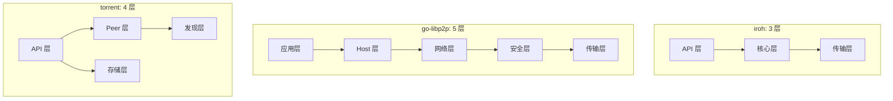

# 架构层对比分析

> **对比产品**: iroh、go-libp2p、torrent  
> **分析日期**: 2026-01-11

---

## 文档索引

| 文档 | 描述 | 状态 |
|------|------|------|
| [01-overall.md](01-overall.md) | 整体架构对比 | ✅ |

---

## 分析维度

### 1. 整体架构 (01-overall.md)

- **产品定位对比**：定位、语言、许可、成熟度
- **设计理念对比**：核心理念、设计哲学
- **分层架构对比**：各产品的架构分层
- **核心模块对比**：入口、连接、流、发现等
- **代码组织对比**：目录结构、代码规模
- **设计模式对比**：使用的设计模式
- **生命周期管理**：启动/关闭流程

---

## 关键对比

### 架构分层

### 对比结论

| 维度 | iroh | go-libp2p | torrent |
|------|------|-----------|---------|
| **复杂度** | 简洁 | 复杂 | 中等 |
| **灵活性** | 中等 | 高 | 低 |
| **可扩展性** | 中等 | 高 | 低 |
| **学习曲线** | 低 | 高 | 低 |

---

## DeP2P 建议

1. 采用 4-5 层架构
2. 借鉴 go-libp2p 的模块化
3. 采用 iroh 的 MagicSock 抽象
4. 增加 Realm 管理层

---

**更新日期**：2026-01-11
