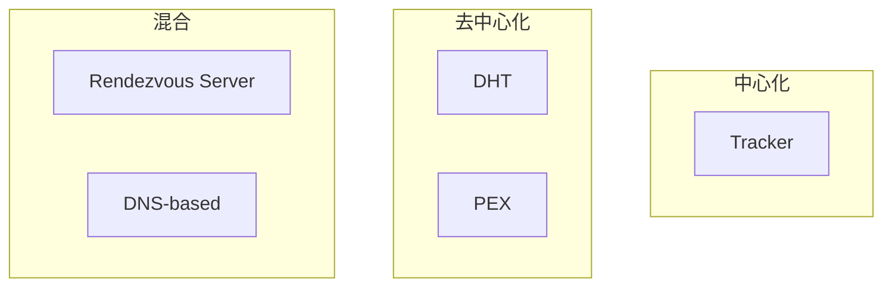
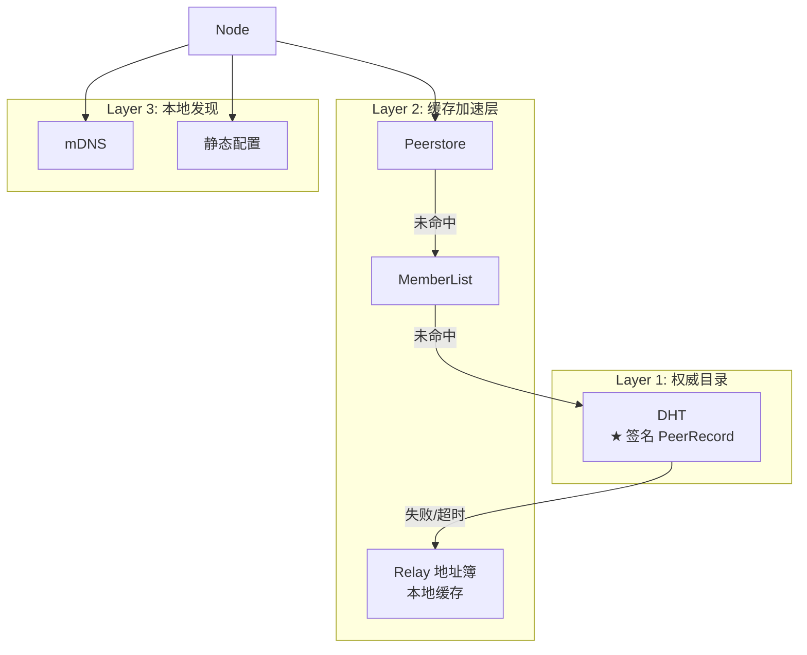
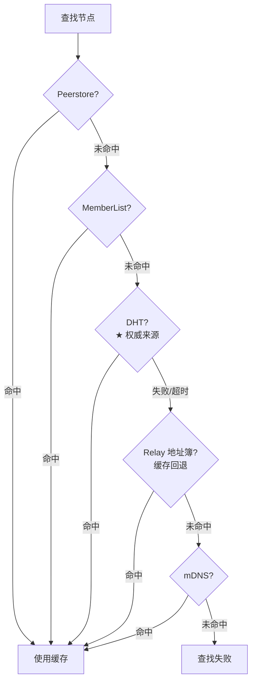

# 跨产品对比：节点发现

> **对比产品**: iroh、go-libp2p、torrent  
> **分析日期**: 2026-01-11

---

## 1. 概述

节点发现是 P2P 网络的基础功能。本文对比分析各产品的节点发现机制。

---

## 2. 对比矩阵

| 机制 | iroh | go-libp2p | torrent |
|------|------|-----------|---------|
| **DHT** | ✅ (Pkarr) | ✅ (Kademlia) | ✅ (Mainline) |
| **DNS** | ✅ | ❌ | ❌ |
| **mDNS** | ✅ | ✅ | ❌ |
| **Tracker** | ❌ | ❌ | ✅ |
| **中心服务器** | ✅ (Relay) | ❌ | ✅ (Tracker) |
| **PEX** | ❌ | ✅ | ✅ |
| **静态配置** | ✅ | ✅ | ✅ |

---

## 3. 详细分析

### 3.1 iroh 节点发现

#### 发现机制

```rust
// iroh/src/discovery.rs

pub trait Discovery: Send + Sync + 'static {
    /// 发布自己的地址信息
    fn publish(&self, info: &EndpointData) -> BoxFuture<'_, Result<()>>;
    
    /// 查询目标端点的地址
    fn resolve(&self, endpoint_id: EndpointId) -> BoxFuture<'_, Result<EndpointAddr>>;
}
```

#### 支持的发现服务

| 服务 | 说明 | 使用场景 |
|------|------|----------|
| **DnsDiscovery** | DNS 记录查询 | 全球可达 |
| **PkarrPublisher** | 发布到 Pkarr DNS | 配合 DNS |
| **MdnsDiscovery** | 本地 mDNS | 局域网 |
| **DhtDiscovery** | Mainline DHT | 去中心化 |
| **StaticProvider** | 静态配置 | 手动指定 |

#### 并发发现

```rust
// 同时使用多个发现服务
let ep = Endpoint::empty_builder(RelayMode::Default)
    .discovery(PkarrPublisher::n0_dns())
    .discovery(DnsDiscovery::n0_dns())
    .discovery(MdnsDiscovery::builder())
    .bind()
    .await?;
```

---

### 3.2 go-libp2p 节点发现

#### 发现接口

```go
// core/discovery/discovery.go

// Advertiser 广告服务
type Advertiser interface {
    Advertise(ctx context.Context, ns string, opts ...Option) (time.Duration, error)
}

// Discoverer 发现 peer
type Discoverer interface {
    FindPeers(ctx context.Context, ns string, opts ...Option) (<-chan peer.AddrInfo, error)
}
```

#### 基于命名空间

libp2p 的发现基于 **命名空间 (namespace)**：

```go
// 广告服务
discovery.Advertise(ctx, "my-app/room/123")

// 发现服务提供者
peerChan, _ := discovery.FindPeers(ctx, "my-app/room/123")
for peer := range peerChan {
    host.Connect(ctx, peer)
}
```

#### 发现实现

| 实现 | 说明 |
|------|------|
| **mDNS** | 本地网络广播 |
| **DHT Routing** | 基于 Kademlia DHT |
| **Backoff** | 带退避的发现封装 |

#### DHT (Kademlia)

libp2p 使用 Kademlia DHT：

```go
// 初始化 DHT
dht, _ := dht.New(ctx, host)

// 提供内容
dht.Provide(ctx, cid, true)

// 查找提供者
providers := dht.FindProviders(ctx, cid)
```

---

### 3.3 torrent 节点发现

BitTorrent 有完善的 peer 发现机制：

#### Tracker

```go
// tracker/tracker.go

type AnnounceRequest struct {
    InfoHash   [20]byte
    PeerId     [20]byte
    Downloaded int64
    Left       int64
    Uploaded   int64
    Event      AnnounceEvent
    NumWant    int32
    Port       uint16
}

type AnnounceResponse struct {
    Interval int32   // 下次 announce 间隔
    Peers    []Peer  // Peer 列表
}
```

#### DHT (BEP 5)

```go
// Kademlia DHT
// get_peers: 获取 infohash 的 peers
// announce_peer: 宣布自己有某个 infohash

dht.GetPeers(infohash)
dht.AnnouncePeer(infohash, port)
```

#### PEX (Peer Exchange)

```go
// BEP 11
// 节点间交换已知的其他节点
// 通过 LTEP 扩展协议实现
```

#### 对比

| 机制 | 优点 | 缺点 |
|------|------|------|
| **Tracker** | 简单可靠 | 中心化 |
| **DHT** | 去中心化 | 延迟高 |
| **PEX** | 快速扩展 | 需初始连接 |
| **LSD** | 本地快速 | 仅局域网 |

---

## 4. 架构对比

### 4.1 中心化 vs 去中心化



### 4.2 各产品定位

| 产品 | 主要方式 | 辅助方式 |
|------|----------|----------|
| **iroh** | DNS + Relay | mDNS, DHT |
| **go-libp2p** | DHT | mDNS, PEX |
| **torrent** | Tracker + DHT | PEX, LSD |

---

## 5. 发现延迟对比

| 机制 | 典型延迟 | 说明 |
|------|----------|------|
| **静态配置** | 0 | 已知地址 |
| **mDNS** | ~100ms | 本地广播 |
| **DNS** | ~200ms | DNS 查询 |
| **Tracker** | ~500ms | HTTP/UDP 请求 |
| **DHT** | ~2-5s | 迭代查询 |
| **PEX** | ~10s | 需先建立连接 |

---

## 6. 对 DeP2P 的启示

### 6.1 设计建议（v2.0 更新）

> **v2.0 核心变化**：DHT 是权威目录，Relay 地址簿是缓存加速层

| 决策 | 建议 | 参考 |
|------|------|------|
| **★ 权威目录** | **DHT + 签名 PeerRecord** | DeP2P v2.0 |
| **缓存层** | Peerstore / MemberList / Relay 地址簿 | 多产品组合 |
| **本地发现** | mDNS | iroh, libp2p |
| **命名空间** | 支持服务发现 | libp2p |

### 6.2 DeP2P 发现架构（v2.0 更新）



### 6.3 发现流程（v2.0 更新）



**关键变化（v2.0）**：
- DHT 查询优先于 Relay 地址簿（DHT 是权威，Relay 是缓存回退）
- PeerRecord 必须签名，防止地址投毒

### 6.4 命名空间设计

参考 libp2p，DeP2P 可以支持基于命名空间的服务发现：

```go
// 服务发现命名空间
// /{realm-id}/{service-type}/{service-name}

discovery.Advertise(ctx, "/realm-abc/chat/general")
discovery.FindPeers(ctx, "/realm-abc/chat/general")
```

---

## 7. 总结

| 产品 | 发现特点 | 适用场景 |
|------|----------|----------|
| **iroh** | DNS + 多机制组合 | 通用 P2P |
| **go-libp2p** | DHT + 命名空间 | 大规模网络 |
| **torrent** | Tracker + DHT | 文件共享 |

**DeP2P v2.0 设计（更新）**：
1. **★ DHT 作为权威目录**（签名 PeerRecord，支持跨 Relay 解析）
2. **Relay 地址簿作为缓存加速层**（仅在 DHT 失败时回退使用）
3. 支持 mDNS 用于本地发现
4. 支持基于命名空间的服务发现

**三层架构**：
- Layer 1: **DHT（权威目录）** — 存储签名 PeerRecord
- Layer 2: **缓存加速层** — Peerstore / MemberList / Relay 地址簿
- Layer 3: **本地发现** — mDNS / 静态配置

---

**分析日期**：2026-01-11  
**更新日期**：2026-01-24
