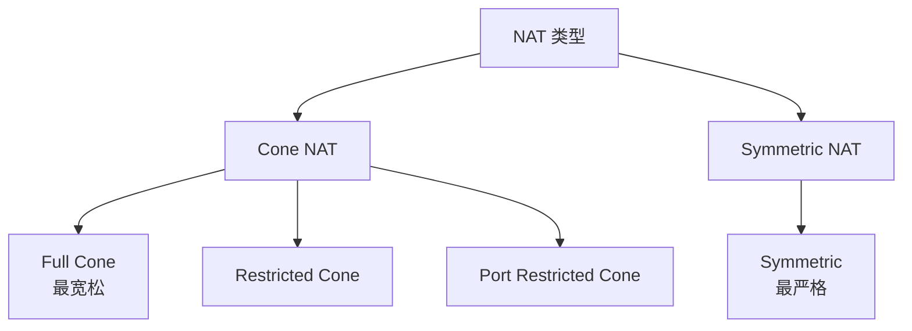
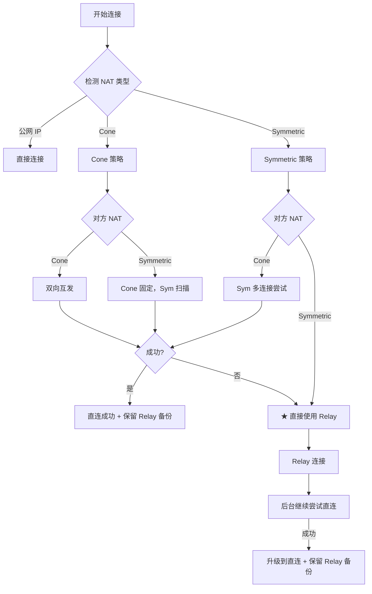

# 跨产品对比：NAT 穿透

> **对比产品**: iroh、go-libp2p、torrent  
> **分析日期**: 2026-01-11

---

## 1. 概述

NAT 穿透是 P2P 网络的核心挑战。本文对比分析各产品的 NAT 穿透设计。

---

## 2. 对比矩阵

| 特性 | iroh | go-libp2p | torrent |
|------|------|-----------|---------|
| **NAT 类型检测** | ✅ | ✅ | ❌ |
| **UDP 打洞** | ✅ | ✅ | ✅ (uTP) |
| **TCP 打洞** | ❌ | ❌ | ❌ |
| **UPNP** | ❌ | ✅ | ✅ |
| **NAT-PMP/PCP** | ❌ | ✅ | ✅ |
| **IPv6** | ✅ | ✅ | ✅ |
| **Relay 降级** | ✅ | ✅ | ❌ |
| **连接升级** | ✅ | ✅ | ❌ |

---

## 3. NAT 类型

### 3.1 NAT 分类



### 3.2 穿透难度

| NAT 类型 | 穿透难度 | 说明 |
|----------|----------|------|
| **Full Cone** | 简单 | 任何外部主机可访问 |
| **Restricted Cone** | 较易 | 需先向对方发包 |
| **Port Restricted** | 中等 | 需知道对方端口 |
| **Symmetric** | 困难 | 每次映射不同端口 |

---

## 4. 详细分析

### 4.1 iroh NAT 穿透

#### 核心组件

```
iroh/src/
├── net_report/           # 网络状况检测
│   ├── probes.rs         # 探测逻辑
│   ├── report.rs         # 报告结构
│   └── reportgen.rs      # 报告生成
├── magicsock/            # 魔法 Socket
│   ├── transports/       # 传输层
│   └── remote_map/       # 远端映射
```

#### NAT 检测

```rust
// NetReport 网络报告
pub struct Report {
    pub ipv4: bool,           // IPv4 可达
    pub ipv6: bool,           // IPv6 可达
    pub nat_type: NatType,    // NAT 类型
    pub upnp: bool,           // UPnP 可用
    pub pcp: bool,            // PCP 可用
    pub relay_latencies: BTreeMap<RelayUrl, Duration>,
}
```

#### 穿透策略

1. **QAD 探测**：使用 QUIC Address Discovery 发现公网地址
2. **打洞尝试**：通过 Relay 协调双方同时发包
3. **Relay 降级**：打洞失败时使用 Relay
4. **后台升级**：持续尝试直连

---

### 4.2 go-libp2p NAT 穿透

#### 核心组件

```
p2p/
├── net/nat/              # NAT 管理
├── host/autonat/         # AutoNAT 服务
└── host/autorelay/       # AutoRelay
```

#### AutoNAT

```go
// 检测自身可达性
type Reachability int

const (
    ReachabilityUnknown Reachability = iota
    ReachabilityPublic               // 公网可达
    ReachabilityPrivate              // 私网（需要 Relay）
)
```

#### Hole Punching (DCUtR)

libp2p 有 Hole Punching 规范（DCUtR 协议）：

1. 通过 Relay 建立初始连接
2. 交换地址信息
3. 同时向对方发起连接
4. 成功则升级连接

---

### 4.3 torrent NAT 穿透

BitTorrent 的 NAT 穿透相对简单：

| 机制 | 说明 |
|------|------|
| **uTP** | μTorrent 传输协议，UDP 基础 |
| **UPnP** | 端口映射 |
| **NAT-PMP** | 苹果设备支持 |
| **DHT** | 去中心化发现 |

没有主动打洞机制，依赖 UPnP 或公网 IP。

---

## 5. 技术对比

### 5.1 NAT 检测方法

| 产品 | 方法 | 说明 |
|------|------|------|
| **iroh** | QAD + Relay 探测 | 现代化方法 |
| **go-libp2p** | AutoNAT 服务 | 请求其他节点帮助检测 |
| **torrent** | 无 | 不主动检测 |

### 5.2 打洞协调

| 产品 | 协调方式 |
|------|----------|
| **iroh** | 通过 Relay 协调 |
| **go-libp2p** | 通过 Relay 或 DCUtR 协议 |
| **torrent** | 无协调 |

### 5.3 连接升级

| 产品 | 升级机制 |
|------|----------|
| **iroh** | MagicSock 自动切换 |
| **go-libp2p** | Swarm 多路径 |
| **torrent** | 无 |

---

## 6. 对 DeP2P 的启示

### 6.1 设计建议

| 决策 | 建议 | 参考 |
|------|------|------|
| **NAT 检测** | 服务器探测 + AutoNAT | iroh, libp2p |
| **UPnP/NAT-PMP** | 可选支持 | libp2p, torrent |
| **Relay 协调** | 通过 Relay 协调 | iroh |
| **连接升级** | 后台持续尝试直连 | iroh |

### 6.2 DeP2P 打洞流程



### 6.3 打洞地址适用条件

观察到的外部地址用于打洞需满足以下条件：

| 条件 | 说明 |
|------|------|
| **NAT 类型** | 非 Symmetric NAT（Symmetric NAT 每次连接映射不同端口） |
| **协议匹配** | UDP 地址用于 QUIC 打洞，不能混用 TCP/UDP |
| **地址时效** | 地址未过期（建议缓存 TTL ≤ 30 秒） |
| **多源验证** | 至少 2 个不同来源确认一致（防止污染） |

### 6.4 NAT 类型检测价值

> **决策**：NAT 类型检测值得实现

**收益**：
- 双方 Symmetric NAT 直接用 Relay，节省 5-30s 打洞时间
- 根据 NAT 类型优化打洞超时参数
- 辅助网络诊断

**成本**：
- 需要 STUN 服务器
- 实现复杂度中等

详见 [概念澄清文档 §17.4](../../../_discussions/20260123-nat-relay-concept-clarification.md)。

### 6.5 UDP vs TCP 打洞

DeP2P 选择 **仅实现 UDP 打洞**（基于 QUIC 传输）：

| 特性 | UDP 打洞 | TCP 打洞 |
|------|----------|---------|
| 成功率 | 较高（~70%） | 较低（~30%） |
| 实现复杂度 | 中等 | 高（需要 simultaneous open） |
| NAT 兼容性 | 大多数 NAT 支持 | 部分 NAT 不支持 |
| DeP2P 选择 | ✅ 主要方式（QUIC） | ❌ 不实现 |

### 6.3 关键实现

```go
// NAT 类型检测
func detectNATType(server string) (NATType, error) {
    localPort := randomPort()
    
    // 连接服务器端口 1
    addr1, err := sendAndReceive(server, port1, localPort)
    // 连接服务器端口 2
    addr2, err := sendAndReceive(server, port2, localPort)
    
    if addr1.Port == addr2.Port {
        return NATCone, nil
    }
    return NATSymmetric, nil
}

// 分策略打洞
func holePunch(local, remote NATType) error {
    switch {
    case local == NATCone && remote == NATCone:
        return holePunchC2C()
    case local == NATCone && remote == NATSymmetric:
        return holePunchC2S()
    case local == NATSymmetric && remote == NATCone:
        return holePunchS2C()
    default:
        return ErrNeedRelay
    }
}
```

---

## 7. 总结

| 产品 | NAT 穿透特点 | 评价 |
|------|--------------|------|
| **iroh** | QAD 探测、自动升级 | 现代化 |
| **go-libp2p** | AutoNAT、DCUtR | 协议化 |
| **torrent** | 依赖 UPnP | 基础 |

DeP2P 应该：
1. 借鉴 iroh 的自动连接升级
2. 参考 libp2p 的 DCUtR 打洞协调
3. 通过 Relay 协调打洞

---

**分析日期**：2026-01-11
