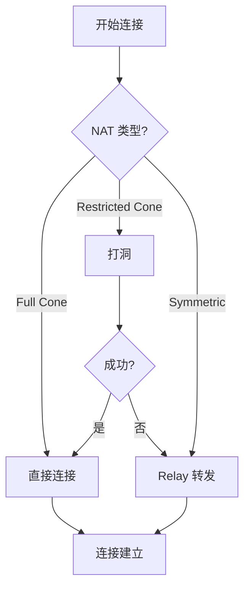

# 网络层对比分析

> **对比产品**: iroh、go-libp2p、torrent  
> **分析日期**: 2026-01-11

---

## 文档索引

| 文档 | 描述 | 状态 |
|------|------|------|
| [01-discovery.md](01-discovery.md) | 节点发现对比 | ✅ |
| [02-nat-traversal.md](02-nat-traversal.md) | NAT 穿透对比 | ✅ |

---

## 分析维度

### 1. 节点发现 (01-discovery.md)

- **发现机制对比**：DHT、DNS、mDNS、Tracker、Rendezvous
- **发现架构**：集中式 vs 去中心化
- **服务发现**：命名空间、服务注册
- **发现流程**：启动、解析、更新

### 2. NAT 穿透 (02-nat-traversal.md)

- **NAT 类型检测**：Cone、Symmetric、检测方法
- **穿透技术**：STUN、打洞、UPnP/NAT-PMP
- **穿透策略**：直连优先、Relay 后备
- **成功率对比**：不同 NAT 类型的穿透率

---

## 关键对比

### 节点发现机制

| 机制 | iroh | go-libp2p | torrent |
|------|------|-----------|---------|
| **DHT** | ✅ (Pkarr) | ✅ (Kademlia) | ✅ (Mainline) |
| **DNS** | ✅ | ❌ | ❌ |
| **mDNS** | ❌ | ✅ | ❌ |
| **Tracker** | ❌ | ❌ | ✅ |
| **Rendezvous** | ❌ | ✅ | ❌ |

### NAT 穿透策略

---

## DeP2P 建议

1. 采用 Rendezvous + DHT + mDNS 组合
2. 支持 NAT 类型检测
3. 自动选择最优连接方式
4. Relay 作为保底方案

---

**更新日期**：2026-01-11
