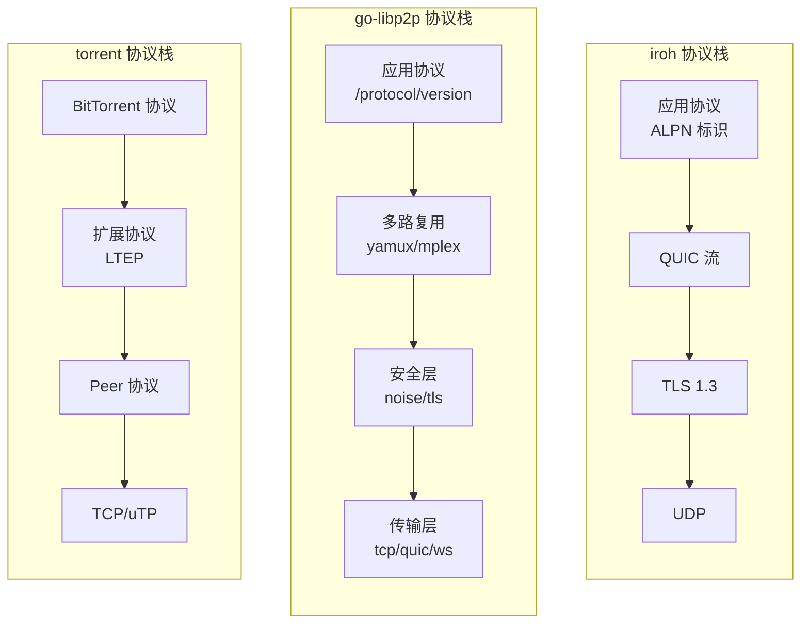
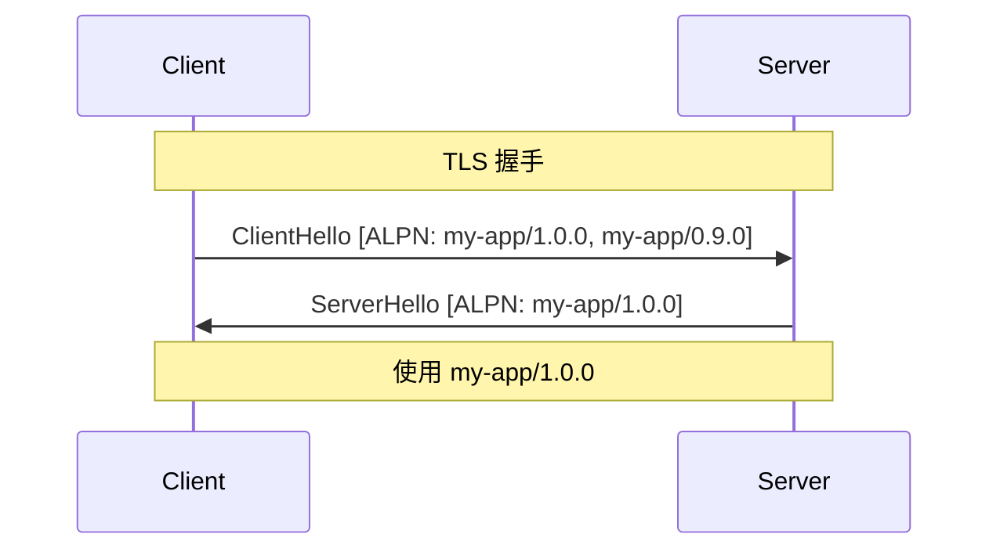
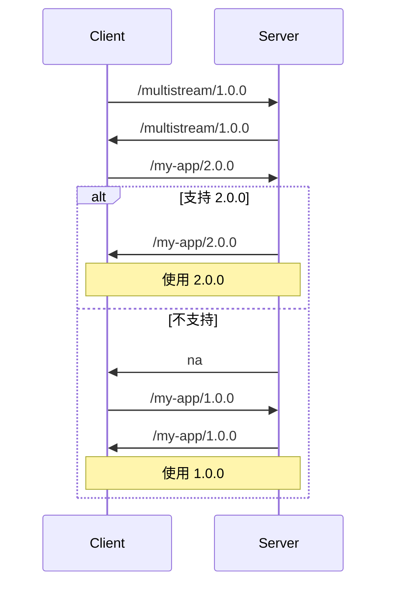
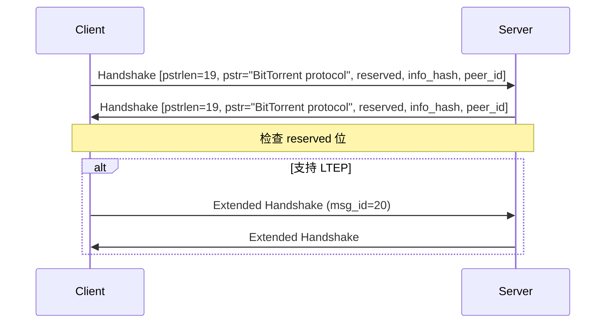
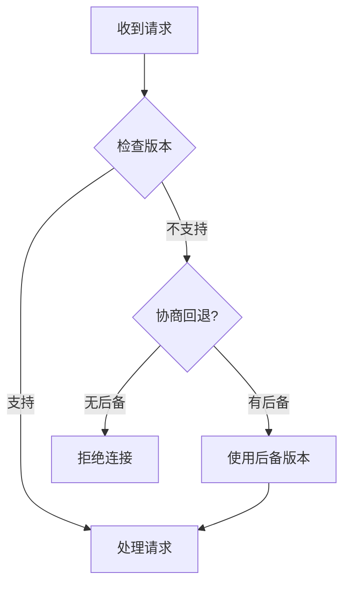

# 跨产品对比：协议设计

> **对比产品**: iroh、go-libp2p、torrent  
> **分析日期**: 2026-01-11

---

## 1. 概述

本文对比分析三个 P2P 产品的协议设计，包括协议命名、协商机制、消息格式、扩展机制等。

---

## 2. 协议栈对比

### 2.1 协议层级



### 2.2 协议栈对比表

| 层级 | iroh | go-libp2p | torrent |
|------|------|-----------|---------|
| **应用层** | ALPN 协商 | Protocol ID 协商 | 固定 BitTorrent |
| **多路复用** | QUIC 原生 | yamux/mplex | 无 |
| **安全层** | TLS 1.3 (QUIC) | Noise/TLS | MSE (可选) |
| **传输层** | QUIC/Relay | TCP/QUIC/WS/WebRTC | TCP/uTP |
| **网络层** | UDP | TCP/UDP | TCP/UDP |

---

## 3. 协议标识对比

### 3.1 命名规范

#### iroh - ALPN

```rust
// ALPN (Application-Layer Protocol Negotiation)
// 通过 TLS 握手协商应用协议

let endpoint = Endpoint::builder()
    .alpns(vec![
        b"my-app/1.0.0".to_vec(),
        b"my-app/0.9.0".to_vec(),  // 后备版本
    ])
    .bind()
    .await?;

// 连接时指定 ALPN
let conn = endpoint.connect(addr, b"my-app/1.0.0").await?;
```

#### go-libp2p - Protocol ID

```go
// Protocol ID 格式: /{name}/{version}
const (
    ProtocolIDv1 = "/my-app/1.0.0"
    ProtocolIDv2 = "/my-app/2.0.0"
)

// 使用 multistream-select 协商
host.SetStreamHandler("/my-app/1.0.0", func(s network.Stream) {
    // 处理流
})

// 支持多协议
stream, _ := host.NewStream(ctx, peerID, 
    "/my-app/2.0.0",  // 首选
    "/my-app/1.0.0",  // 后备
)
```

#### torrent - 固定协议

```go
// BitTorrent 协议固定标识
// 握手: "\x13BitTorrent protocol"

// 扩展通过 LTEP (BEP 10) 实现
const (
    ExtensionBitLtep = 20  // LibTorrent Extension Protocol
)

// 扩展消息类型
const (
    ExtendedHandshake = 0
    ExtendedUTMetadata = 1
    ExtendedUTPEX = 2
)
```

### 3.2 命名规范对比

| 特性 | iroh | go-libp2p | torrent |
|------|------|-----------|---------|
| **格式** | 字节序列 | 路径格式 `/x/y` | 固定字符串 |
| **版本** | 自定义 | 路径中 | 扩展协商 |
| **协商** | TLS ALPN | multistream-select | 握手 + 扩展 |
| **多协议** | ✅ | ✅ | ❌ (仅扩展) |

---

## 4. 协议协商对比

### 4.1 iroh ALPN 协商



### 4.2 go-libp2p multistream-select



### 4.3 torrent 握手



---

## 5. 消息格式对比

### 5.1 iroh 消息格式

```rust
// 基于 QUIC，消息通过 Stream 传输
// 应用自定义消息格式

// 示例：简单长度前缀格式
struct Message {
    length: u32,      // 4 字节长度
    type_id: u16,     // 2 字节类型
    payload: Vec<u8>, // 可变长度数据
}
```

### 5.2 go-libp2p 消息格式

```go
// 无固定格式，由应用协议定义
// 常用模式：

// 1. Protocol Buffers
message MyMessage {
    uint32 type = 1;
    bytes data = 2;
}

// 2. 长度前缀
// [varint length][protobuf message]

// 3. 多路复用流
// 每个请求一个流，天然分隔
```

### 5.3 torrent Peer Protocol

```go
// 固定格式：[4字节长度][1字节类型][payload]

// 消息类型
const (
    Choke         = 0   // 空
    Unchoke       = 1   // 空
    Interested    = 2   // 空
    NotInterested = 3   // 空
    Have          = 4   // piece index (4字节)
    Bitfield      = 5   // bitfield
    Request       = 6   // index, begin, length (各4字节)
    Piece         = 7   // index, begin, block
    Cancel        = 8   // index, begin, length
    Port          = 9   // listen-port (2字节)
)

// 扩展消息 (type = 20)
// [4字节长度][type=20][ext_msg_id][payload]
```

### 5.4 消息格式对比表

| 特性 | iroh | go-libp2p | torrent |
|------|------|-----------|---------|
| **格式定义** | 应用自定义 | 应用自定义 | 协议规定 |
| **序列化** | 自选 | 常用 Protobuf | 固定二进制 |
| **长度前缀** | 自选 | varint | 4 字节大端 |
| **类型标识** | 自选 | 自选 | 1 字节 |
| **压缩** | 自选 | 自选 | 无 |

---

## 6. 扩展机制对比

### 6.1 iroh 扩展

```rust
// 通过 ALPN 协商不同协议版本
// 应用层自行实现扩展

// 预设机制
pub trait Preset {
    fn apply(self, builder: Builder) -> Builder;
}

// 自定义发现服务
pub trait Discovery: Send + Sync + 'static {
    fn publish(&self, info: &EndpointData) -> BoxFuture<'_, Result<()>>;
    fn resolve(&self, id: EndpointId) -> BoxFuture<'_, Result<EndpointAddr>>;
}
```

### 6.2 go-libp2p 扩展

```go
// 1. 新增协议
host.SetStreamHandler("/my-new-protocol/1.0.0", handler)

// 2. 自定义传输
type Transport interface {
    Dial(ctx context.Context, raddr ma.Multiaddr, p peer.ID) (CapableConn, error)
    Listen(laddr ma.Multiaddr) (Listener, error)
    Protocols() []int
}

// 3. 自定义安全
type SecureTransport interface {
    SecureInbound(ctx context.Context, insecure net.Conn, p peer.ID) (SecureConn, error)
    SecureOutbound(ctx context.Context, insecure net.Conn, p peer.ID) (SecureConn, error)
}

// 4. 自定义发现
type Discovery interface {
    Advertiser
    Discoverer
}
```

### 6.3 torrent 扩展

```go
// BEP 10: Extension Protocol
// 通过 reserved 位和扩展握手协商

// 扩展握手 payload (bencode 编码)
{
    "m": {
        "ut_metadata": 1,
        "ut_pex": 2
    },
    "v": "libtorrent/1.0.0",
    "yourip": "\x7f\x00\x00\x01",
    "metadata_size": 31235
}

// 扩展消息格式
// [length][type=20][ext_msg_id][bencoded payload]
```

### 6.4 扩展机制对比

| 扩展方式 | iroh | go-libp2p | torrent |
|----------|------|-----------|---------|
| **新协议** | ALPN | Protocol ID | LTEP 扩展 |
| **新传输** | Preset | Transport 接口 | 不支持 |
| **新安全** | 内置 TLS | SecureTransport | 不支持 |
| **新发现** | Discovery trait | Discovery 接口 | 不支持 |
| **向后兼容** | ALPN 回退 | 多版本支持 | reserved 位 |

---

## 7. 版本管理对比

### 7.1 版本策略

| 策略 | iroh | go-libp2p | torrent |
|------|------|-----------|---------|
| **命名** | 语义化版本 | 语义化版本 | BEP 编号 |
| **协商** | ALPN 列表 | multistream 回退 | 扩展握手 |
| **废弃** | 移除 ALPN | 移除 handler | 清除 reserved 位 |
| **共存** | 多版本 ALPN | 多版本 handler | 多扩展 |

### 7.2 兼容性处理



---

## 8. 对 DeP2P 的启示

### 8.1 协议设计建议

| 决策 | 建议 | 参考 |
|------|------|------|
| **命名** | `/{domain}/{protocol}/{version}` | go-libp2p |
| **协商** | QUIC ALPN 或 multistream | iroh + libp2p |
| **格式** | Protobuf + varint 长度前缀 | go-libp2p |
| **扩展** | 接口 + 版本协商 | go-libp2p |
| **版本** | 语义化版本 | 通用 |

### 8.2 DeP2P 协议命名空间

```
/dep2p/                           # DeP2P 协议族
├── control/1.0.0                 # 控制协议
│   ├── realm/join                # Realm 加入
│   ├── realm/leave               # Realm 离开
│   └── peer/discover             # 节点发现
├── data/1.0.0                    # 数据协议
│   ├── stream                    # 流传输
│   └── datagram                  # 数据报
├── relay/1.0.0                   # 中继协议
│   ├── connect                   # 连接请求
│   └── forward                   # 转发
└── app/{name}/{version}          # 应用协议
```

### 8.3 建议消息格式

```go
// DeP2P 消息格式
type Message struct {
    // Header (固定 8 字节)
    Version  uint8   // 协议版本
    Type     uint8   // 消息类型
    Flags    uint16  // 标志位
    Length   uint32  // Payload 长度
    
    // Payload (可变长度)
    Payload  []byte  // Protobuf 编码
}

// 消息类型
const (
    MsgTypeRequest  = 0x01
    MsgTypeResponse = 0x02
    MsgTypeNotify   = 0x03
    MsgTypeError    = 0x04
)
```

---

## 9. 总结

| 产品 | 协议特点 | 评价 |
|------|----------|------|
| **iroh** | 简洁、ALPN 协商 | 现代化 |
| **go-libp2p** | 模块化、multistream | 灵活 |
| **torrent** | 固定、BEP 扩展 | 兼容 |

DeP2P 应该：
1. 采用类似 libp2p 的协议命名空间
2. 使用 QUIC ALPN 进行协商
3. Protobuf 作为消息序列化格式
4. 设计清晰的扩展机制

---

**分析日期**：2026-01-11
