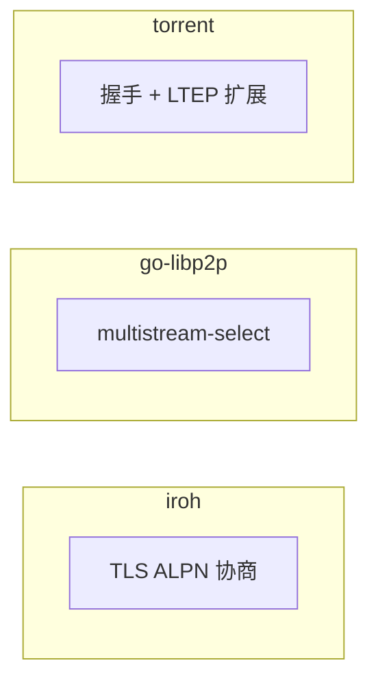

# 协议层对比分析

> **对比产品**: iroh、go-libp2p、torrent  
> **分析日期**: 2026-01-11

---

## 文档索引

| 文档 | 描述 | 状态 |
|------|------|------|
| [01-protocol-design.md](01-protocol-design.md) | 协议设计对比 | ✅ |

---

## 分析维度

### 1. 协议设计 (01-protocol-design.md)

- **协议栈对比**：各产品的协议分层
- **协议标识对比**：命名规范、协商机制
- **协议协商对比**：ALPN、multistream-select、握手
- **消息格式对比**：编码、序列化、长度前缀
- **扩展机制对比**：如何添加新协议
- **版本管理对比**：版本策略、兼容性

---

## 关键对比

### 协议命名

| 产品 | 格式 | 示例 |
|------|------|------|
| **iroh** | 字节序列 (ALPN) | `my-app/1.0.0` |
| **go-libp2p** | 路径格式 | `/my-app/1.0.0` |
| **torrent** | 固定协议 | `BitTorrent protocol` |

### 协议协商

### 消息格式

| 特性 | iroh | go-libp2p | torrent |
|------|------|-----------|---------|
| **格式** | 自定义 | Protobuf | 二进制固定 |
| **长度前缀** | 自选 | varint | 4 字节大端 |
| **类型标识** | 自选 | 自选 | 1 字节 |

---

## DeP2P 建议

1. 采用 `/dep2p/{domain}/{protocol}/{version}` 命名
2. 使用 QUIC ALPN 协商
3. Protobuf 作为消息格式
4. 设计清晰的扩展机制

---

**更新日期**：2026-01-11
