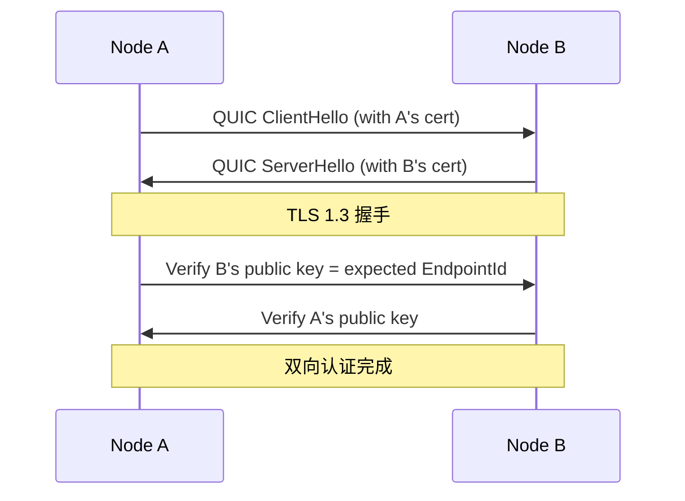
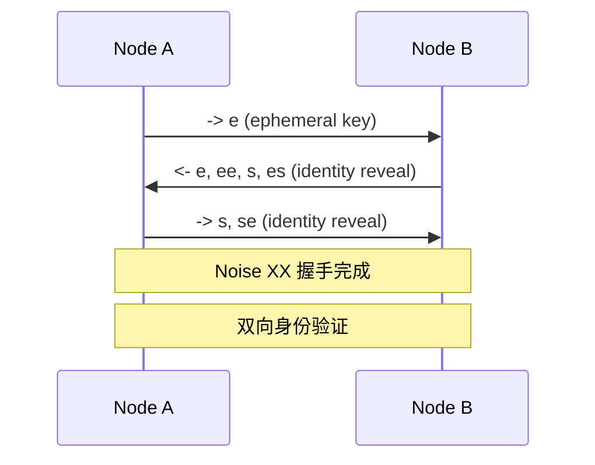
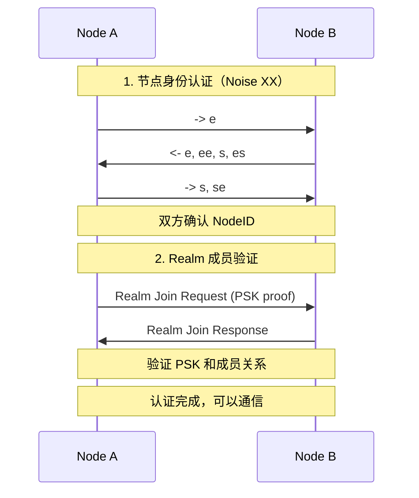

# 跨产品对比：身份认证

> **对比产品**: iroh、go-libp2p、torrent  
> **分析日期**: 2026-01-11

---

## 1. 概述

身份是 P2P 网络的基础。本文对比分析各产品的身份设计和认证机制。

---

## 2. 对比矩阵

| 特性 | iroh | go-libp2p | torrent |
|------|------|-----------|---------|
| **密钥类型** | Ed25519 | 多种 | - |
| **节点 ID** | 公钥本身 | 公钥哈希 | 随机 Peer ID |
| **TLS/加密** | ✅ TLS 1.3 | ✅ Noise/TLS | ❌ (可选 MSE) |
| **端到端加密** | ✅ | ✅ | ❌ |
| **身份持久化** | ✅ | ✅ | ❌ (通常随机) |
| **身份验证** | 公钥 | 公钥 | 无 |

---

## 3. 详细分析

### 3.1 iroh 身份设计

#### 密钥体系

```rust
// iroh-base/src/key.rs

/// 公钥 - 使用 CompressedEdwardsY 存储
pub struct PublicKey(CompressedEdwardsY);

/// EndpointId = PublicKey
/// 端点标识符就是公钥本身
pub type EndpointId = PublicKey;

/// 私钥
pub struct SecretKey(SigningKey);
```

#### 特点

| 特点 | 说明 |
|------|------|
| **公钥即身份** | NodeID = PublicKey |
| **Ed25519** | 现代椭圆曲线 |
| **32 字节** | 紧凑的标识符 |
| **可直接加密** | 无需额外存储公钥 |

#### 加密

```rust
// 使用 TLS 1.3
// 每个连接使用 QUIC 的 TLS 握手
// 公钥用于双向认证
```

---

### 3.2 go-libp2p 身份设计

#### 密钥体系

```go
// core/crypto/key.go

// 支持的密钥类型
const (
    RSA = iota
    Ed25519
    Secp256k1
    ECDSA
)
```

#### Peer ID 生成

```go
// core/peer/peer.go

// Peer ID = Multihash(PublicKey)
func IDFromPublicKey(pk ic.PubKey) (ID, error) {
    b, err := ic.MarshalPublicKey(pk)
    if err != nil {
        return "", err
    }
    
    var alg uint64 = mh.SHA2_256
    // 短密钥可以直接嵌入（identity hash）
    if AdvancedEnableInlining && len(b) <= maxInlineKeyLength {
        alg = mh.IDENTITY
    }
    hash, _ := mh.Sum(b, alg, -1)
    return ID(hash), nil
}
```

#### 特点

| 特点 | 说明 |
|------|------|
| **多密钥支持** | RSA、Ed25519、Secp256k1、ECDSA |
| **Multihash** | 自描述的哈希格式 |
| **可嵌入** | 短密钥可直接从 ID 提取 |
| **灵活性** | 适应不同场景 |

#### 安全传输

```go
// core/sec/security.go

type SecureTransport interface {
    SecureInbound(ctx context.Context, insecure net.Conn, p peer.ID) (SecureConn, error)
    SecureOutbound(ctx context.Context, insecure net.Conn, p peer.ID) (SecureConn, error)
    ID() protocol.ID
}

// 实现：
// - Noise 协议 (/noise)
// - TLS 1.3 (/tls/1.0.0)
```

---

### 3.3 torrent 身份设计

#### Peer ID

```go
// types/peerid.go

// Peer ID 是 20 字节的标识符
type PeerID [20]byte

// 通常格式：-XX0000-xxxxxxxxxxxx
// XX: 客户端标识（如 TR=Transmission）
// 0000: 版本号
// xxxxxxxxxxxx: 随机字节
```

#### 特点

| 特点 | 说明 |
|------|------|
| **随机生成** | 通常每次运行不同 |
| **客户端标识** | 前缀标识客户端类型 |
| **无加密** | 可选的 MSE 加密 |
| **无认证** | 不验证身份 |

---

## 4. 架构对比

### 4.1 身份模型

```mermaid
flowchart TB
    subgraph Cryptographic[密码学身份]
        iroh[iroh: PublicKey = ID]
        libp2p[libp2p: Hash(PublicKey) = ID]
    end
    
    subgraph Random[随机身份]
        torrent[torrent: 随机 Peer ID]
    end
```

### 4.2 安全等级

| 产品 | 安全等级 | 说明 |
|------|----------|------|
| **iroh** | 高 | 强制 TLS 1.3 + 公钥认证 |
| **go-libp2p** | 高 | Noise/TLS + 公钥认证 |
| **torrent** | 低 | 可选加密，无认证 |

### 4.3 密钥管理

| 产品 | 密钥存储 | 备份恢复 |
|------|----------|----------|
| **iroh** | 本地文件 | 支持 |
| **go-libp2p** | 本地文件 | 支持 |
| **torrent** | 通常不存储 | N/A |

---

## 5. 认证流程对比

### 5.1 iroh 认证流程



### 5.2 libp2p 认证流程 (Noise)



---

## 6. 对 DeP2P 的启示

### 6.1 设计建议

| 决策 | 建议 | 参考 |
|------|------|------|
| **密钥类型** | Ed25519 | iroh, libp2p |
| **NodeID 格式** | SHA256(PublicKey) | libp2p |
| **安全传输** | Noise 或 TLS 1.3 | libp2p |
| **Realm PSK** | 额外的域隔离密钥 | 创新 |

### 6.2 DeP2P 身份架构

```mermaid
flowchart TB
    subgraph Identity[身份层]
        PrivKey[Private Key<br/>Ed25519]
        PubKey[Public Key]
        NodeID[NodeID = SHA256(PubKey)]
    end
    
    subgraph Realm[Realm 层]
        RealmID[Realm ID]
        PSK[Pre-Shared Key]
        Membership[成员关系]
    end
    
    subgraph Security[安全层]
        Noise[Noise XX]
        PSKAuth[PSK 验证]
    end
    
    PrivKey --> PubKey --> NodeID
    NodeID --> Membership
    RealmID --> Membership
    PSK --> PSKAuth
    NodeID --> Noise
```

### 6.3 认证流程设计



### 6.4 NodeID 格式

```go
// DeP2P NodeID 设计

// NodeID = SHA256(PublicKey)
// 32 字节，Base58 编码展示

type NodeID [32]byte

func NewNodeID(pubKey ed25519.PublicKey) NodeID {
    return sha256.Sum256(pubKey)
}

// 与 libp2p 不同：不嵌入公钥
// 优点：隐藏公钥，更安全
// 缺点：需要额外传递公钥
```

---

## 7. 总结

| 产品 | 身份特点 | 安全等级 |
|------|----------|----------|
| **iroh** | 公钥即身份，现代加密 | 高 |
| **go-libp2p** | 多密钥支持，协议化 | 高 |
| **torrent** | 随机身份，可选加密 | 低 |

DeP2P 应该：
1. 使用 Ed25519 密钥对
2. NodeID = SHA256(PublicKey)（隐藏公钥）
3. 使用 Noise XX 进行节点认证
4. 增加 Realm PSK 进行域隔离认证

---

**分析日期**：2026-01-11
