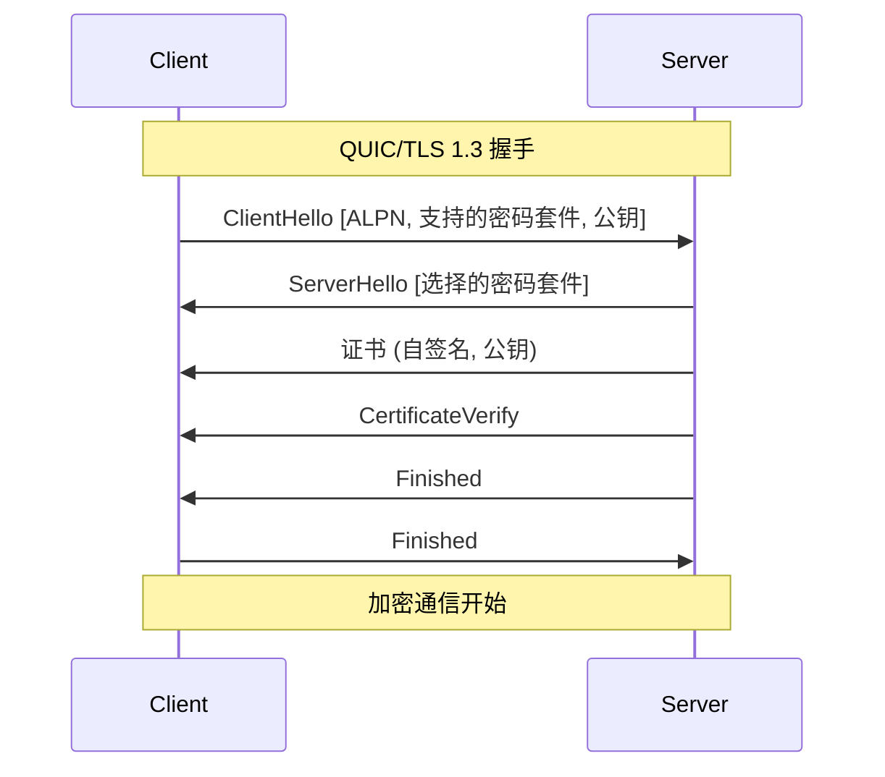
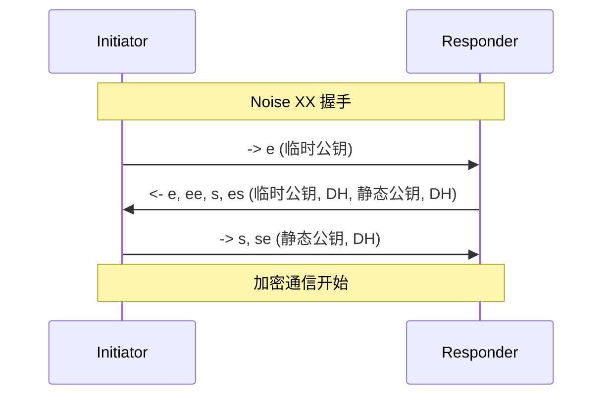
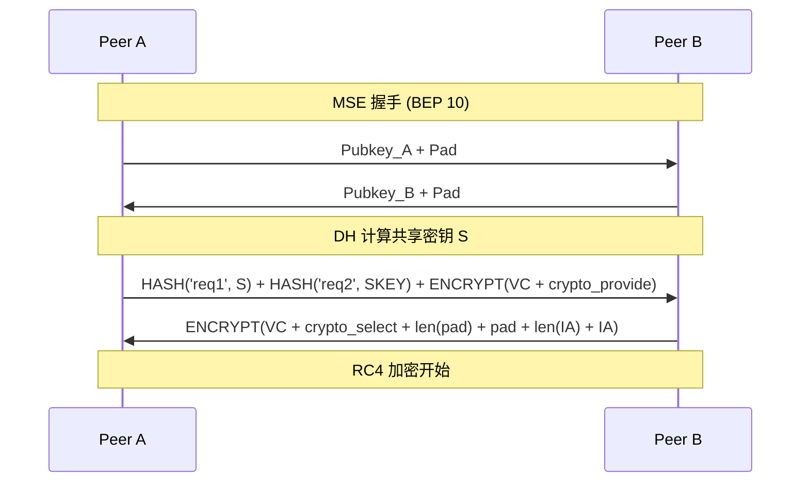
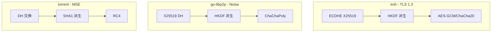
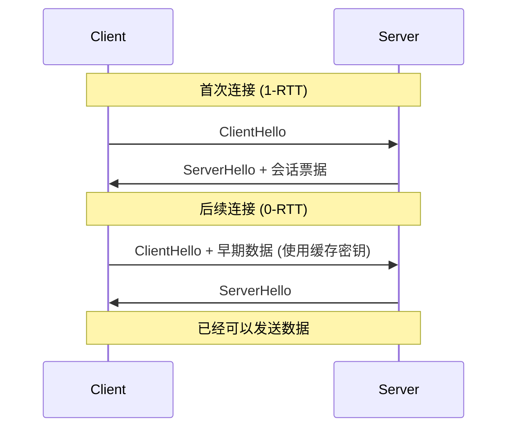
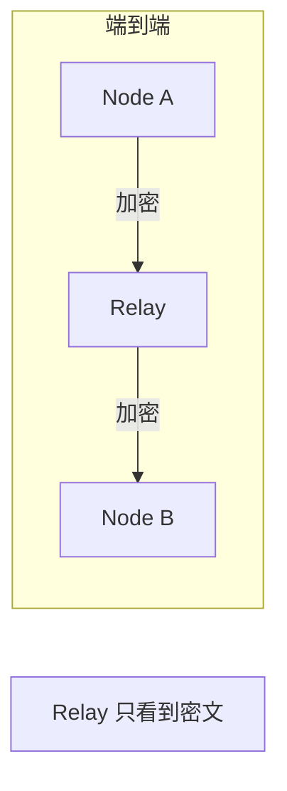
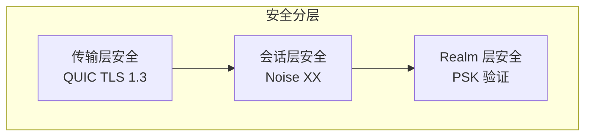

# 跨产品对比：加密与安全传输

> **对比产品**: iroh、go-libp2p、torrent  
> **分析日期**: 2026-01-11

---

## 1. 概述

本文对比分析三个 P2P 产品的加密和安全传输机制，包括协议、密钥交换、会话安全等。

---

## 2. 安全机制对比矩阵

| 特性 | iroh | go-libp2p | torrent |
|------|------|-----------|---------|
| **强制加密** | ✅ | ✅ | ❌ |
| **协议** | TLS 1.3 (QUIC) | Noise XX / TLS | MSE (可选) |
| **密钥交换** | ECDHE | XX 模式 / ECDHE | DH (MSE) |
| **对称加密** | AES-GCM/ChaCha20 | AES-GCM/ChaCha20 | RC4 (MSE) |
| **前向安全** | ✅ | ✅ | ❌ |
| **身份验证** | 公钥证书 | 公钥签名 | 无 |

---

## 3. iroh 安全机制

### 3.1 TLS 1.3 (QUIC 内置)



### 3.2 密钥配置

```rust
// 自动生成或加载密钥
let secret_key = SecretKey::generate();

// 证书配置 (QUIC/TLS)
let endpoint = Endpoint::builder()
    .secret_key(secret_key)  // Ed25519 密钥
    .bind()
    .await?;

// 身份 = 公钥
let node_id = endpoint.node_id();  // PublicKey
```

### 3.3 加密套件

```
TLS 1.3 支持的密码套件:
- TLS_AES_256_GCM_SHA384
- TLS_AES_128_GCM_SHA256
- TLS_CHACHA20_POLY1305_SHA256
```

---

## 4. go-libp2p 安全机制

### 4.1 Noise XX 协议



### 4.2 安全传输接口

```go
type SecureTransport interface {
    // 入站加密
    SecureInbound(ctx context.Context, insecure net.Conn, p peer.ID) (SecureConn, error)
    
    // 出站加密
    SecureOutbound(ctx context.Context, insecure net.Conn, p peer.ID) (SecureConn, error)
    
    // 协议 ID
    ID() protocol.ID
}

// Noise 配置
host, _ := libp2p.New(
    libp2p.Security(noise.ID, noise.New),
    // 或 TLS
    libp2p.Security(tls.ID, tls.New),
)
```

### 4.3 Noise 协议细节

```go
// Noise 协议配置
type Config struct {
    // 本地密钥
    PrivKey crypto.PrivKey
    
    // 最大消息长度
    MaxPayloadSize int
    
    // 扩展 (如 Early Data)
    Extensions []Extension
}

// 握手模式
const (
    NoiseXX = "XX"  // 双向认证
    NoiseIK = "IK"  // 知道对方公钥
    NoiseNK = "NK"  // 对方匿名
)
```

---

## 5. torrent 安全机制

### 5.1 MSE (Message Stream Encryption)



### 5.2 MSE 配置

```go
// 配置
type ClientConfig struct {
    // 加密级别
    HeaderObfuscationPolicy  HeaderObfuscationPolicy
    CryptoProvides           mse.CryptoMethod
    CryptoSelector           mse.CryptoSelector
}

// 加密方法
const (
    CryptoMethodPlaintext mse.CryptoMethod = 1 << 0
    CryptoMethodRC4       mse.CryptoMethod = 1 << 1
)
```

### 5.3 MSE 局限性

| 局限 | 说明 |
|------|------|
| **无身份验证** | 不验证对方身份 |
| **RC4 已废弃** | 现代标准不推荐 |
| **可选加密** | 可协商明文 |
| **无前向安全** | 密钥泄露影响历史会话 |

---

## 6. 密钥交换对比

### 6.1 密钥交换流程



### 6.2 对比表

| 特性 | iroh (TLS 1.3) | go-libp2p (Noise) | torrent (MSE) |
|------|----------------|-------------------|---------------|
| **DH 曲线** | X25519/P-256 | X25519 | 768-bit DH |
| **KDF** | HKDF-SHA256 | HKDF-SHA256 | SHA1 |
| **对称密钥** | 256-bit | 256-bit | 160-bit (RC4) |
| **安全强度** | 高 | 高 | 低 |

---

## 7. 会话安全对比

### 7.1 会话管理

| 特性 | iroh | go-libp2p | torrent |
|------|------|-----------|---------|
| **会话恢复** | ✅ 0-RTT | ❌ | ❌ |
| **密钥轮换** | TLS 自动 | Noise 支持 | ❌ |
| **重放保护** | ✅ | ✅ | ❌ |

### 7.2 0-RTT 恢复 (iroh)



---

## 8. 通道安全对比

### 8.1 Relay 通道安全

| 产品 | Relay 安全 | 说明 |
|------|------------|------|
| **iroh** | ✅ 端到端 | QUIC 加密穿透 Relay |
| **go-libp2p** | ✅ 端到端 | 安全层在 Relay 之上 |
| **torrent** | - | 无 Relay |

### 8.2 端到端加密



---

## 9. 对 DeP2P 的启示

### 9.1 安全设计建议

| 决策 | 建议 | 参考 |
|------|------|------|
| **传输安全** | QUIC TLS 1.3 | iroh |
| **应用层安全** | Noise XX + PSK | 创新 |
| **密钥类型** | Ed25519 | 通用 |
| **前向安全** | 必须支持 | iroh, libp2p |

### 9.2 DeP2P 安全分层



### 9.3 Realm PSK 机制

```go
// Realm 预共享密钥
type RealmPSK struct {
    RealmID   RealmID
    PSK       [32]byte  // 256-bit
    ExpiresAt time.Time
}

// 握手扩展
type RealmHandshake struct {
    RealmID    RealmID
    Signature  []byte  // 签名证明成员资格
    PSKHash    [32]byte // HMAC(PSK, nonce)
}

// 验证流程
func verifyRealmMembership(peer NodeID, handshake *RealmHandshake) error {
    // 1. 验证签名
    if !verifySignature(peer, handshake.Signature) {
        return ErrInvalidSignature
    }
    
    // 2. 验证 PSK
    expectedHash := hmac.Sum(psk, nonce)
    if !hmac.Equal(handshake.PSKHash, expectedHash) {
        return ErrInvalidPSK
    }
    
    return nil
}
```

---

## 10. 安全最佳实践

### 10.1 推荐配置

| 组件 | 推荐 | 避免 |
|------|------|------|
| **密钥交换** | X25519 | RSA, DH-768 |
| **签名** | Ed25519 | RSA-1024 |
| **对称加密** | AES-256-GCM, ChaCha20 | RC4, DES |
| **哈希** | SHA-256, BLAKE3 | SHA-1, MD5 |

### 10.2 安全检查清单

- [x] 强制加密所有连接
- [x] 使用现代密码学原语
- [x] 支持前向安全
- [x] 验证对等节点身份
- [x] 保护中继通道
- [x] Realm 成员验证

---

## 11. 总结

| 产品 | 安全特点 | 评价 |
|------|----------|------|
| **iroh** | 现代 TLS 1.3、0-RTT | 优秀 |
| **go-libp2p** | Noise 协议、灵活 | 优秀 |
| **torrent** | 可选 MSE、兼容性 | 较弱 |

DeP2P 应该：
1. 基于 QUIC TLS 1.3 实现传输安全
2. 使用 Noise XX 进行会话认证
3. 增加 Realm PSK 验证层
4. 保证端到端加密

---

**分析日期**：2026-01-11
