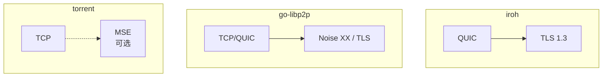

# 安全层对比分析

> **对比产品**: iroh、go-libp2p、torrent  
> **分析日期**: 2026-01-11

---

## 文档索引

| 文档 | 描述 | 状态 |
|------|------|------|
| [01-identity.md](01-identity.md) | 身份与认证对比 | ✅ |
| [02-encryption.md](02-encryption.md) | 加密与安全传输对比 | ✅ |

---

## 分析维度

### 1. 身份与认证 (01-identity.md)

- **身份模型**：公钥即身份、Multihash 等
- **密钥类型**：Ed25519、RSA、Secp256k1
- **身份生成**：NodeID 计算方法
- **身份验证**：签名、证书

### 2. 加密与安全传输 (02-encryption.md)

- **传输安全**：TLS 1.3、Noise、MSE
- **密钥交换**：ECDHE、Noise XX
- **会话安全**：前向安全、0-RTT
- **通道安全**：端到端加密

---

## 关键对比

### 身份模型

| 特性 | iroh | go-libp2p | torrent |
|------|------|-----------|---------|
| **模型** | PublicKey | Multihash(PublicKey) | 随机 PeerID |
| **密钥** | Ed25519 | Ed25519/RSA/Secp256k1 | 无 |
| **格式** | 32 字节 | Multihash 变长 | 20 字节 |

### 安全协议

### 安全特性

| 特性 | iroh | go-libp2p | torrent |
|------|------|-----------|---------|
| **强制加密** | ✅ | ✅ | ❌ |
| **前向安全** | ✅ | ✅ | ❌ |
| **身份验证** | ✅ | ✅ | ❌ |
| **0-RTT** | ✅ | ❌ | ❌ |

---

## DeP2P 建议

1. QUIC TLS 1.3 作为传输层安全
2. Noise XX 用于会话认证
3. 增加 Realm PSK 验证层
4. Ed25519 作为身份密钥

---

**更新日期**：2026-01-11
