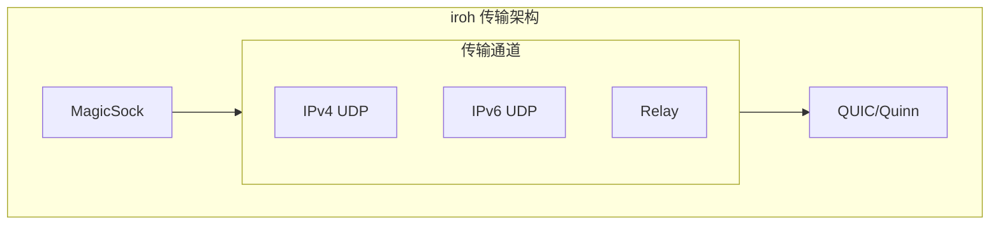
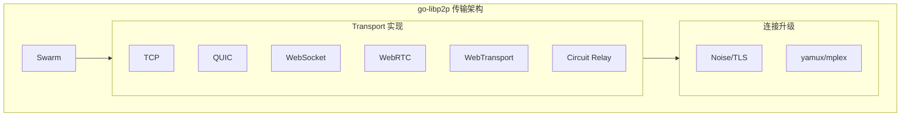
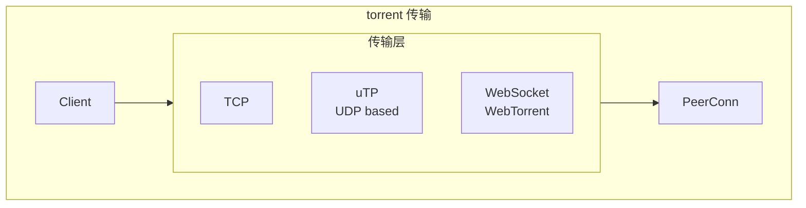
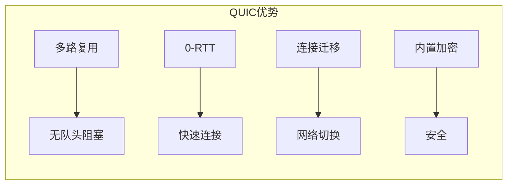
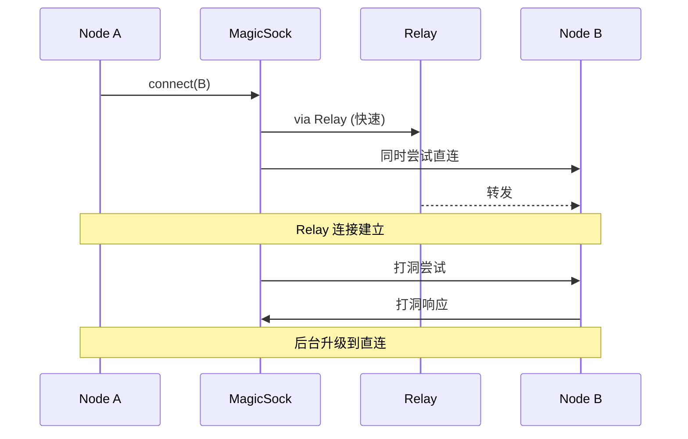
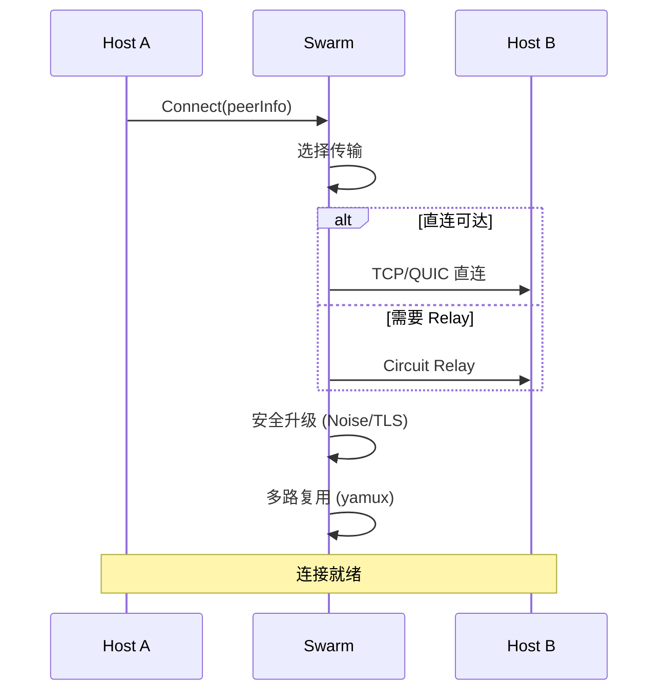
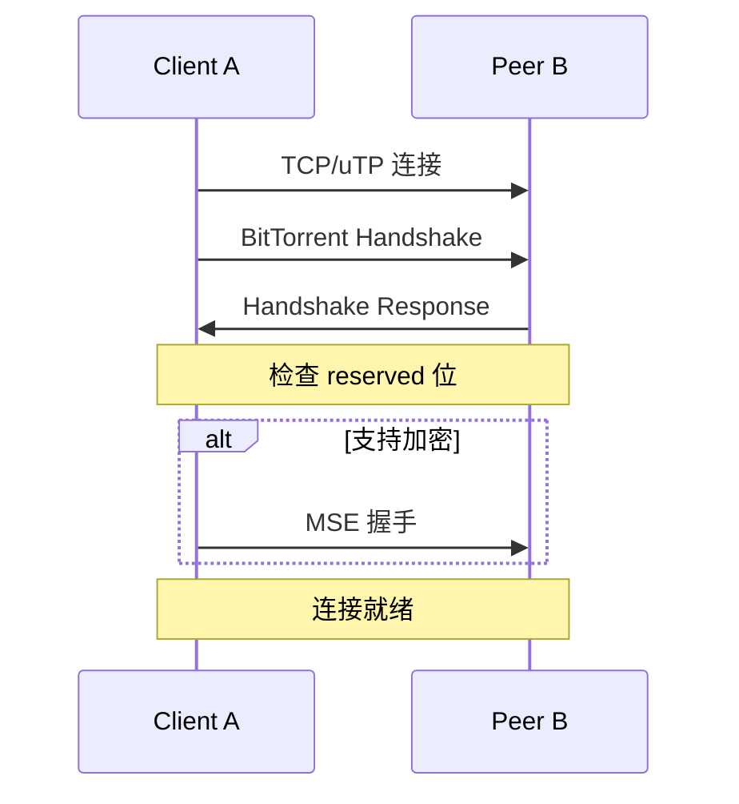
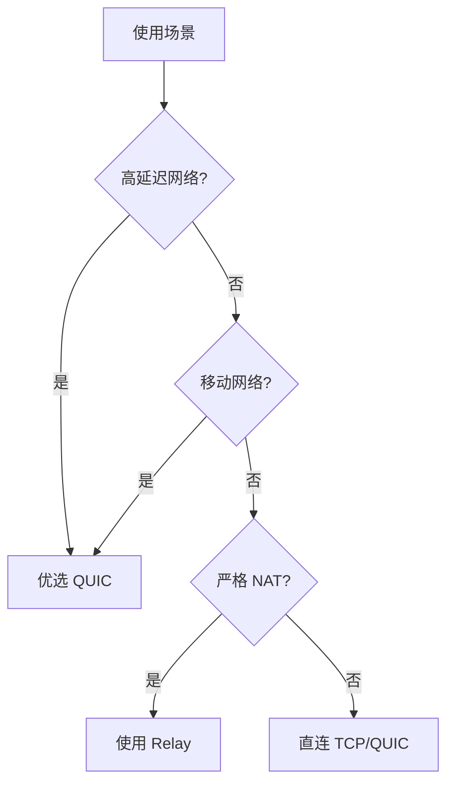
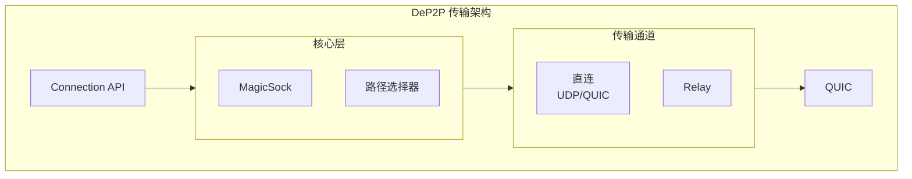

# 跨产品对比：传输协议

> **对比产品**: iroh、go-libp2p、torrent  
> **分析日期**: 2026-01-11

---

## 1. 概述

本文对比分析三个 P2P 产品支持的传输协议，包括 TCP、QUIC、WebSocket、WebRTC 等。

---

## 2. 传输协议支持矩阵

| 协议 | iroh | go-libp2p | torrent |
|------|------|-----------|---------|
| **TCP** | ❌ | ✅ | ✅ |
| **QUIC** | ✅ (核心) | ✅ | ❌ |
| **UDP** | ✅ (底层) | ✅ | ✅ (uTP) |
| **WebSocket** | ❌ | ✅ | ❌ |
| **WebRTC** | ❌ | ✅ | ✅ (WebTorrent) |
| **WebTransport** | ❌ | ✅ | ❌ |
| **Relay** | ✅ | ✅ | ❌ |

---

## 3. 详细分析

### 3.1 iroh 传输



**特点**：
- **QUIC 优先**：所有连接使用 QUIC
- **MagicSock**：统一抽象，自动选择最优路径
- **多路径**：同时维护多个传输通道

**传输配置**：

```rust
pub enum TransportConfig {
    /// IPv4 直连
    Ipv4 { port: u16 },
    /// IPv6 直连
    Ipv6 { port: u16 },
    /// Relay 中继
    Relay { relay_map: RelayMap },
}

// 默认配置
let transports = vec![
    TransportConfig::default_ipv4(),
    TransportConfig::default_ipv6(),
    TransportConfig::Relay { relay_map },
];
```

---

### 3.2 go-libp2p 传输



**Transport 接口**：

```go
type Transport interface {
    // 拨号
    Dial(ctx context.Context, raddr ma.Multiaddr, p peer.ID) (CapableConn, error)
    
    // 是否能拨号
    CanDial(addr ma.Multiaddr) bool
    
    // 监听
    Listen(laddr ma.Multiaddr) (Listener, error)
    
    // 支持的协议
    Protocols() []int
    
    // 是否代理
    Proxy() bool
}
```

**地址格式 (Multiaddr)**：

```
/ip4/192.168.1.1/tcp/4001                    # TCP
/ip4/192.168.1.1/udp/4001/quic-v1            # QUIC
/ip4/192.168.1.1/tcp/443/wss                 # WebSocket Secure
/ip4/192.168.1.1/udp/4001/webrtc-direct      # WebRTC
/ip4/192.168.1.1/udp/443/quic-v1/webtransport # WebTransport
/p2p/{relay}/p2p-circuit/p2p/{target}        # Circuit Relay
```

---

### 3.3 torrent 传输



**支持的传输**：

```go
// TCP
conn, _ := net.DialTCP("tcp", nil, addr)

// uTP (UDP-based Transport Protocol)
// 使用 github.com/anacrolix/go-libutp
conn, _ := utp.Dial("utp", addr)

// WebSocket (WebTorrent)
conn, _ := websocket.Dial(wsURL)
```

---

## 4. QUIC 对比

### 4.1 QUIC 使用情况

| 特性 | iroh | go-libp2p |
|------|------|-----------|
| **库** | quinn | quic-go |
| **版本** | v1 | v1 |
| **TLS** | rustls | crypto/tls |
| **0-RTT** | ✅ | ✅ |
| **多路复用** | ✅ 原生 | ✅ 原生 |
| **连接迁移** | ✅ | ✅ |

### 4.2 QUIC 优势



---

## 5. 连接建立对比

### 5.1 iroh 连接



### 5.2 go-libp2p 连接



### 5.3 torrent 连接



---

## 6. 多路复用对比

| 特性 | iroh | go-libp2p | torrent |
|------|------|-----------|---------|
| **机制** | QUIC 原生 | yamux/mplex | 无 |
| **流数量** | 无限制 | 配置限制 | 单连接单流 |
| **优先级** | ✅ | ✅ | ❌ |
| **流控** | QUIC 原生 | 实现级别 | TCP 级别 |

### 6.1 iroh QUIC 流

```rust
// 打开双向流
let (send, recv) = conn.open_bi().await?;

// 打开单向流
let send = conn.open_uni().await?;

// 接受流
let (send, recv) = conn.accept_bi().await?;
```

### 6.2 go-libp2p yamux

```go
// 流天然多路复用
stream, _ := host.NewStream(ctx, peerID, protocolID)

// 或在连接上
stream, _ := conn.NewStream(ctx)
```

---

## 7. 传输安全对比

| 特性 | iroh | go-libp2p | torrent |
|------|------|-----------|---------|
| **强制加密** | ✅ | ✅ | ❌ |
| **协议** | TLS 1.3 (QUIC) | Noise XX / TLS | MSE (可选) |
| **身份验证** | 公钥证书 | 公钥 | 无 |
| **前向安全** | ✅ | ✅ | ❌ |

---

## 8. 性能对比

### 8.1 理论对比

| 指标 | QUIC | TCP+TLS | uTP |
|------|------|---------|-----|
| **连接延迟** | 0-1 RTT | 2-3 RTT | 1 RTT |
| **队头阻塞** | 无 | 有 | 有 |
| **连接迁移** | 支持 | 不支持 | 不支持 |
| **NAT 友好** | 中等 | 差 | 好 |

### 8.2 典型场景



---

## 9. 对 DeP2P 的启示

### 9.1 传输设计建议

| 决策 | 建议 | 参考 |
|------|------|------|
| **主传输** | QUIC | iroh |
| **后备传输** | Relay | iroh, libp2p |
| **多路复用** | QUIC 原生 | iroh |
| **安全** | TLS 1.3 (QUIC 内置) | iroh |

### 9.2 DeP2P 传输架构



### 9.3 传输选择策略

```go
// 路径选择优先级
type PathPriority int

const (
    PriorityDirect PathPriority = 0 // 直连最优
    PriorityRelay  PathPriority = 1 // Relay 保底
)

// 选择最优路径
func selectPath(paths []Path) Path {
    sort.Slice(paths, func(i, j int) bool {
        if paths[i].Priority != paths[j].Priority {
            return paths[i].Priority < paths[j].Priority
        }
        return paths[i].Latency < paths[j].Latency
    })
    return paths[0]
}
```

---

## 10. 总结

| 产品 | 传输特点 | 评价 |
|------|----------|------|
| **iroh** | QUIC 优先、MagicSock 抽象 | 现代化 |
| **go-libp2p** | 多传输、可插拔 | 灵活 |
| **torrent** | TCP/uTP、简单 | 实用 |

DeP2P 应该：
1. 以 QUIC 为核心传输
2. 借鉴 iroh 的 MagicSock 设计
3. 实现路径选择和自动升级
4. 支持统一 Relay

---

**分析日期**：2026-01-11
