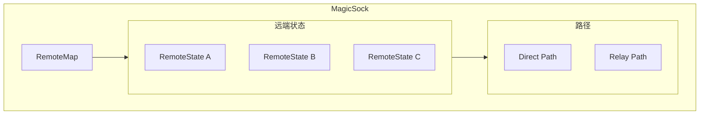
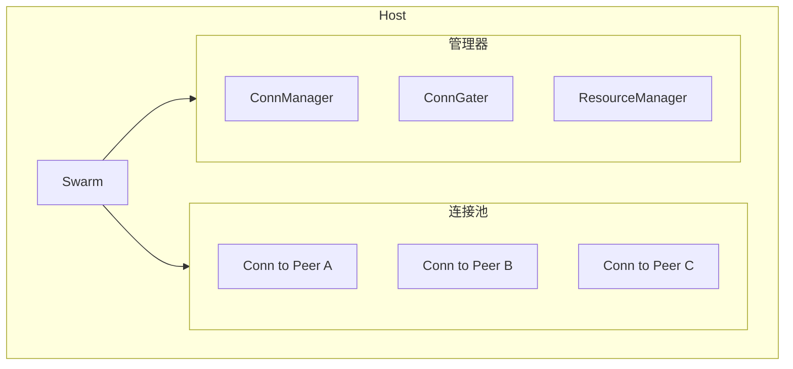
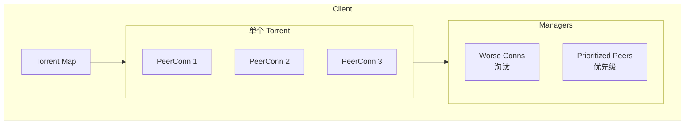
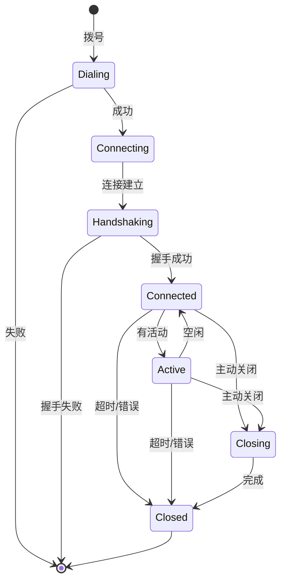
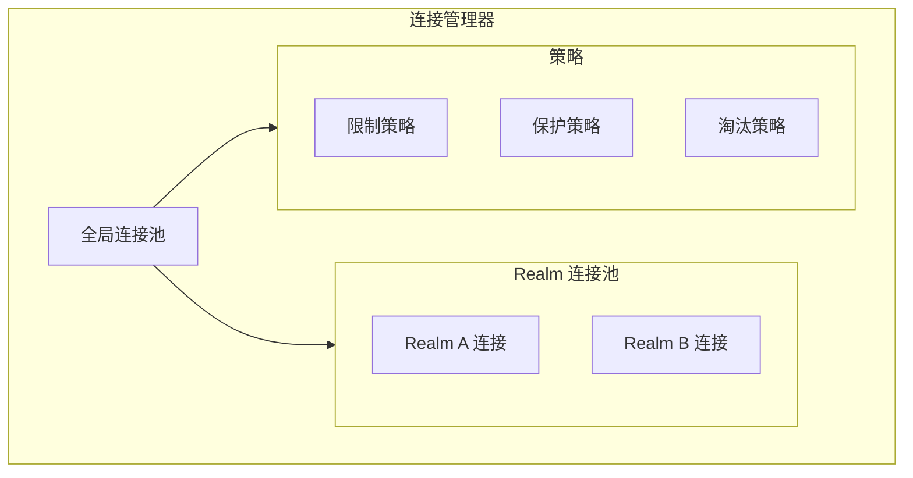

# 跨产品对比：连接管理

> **对比产品**: iroh、go-libp2p、torrent  
> **分析日期**: 2026-01-11

---

## 1. 概述

本文对比分析三个 P2P 产品的连接管理机制，包括连接池、生命周期、保活、限制等。

---

## 2. 连接管理对比矩阵

| 特性 | iroh | go-libp2p | torrent |
|------|------|-----------|---------|
| **连接池** | ✅ RemoteMap | ✅ Swarm | ✅ Client |
| **连接限制** | ✅ | ✅ ConnManager | ✅ |
| **连接保护** | ❌ | ✅ | ❌ |
| **心跳保活** | ✅ | ✅ | ✅ |
| **空闲超时** | ✅ | ✅ | ✅ |
| **多路径** | ✅ | ✅ | ❌ |
| **连接升级** | ✅ 自动 | ✅ 手动 | ❌ |

---

## 3. iroh 连接管理

### 3.1 RemoteMap 架构



### 3.2 关键配置

```rust
// 心跳间隔
pub(crate) const HEARTBEAT_INTERVAL: Duration = Duration::from_secs(5);

// 路径最大空闲时间
pub(crate) const PATH_MAX_IDLE_TIMEOUT: Duration = Duration::from_millis(6500);

// 最大多路径数
pub(crate) const MAX_MULTIPATH_PATHS: u32 = 12;
```

### 3.3 连接状态

```rust
// 远端状态
pub struct RemoteState {
    pub id: EndpointId,
    pub paths: Vec<PathState>,
    pub last_used: Instant,
    pub best_path: Option<PathInfo>,
}

// 路径状态
pub struct PathState {
    pub addr: SocketAddr,
    pub latency: Duration,
    pub last_pong: Instant,
    pub active: bool,
}
```

---

## 4. go-libp2p 连接管理

### 4.1 Swarm 架构



### 4.2 ConnManager 接口

```go
type ConnManager interface {
    // 标记连接
    TagPeer(peer.ID, string, int)
    UntagPeer(peer.ID, string)
    
    // 保护连接
    Protect(peer.ID, string)
    Unprotect(peer.ID, string) bool
    IsProtected(peer.ID, string) bool
    
    // 修剪连接
    TrimOpenConns(ctx context.Context)
    
    // 获取信息
    GetTagInfo(peer.ID) *TagInfo
}
```

### 4.3 资源限制

```go
// 默认限制
type LimitConfig struct {
    // 系统级别
    SystemMemory          int64
    SystemFD              int
    SystemConns           int
    SystemConnsInbound    int
    SystemConnsOutbound   int
    SystemStreams         int
    SystemStreamsInbound  int
    SystemStreamsOutbound int
    
    // 每个 Peer
    PeerConns             int
    PeerConnsInbound      int
    PeerConnsOutbound     int
    PeerStreams           int
    PeerStreamsInbound    int
    PeerStreamsOutbound   int
}
```

### 4.4 ConnGater 接口

```go
type ConnectionGater interface {
    // 拦截拨号
    InterceptPeerDial(p peer.ID) bool
    InterceptAddrDial(id peer.ID, ma ma.Multiaddr) bool
    
    // 拦截入站
    InterceptAccept(network.ConnMultiaddrs) bool
    InterceptSecured(network.Direction, peer.ID, network.ConnMultiaddrs) bool
    
    // 拦截升级
    InterceptUpgraded(network.Conn) (bool, control.DisconnectReason)
}
```

---

## 5. torrent 连接管理

### 5.1 Client 架构



### 5.2 连接评分

```go
// 连接质量评估
type connStats struct {
    totalUpload   int64
    totalDownload int64
    lastActivity  time.Time
    choked        bool
    interested    bool
}

// 淘汰策略
func (t *Torrent) worstConns() []*PeerConn {
    // 按以下优先级排序：
    // 1. 未握手的连接
    // 2. 长时间无活动
    // 3. 下载速度低
    // 4. 上传速度低
}
```

---

## 6. 生命周期管理对比

### 6.1 连接生命周期



### 6.2 生命周期钩子

| 钩子 | iroh | go-libp2p | torrent |
|------|------|-----------|---------|
| **连接前** | BeforeConnect | InterceptPeerDial | - |
| **连接后** | AfterHandshake | Connected (Notifiee) | - |
| **流打开** | - | OpenedStream | - |
| **断开前** | - | Disconnected | - |
| **断开后** | - | Disconnected | - |

#### iroh Hooks

```rust
pub trait EndpointHooks: Send + Sync + 'static {
    fn before_connect(&self, peer: EndpointId) -> BeforeConnectOutcome;
    fn after_handshake(&self, conn: &Connection) -> AfterHandshakeOutcome;
}
```

#### go-libp2p Notifiee

```go
type Notifiee interface {
    Listen(network.Network, ma.Multiaddr)
    ListenClose(network.Network, ma.Multiaddr)
    Connected(network.Network, network.Conn)
    Disconnected(network.Network, network.Conn)
    OpenedStream(network.Network, network.Stream)
    ClosedStream(network.Network, network.Stream)
}
```

---

## 7. 保活机制对比

### 7.1 心跳对比

| 特性 | iroh | go-libp2p | torrent |
|------|------|-----------|---------|
| **机制** | QUIC PING | yamux keepalive | BitTorrent keepalive |
| **间隔** | 5 秒 | 30 秒 (默认) | 2 分钟 |
| **超时** | 6.5 秒 | 配置 | 配置 |

### 7.2 保活实现

#### iroh

```rust
// QUIC 原生心跳
// 配置在 TransportConfig 中
let config = TransportConfig::default();
config.keep_alive_interval(Some(Duration::from_secs(5)));
```

#### go-libp2p

```go
// yamux 配置
yamuxConfig := yamux.DefaultConfig()
yamuxConfig.EnableKeepAlive = true
yamuxConfig.KeepAliveInterval = 30 * time.Second
```

#### torrent

```go
// BitTorrent keep-alive
// 每 2 分钟发送空消息
func (c *PeerConn) keepAlive() {
    ticker := time.NewTicker(2 * time.Minute)
    for range ticker.C {
        c.write([]byte{0, 0, 0, 0}) // 长度为 0
    }
}
```

---

## 8. 连接复用对比

### 8.1 复用策略

| 策略 | iroh | go-libp2p | torrent |
|------|------|-----------|---------|
| **每 Peer 连接数** | 1 | 可配置 | 1 |
| **流复用** | QUIC | yamux | 无 |
| **连接复用** | 自动 | 自动 | 每 torrent |

### 8.2 go-libp2p 连接复用

```go
// 一个 peer 多个连接
host, _ := libp2p.New(
    libp2p.ConnectionManager(
        connmgr.NewConnManager(
            100,  // low water
            400,  // high water
            connmgr.WithGracePeriod(time.Minute),
        ),
    ),
)

// 获取现有连接
conns := host.Network().ConnsToPeer(peerID)
```

---

## 9. 对 DeP2P 的启示

### 9.1 连接管理建议

| 决策 | 建议 | 参考 |
|------|------|------|
| **连接池** | 全局 + Realm 分层 | 创新 |
| **连接限制** | ResourceManager 模式 | go-libp2p |
| **连接保护** | 支持重要连接保护 | go-libp2p |
| **心跳** | QUIC 原生 5 秒 | iroh |
| **多路径** | 支持并自动选优 | iroh |

### 9.2 DeP2P 连接管理架构



### 9.3 关键接口设计

```go
// 连接管理器接口
type ConnectionManager interface {
    // 连接操作
    GetConnection(nodeID NodeID) (Connection, bool)
    AddConnection(conn Connection) error
    RemoveConnection(nodeID NodeID) error
    
    // 连接保护
    Protect(nodeID NodeID, tag string)
    Unprotect(nodeID NodeID, tag string)
    IsProtected(nodeID NodeID) bool
    
    // 连接限制
    SetLimit(limit ConnectionLimit)
    TrimConnections(ctx context.Context, count int)
    
    // 统计
    ConnectionCount() int
    Stats() ConnectionStats
}

// Realm 感知
type RealmConnectionManager interface {
    ConnectionManager
    
    // Realm 操作
    GetRealmConnections(realmID RealmID) []Connection
    SetRealmLimit(realmID RealmID, limit int)
}
```

---

## 10. 总结

| 产品 | 连接管理特点 | 评价 |
|------|--------------|------|
| **iroh** | 多路径、自动升级 | 智能 |
| **go-libp2p** | 完善、可配置 | 成熟 |
| **torrent** | 简单、有效 | 实用 |

DeP2P 应该：
1. 借鉴 go-libp2p 的 ConnectionManager 设计
2. 采用 iroh 的多路径和自动升级
3. 增加 Realm 感知的连接管理
4. 实现连接保护和优雅淘汰

---

**分析日期**：2026-01-11
