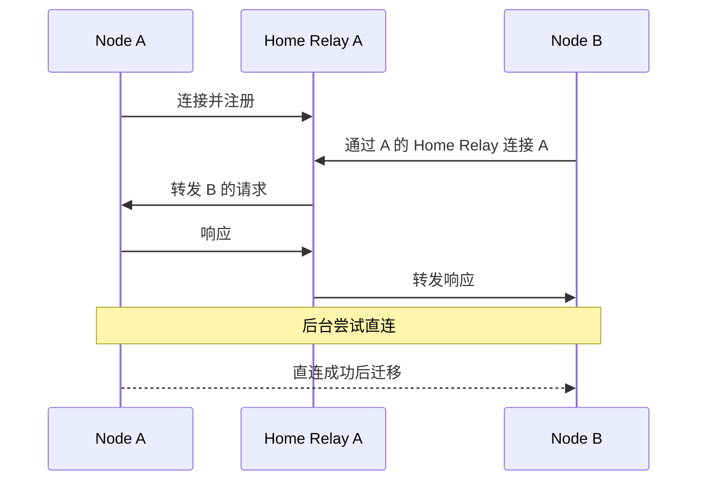
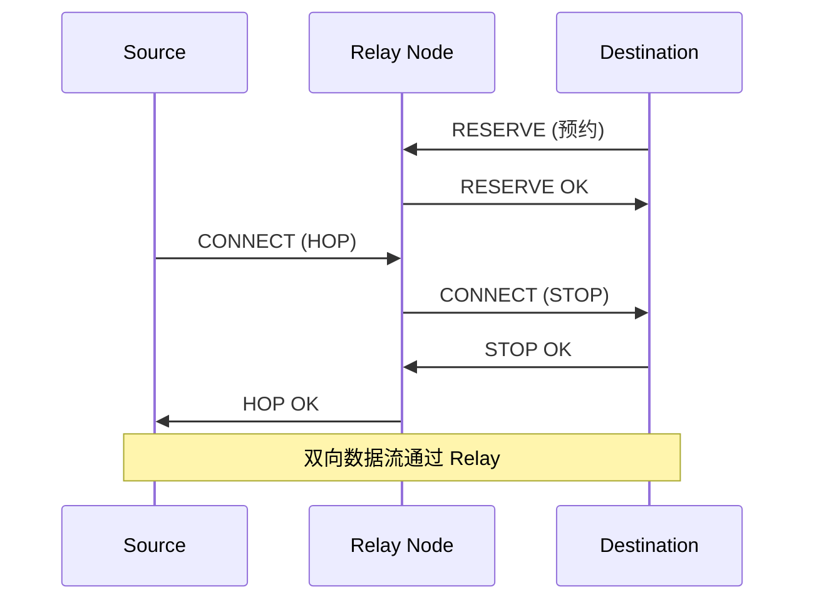
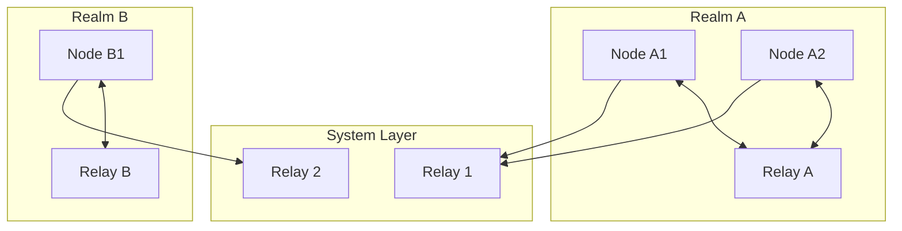

# 跨产品对比：Relay 设计

> **对比产品**: iroh、go-libp2p、torrent  
> **分析日期**: 2026-01-11  
> **更新日期**: 2026-01-24

---

## 1. 概述

Relay（中继）是 P2P 网络中解决 NAT 穿透失败的关键机制。本文对比分析各产品的 Relay 设计。

---

## 2. 对比矩阵

| 特性 | iroh | go-libp2p | torrent |
|------|------|-----------|---------|
| **有 Relay** | ✅ | ✅ | ❌ |
| **协议** | DERP 变体 | Circuit Relay v2 | N/A |
| **分层** | 单层 | 单层 | N/A |
| **加密** | 端到端 | 端到端 | N/A |
| **连接升级** | ✅ 自动 | ✅ 自动 | N/A |
| **资源限制** | ✅ | ✅ | N/A |
| **Home Relay** | ✅ | ❌ | N/A |

---

## 3. 详细分析

### 3.1 iroh Relay

#### 设计理念

> Relay 服务器确保所有端点始终可达，只转发加密流量

#### 关键特性

```
iroh-relay/
├── client/          # 客户端
├── server/          # 服务端
└── protos/          # 协议定义
    └── relay.rs     # DERP 变体协议
```

| 特性 | 说明 |
|------|------|
| **Home Relay** | 每个端点有一个"家" Relay |
| **端到端加密** | Relay 只看到密文 |
| **自动升级** | 后台持续尝试直连 |
| **QAD 支持** | 辅助 NAT 穿透 |

#### 连接流程



---

### 3.2 go-libp2p Circuit Relay v2

#### 设计理念

> 协议化的中继，可由任何节点提供

#### 协议 ID

```go
const (
    ProtoIDv2Hop  = "/libp2p/circuit/relay/0.2.0/hop"
    ProtoIDv2Stop = "/libp2p/circuit/relay/0.2.0/stop"
)
```

#### 关键特性

| 特性 | 说明 |
|------|------|
| **去中心化** | 任何节点可成为 Relay |
| **预约机制** | 客户端需预约 Relay 资源 |
| **资源限制** | 流量、连接数、时间限制 |
| **有限连接** | Relay 连接标记为 "Limited" |

#### 地址格式

```
/p2p/{relay-peer-id}/p2p-circuit/p2p/{target-peer-id}
```

#### 资源限制

```go
var DefaultResources = Resources{
    Limit:                  DefaultLimit,
    ReservationTTL:         time.Hour,
    MaxReservations:        128,
    MaxCircuits:            16,
    BufferSize:             2048,
    MaxReservationsPerPeer: 4,
    MaxReservationsPerIP:   8,
}
```

#### 流程



---

### 3.3 torrent

BitTorrent 协议**没有原生 Relay 机制**：

- 依赖 Tracker 和 DHT 发现 peers
- NAT 穿透失败则无法连接
- 部分客户端支持 uTP（更易穿透）

---

## 4. 架构对比

### 4.1 中心化 vs 去中心化

| 产品 | 模式 | 说明 |
|------|------|------|
| **iroh** | 半中心化 | 使用指定的 Relay 服务器 |
| **go-libp2p** | 去中心化 | 任何节点可成为 Relay |

### 4.2 Relay 发现

| 产品 | 发现方式 |
|------|----------|
| **iroh** | 配置的 RelayMap |
| **go-libp2p** | DHT、配置、AutoRelay |

---

## 5. 对 DeP2P 的启示

### 5.1 设计建议

基于分析，DeP2P 的 Relay 设计建议：

| 决策 | 建议 | 参考 |
|------|------|------|
| **分层** | 统一 Relay | 创新 |
| **协议** | 基于 libp2p 的协议抽象 | go-libp2p |
| **Home Relay** | 采用 Home Relay 概念 | iroh |
| **端到端加密** | 必须支持 | iroh |
| **资源限制** | 参考 Circuit v2 | go-libp2p |

### 5.2 DeP2P 统一设计



### 5.3 关键差异

| 特性 | 其他产品 | DeP2P |
|------|----------|-------|
| **Relay 层级** | 单层 | 统一 Relay |
| **隔离** | 无 | Realm 隔离 |
| **控制面/数据面** | 混合 | 分离 |

### 5.4 DeP2P Relay 地址簿功能（v2.0 更新）

> **v2.0 核心变化**：DHT 是权威目录，Relay 地址簿是本地缓存加速层

```go
// AddressBookEntry 地址簿条目
type AddressBookEntry struct {
    NodeID      NodeID         // 节点标识
    DirectAddrs []Multiaddr    // 直连地址列表
    NATType     NATType        // NAT 类型
    Online      bool           // 在线状态
    LastSeen    time.Time      // 最后活跃时间
}
```

**Relay 三大职责（v2.0 更新）**：
1. **缓存加速层**：缓存连接成员的地址信息（作为 DHT 的本地缓存）
2. **打洞协调信令**：提供打洞协调的信令通道
3. **数据转发兜底**：打洞失败时作为数据中继

**三层架构（v2.0）**：
- Layer 1: **DHT（★ 权威目录）** — 存储签名 PeerRecord
- Layer 2: **缓存加速层** — Peerstore / MemberList / Relay 地址簿
- Layer 3: **连接策略** — 直连 → 打洞 → Relay 兜底

### 5.5 TTL 与续租参数

| 参数 | DeP2P 值 | libp2p 参考值 |
|------|---------|---------------|
| 预留 TTL | **1h** | 1h (ReservationTTL) |
| 续租间隔 | **30min** (TTL/2) | - |
| 最大预留数 | 100 | 128 (MaxReservations) |
| 打洞后 Relay | **保留作备份** | 自动断开 |

详见 [概念澄清文档 §17.1](../../../_discussions/20260123-nat-relay-concept-clarification.md)。

---

## 6. 总结

| 产品 | Relay 特点 | 适用场景 |
|------|------------|----------|
| **iroh** | Home Relay、自动升级 | 通用 P2P |
| **go-libp2p** | 协议化、去中心化 | 大规模网络 |
| **torrent** | 无 | 依赖穿透 |

DeP2P 应结合 iroh 的 Home Relay 概念和 libp2p 的协议化设计，采用统一 Relay 架构（v2.0 作为缓存加速层）。

---

**分析日期**：2026-01-11
