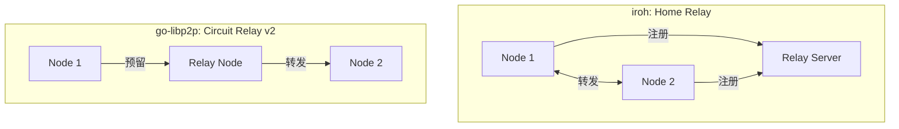

# 传输层对比分析

> **对比产品**: iroh、go-libp2p、torrent  
> **分析日期**: 2026-01-11

---

## 文档索引

| 文档 | 描述 | 状态 |
|------|------|------|
| [01-transport-protocols.md](01-transport-protocols.md) | 传输协议对比 | ✅ |
| [02-connection-management.md](02-connection-management.md) | 连接管理对比 | ✅ |
| [03-relay.md](03-relay.md) | Relay 设计对比 | ✅ |

---

## 分析维度

### 1. 传输协议 (01-transport-protocols.md)

- **协议支持矩阵**：TCP、QUIC、WebSocket、WebRTC 等
- **QUIC 对比**：库选择、特性支持
- **连接建立对比**：握手流程、多路复用
- **传输安全对比**：加密、认证

### 2. 连接管理 (02-connection-management.md)

- **连接池设计**：架构、限制、保护
- **生命周期管理**：状态机、钩子
- **保活机制**：心跳、超时
- **连接复用**：每 peer 连接数、流复用

### 3. Relay 设计 (03-relay.md)

- **Relay 架构**：集中式 vs 去中心化
- **协议设计**：握手、转发、计费
- **特性对比**：带宽限制、延迟、安全

---

## 关键对比

### 传输协议支持

| 协议 | iroh | go-libp2p | torrent |
|------|------|-----------|---------|
| **TCP** | ❌ | ✅ | ✅ |
| **QUIC** | ✅ (核心) | ✅ | ❌ |
| **WebSocket** | ❌ | ✅ | ❌ |
| **Relay** | ✅ | ✅ | ❌ |

### Relay 架构

---

## DeP2P 建议

1. QUIC 作为核心传输
2. 借鉴 iroh 的 MagicSock 设计
3. 统一 Relay（v2.0 缓存加速层）
4. 自动路径选择和升级

---

**更新日期**：2026-01-11
