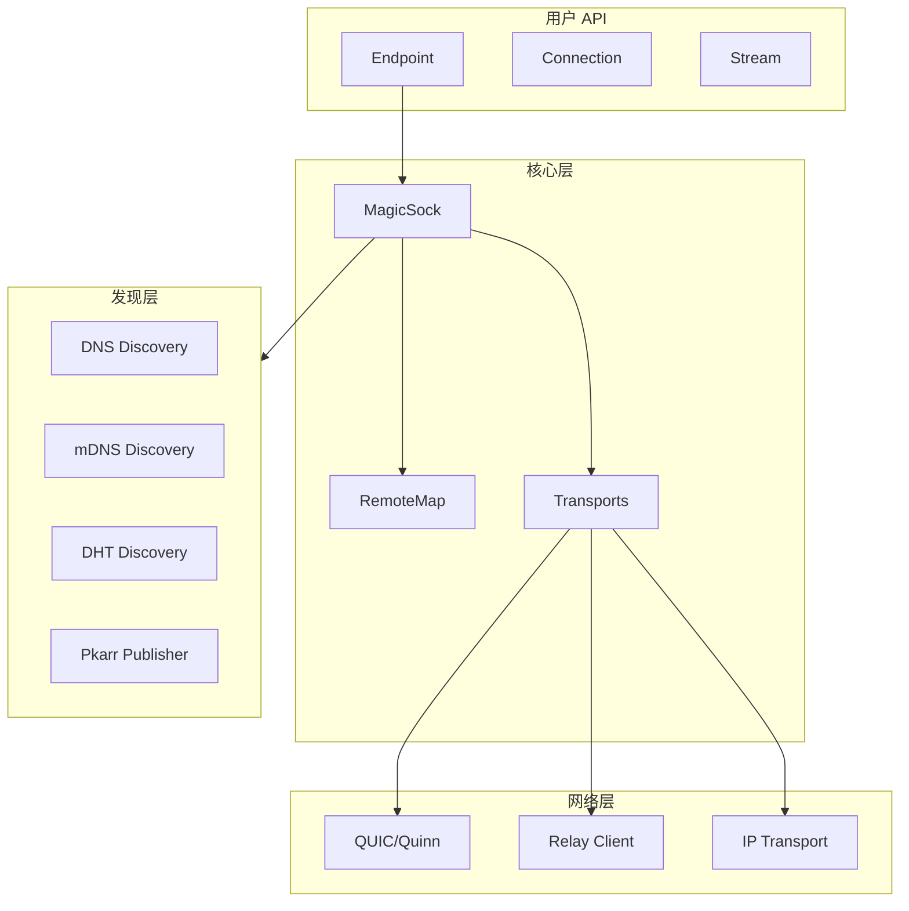
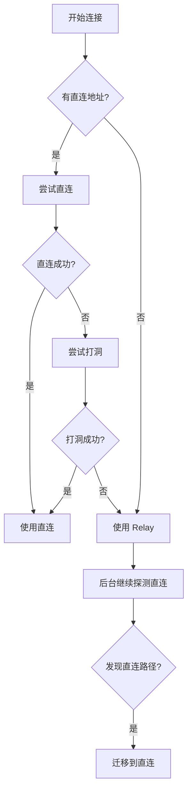
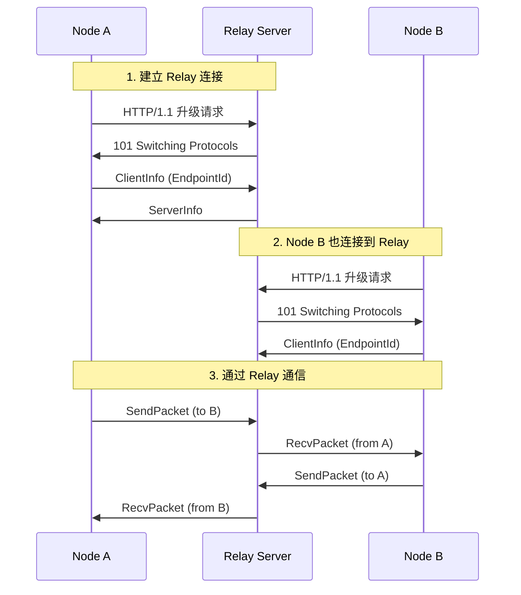

# iroh 深度分析

> **版本**: 基于 iroh-main (2026-01 分析)  
> **语言**: Rust  
> **许可**: MIT / Apache-2.0  
> **仓库**: https://github.com/n0-computer/iroh

---

## 1. 项目概述

### 1.1 基本信息

| 属性 | 值 |
|------|-----|
| **组织** | n0 (Number 0) |
| **定位** | 现代化 P2P 网络库 |
| **核心特性** | QUIC 优先、Relay 中继、打洞穿透 |
| **主要语言** | Rust |
| **本地路径** | `/Users/qinglong/go/src/chaincodes/p2p/iroh-main` |

### 1.2 核心理念

iroh 的设计理念可以概括为：

> **"Dial by Public Key"** - 通过公钥拨号

用户只需知道目标节点的公钥（EndpointId），iroh 会自动找到并维护最快的连接路径。

### 1.3 关键特性

| 特性 | 说明 |
|------|------|
| **QUIC 原生** | 基于 Quinn 库，提供多路复用、0-RTT、数据报传输 |
| **自动打洞** | 优先直连，自动尝试 NAT 穿透 |
| **Relay 降级** | 打洞失败时通过 Relay 中继，保证连接可达 |
| **端到端加密** | 即使通过 Relay，数据也是加密的 |
| **多发现机制** | DNS、mDNS、DHT、静态配置 |

---

## 2. 架构分析

### 2.1 整体架构



### 2.2 功能聚焦架构（极简设计）

iroh 采用**功能聚焦架构**，核心更加精简：

```
┌─────────────────────────────────────────────────────────────┐
│                      iroh 架构                               │
├─────────────────────────────────────────────────────────────┤
│                                                             │
│  ┌─────────────────────────────────────────────────────┐   │
│  │ endpoint/     端点（入口门面）                        │   │
│  │   connection/  hooks/  presets/  quic/               │   │
│  └─────────────────────────────────────────────────────┘   │
│                          ↓                                  │
│  ┌────────────────────┬────────────────────────────────┐   │
│  │ discovery/          │ magicsock/                      │   │
│  │   dns/  mdns/       │   transports/  remote_map/     │   │
│  │   pkarr/            │   （传输抽象+NAT穿透）          │   │
│  └────────────────────┴────────────────────────────────┘   │
│                          ↓                                  │
│  ┌─────────────────────────────────────────────────────┐   │
│  │ tls/  net_report/  protocol/                          │   │
│  │       （安全、网络报告、协议定义）                     │   │
│  └─────────────────────────────────────────────────────┘   │
│                                                             │
│  ════════════════════════════════════════════════════════  │
│                                                             │
│  ┌─────────────────────────────────────────────────────┐   │
│  │ 独立服务                                              │   │
│  │   iroh-relay/  iroh-dns-server/  iroh-base/          │   │
│  └─────────────────────────────────────────────────────┘   │
│                                                             │
└─────────────────────────────────────────────────────────────┘
```

**核心特点：**

| 特点 | 说明 |
|------|------|
| **极简设计** | 核心只做连接建立（hole punching + relay fallback） |
| **Endpoint 中心化** | 单一入口，所有功能通过 Endpoint 暴露 |
| **功能组合** | 高级功能（blobs, gossip, docs）作为独立库组合 |
| **QUIC 原生** | 不抽象传输层，直接基于 QUIC |

### 2.3 核心模块

| 模块 | 路径 | 职责 |
|------|------|------|
| **iroh** | `iroh/` | 核心库，Endpoint API |
| **iroh-base** | `iroh-base/` | 基础类型（Key、RelayUrl） |
| **iroh-relay** | `iroh-relay/` | Relay 服务器和客户端 |
| **iroh-dns-server** | `iroh-dns-server/` | DNS 发现服务 |

### 2.4 代码组织

```
iroh/src/
├── endpoint.rs           # Endpoint 主入口
├── endpoint/
│   ├── connection.rs     # 连接抽象
│   ├── hooks.rs          # 生命周期钩子
│   ├── presets.rs        # 预设配置
│   └── quic.rs           # QUIC 封装
├── magicsock.rs          # MagicSock 核心
├── magicsock/
│   ├── remote_map.rs     # 远端节点映射
│   ├── transports.rs     # 传输层抽象
│   └── mapped_addrs.rs   # 地址映射
├── discovery.rs          # 发现服务
├── discovery/
│   ├── dns.rs            # DNS 发现
│   ├── mdns.rs           # mDNS 发现
│   └── pkarr.rs          # Pkarr 发布/解析
├── net_report.rs         # 网络探测
├── tls.rs                # TLS 配置
└── protocol.rs           # 协议处理
```

---

## 3. 身份设计

### 3.1 密钥体系

iroh 使用 **Ed25519** 密钥对：

```rust
// iroh-base/src/key.rs

/// 公钥 - 使用 CompressedEdwardsY 存储
pub struct PublicKey(CompressedEdwardsY);

/// EndpointId = PublicKey
/// 按约定：执行密码操作时使用 PublicKey，引用端点时使用 EndpointId
pub type EndpointId = PublicKey;

/// 私钥
pub struct SecretKey(SigningKey);
```

### 3.2 EndpointId 设计

| 特点 | 说明 |
|------|------|
| **格式** | Ed25519 公钥原始字节（32 字节） |
| **展示** | Base32 编码的字符串 |
| **唯一性** | 全局唯一，由密钥对决定 |
| **用途** | 身份标识 + 加密密钥 |

### 3.3 对 DeP2P 的启示

DeP2P 的 `NodeID = SHA256(PublicKey)` 与 iroh 的 `EndpointId = PublicKey` 不同：

| 对比 | iroh | DeP2P |
|------|------|-------|
| NodeID 格式 | 公钥本身 | 公钥哈希 |
| 长度 | 32 字节 | 32 字节 |
| 可逆性 | 可直接用于加密 | 需要额外存储公钥 |

**建议**：DeP2P 的哈希方式更安全（隐藏公钥），但需要在连接时传递公钥。

---

## 4. 传输层设计

### 4.1 MagicSock

MagicSock 是 iroh 的核心传输抽象：

> 一个可以在使用中改变通信路径的 socket，主动搜索最佳通信方式。

```rust
// iroh/src/magicsock.rs

/// MagicSock 核心功能：
/// 1. 管理多个传输路径（Relay、直连 IP）
/// 2. 自动选择最优路径
/// 3. 路径探测和切换
pub struct MagicSock {
    remote_map: RemoteMap,      // 远端节点状态
    transports: Transports,     // 传输通道集合
    discovery: Discovery,       // 发现服务
    // ...
}
```

### 4.2 传输配置

```rust
pub enum TransportConfig {
    /// IPv4 直连传输
    Ipv4 { port: u16 },
    /// IPv6 直连传输  
    Ipv6 { port: u16 },
    /// Relay 中继传输
    Relay { relay_map: RelayMap },
}
```

### 4.3 路径选择策略



### 4.4 心跳和超时

```rust
/// 心跳间隔：5 秒
pub(crate) const HEARTBEAT_INTERVAL: Duration = Duration::from_secs(5);

/// 路径最大空闲时间：6.5 秒（HEARTBEAT + 1.5s 重试）
pub(crate) const PATH_MAX_IDLE_TIMEOUT: Duration = Duration::from_millis(6500);

/// 最大多路径数
pub(crate) const MAX_MULTIPATH_PATHS: u32 = 12;
```

---

## 5. Relay 设计

### 5.1 Relay 定位

> Relay 服务器确保所有 iroh 端点始终可达。它们接受加密流量，根据 EndpointId 转发到正确目的地。

### 5.2 Relay 协议

iroh-relay 使用修改版的 DERP（Designated Encrypted Relay for Packets）协议：

```rust
// iroh-relay/src/protos/relay.rs

/// 最大包大小
pub const MAX_PACKET_SIZE: usize = 64 * 1024;

/// Relay 帧类型
pub enum FrameType {
    ClientInfo,      // 客户端信息
    SendPacket,      // 发送数据包
    RecvPacket,      // 接收数据包
    KeepAlive,       // 保活
    Ping,            // ping
    Pong,            // pong
    // ...
}
```

### 5.3 Relay 连接流程



### 5.4 RelayMap

```rust
// iroh-relay/src/relay_map.rs

/// Relay 服务器配置
pub struct RelayConfig {
    pub url: RelayUrl,           // Relay URL
    pub quic: Option<RelayQuicConfig>,  // QUIC 配置
}

/// Relay 地图 - 所有可用的 Relay 服务器
pub struct RelayMap {
    relays: BTreeMap<RelayUrl, RelayConfig>,
}
```

### 5.5 Home Relay 概念

每个端点有一个 **Home Relay**：

1. 启动时连接到最近的 Relay 服务器
2. 该 Relay 成为该端点的 "Home Relay"
3. 其他端点通过 Home Relay 找到该端点

---

## 6. 节点发现（"仅 ID 连接"的核心）

### 6.1 核心问题

> **如果只有一个 EndpointId（公钥），没有 IP 地址，如何找到目标节点？**

iroh 通过 **Discovery（发现）系统** 解决这个问题，实现真正的"仅 ID 连接"。

### 6.2 发布-发现（Publish-Resolve）模式

```
┌─────────────────────────────────────────────────────────────────────────────┐
│                    iroh "仅 ID 连接" 架构                                    │
├─────────────────────────────────────────────────────────────────────────────┤
│                                                                             │
│  ┌─────────────┐                        ┌─────────────┐                    │
│  │   Node A    │                        │   Node B    │                    │
│  │  (客户端)   │                        │  (服务端)   │                    │
│  └──────┬──────┘                        └──────┬──────┘                    │
│         │                                      │                            │
│         │  1. 仅知道 EndpointId (公钥)         │  2. 启动时自动发布         │
│         │                                      │     自己的地址信息          │
│         │                                      ▼                            │
│         │                              ┌─────────────────┐                 │
│         │                              │  发现服务         │                 │
│         │                              │  (DNS / pkarr / │                 │
│         │      3. 查询目标 ID 的地址    │   DHT / mDNS)   │                 │
│         │  ──────────────────────────► │                 │                 │
│         │                              └────────┬────────┘                 │
│         │                                       │                          │
│         │      4. 返回 {RelayUrl, IP地址}       │                          │
│         │  ◄────────────────────────────────────┘                          │
│         │                                                                   │
│         │  5. 使用获得的地址连接到 Node B                                   │
│         │  ─────────────────────────────────────────────────────►          │
│                                                                             │
└─────────────────────────────────────────────────────────────────────────────┘
```

### 6.3 Discovery Trait

```rust
// iroh/src/discovery.rs

/// 端点发现服务 trait
pub trait Discovery: std::fmt::Debug + Send + Sync + 'static {
    /// 发布自己的地址信息到发现机制
    /// - 火后不管（fire and forget），Endpoint 不等待发布成功
    /// - 如果发布是异步的，实现应该启动自己的任务
    fn publish(&self, _data: &EndpointData) {}

    /// 根据 EndpointId 解析地址信息
    /// - 返回一个 Stream，可能产生多个结果
    /// - Stream 被 drop 时，服务应停止所有待处理的工作
    fn resolve(
        &self,
        _endpoint_id: EndpointId,
    ) -> Option<BoxStream<Result<DiscoveryItem, DiscoveryError>>> {
        None
    }
}
```

### 6.4 支持的发现服务

| 服务 | 发布 | 解析 | 机制 | 使用场景 |
|------|:----:|:----:|------|----------|
| **PkarrPublisher** | ✅ | ❌ | HTTP PUT 到 pkarr 中继 | 公网发布 |
| **PkarrResolver** | ❌ | ✅ | HTTP GET 从 pkarr 中继 | 公网查询 |
| **DnsDiscovery** | ❌ | ✅ | DNS TXT 记录查询 | 公网查询 |
| **DhtDiscovery** | ✅ | ✅ | Mainline DHT | 去中心化 |
| **MdnsDiscovery** | ✅ | ✅ | mDNS 多播 | 局域网发现 |
| **StaticProvider** | ❌ | ✅ | 静态配置 | 已知节点 |

### 6.5 pkarr 发现详解

**pkarr**（Public-Key Addressable Resource Records）是 iroh 的核心发现机制：

```
┌─────────────────────────────────────────────────────────────────────────────┐
│                    pkarr 发布-查询流程                                       │
├─────────────────────────────────────────────────────────────────────────────┤
│                                                                             │
│  发布端（Node B 启动时）：                                                   │
│  ─────────────────────────                                                  │
│  1. 创建 EndpointInfo {endpoint_id, relay_url, ip_addrs}                   │
│  2. 使用 SecretKey 签名 → SignedPacket                                     │
│  3. HTTP PUT → https://dns.iroh.link/pkarr/<z32-endpoint-id>               │
│                                                                             │
│  查询端（Node A 连接时）：                                                   │
│  ─────────────────────────                                                  │
│  方式 1: pkarr HTTP 查询                                                    │
│    HTTP GET → https://dns.iroh.link/pkarr/<z32-endpoint-id>                │
│    解析 SignedPacket → EndpointInfo                                        │
│                                                                             │
│  方式 2: DNS 查询                                                           │
│    DNS TXT 查询 → _iroh.<z32-endpoint-id>.dns.iroh.link                    │
│    解析 TXT 记录 → relay=https://..., addr=1.2.3.4:4001                    │
│                                                                             │
└─────────────────────────────────────────────────────────────────────────────┘
```

**关键代码参考**：

```rust
// iroh/src/discovery/pkarr.rs

impl PkarrPublisher {
    /// 发布地址信息
    pub fn update_endpoint_data(&self, data: &EndpointData) {
        let mut data = data.clone();
        if data.relay_urls().next().is_some() {
            // 如果有 Relay URL，只发布 Relay URL（不暴露直连地址）
            data.clear_ip_addrs();
        }
        let info = EndpointInfo::from_parts(self.endpoint_id, data);
        self.watchable.set(Some(info)).ok();
    }
}

// 发布位置
pub const N0_DNS_PKARR_RELAY_PROD: &str = "https://dns.iroh.link/pkarr";
```

### 6.6 连接时的发现流程

当调用 `endpoint.connect(endpoint_id, alpn)` 时：

```rust
// magicsock.rs - 解析远端地址
pub(crate) async fn resolve_remote(&self, addr: EndpointAddr) 
    -> Result<Result<EndpointIdMappedAddr, DiscoveryError>, ...> 
{
    let EndpointAddr { id, addrs } = addr;
    let actor = self.remote_map.remote_state_actor(id);
    // 发送解析请求给 RemoteStateActor
    actor.send(RemoteStateMessage::ResolveRemote(addrs, tx)).await?;
    // ...
}

// remote_state.rs - 触发发现
fn trigger_discovery(&mut self) {
    // 如果已有选定路径或正在发现中，跳过
    if self.selected_path.get().is_some() || matches!(self.discovery_stream, Either::Right(_)) {
        return;
    }
    // 调用所有配置的发现服务
    match self.discovery.resolve(self.endpoint_id) {
        Some(stream) => self.discovery_stream = Either::Right(SyncStream::new(stream)),
        None => self.paths.discovery_finished(Ok(())),
    }
}
```

### 6.7 ConcurrentDiscovery

```rust
/// 并发发现 - 同时使用多个发现服务
pub struct ConcurrentDiscovery {
    services: Arc<RwLock<Vec<Box<dyn Discovery>>>>,
    last_data: Arc<RwLock<Option<EndpointData>>>,
}

impl Discovery for ConcurrentDiscovery {
    fn publish(&self, data: &EndpointData) {
        // 发布到所有服务
        for service in &*services {
            service.publish(data);
        }
    }

    fn resolve(&self, endpoint_id: EndpointId) 
        -> Option<BoxStream<Result<DiscoveryItem, DiscoveryError>>> 
    {
        // 并行查询所有服务，合并结果流
        let streams = services.iter()
            .filter_map(|service| service.resolve(endpoint_id));
        Some(Box::pin(MergeBounded::from_iter(streams)))
    }
}
```

### 6.8 典型使用示例

```rust
// 创建带发现服务的 Endpoint
let ep = Endpoint::empty_builder(RelayMode::Default)
    .discovery(PkarrPublisher::n0_dns())   // 发布到 n0 的 pkarr 服务
    .discovery(DnsDiscovery::n0_dns())     // 从 DNS 查询
    .discovery(MdnsDiscovery::builder())   // 本地 mDNS
    .bind()
    .await?;

// 只用 EndpointId 连接！无需任何 IP 地址
let target_id: EndpointId = "ae58ff8833241ac82d6ff7611046ed67b5072d142c588d0063e942d9a75502b6".parse()?;
let conn = ep.connect(target_id, MY_ALPN).await?;
// iroh 自动：查询 DNS/pkarr → 获取地址 → 建立连接
```

### 6.9 "仅 ID 连接"的前提条件

> **重要**：目标节点必须先"发布"自己的地址信息到发现服务，否则无法被发现。

| 条件 | 说明 |
|------|------|
| **发布地址** | 目标节点启动时自动发布到配置的发现服务 |
| **发布内容** | 通常是 Relay URL，可选地包含直连 IP |
| **Relay 保底** | 即使直连失败，通过 Relay 也能建立连接 |
| **定期刷新** | 默认每 5 分钟重新发布（DEFAULT_REPUBLISH_INTERVAL） |

---

## 7. NAT 穿透

### 7.1 NetReport

NetReport 负责探测网络状况：

```rust
// iroh/src/net_report.rs

/// 网络报告 - 描述当前网络环境
pub struct Report {
    /// IPv4 可达性
    pub ipv4: bool,
    /// IPv6 可达性
    pub ipv6: bool,
    /// NAT 类型
    pub nat_type: NatType,
    /// UPnP 可用性
    pub upnp: bool,
    /// PCP 可用性
    pub pcp: bool,
    /// 各 Relay 的延迟
    pub relay_latencies: BTreeMap<RelayUrl, Duration>,
}
```

### 7.2 NAT 穿透策略

1. **探测**：通过 QAD（QUIC Address Discovery）探测 NAT 类型
2. **打洞**：如果 NAT 允许，尝试 UDP 打洞
3. **降级**：打洞失败则使用 Relay

### 7.3 QAD 协议

iroh 使用 QUIC Address Discovery (QAD) 来发现公网地址：

- 连接到 Relay 服务器的 QAD 端点
- 获取自己的公网地址
- 用于 NAT 类型判断和打洞

---

## 8. 接口设计

### 8.1 Endpoint API

```rust
// 创建端点
let ep = Endpoint::bind().await?;

// 获取自己的地址
let addr = ep.endpoint_addr().await?;

// 连接到其他端点
let conn = ep.connect(addr, b"my-alpn").await?;

// 接受连接
let conn = ep.accept().await?.await?;

// 打开/接受流
let (send, recv) = conn.open_bi().await?;
let (send, recv) = conn.accept_bi().await?;
```

### 8.2 Builder 模式

```rust
let ep = Endpoint::builder()
    .secret_key(secret_key)           // 设置密钥
    .alpns(vec![b"my-alpn".to_vec()]) // 设置 ALPN
    .relay_mode(RelayMode::Default)   // 设置 Relay 模式
    .discovery(DnsDiscovery::n0_dns())// 添加发现服务
    .bind()
    .await?;
```

### 8.3 预设配置

```rust
// iroh/src/endpoint/presets.rs

pub trait Preset {
    fn apply(self, builder: Builder) -> Builder;
}

// 使用预设
let ep = Endpoint::new(SomePreset::default());
```

---

## 9. 对 DeP2P 的启示

### 9.1 可借鉴点

| 方面 | iroh 设计 | 借鉴价值 |
|------|-----------|----------|
| **MagicSock** | 统一的传输抽象，自动路径选择 | ⭐⭐⭐ 高 |
| **Relay 设计** | 加密中继、Home Relay 概念 | ⭐⭐⭐ 高 |
| **发现机制** | 可插拔的多发现服务 | ⭐⭐⭐ 高 |
| **NetReport** | 网络状况探测 | ⭐⭐ 中 |
| **Preset 模式** | 预设配置简化使用 | ⭐⭐ 中 |

### 9.2 主要差异

| 方面 | iroh | DeP2P |
|------|------|-------|
| **语言** | Rust | Go |
| **NodeID** | 公钥本身 | 公钥哈希 |
| **域隔离** | 无 | Realm + PSK |
| **中继分层** | 单层 Relay | 统一 Relay |

### 9.3 相关决策

- **ADR-0003**: Relay 优先连接 - 参考 iroh 的 Relay 设计
- **ADR-0010**: Relay 明确配置 - 参考 iroh 的简洁配置

---

## 10. 总结

iroh 是一个现代化、设计精良的 P2P 网络库：

1. **简洁的 API**：通过公钥拨号，隐藏复杂性
2. **QUIC 优先**：利用 QUIC 的多路复用、0-RTT 等优势
3. **可靠连接**：Relay 保底，打洞优先
4. **灵活发现**：支持多种发现机制组合

DeP2P 可以借鉴 iroh 的整体设计理念，同时增加 Realm 隔离和中继分层等特性。

---

## 附录：关键源码路径

| 功能 | 文件路径 | 说明 |
|------|----------|------|
| Discovery Trait | `iroh/src/discovery.rs` | 发现服务接口定义 |
| pkarr 发布 | `iroh/src/discovery/pkarr.rs` | PkarrPublisher 实现 |
| DNS 发现 | `iroh/src/discovery/dns.rs` | DnsDiscovery 实现 |
| 地址解析 | `iroh/src/magicsock.rs:resolve_remote` | 连接时触发发现 |
| 发现触发 | `iroh/src/magicsock/remote_map/remote_state.rs:trigger_discovery` | 发现流程控制 |
| 密钥定义 | `iroh-base/src/key.rs` | EndpointId/PublicKey 定义 |
| 地址类型 | `iroh-base/src/endpoint_addr.rs` | EndpointAddr/TransportAddr 定义 |

---

**分析日期**：2026-01-16  
**分析版本**：iroh-main (latest)  
**更新内容**：添加"仅 ID 连接"实现机制详解
