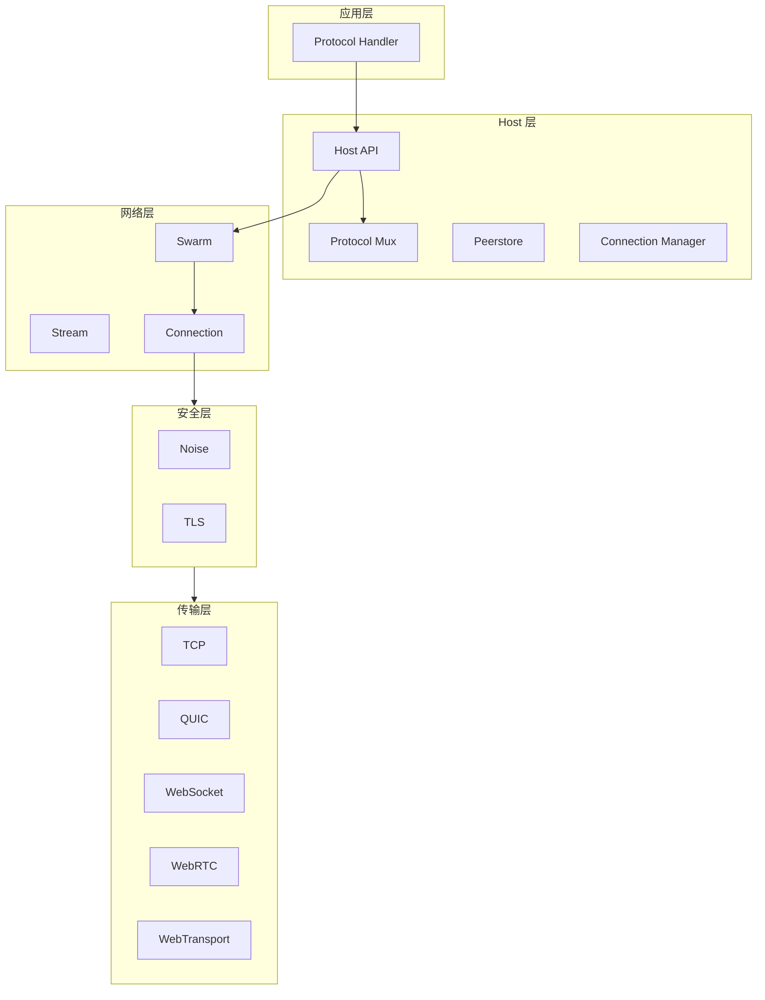
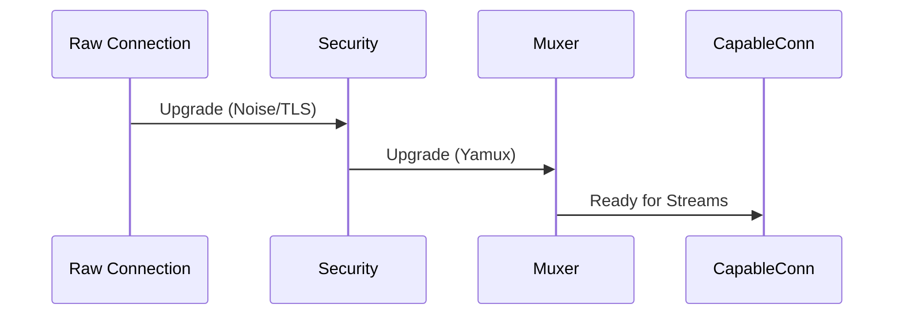
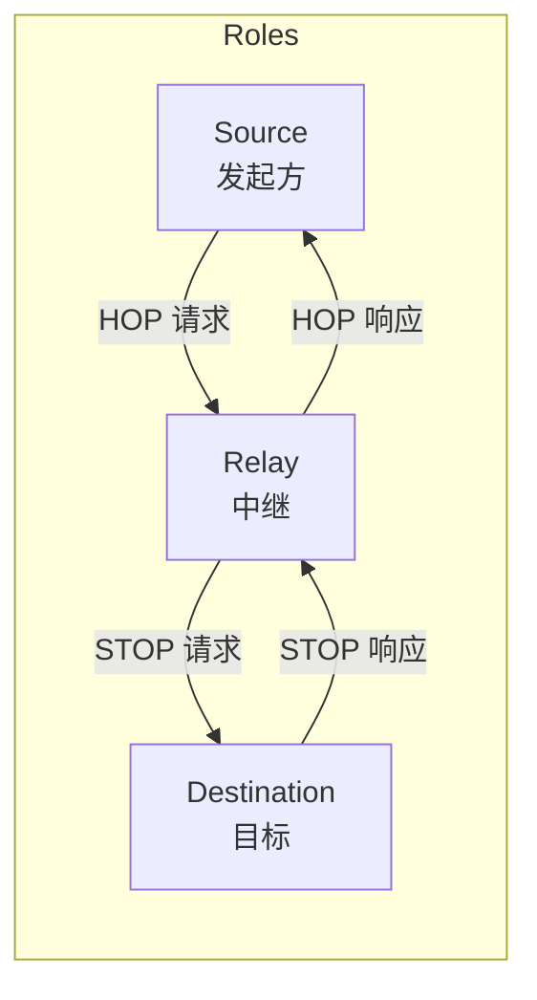
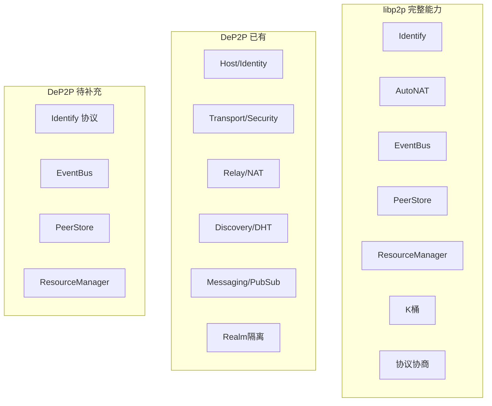

# go-libp2p 深度分析

> **版本**: 基于 go-libp2p-master (2026-01 分析)  
> **语言**: Go  
> **许可**: MIT  
> **仓库**: https://github.com/libp2p/go-libp2p

---

## 1. 项目概述

### 1.1 基本信息

| 属性 | 值 |
|------|-----|
| **组织** | Protocol Labs (IPFS) |
| **定位** | 模块化 P2P 网络协议栈 |
| **核心特性** | 协议抽象、多传输、可插拔安全 |
| **主要语言** | Go |
| **本地路径** | `/Users/qinglong/go/src/chaincodes/p2p/go-libp2p-master` |

### 1.2 核心理念

libp2p 的设计理念：

> **模块化网络协议栈** - 干净地分离关注点，让应用只使用需要的协议

libp2p 从 IPFS 项目中提取出来，成为独立的 P2P 网络库，被众多知名项目使用。

### 1.3 知名用户

| 项目 | 领域 | 说明 |
|------|------|------|
| **Kubo** | IPFS | IPFS 的 Go 实现 |
| **Filecoin/Lotus** | 区块链 | 去中心化存储 |
| **Ethereum/Prysm** | 区块链 | Beacon Chain 客户端 |
| **Polygon Edge** | 区块链 | 以太坊兼容网络 |
| **Celestia** | 区块链 | 数据可用性层 |

---

## 2. 架构分析

### 2.1 整体架构



### 2.2 技术层次架构（按协议栈分层）

go-libp2p 采用**技术层次架构**，按照网络协议栈的自然层次划分：

```
┌─────────────────────────────────────────────────────────────┐
│                      p2p/ 目录结构                           │
├─────────────────────────────────────────────────────────────┤
│                                                             │
│  ┌─────────────────────────────────────────────────────┐   │
│  │ protocol/     协议层                                  │   │
│  │   identify/  ping/  circuitv2/  holepunch/  autonat/ │   │
│  └─────────────────────────────────────────────────────┘   │
│                                                             │
│  ┌─────────────────────────────────────────────────────┐   │
│  │ host/        主机层                                   │   │
│  │   basic/  autonat/  autorelay/  peerstore/           │   │
│  │   eventbus/  resource-manager/  routed/               │   │
│  └─────────────────────────────────────────────────────┘   │
│                                                             │
│  ┌─────────────────────────────────────────────────────┐   │
│  │ net/         网络层                                   │   │
│  │   swarm/  connmgr/  nat/  upgrader/  conngater/       │   │
│  └─────────────────────────────────────────────────────┘   │
│                                                             │
│  ┌─────────────────────────────────────────────────────┐   │
│  │ muxer/       多路复用层                               │   │
│  │   yamux/                                              │   │
│  └─────────────────────────────────────────────────────┘   │
│                                                             │
│  ┌─────────────────────────────────────────────────────┐   │
│  │ security/    安全层                                   │   │
│  │   noise/  tls/  insecure/                            │   │
│  └─────────────────────────────────────────────────────┘   │
│                                                             │
│  ┌─────────────────────────────────────────────────────┐   │
│  │ transport/   传输层                                   │   │
│  │   tcp/  quic/  websocket/  webrtc/  webtransport/    │   │
│  └─────────────────────────────────────────────────────┘   │
│                                                             │
│  ┌─────────────────────────────────────────────────────┐   │
│  │ discovery/   发现（辅助服务）                         │   │
│  │   mdns/  routing/  backoff/                           │   │
│  └─────────────────────────────────────────────────────┘   │
│                                                             │
└─────────────────────────────────────────────────────────────┘
```

**核心特点：**

| 特点 | 说明 |
|------|------|
| **按网络协议栈分层** | 从底层传输 → 安全 → 复用 → 网络 → 主机 → 协议 |
| **无"业务域"概念** | 只有技术关注点，不包含业务逻辑 |
| **发现作为辅助服务** | 不是独立的"域"，而是支撑功能 |
| **可插拔组件** | 每层都可以替换不同实现 |

### 2.3 核心模块

| 模块 | 路径 | 职责 |
|------|------|------|
| **core** | `core/` | 核心接口定义 |
| **host** | `core/host/` | Host 接口 |
| **network** | `core/network/` | 网络抽象 |
| **transport** | `core/transport/` | 传输接口 |
| **crypto** | `core/crypto/` | 密码学原语 |
| **peer** | `core/peer/` | Peer 标识 |
| **protocol** | `core/protocol/` | 协议 ID |
| **discovery** | `core/discovery/` | 发现接口 |
| **peerstore** | `core/peerstore/` | Peer 存储 |
| **sec** | `core/sec/` | 安全传输 |

### 2.4 代码组织

```
go-libp2p/
├── core/                          # 核心接口（抽象层）
│   ├── host/                      # Host 接口
│   ├── network/                   # Network/Swarm 接口
│   ├── transport/                 # Transport 接口
│   ├── crypto/                    # 密码学
│   ├── peer/                      # Peer ID
│   ├── protocol/                  # Protocol ID
│   ├── discovery/                 # 发现接口
│   ├── peerstore/                 # Peer 存储接口
│   ├── sec/                       # 安全接口
│   └── connmgr/                   # 连接管理接口
│
└── p2p/                           # 具体实现
    ├── host/                      # Host 实现
    │   ├── basic/                 # BasicHost
    │   ├── autonat/               # AutoNAT 服务
    │   ├── autorelay/             # 自动 Relay
    │   └── peerstore/             # Peerstore 实现
    ├── net/                       # 网络实现
    │   ├── swarm/                 # Swarm 实现
    │   ├── connmgr/               # 连接管理
    │   ├── nat/                   # NAT 管理
    │   └── upgrader/              # 连接升级
    ├── transport/                 # 传输实现
    │   ├── tcp/                   # TCP
    │   ├── quic/                  # QUIC
    │   ├── websocket/             # WebSocket
    │   ├── webrtc/                # WebRTC
    │   └── webtransport/          # WebTransport
    ├── security/                  # 安全实现
    │   ├── noise/                 # Noise 协议
    │   └── tls/                   # TLS
    ├── muxer/                     # 多路复用
    │   └── yamux/                 # Yamux
    ├── protocol/                  # 协议实现
    │   └── circuitv2/             # Relay v2
    └── discovery/                 # 发现实现
        ├── mdns/                  # mDNS
        ├── routing/               # DHT 路由
        └── backoff/               # 退避策略
```

---

## 3. 身份设计

### 3.1 Peer ID

```go
// core/peer/peer.go

// ID 是 libp2p 的 peer 标识
// Peer ID 通过对 peer 公钥进行哈希并编码为 multihash 得到
type ID string

// IDFromPublicKey 从公钥生成 Peer ID
func IDFromPublicKey(pk ic.PubKey) (ID, error) {
    b, err := ic.MarshalPublicKey(pk)
    if err != nil {
        return "", err
    }
    var alg uint64 = mh.SHA2_256
    // 对于短密钥（<=42字节），可以直接嵌入
    if AdvancedEnableInlining && len(b) <= maxInlineKeyLength {
        alg = mh.IDENTITY
    }
    hash, _ := mh.Sum(b, alg, -1)
    return ID(hash), nil
}
```

### 3.2 密钥类型

```go
// core/crypto/key.go

// 支持的密钥类型
const (
    RSA = iota
    Ed25519
    Secp256k1
    ECDSA
)
```

| 密钥类型 | 说明 | 使用场景 |
|----------|------|----------|
| **Ed25519** | 默认推荐 | 大多数场景 |
| **RSA** | 传统兼容 | 需要 RSA 时 |
| **Secp256k1** | 区块链兼容 | 与以太坊等兼容 |
| **ECDSA** | 通用 | 特定需求 |

### 3.3 对 DeP2P 的启示

| 对比 | go-libp2p | DeP2P |
|------|-----------|-------|
| NodeID 格式 | Multihash(PublicKey) | SHA256(PublicKey) |
| 密钥嵌入 | 短密钥可嵌入 ID | 不嵌入 |
| 多密钥支持 | 支持多种 | 仅 Ed25519 |

---

## 4. 传输层设计

### 4.1 Transport 接口

```go
// core/transport/transport.go

// Transport 表示可以连接和接受其他 peer 连接的任何设备
type Transport interface {
    // Dial 拨号远程 peer
    Dial(ctx context.Context, raddr ma.Multiaddr, p peer.ID) (CapableConn, error)
    
    // CanDial 返回是否知道如何拨号给定的 multiaddr
    CanDial(addr ma.Multiaddr) bool
    
    // Listen 在给定的 multiaddr 上监听
    Listen(laddr ma.Multiaddr) (Listener, error)
    
    // Protocols 返回此传输处理的协议集
    Protocols() []int
    
    // Proxy 返回是否为代理传输
    Proxy() bool
}
```

### 4.2 支持的传输

| 传输 | 路径 | 说明 |
|------|------|------|
| **TCP** | `p2p/transport/tcp/` | 传统 TCP |
| **QUIC** | `p2p/transport/quic/` | 基于 QUIC |
| **WebSocket** | `p2p/transport/websocket/` | WebSocket |
| **WebRTC** | `p2p/transport/webrtc/` | 浏览器兼容 |
| **WebTransport** | `p2p/transport/webtransport/` | HTTP/3 |

### 4.3 Multiaddr

libp2p 使用 Multiaddr 统一地址格式：

```
/ip4/127.0.0.1/tcp/4001
/ip4/192.168.1.1/udp/4001/quic-v1
/dns4/relay.example.com/tcp/443/wss
/p2p/QmPeer.../p2p-circuit/p2p/QmTarget...
```

### 4.4 连接升级



---

## 5. Relay 设计 (Circuit Relay v2)

### 5.1 协议标识

```go
// p2p/protocol/circuitv2/proto/protocol.go

const (
    ProtoIDv2Hop  = "/libp2p/circuit/relay/0.2.0/hop"
    ProtoIDv2Stop = "/libp2p/circuit/relay/0.2.0/stop"
)
```

### 5.2 Relay 角色



### 5.3 Relay 模块结构

```
p2p/protocol/circuitv2/
├── client/               # 客户端（作为 Source 或 Destination）
│   ├── client.go         # 客户端实现
│   ├── transport.go      # 作为 Transport
│   ├── dial.go           # 拨号逻辑
│   ├── listen.go         # 监听逻辑
│   └── reservation.go    # 预约机制
├── relay/                # 服务端（作为 Relay）
│   ├── relay.go          # Relay 服务
│   ├── options.go        # 配置选项
│   ├── resources.go      # 资源限制
│   ├── constraints.go    # 约束检查
│   └── acl.go            # 访问控制
└── proto/                # 协议定义
    └── protocol.go       # 协议 ID
```

### 5.4 Relay 地址

Circuit Relay v2 使用特殊的地址格式：

```
/p2p/{relay-peer-id}/p2p-circuit/p2p/{target-peer-id}
```

### 5.5 资源限制

```go
// p2p/protocol/circuitv2/relay/resources.go

// 默认资源限制
var DefaultResources = Resources{
    Limit:             DefaultLimit,
    ReservationTTL:    time.Hour,
    MaxReservations:   128,
    MaxCircuits:       16,
    BufferSize:        2048,
    MaxReservationsPerPeer: 4,
    MaxReservationsPerIP:   8,
}
```

---

## 6. 节点发现

### 6.1 Discovery 接口

```go
// core/discovery/discovery.go

// Advertiser 广告服务
type Advertiser interface {
    Advertise(ctx context.Context, ns string, opts ...Option) (time.Duration, error)
}

// Discoverer 发现 peer
type Discoverer interface {
    FindPeers(ctx context.Context, ns string, opts ...Option) (<-chan peer.AddrInfo, error)
}

// Discovery 组合接口
type Discovery interface {
    Advertiser
    Discoverer
}
```

### 6.2 发现实现

| 实现 | 路径 | 说明 |
|------|------|------|
| **mDNS** | `p2p/discovery/mdns/` | 本地网络发现 |
| **DHT Routing** | `p2p/discovery/routing/` | 基于 DHT 的发现 |
| **Backoff** | `p2p/discovery/backoff/` | 退避策略封装 |

### 6.3 基于命名空间

libp2p 的发现机制基于 **命名空间 (namespace)**：

- 广告时指定服务命名空间
- 发现时查询相同命名空间
- 类似于服务注册/发现模式

---

## 7. 安全层

### 7.1 SecureTransport 接口

```go
// core/sec/security.go

// SecureTransport 将不安全连接转换为安全连接
type SecureTransport interface {
    // SecureInbound 保护入站连接
    SecureInbound(ctx context.Context, insecure net.Conn, p peer.ID) (SecureConn, error)
    
    // SecureOutbound 保护出站连接
    SecureOutbound(ctx context.Context, insecure net.Conn, p peer.ID) (SecureConn, error)
    
    // ID 返回安全协议的协议 ID
    ID() protocol.ID
}
```

### 7.2 安全实现

| 实现 | 协议 ID | 说明 |
|------|---------|------|
| **Noise** | `/noise` | 推荐使用 |
| **TLS** | `/tls/1.0.0` | TLS 1.3 |

### 7.3 Noise 协议

```go
// p2p/security/noise/transport.go

// Noise 使用 XX 握手模式
// 双方互相认证，不需要预先共享密钥
```

---

## 8. 核心接口设计

### 8.1 Host 接口

```go
// core/host/host.go

type Host interface {
    // ID 返回本地 peer ID
    ID() peer.ID
    
    // Peerstore 返回 Peer 地址和密钥仓库
    Peerstore() peerstore.Peerstore
    
    // Addrs 返回监听地址
    Addrs() []ma.Multiaddr
    
    // Network 返回 Network 接口
    Network() network.Network
    
    // Mux 返回协议多路复用器
    Mux() protocol.Switch
    
    // Connect 连接到 peer
    Connect(ctx context.Context, pi peer.AddrInfo) error
    
    // SetStreamHandler 设置协议处理器
    SetStreamHandler(pid protocol.ID, handler network.StreamHandler)
    
    // NewStream 打开新流
    NewStream(ctx context.Context, p peer.ID, pids ...protocol.ID) (network.Stream, error)
    
    // ConnManager 返回连接管理器
    ConnManager() connmgr.ConnManager
    
    // EventBus 返回事件总线
    EventBus() event.Bus
}
```

### 8.2 Network 接口

```go
// core/network/network.go

type Network interface {
    Dialer
    io.Closer
    
    // SetStreamHandler 设置新流处理器
    SetStreamHandler(StreamHandler)
    
    // NewStream 创建新流
    NewStream(context.Context, peer.ID) (Stream, error)
    
    // Listen 开始监听
    Listen(...ma.Multiaddr) error
    
    // ListenAddresses 返回监听地址
    ListenAddresses() []ma.Multiaddr
    
    // ResourceManager 返回资源管理器
    ResourceManager() ResourceManager
}
```

### 8.3 Stream 和 Connection

```go
// Stream 是 peer 之间的双向通道
type Stream interface {
    io.Reader
    io.Writer
    io.Closer
    
    // Protocol 返回流使用的协议
    Protocol() protocol.ID
    
    // Conn 返回关联的连接
    Conn() Conn
}

// Conn 是两个 peer 之间的连接
type Conn interface {
    // NewStream 在连接上打开新流
    NewStream(context.Context) (Stream, error)
    
    // GetStreams 返回所有流
    GetStreams() []Stream
    
    // LocalPeer/RemotePeer 返回本地/远程 peer
    LocalPeer() peer.ID
    RemotePeer() peer.ID
}
```

---

## 9. 协议抽象

### 9.1 Protocol ID

```go
// core/protocol/id.go

// ID 是用于在流中写入协议头的标识符
type ID string

// 示例协议 ID
// "/ipfs/ping/1.0.0"
// "/ipfs/id/1.0.0"
// "/libp2p/circuit/relay/0.2.0/hop"
```

### 9.2 协议协商

libp2p 使用 **multistream-select** 进行协议协商：

1. 发起方发送支持的协议列表
2. 响应方选择一个协议
3. 双方使用选定的协议通信

### 9.3 StreamHandler

```go
// 协议处理器模式
host.SetStreamHandler("/myapp/1.0.0", func(s network.Stream) {
    // 处理流
    defer s.Close()
    // ...
})
```

---

## 10. 对 DeP2P 的启示

### 10.1 可借鉴点

| 方面 | libp2p 设计 | 借鉴价值 |
|------|-------------|----------|
| **模块化** | 清晰的接口分离 | ⭐⭐⭐ 高 |
| **协议抽象** | Protocol ID + StreamHandler | ⭐⭐⭐ 高 |
| **多传输** | 可插拔的 Transport | ⭐⭐⭐ 高 |
| **Multiaddr** | 统一地址格式 | ⭐⭐ 中 |
| **Peerstore** | Peer 信息存储 | ⭐⭐ 中 |
| **EventBus** | 事件驱动 | ⭐⭐ 中 |

### 10.2 主要差异

| 方面 | go-libp2p | DeP2P |
|------|-----------|-------|
| **语言** | Go | Go |
| **成熟度** | 非常成熟 | 新项目 |
| **复杂度** | 较高 | 力求简洁 |
| **Relay 分层** | 单层 | System + Realm |
| **域隔离** | 无原生支持 | Realm + PSK |

### 10.3 设计启示

1. **接口优先**：先定义清晰的接口，再实现
2. **可插拔设计**：Transport、Security、Discovery 都应可替换
3. **协议版本化**：使用语义化的协议 ID
4. **资源管理**：内置资源管理器（ResourceManager）

### 10.4 相关决策

- **ADR-0001**: Identity First - 参考 libp2p 的 Peer ID 设计
- **ADR-0002**: Realm 隔离 - DeP2P 独有创新

---

## 11. libp2p 生态完整能力

### 11.1 go-libp2p-master 内置能力

| 类别 | 模块 | 说明 |
|------|------|------|
| **协议层** | `p2p/protocol/identify/` | 身份识别，交换密钥和地址 |
| | `p2p/protocol/ping/` | Ping/Pong 存活检测 |
| | `p2p/protocol/circuitv2/` | 中继协议 v2 |
| | `p2p/protocol/holepunch/` | 打洞协调协议 |
| | `p2p/protocol/autonatv2/` | NAT 自动检测 v2 |
| **主机层** | `p2p/host/basic/` | 基础主机 |
| | `p2p/host/autonat/` | NAT 检测服务 |
| | `p2p/host/autorelay/` | 自动中继 |
| | `p2p/host/eventbus/` | 事件总线 |
| | `p2p/host/peerstore/` | 节点信息存储 |
| | `p2p/host/resource-manager/` | 资源管理器 |
| **网络层** | `p2p/net/swarm/` | 连接群管理 |
| | `p2p/net/connmgr/` | 连接管理器 |
| | `p2p/net/pnet/` | 私有网络 (PSK) |
| | `p2p/net/nat/` | NAT 穿透 |
| **发现** | `p2p/discovery/mdns/` | mDNS 局域网发现 |
| | `p2p/discovery/routing/` | 路由发现 |

### 11.2 libp2p 独立包（不在 go-libp2p 主包中）

| 包名 | 说明 | 重要程度 |
|------|------|----------|
| **go-libp2p-kad-dht** | Kademlia DHT 实现 | ⭐⭐⭐ 核心 |
| **go-libp2p-pubsub** | PubSub/GossipSub | ⭐⭐⭐ 核心 |
| **go-libp2p-kbucket** | K桶（DHT 路由表） | ⭐⭐ 重要 |
| **go-libp2p-consensus** | 共识 | ⭐ 扩展 |
| **go-libp2p-gostream** | Go 流封装 | ⭐ 扩展 |
| **go-libp2p-http** | HTTP over libp2p | ⭐ 扩展 |

### 11.3 libp2p 规范定义的完整协议栈

```
┌─────────────────────────────────────────────────────────────────────────────┐
│                         libp2p 完整协议栈 (规范定义)                          │
├─────────────────────────────────────────────────────────────────────────────┤
│                                                                             │
│  ┌─────────────────────────────────────────────────────────────────────┐   │
│  │ 应用协议                                                             │   │
│  │   pubsub/gossipsub (发布订阅)    fetch (数据获取)                    │   │
│  └─────────────────────────────────────────────────────────────────────┘   │
│                                                                             │
│  ┌─────────────────────────────────────────────────────────────────────┐   │
│  │ 系统协议                                                             │   │
│  │   identify (身份识别)    ping (存活)    autonat (NAT检测)            │   │
│  │   relay/circuit (中继)   holepunch (打洞)                            │   │
│  └─────────────────────────────────────────────────────────────────────┘   │
│                                                                             │
│  ┌─────────────────────────────────────────────────────────────────────┐   │
│  │ 发现协议                                                             │   │
│  │   kad-dht (Kademlia DHT)    mdns (局域网)    rendezvous (命名空间)   │   │
│  │   bootstrap (引导)                                                   │   │
│  └─────────────────────────────────────────────────────────────────────┘   │
│                                                                             │
│  ┌─────────────────────────────────────────────────────────────────────┐   │
│  │ 隔离层                                                               │   │
│  │   pnet (私有网络 PSK)                                                │   │
│  └─────────────────────────────────────────────────────────────────────┘   │
│                                                                             │
│  ┌─────────────────────────────────────────────────────────────────────┐   │
│  │ 连接层                                                               │   │
│  │   connections (连接升级)    multistream (协议协商)                   │   │
│  └─────────────────────────────────────────────────────────────────────┘   │
│                                                                             │
│  ┌─────────────────────────────────────────────────────────────────────┐   │
│  │ 多路复用                                                             │   │
│  │   yamux    mplex                                                     │   │
│  └─────────────────────────────────────────────────────────────────────┘   │
│                                                                             │
│  ┌─────────────────────────────────────────────────────────────────────┐   │
│  │ 安全层                                                               │   │
│  │   tls    noise    secio (已弃用)                                     │   │
│  └─────────────────────────────────────────────────────────────────────┘   │
│                                                                             │
│  ┌─────────────────────────────────────────────────────────────────────┐   │
│  │ 传输层                                                               │   │
│  │   tcp    quic    websocket    webrtc    webtransport                │   │
│  └─────────────────────────────────────────────────────────────────────┘   │
│                                                                             │
│  ┌─────────────────────────────────────────────────────────────────────┐   │
│  │ 寻址                                                                 │   │
│  │   multiaddr    peer-ids                                              │   │
│  └─────────────────────────────────────────────────────────────────────┘   │
│                                                                             │
└─────────────────────────────────────────────────────────────────────────────┘
```

---

## 12. DeP2P 能力对照

### 12.1 DeP2P 已有能力

| DeP2P 模块 | 对标 libp2p | 说明 |
|------------|-------------|------|
| Messaging | 自定义 | libp2p 无直接对应，DeP2P 特有 |
| PubSub | go-libp2p-pubsub | 发布订阅 |
| Streams | 流管理 | 类似 libp2p Stream |
| Liveness | protocol/ping | 存活检测 |
| Realm | 增强版 pnet | 应用级隔离（PSK） |
| Host | host/basic | 基础主机 |
| Identity | peer-ids | 节点身份 |
| Transport | transport/ | 传输层 |
| Security | security/tls, security/noise | 安全传输 |
| Muxer | muxer/yamux | 多路复用 |
| ConnMgr | net/connmgr | 连接管理 |
| Relay | protocol/circuitv2 | 中继服务 |
| NAT | net/nat + protocol/holepunch | NAT 穿透 |
| DHT | go-libp2p-kad-dht | 分布式哈希表 |
| Bootstrap | discovery/routing | 引导发现 |
| mDNS | discovery/mdns | 局域网发现 |
| Rendezvous | rendezvous | 命名空间发现 |

### 12.2 可能遗漏的能力

| 能力 | libp2p 位置 | 建议 |
|------|-------------|------|
| **Identify 协议** | `protocol/identify/` | 应在核心层添加，用于交换密钥和地址 |
| **AutoNAT** | `protocol/autonatv2/` | 判断是否在 NAT 后，应在 NAT 模块中 |
| **EventBus** | `host/eventbus/` | 事件驱动架构，应在核心层添加 |
| **PeerStore** | `host/peerstore/` | 节点信息持久化，应在核心层添加 |
| **ResourceManager** | `host/resource-manager/` | 资源限制，应在核心层添加 |
| **K桶** | `go-libp2p-kbucket` | DHT 路由表数据结构，DHT 内部依赖 |
| **协议协商** | `multistream` | 多协议协商机制 |

### 12.3 能力覆盖分析



---

## 13. 总结

go-libp2p 是最成熟的 P2P 网络库之一：

1. **高度模块化**：清晰的分层和接口设计
2. **协议抽象**：Protocol ID + StreamHandler 模式
3. **多传输支持**：TCP、QUIC、WebSocket、WebRTC 等
4. **丰富生态**：DHT、PubSub、Relay 等完整协议栈
5. **广泛使用**：IPFS、Filecoin、以太坊等重要项目

DeP2P 可以借鉴 libp2p 的模块化设计和协议抽象，同时简化复杂度，增加 Realm 隔离等特性。

---

**分析日期**：2026-01-11  
**分析版本**：go-libp2p-master (latest)
