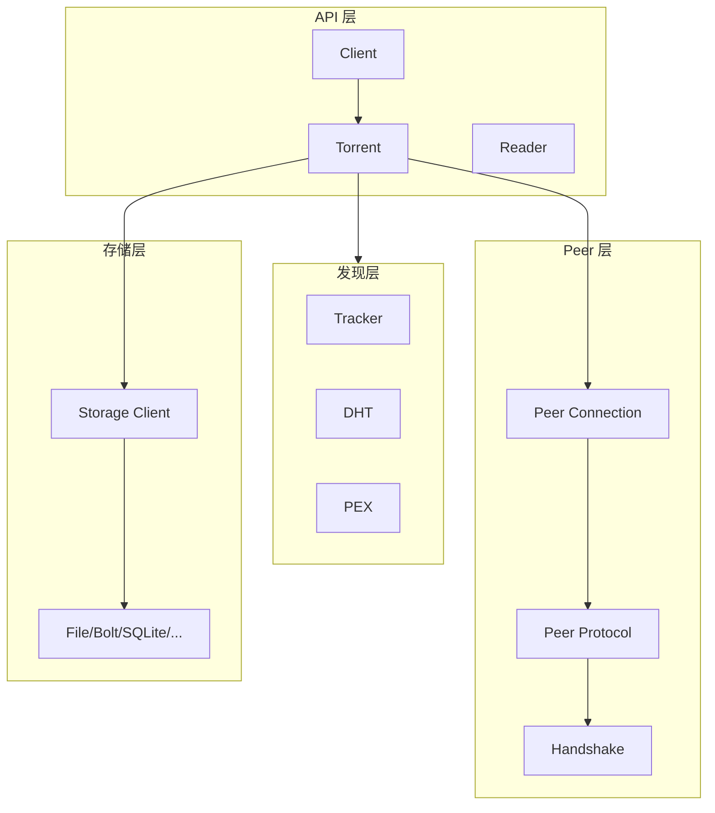
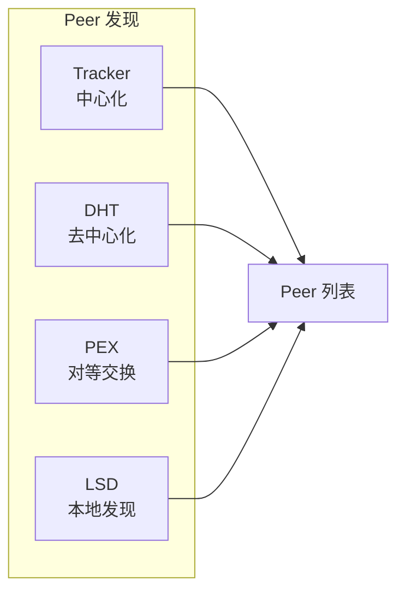

# anacrolix/torrent 深度分析

> **版本**: 基于 torrent-master (2026-01 分析)  
> **语言**: Go  
> **许可**: MIT  
> **仓库**: https://github.com/anacrolix/torrent

---

## 1. 项目概述

### 1.1 基本信息

| 属性 | 值 |
|------|-----|
| **作者** | @anacrolix |
| **定位** | BitTorrent 协议库与工具 |
| **核心特性** | DHT、Tracker、流式传输 |
| **主要语言** | Go |
| **本地路径** | `/Users/qinglong/go/src/chaincodes/p2p/torrent-master` |

### 1.2 核心理念

anacrolix/torrent 的设计理念：

> **作为库使用的 BitTorrent 实现** - 支持流式传输、边下边播

自 2014 年起在生产环境 24/7 运行，专注于探索 Go 的并发能力。

### 1.3 支持的特性

| 特性 | 说明 |
|------|------|
| **协议加密** | MSE (Message Stream Encryption) |
| **DHT** | BEP 5 分布式哈希表 |
| **PEX** | Peer Exchange 对等交换 |
| **uTP** | μTorrent Transport Protocol |
| **多种存储后端** | blob、file、bolt、mmap、sqlite |
| **流式传输** | 支持 seeking、readahead |
| **WebTorrent** | 浏览器兼容 |

### 1.4 知名用户

| 项目 | 说明 |
|------|------|
| **Erigon** | 以太坊执行层实现 |
| **Gopeed** | 高速下载器 |
| **exatorrent** | 自托管 torrent 客户端 |
| **bitmagnet** | BitTorrent 索引器 |
| **TorrServer** | Torrent 流服务器 |

---

## 2. 架构分析

### 2.1 整体架构



### 2.2 扁平模块化架构

torrent 采用**扁平模块化架构**，围绕 BitTorrent 协议需求组织：

```
┌─────────────────────────────────────────────────────────────┐
│                      torrent 架构                            │
├─────────────────────────────────────────────────────────────┤
│                                                             │
│  ┌─────────────────────────────────────────────────────┐   │
│  │ Client (client.go)                                    │   │
│  │        ↓ 聚合所有功能                                  │   │
│  └─────────────────────────────────────────────────────┘   │
│                                                             │
│  ┌──────────┬──────────┬──────────┬──────────┬─────────┐   │
│  │ torrent/ │ peer     │ tracker/ │ storage/ │ metainfo│   │
│  │ 种子管理 │ 对等连接  │ 追踪器   │ 存储后端 │  元信息  │   │
│  └──────────┴──────────┴──────────┴──────────┴─────────┘   │
│                                                             │
│  ┌──────────┬──────────┬──────────┬──────────┐             │
│  │   dht    │ peer_    │webtorrent│ bencode  │             │
│  │  DHT发现 │ protocol │ WebRTC   │  编解码  │             │
│  └──────────┴──────────┴──────────┴──────────┘             │
│                                                             │
└─────────────────────────────────────────────────────────────┘
```

**核心特点：**

| 特点 | 说明 |
|------|------|
| **扁平结构** | 没有明确的层次划分，模块平铺 |
| **功能导向** | 按 BitTorrent 协议需求组织模块 |
| **Client 聚合** | 单一 Client 对象聚合所有功能 |
| **协议专注** | 专为 BitTorrent 设计，非通用 P2P 框架 |

### 2.3 代码组织

```
torrent/
├── client.go                 # Client 主入口
├── config.go                 # 配置
├── torrent.go               # Torrent 类型（内部）
├── spec.go                  # TorrentSpec（创建 torrent 的规格）
├── handshake.go             # 握手逻辑
├── peerconn.go              # Peer 连接
├── peer-impl.go             # Peer 实现
│
├── peer_protocol/           # BitTorrent 对等协议
│   ├── handshake.go         # 握手协议
│   ├── msg.go               # 消息定义
│   └── decoder.go           # 消息解码
│
├── tracker/                 # Tracker 客户端
│   ├── tracker.go           # Tracker 接口
│   ├── http/                # HTTP Tracker
│   └── udp/                 # UDP Tracker
│
├── metainfo/                # .torrent 文件解析
│   ├── metainfo.go          # MetaInfo 结构
│   ├── info.go              # Info 字典
│   └── magnet.go            # Magnet 链接
│
├── storage/                 # 存储后端
│   ├── file.go              # 文件存储
│   ├── bolt.go              # BoltDB 存储
│   ├── sqlite.go            # SQLite 存储
│   └── mmap.go              # 内存映射
│
├── types/                   # 核心类型
│   ├── infohash/            # InfoHash (SHA-1)
│   ├── infohash-v2/         # InfoHash v2 (SHA-256)
│   └── peerid.go            # Peer ID
│
├── webtorrent/              # WebTorrent 支持
├── webseed/                 # WebSeed 支持
└── bencode/                 # Bencode 编解码
```

---

## 3. 身份设计

### 3.1 InfoHash

```go
// types/infohash/infohash.go

const Size = 20  // 20 字节

// 20-byte SHA1 hash used for info and pieces
type T [Size]byte

// HashBytes 计算数据的 SHA-1 哈希
func HashBytes(b []byte) (ret T) {
    hasher := sha1.New()
    hasher.Write(b)
    copy(ret[:], hasher.Sum(nil))
    return
}

// v2 使用 SHA-256（截断为 20 字节）
func HashBytesV2(b []byte) (ret T) {
    hasher := sha256.New()
    hasher.Write(b)
    copy(ret[:], hasher.Sum(nil))
    return
}
```

### 3.2 Peer ID

```go
// types/peerid.go

// Peer ID 是 20 字节的标识符
// 通常包含客户端标识和随机部分
// 例如：-TR2940-xxxxxxxxxxxx (Transmission)
type PeerID [20]byte
```

### 3.3 标识对比

| 标识 | 格式 | 用途 |
|------|------|------|
| **InfoHash** | SHA-1(info dict) | 唯一标识 torrent |
| **Peer ID** | 20 字节 | 标识客户端实例 |

---

## 4. Peer 发现

### 4.1 发现机制

BitTorrent 支持多种 peer 发现方式：



### 4.2 Tracker 协议

```go
// tracker/tracker.go

type AnnounceRequest struct {
    InfoHash   [20]byte
    PeerId     [20]byte
    Downloaded int64
    Left       int64
    Uploaded   int64
    Event      AnnounceEvent  // started/stopped/completed
    IPAddress  uint32
    Key        uint32
    NumWant    int32
    Port       uint16
}

type AnnounceResponse struct {
    Interval int32      // 下次 announce 间隔
    Leechers int32      // 下载者数量
    Seeders  int32      // 做种者数量
    Peers    []Peer     // Peer 列表
}
```

### 4.3 Tracker 类型

| 类型 | 协议 | 说明 |
|------|------|------|
| **HTTP** | `http://` | 传统 HTTP 请求 |
| **HTTPS** | `https://` | 加密 HTTP |
| **UDP** | `udp://` | 更高效，BEP 15 |
| **WebSocket** | `wss://` | WebTorrent 使用 |

### 4.4 DHT (BEP 5)

DHT 是独立的库 `github.com/anacrolix/dht`：

```go
// 使用 DHT
import "github.com/anacrolix/dht/v2"

// DHT 节点
type Server struct {
    // 路由表
    table *routingTable
    // 节点 ID
    id  krpc.ID
    // ...
}

// Kademlia 距离
func distance(a, b krpc.ID) *big.Int {
    return xor(a, b)
}
```

#### DHT 操作

| 操作 | 说明 |
|------|------|
| **ping** | 测试节点存活 |
| **find_node** | 查找节点 |
| **get_peers** | 获取 infohash 的 peers |
| **announce_peer** | 宣布自己有某个 infohash |

### 4.5 PEX (Peer Exchange)

```go
// BEP 11 - Peer Exchange
// 通过 LTEP (BEP 10) 扩展协议实现

// 扩展位
const (
    ExtensionBitLtep = 20  // LibTorrent Extension Protocol
)
```

节点间直接交换已知的其他节点信息。

---

## 5. 协议设计

### 5.1 握手协议

```go
// peer_protocol/handshake.go

// 扩展位定义
const (
    ExtensionBitDht  = 0   // BEP 5: DHT
    ExtensionBitFast = 2   // BEP 6: Fast Extension
    ExtensionBitV2Upgrade = 4  // BEP 52: v2 升级
    ExtensionBitLtep = 20  // BEP 10: Extension Protocol
    // ...
)

// 握手格式（68 字节）
// 1 字节: pstrlen = 19
// 19 字节: pstr = "BitTorrent protocol"
// 8 字节: reserved (扩展位)
// 20 字节: info_hash
// 20 字节: peer_id
```

### 5.2 消息类型

```go
// peer_protocol/msg.go

const (
    Choke         = 0   // 阻塞
    Unchoke       = 1   // 取消阻塞
    Interested    = 2   // 感兴趣
    NotInterested = 3   // 不感兴趣
    Have          = 4   // 拥有某块
    Bitfield      = 5   // 位图
    Request       = 6   // 请求块
    Piece         = 7   // 数据块
    Cancel        = 8   // 取消请求
    Port          = 9   // DHT 端口（BEP 5）
    // Fast Extension (BEP 6)
    Suggest       = 0x0d
    HaveAll       = 0x0e
    HaveNone      = 0x0f
    Reject        = 0x10
    AllowedFast   = 0x11
    // Extension (BEP 10)
    Extended      = 0x14
)
```

### 5.3 协议加密 (MSE)

```go
// mse/mse.go
// Message Stream Encryption

// 加密握手后的连接，防止 ISP 识别
```

---

## 6. 存储后端

### 6.1 Storage 接口

```go
// storage/interface.go

type ClientImpl interface {
    OpenTorrent(info *metainfo.Info, infoHash metainfo.Hash) (TorrentImpl, error)
    Close() error
}

type TorrentImpl interface {
    Piece(p metainfo.Piece) PieceImpl
    Close() error
}

type PieceImpl interface {
    // 读取 piece 数据
    ReadAt([]byte, int64) (int, error)
    // 写入 piece 数据
    WriteAt([]byte, int64) (int, error)
    // 标记完成
    MarkComplete() error
    // 检查是否完成
    Completion() Completion
}
```

### 6.2 可用后端

| 后端 | 文件 | 说明 |
|------|------|------|
| **File** | `file.go` | 文件系统存储 |
| **Bolt** | `bolt.go` | BoltDB 嵌入式数据库 |
| **SQLite** | `sqlite.go` | SQLite 存储 |
| **Mmap** | `mmap.go` | 内存映射 |
| **Blob** | `blob.go` | 对象存储 |

---

## 7. Client API

### 7.1 创建客户端

```go
import "github.com/anacrolix/torrent"

// 创建客户端
client, _ := torrent.NewClient(nil)
defer client.Close()

// 添加 torrent
t, _ := client.AddMagnet("magnet:?xt=urn:btih:...")

// 等待信息
<-t.GotInfo()

// 下载所有文件
t.DownloadAll()

// 等待完成
client.WaitAll()
```

### 7.2 流式读取

```go
// 获取 Reader（支持 seeking）
reader := t.NewReader()
defer reader.Close()

// 设置 readahead
reader.SetReadahead(5 * 1024 * 1024)  // 5MB

// 像普通 io.Reader 一样使用
io.Copy(dst, reader)
```

### 7.3 配置选项

```go
type ClientConfig struct {
    // 存储后端
    DefaultStorage storage.ClientImpl
    // 监听地址
    ListenHost func(network string) string
    ListenPort int
    // DHT
    NoDHT bool
    DhtStartingNodes func(network string) dht.StartingNodesGetter
    // 协议加密
    HeaderObfuscationPolicy HeaderObfuscationPolicy
    // ...
}
```

---

## 8. 对 DeP2P 的启示

### 8.1 可借鉴点

| 方面 | torrent 设计 | 借鉴价值 |
|------|--------------|----------|
| **多发现机制** | Tracker + DHT + PEX | ⭐⭐⭐ 高 |
| **存储抽象** | 可插拔的存储后端 | ⭐⭐ 中 |
| **流式接口** | Reader with seek | ⭐⭐ 中 |
| **协议扩展** | LTEP 扩展机制 | ⭐⭐ 中 |
| **DHT 实现** | 成熟的 Kademlia | ⭐⭐⭐ 高 |

### 8.2 主要差异

| 方面 | anacrolix/torrent | DeP2P |
|------|-------------------|-------|
| **应用场景** | 文件共享 | 通用 P2P 网络 |
| **身份模型** | InfoHash + PeerID | NodeID (密钥派生) |
| **安全模型** | 可选加密 | 强制加密 |
| **隔离** | 无 | Realm 隔离 |
| **Relay** | 无原生支持 | 核心特性 |

### 8.3 DHT 启示

anacrolix/dht 是一个成熟的 Kademlia 实现：

1. **路由表维护**：k-bucket 结构
2. **节点查找**：迭代查询最近节点
3. **值存储**：get_peers / announce_peer
4. **引导**：从已知节点开始

DeP2P 可以考虑使用类似机制进行 Realm 内节点发现。

### 8.4 发现机制对比

| 机制 | 优点 | 缺点 |
|------|------|------|
| **Tracker** | 简单可靠 | 中心化 |
| **DHT** | 去中心化 | 延迟较高 |
| **PEX** | 快速扩展 | 需要初始连接 |
| **Rendezvous** | 适合小规模 | 需要服务器 |

---

## 9. 总结

anacrolix/torrent 是一个成熟的 BitTorrent 实现：

1. **功能完整**：DHT、Tracker、PEX、WebTorrent
2. **生产就绪**：自 2014 年在生产环境运行
3. **灵活存储**：支持多种存储后端
4. **流式支持**：边下载边播放
5. **良好抽象**：清晰的接口设计

DeP2P 可以借鉴：
- DHT 实现作为 Realm 内发现机制
- 多发现机制并行（Tracker/DHT/PEX 类似 Relay/Rendezvous/mDNS）
- 存储抽象的设计模式
- 协议扩展机制（类似 LTEP）

---

**分析日期**：2026-01-11  
**分析版本**：torrent-master (latest)
