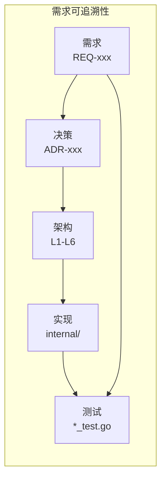
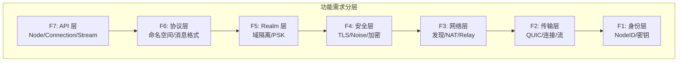
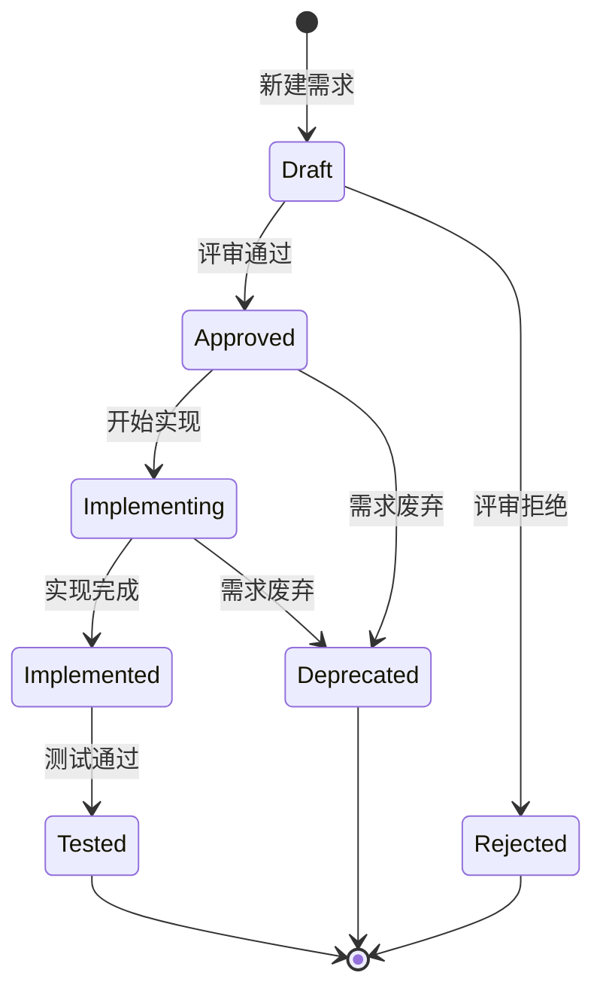

# 需求文档 (Requirements)

> 定义 DeP2P 必须满足的功能和非功能需求，指导重构和能力提升

---

## 1. 概述

本目录包含 DeP2P 项目的完整需求规范，采用**分层分类**的组织方式，确保：

- **可追溯**：从需求到设计到实现到测试有完整的证据链
- **可测试**：每个需求有明确的验收标准
- **可追踪**：唯一编号，可与代码、测试关联



---

## 2. 目录结构

```
requirements/
├── README.md                        # 本文件 - 需求管理规范
├── registry.md                      # 需求注册表（全索引）
│
├── functional/                      # 功能需求
│   ├── README.md                    # 功能需求索引
│   │
│   ├── F1_identity/                 # 身份与认证
│   │   ├── REQ-ID-001.md            # NodeID 设计
│   │   └── REQ-ID-002.md            # 密钥管理
│   │
│   ├── F2_transport/                # 传输层
│   │   ├── REQ-TRANS-001.md         # QUIC 传输
│   │   ├── REQ-TRANS-002.md         # 连接管理
│   │   └── REQ-TRANS-003.md         # 流多路复用
│   │
│   ├── F3_network/                  # 网络层
│   │   ├── REQ-NET-001.md           # 节点发现
│   │   ├── REQ-NET-002.md           # NAT 穿透
│   │   └── REQ-NET-003.md           # Relay 中继
│   │
│   ├── F4_security/                 # 安全层
│   │   ├── REQ-SEC-001.md           # 传输加密
│   │   └── REQ-SEC-002.md           # 身份验证
│   │
│   ├── F5_realm/                    # Realm 域隔离 (DeP2P 特有)
│   │   ├── REQ-REALM-001.md         # Realm 强制隔离
│   │   ├── REQ-REALM-002.md         # Realm PSK 认证
│   │   └── REQ-REALM-003.md         # Relay
│   │
│   ├── F6_protocol/                 # 协议层
│   │   ├── REQ-PROTO-001.md         # 协议命名空间
│   │   ├── REQ-PROTO-002.md         # 消息格式
│   │   └── REQ-PROTO-003.md         # 流式通信
│   │
│   └── F7_api/                      # 接口层
│       ├── REQ-API-001.md           # Node API 设计
│       ├── REQ-API-002.md           # 连接语义
│       └── REQ-API-003.md           # 事件通知
│
└── non_functional/                  # 非功能需求
    ├── README.md                    # 非功能需求索引
    ├── REQ-PERF-001.md              # 性能需求
    ├── REQ-SCALE-001.md             # 可扩展性需求
    ├── REQ-AVAIL-001.md             # 可用性需求
    ├── REQ-OPS-001.md               # 可观测性需求
    └── REQ-COMPAT-001.md            # 兼容性需求
```

---

## 3. 需求分类

### 3.1 功能需求分层

基于 P2P 网络的分层模型，将功能需求分为七个层级：



| 层级 | 名称 | 关注点 | 竞品参考 |
|------|------|--------|----------|
| **F7** | API 层 | Node 入口、连接语义、事件 | iroh Endpoint, libp2p Host |
| **F6** | 协议层 | 协议命名、消息格式、协商 | libp2p multistream |
| **F5** | Realm 层 | 域隔离、PSK 认证、成员管理 | **DeP2P 独有** |
| **F4** | 安全层 | TLS、Noise、加密 | iroh TLS, libp2p Noise |
| **F3** | 网络层 | 发现、NAT、Relay | iroh/libp2p 各有特色 |
| **F2** | 传输层 | QUIC、连接、流 | iroh MagicSock |
| **F1** | 身份层 | NodeID、密钥、证书 | iroh/libp2p Ed25519 |

### 3.2 需求类型

| 类型 | 说明 | 示例 |
|------|------|------|
| `generic` | P2P 通用能力（业界标准） | QUIC 传输、DHT 发现 |
| `dep2p-specific` | DeP2P 独有设计 | Realm 隔离、DHT 权威目录 |

### 3.3 非功能需求

| 类别 | 编号前缀 | 关注点 |
|------|----------|--------|
| **性能** | REQ-PERF | 延迟、吞吐、资源占用 |
| **可扩展性** | REQ-SCALE | 节点数、连接数、消息量 |
| **可用性** | REQ-AVAIL | 故障恢复、优雅降级 |
| **可观测性** | REQ-OPS | 日志、指标、诊断 |
| **兼容性** | REQ-COMPAT | 版本兼容、协议兼容 |

---

## 4. 需求编号体系

### 4.1 编号格式

```
REQ-<类别>-<编号>
```

| 类别 | 层级 | 说明 | 示例 |
|------|------|------|------|
| ID | F1 | 身份相关 | REQ-ID-001 |
| TRANS | F2 | 传输相关 | REQ-TRANS-001 |
| NET | F3 | 网络相关 | REQ-NET-001 |
| SEC | F4 | 安全相关 | REQ-SEC-001 |
| REALM | F5 | Realm 相关 | REQ-REALM-001 |
| PROTO | F6 | 协议相关 | REQ-PROTO-001 |
| API | F7 | 接口相关 | REQ-API-001 |
| PERF | NF | 性能相关 | REQ-PERF-001 |
| SCALE | NF | 扩展性相关 | REQ-SCALE-001 |
| AVAIL | NF | 可用性相关 | REQ-AVAIL-001 |
| OPS | NF | 可观测性相关 | REQ-OPS-001 |

### 4.2 编号规则

- 编号从 001 开始
- 编号递增，不重用
- 废弃的需求保留编号

---

## 5. 需求状态



| 状态 | 说明 | 必填字段 |
|------|------|----------|
| `draft` | 草稿，待评审 | 基本信息 |
| `approved` | 已批准，待实现 | 验收标准 |
| `implementing` | 实现中 | 实现引用 |
| `implemented` | 已实现，待测试 | 代码引用 |
| `tested` | 测试通过 | 测试证据 |
| `deprecated` | 已废弃 | 废弃原因 |
| `rejected` | 评审拒绝 | 拒绝原因 |

---

## 6. 优先级定义

| 优先级 | 说明 | 处理方式 |
|--------|------|----------|
| **P0** | 关键路径 | 必须完成，阻塞核心功能 |
| **P1** | 重要功能 | 应该完成，影响用户体验 |
| **P2** | 增强功能 | 可以推迟，不影响核心功能 |
| **P3** | 可选功能 | 资源充足时考虑 |

---

## 7. 需求模板

创建新需求时，使用以下模板：

```markdown
# REQ-<类别>-<编号>: <标题>

## 1. 元数据

| 属性 | 值 |
|------|---|
| **ID** | REQ-xxx-xxx |
| **标题** | 一句话描述 |
| **类型** | generic / dep2p-specific |
| **层级** | F1-F7 / NF |
| **优先级** | P0 / P1 / P2 / P3 |
| **状态** | draft / approved / ... |
| **创建日期** | YYYY-MM-DD |
| **更新日期** | YYYY-MM-DD |

---

## 2. 需求描述

一句话描述需求的核心内容。

---

## 3. 背景与动机

### 3.1 问题陈述

当前存在什么问题？

### 3.2 目标

解决什么问题？达成什么目标？

### 3.3 竞品参考

| 产品 | 做法 | 启示 |
|------|------|------|
| iroh | ... | ... |
| go-libp2p | ... | ... |

---

## 4. 需求详情

### 4.1 功能要求

1. 要求 1
2. 要求 2

### 4.2 接口定义

```go
// 接口定义
type Interface interface {
    Method() error
}
```

### 4.3 流程说明


### 4.4 错误处理

| 场景 | 错误 | 说明 |
|------|------|------|
| ... | ErrXxx | ... |

---

## 5. 验收标准

- [ ] 标准 1
- [ ] 标准 2
- [ ] 标准 3

---

## 6. 非功能要求

| 维度 | 要求 |
|------|------|
| **性能** | ... |
| **可用性** | ... |

---

## 7. 关联文档

| 类型 | 链接 |
|------|------|
| **决策** | ADR-xxx |
| **架构** | L1-L6 相关文档 |
| **竞品** | references/comparison/... |
| **API** | pkg/xxx |
| **实现** | internal/xxx |
| **测试** | tests/xxx |

---

## 8. 实现追踪

### 8.1 代码引用

| 文件 | 符号 | 状态 |
|------|------|------|
| `pkg/xxx.go` | `Xxx.Method` | ✅ |

### 8.2 测试证据

| 测试文件 | 测试函数 | 状态 |
|----------|----------|------|
| `xxx_test.go` | `TestXxx` | ✅ |

---

## 9. 变更历史

| 日期 | 版本 | 变更说明 |
|------|------|----------|
| YYYY-MM-DD | 1.0 | 初始版本 |
```

---

## 8. 需求来源

### 8.1 竞品分析驱动

基于 [竞品分析](../references/) 识别的能力差距：

| 来源 | 需求 | 参考 |
|------|------|------|
| iroh 分析 | QUIC 传输、MagicSock 抽象 | [iroh.md](../references/individual/iroh.md) |
| libp2p 分析 | 模块化设计、多传输 | [libp2p.md](../references/individual/libp2p.md) |
| 跨产品对比 | Relay 设计、NAT 穿透 | [comparison/](../references/comparison/) |

### 8.2 能力缺口分析

| 缺口 | 需求 | 优先级 |
|------|------|--------|
| ResourceManager 限额 | REQ-PERF-002 | P1 |
| Prometheus 指标 | REQ-OPS-001 | P1 |
| DHT Mode 查询 | REQ-NET-001 | P2 |

---

## 9. 相关文档

| 类型 | 链接 |
|------|------|
| 竞品分析 | [references/](../references/) |
| 架构决策 | [decisions/](../decisions/) |
| 架构设计 | [03_architecture/](../../03_architecture/) |

---

**最后更新**：2026-01-11
