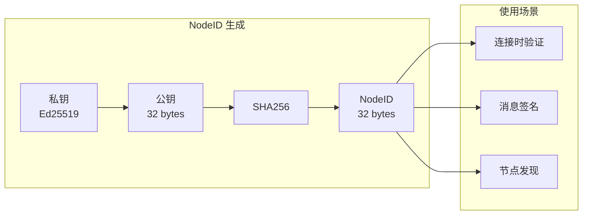

# REQ-ID-001: NodeID 设计

## 1. 元数据

| 属性 | 值 |
|------|---|
| **ID** | REQ-ID-001 |
| **标题** | NodeID 设计 |
| **类型** | generic |
| **层级** | F1: 身份层 |
| **优先级** | P0 |
| **状态** | draft |
| **创建日期** | 2026-01-11 |
| **更新日期** | 2026-01-11 |

---

## 2. 需求描述

定义 DeP2P 节点的唯一身份标识（NodeID），采用密码学公钥作为身份基础，确保身份的不可伪造性和可验证性。

---

## 3. 背景与动机

### 3.1 问题陈述

传统网络应用使用 IP:Port 作为节点地址，存在以下问题：

1. **身份不稳定**：IP 地址可能变化（DHCP、NAT）
2. **无法验证**：无法确认对方身份
3. **易被伪造**：IP 可被欺骗

### 3.2 目标

设计一个**稳定、可验证、不可伪造**的节点身份系统。

### 3.3 竞品参考

| 产品 | NodeID 设计 | 特点 |
|------|-------------|------|
| **iroh** | `PublicKey` (32 bytes) | 公钥即身份，简洁 |
| **go-libp2p** | `Multihash(PublicKey)` | 自描述格式，灵活 |
| **torrent** | 随机 20 字节 | 无密码学保证 |

**选择**：采用 iroh 的简洁方式，同时支持 Multihash 编码。

---

## 4. 需求详情

### 4.1 功能要求

1. **唯一性**：NodeID 在网络中全局唯一
2. **稳定性**：只要私钥不变，NodeID 不变
3. **可验证**：可通过签名验证身份
4. **不可伪造**：无法伪造他人 NodeID

### 4.2 NodeID 计算

```
NodeID = SHA256(PublicKey)
```

| 组件 | 规格 |
|------|------|
| **密钥算法** | Ed25519 |
| **公钥长度** | 32 bytes |
| **NodeID 长度** | 32 bytes (SHA256) |
| **编码格式** | Base58 (人类可读) |

### 4.3 接口定义

```go
// NodeID 表示节点唯一身份
type NodeID [32]byte

// 从公钥派生 NodeID
func NodeIDFromPublicKey(pub ed25519.PublicKey) NodeID {
    return sha256.Sum256(pub)
}

// String 返回 Base58 编码
func (id NodeID) String() string {
    return base58.Encode(id[:])
}

// ParseNodeID 解析 Base58 编码的 NodeID
func ParseNodeID(s string) (NodeID, error)

// Identity 接口
type Identity interface {
    // NodeID 返回节点 ID
    NodeID() NodeID
    
    // PublicKey 返回公钥
    PublicKey() ed25519.PublicKey
    
    // Sign 签名数据
    Sign(data []byte) ([]byte, error)
    
    // Verify 验证签名
    Verify(data, signature []byte) bool
}
```

### 4.4 示意图



### 4.5 错误处理

| 场景 | 错误 | 说明 |
|------|------|------|
| 无效公钥长度 | `ErrInvalidPublicKey` | 公钥不是 32 字节 |
| 解析失败 | `ErrInvalidNodeID` | Base58 解码失败 |
| 签名验证失败 | `ErrSignatureInvalid` | 签名与公钥不匹配 |

---

## 5. 验收标准

- [ ] NodeID 从 Ed25519 公钥派生
- [ ] NodeID 长度为 32 字节
- [ ] 支持 Base58 编码/解码
- [ ] 同一公钥生成相同 NodeID
- [ ] 不同公钥生成不同 NodeID
- [ ] 支持签名和验证操作
- [ ] 错误处理符合规范

---

## 6. 非功能要求

| 维度 | 要求 |
|------|------|
| **性能** | NodeID 生成 < 1ms |
| **安全** | Ed25519 256 位安全强度 |

---

## 7. 关联文档

| 类型 | 链接 |
|------|------|
| **竞品** | [iroh 分析](../../references/individual/iroh.md) |
| **竞品** | [身份对比](../../references/comparison/security/01-identity.md) |
| **决策** | ADR-001: 身份第一性 |
| **架构** | L1: 身份层 |

---

## 8. 实现追踪

### 8.1 代码引用

| 文件 | 符号 | 状态 |
|------|------|------|
| `pkg/types/nodeid.go` | `NodeID` | ⏳ 待实现 |
| `pkg/identity/identity.go` | `Identity` | ⏳ 待实现 |

### 8.2 测试证据

| 测试文件 | 测试函数 | 状态 |
|----------|----------|------|
| `pkg/types/nodeid_test.go` | `TestNodeIDFromPublicKey` | ⏳ 待实现 |
| `pkg/types/nodeid_test.go` | `TestNodeIDString` | ⏳ 待实现 |

---

## 9. 变更历史

| 日期 | 版本 | 变更说明 |
|------|------|----------|
| 2026-01-11 | 1.0 | 初始版本 |
