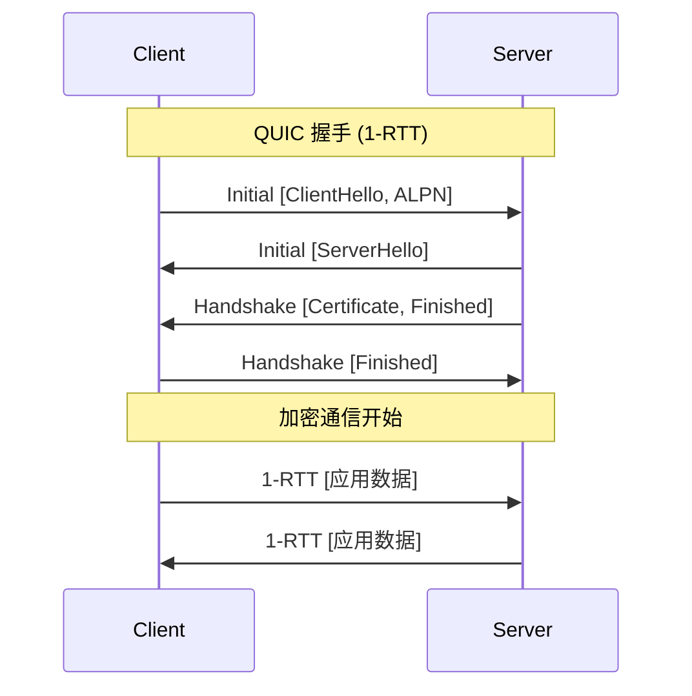
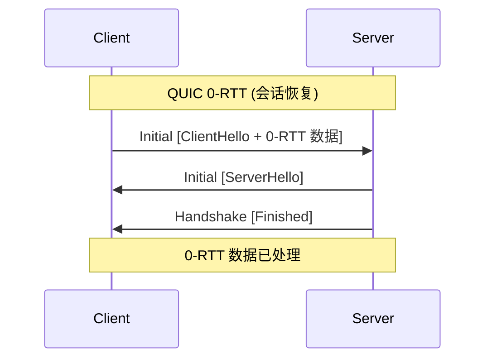

# REQ-TRANS-001: QUIC 传输

## 1. 元数据

| 属性 | 值 |
|------|---|
| **ID** | REQ-TRANS-001 |
| **标题** | QUIC 传输 |
| **类型** | generic |
| **层级** | F2: 传输层 |
| **优先级** | P0 |
| **状态** | draft |
| **创建日期** | 2026-01-11 |
| **更新日期** | 2026-01-11 |

---

## 2. 需求描述

DeP2P 采用 QUIC 作为核心传输协议，提供低延迟连接、内置加密、多路复用和连接迁移能力。

---

## 3. 背景与动机

### 3.1 问题陈述

传统 TCP 传输存在以下问题：

1. **连接建立慢**：TCP + TLS 需要 2-3 RTT
2. **队头阻塞**：单流丢包影响所有数据
3. **连接迁移难**：IP 变化导致连接断开
4. **需要额外加密层**：TLS 是独立的

### 3.2 目标

采用 QUIC 协议解决上述问题，实现：
- 0-1 RTT 连接建立
- 无队头阻塞的多路复用
- 无缝连接迁移
- 内置 TLS 1.3 加密

### 3.3 竞品参考

| 产品 | QUIC 支持 | 实现 | 特点 |
|------|-----------|------|------|
| **iroh** | 核心 | quinn (Rust) | QUIC 优先，无 TCP |
| **go-libp2p** | 可选 | quic-go | 多传输之一 |
| **torrent** | 无 | - | 仅 TCP/uTP |

**选择**：借鉴 iroh，以 QUIC 为核心传输。

---

## 4. 需求详情

### 4.1 功能要求

1. **QUIC v1 支持**：符合 RFC 9000 规范
2. **0-RTT 连接**：支持会话恢复
3. **连接迁移**：支持 IP 地址变化
4. **多路复用**：单连接多流
5. **流控**：连接级和流级流控

### 4.2 QUIC 特性要求

| 特性 | 要求 | 说明 |
|------|------|------|
| **版本** | QUIC v1 | RFC 9000 |
| **加密** | TLS 1.3 | 内置，不可禁用 |
| **0-RTT** | 支持 | 会话恢复 |
| **连接迁移** | 支持 | 网络切换 |
| **ALPN** | 必须 | 协议协商 |
| **流类型** | 双向 + 单向 | 完整支持 |

### 4.3 接口定义

```go
// QUICTransport QUIC 传输接口
type QUICTransport interface {
    // Listen 监听指定地址
    Listen(addr string) (Listener, error)
    
    // Dial 连接到远端
    Dial(ctx context.Context, addr string, alpn []string) (Connection, error)
    
    // Close 关闭传输
    Close() error
}

// Listener QUIC 监听器
type Listener interface {
    // Accept 接受连接
    Accept(ctx context.Context) (Connection, error)
    
    // Addr 返回监听地址
    Addr() net.Addr
    
    // Close 关闭监听器
    Close() error
}

// Connection QUIC 连接
type Connection interface {
    // RemoteAddr 远端地址
    RemoteAddr() net.Addr
    
    // LocalAddr 本地地址
    LocalAddr() net.Addr
    
    // OpenStream 打开双向流
    OpenStream(ctx context.Context) (Stream, error)
    
    // OpenUniStream 打开单向流
    OpenUniStream(ctx context.Context) (SendStream, error)
    
    // AcceptStream 接受双向流
    AcceptStream(ctx context.Context) (Stream, error)
    
    // AcceptUniStream 接受单向流
    AcceptUniStream(ctx context.Context) (ReceiveStream, error)
    
    // Close 关闭连接
    Close() error
    
    // CloseWithError 带错误码关闭
    CloseWithError(code uint64, reason string) error
}
```

### 4.4 连接建立流程





### 4.5 配置选项

```go
// QUICConfig QUIC 配置
type QUICConfig struct {
    // MaxIdleTimeout 最大空闲超时
    MaxIdleTimeout time.Duration // 默认 30s
    
    // KeepAlivePeriod 心跳间隔
    KeepAlivePeriod time.Duration // 默认 15s
    
    // MaxIncomingStreams 最大入站流数
    MaxIncomingStreams int64 // 默认 100
    
    // MaxIncomingUniStreams 最大入站单向流数
    MaxIncomingUniStreams int64 // 默认 100
    
    // Enable0RTT 启用 0-RTT
    Enable0RTT bool // 默认 true
    
    // TLSConfig TLS 配置
    TLSConfig *tls.Config
}
```

### 4.6 错误处理

| 场景 | 错误 | 说明 |
|------|------|------|
| 连接超时 | `ErrConnectionTimeout` | 握手超时 |
| 连接被拒 | `ErrConnectionRefused` | 对方拒绝 |
| ALPN 不匹配 | `ErrALPNMismatch` | 协议不支持 |
| 证书无效 | `ErrInvalidCertificate` | TLS 验证失败 |
| 连接关闭 | `ErrConnectionClosed` | 连接已关闭 |

---

## 5. 验收标准

- [ ] 支持 QUIC v1 (RFC 9000)
- [ ] 支持 TLS 1.3 加密
- [ ] 支持 0-RTT 会话恢复
- [ ] 支持连接迁移
- [ ] 支持双向流和单向流
- [ ] 支持 ALPN 协商
- [ ] 连接建立延迟 < 100ms (本地网络)
- [ ] 正确处理所有错误场景

---

## 6. 非功能要求

| 维度 | 要求 |
|------|------|
| **性能** | 1-RTT 连接 < 50ms，0-RTT < 10ms |
| **并发** | 单连接支持 1000+ 并发流 |
| **资源** | 空闲连接 < 1MB 内存 |

---

## 7. 关联文档

| 类型 | 链接 |
|------|------|
| **竞品** | [iroh 分析](../../references/individual/iroh.md) |
| **竞品** | [传输协议对比](../../references/comparison/transport/01-transport-protocols.md) |
| **需求** | [REQ-TRANS-002](REQ-TRANS-002.md): 连接管理 |
| **需求** | [REQ-TRANS-003](REQ-TRANS-003.md): 流多路复用 |
| **需求** | [REQ-SEC-001](../F4_security/REQ-SEC-001.md): 传输加密 |

---

## 8. 实现追踪

### 8.1 代码引用

| 文件 | 符号 | 状态 |
|------|------|------|
| `internal/transport/quic/transport.go` | `QUICTransport` | ⏳ 待实现 |
| `internal/transport/quic/connection.go` | `Connection` | ⏳ 待实现 |
| `internal/transport/quic/stream.go` | `Stream` | ⏳ 待实现 |

### 8.2 测试证据

| 测试文件 | 测试函数 | 状态 |
|----------|----------|------|
| `internal/transport/quic/transport_test.go` | `TestQUICConnect` | ⏳ 待实现 |
| `internal/transport/quic/transport_test.go` | `TestQUIC0RTT` | ⏳ 待实现 |

---

## 9. 变更历史

| 日期 | 版本 | 变更说明 |
|------|------|----------|
| 2026-01-11 | 1.0 | 初始版本 |
