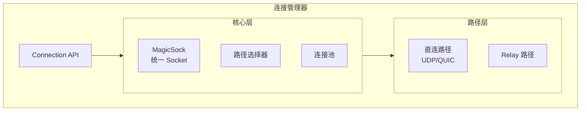
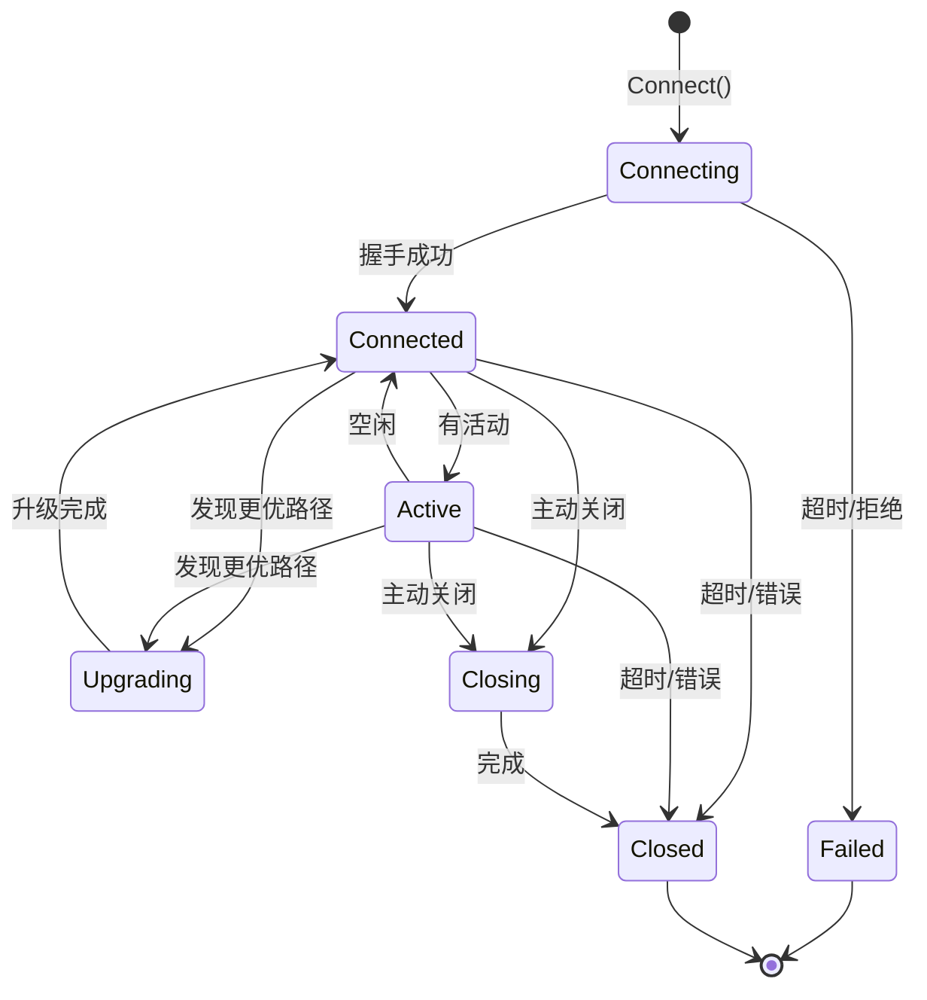
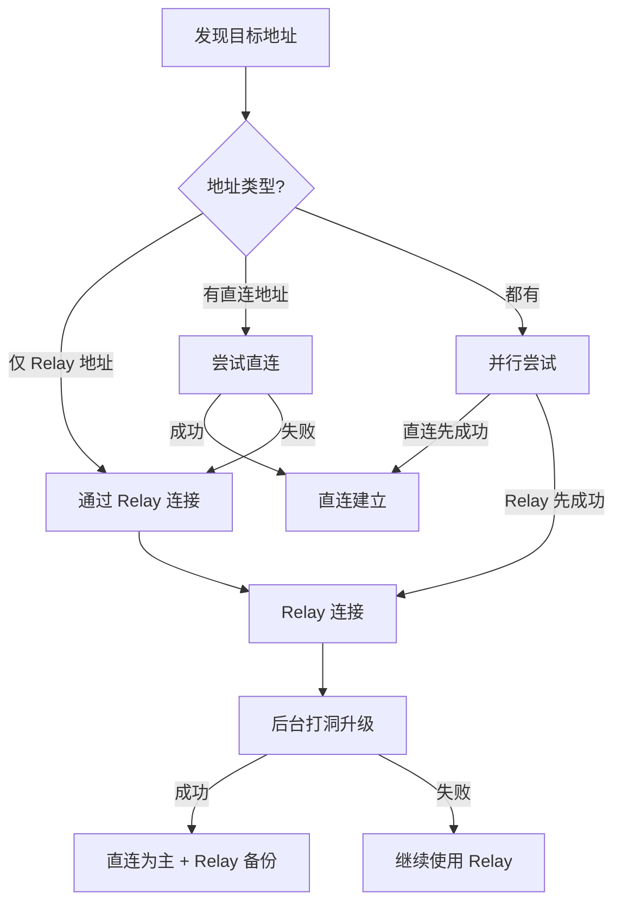

# REQ-TRANS-002: 连接管理

## 1. 元数据

| 属性 | 值 |
|------|---|
| **ID** | REQ-TRANS-002 |
| **标题** | 连接管理 |
| **类型** | generic |
| **层级** | F2: 传输层 |
| **优先级** | P0 |
| **状态** | implementing |
| **创建日期** | 2026-01-11 |
| **更新日期** | 2026-01-23 |

---

## 2. 需求描述

DeP2P 需要统一的连接管理机制，支持多路径（直连 + Relay）、自动路径选择、连接池管理和生命周期控制。

---

## 3. 背景与动机

### 3.1 问题陈述

P2P 网络中的连接管理面临以下挑战：

1. **多路径复杂性**：直连、Relay、多地址
2. **路径选择**：如何选择最优路径
3. **连接维护**：保活、超时、重连
4. **资源管理**：连接数限制、淘汰策略

### 3.2 目标

设计统一的连接管理层，实现：
- 多路径抽象（MagicSock 概念）
- 自动路径选择和升级
- 连接池和生命周期管理
- 资源限制和优雅淘汰

### 3.3 竞品参考

| 产品 | 连接管理 | 特点 |
|------|----------|------|
| **iroh** | MagicSock + RemoteMap | 多路径抽象，自动升级 |
| **go-libp2p** | Swarm + ConnManager | 完善的连接管理器 |
| **torrent** | Client | 简单的 Peer 管理 |

**选择**：借鉴 iroh 的 MagicSock 概念和 libp2p 的 ConnManager。

---

## 4. 需求详情

### 4.1 功能要求

1. **多路径支持**：同一节点可通过多种路径连接
2. **自动路径选择**：选择延迟最低的路径
3. **路径升级**：从 Relay 升级到直连
4. **连接池**：复用现有连接
5. **连接限制**：最大连接数控制
6. **连接保护**：保护重要连接不被淘汰
7. **心跳保活**：检测连接活性

### 4.2 架构设计



### 4.3 MagicSock 设计

```go
// MagicSock 统一的多路径 Socket
type MagicSock interface {
    // Send 发送数据到指定节点（自动选择路径）
    Send(nodeID NodeID, data []byte) error
    
    // Receive 接收数据
    Receive() (NodeID, []byte, error)
    
    // AddPath 添加路径
    AddPath(nodeID NodeID, path Path) error
    
    // RemovePath 移除路径
    RemovePath(nodeID NodeID, path Path) error
    
    // BestPath 获取最优路径
    BestPath(nodeID NodeID) (Path, error)
    
    // Close 关闭
    Close() error
}

// Path 路径接口
type Path interface {
    // Type 路径类型
    Type() PathType // Direct, Relay
    
    // Addr 路径地址
    Addr() string
    
    // Latency 延迟
    Latency() time.Duration
    
    // Send 发送数据
    Send(data []byte) error
    
    // Close 关闭路径
    Close() error
}

// PathType 路径类型
type PathType int

const (
    PathTypeDirect PathType = iota // 直连
    PathTypeRelay                   // Relay 中继
)
```

### 4.4 连接管理器接口

```go
// ConnectionManager 连接管理器
type ConnectionManager interface {
    // Connect 连接到节点
    Connect(ctx context.Context, nodeID NodeID) (Connection, error)
    
    // GetConnection 获取现有连接
    GetConnection(nodeID NodeID) (Connection, bool)
    
    // Connections 所有连接
    Connections() []Connection
    
    // ConnectionCount 连接数
    ConnectionCount() int
    
    // Disconnect 断开连接
    Disconnect(nodeID NodeID) error
    
    // Protect 保护连接
    Protect(nodeID NodeID, tag string)
    
    // Unprotect 取消保护
    Unprotect(nodeID NodeID, tag string)
    
    // IsProtected 是否受保护
    IsProtected(nodeID NodeID) bool
    
    // TrimConnections 淘汰连接
    TrimConnections(ctx context.Context, count int)
    
    // SetLimits 设置限制
    SetLimits(limits ConnectionLimits)
    
    // Close 关闭管理器
    Close() error
}

// ConnectionLimits 连接限制
type ConnectionLimits struct {
    MaxConnections    int           // 最大连接数
    MaxInbound        int           // 最大入站连接
    MaxOutbound       int           // 最大出站连接
    IdleTimeout       time.Duration // 空闲超时
    GracePeriod       time.Duration // 新连接保护期
}
```

### 4.5 连接生命周期



### 4.6 路径选择策略

```go
// PathSelector 路径选择器
type PathSelector interface {
    // SelectPath 选择最优路径
    SelectPath(paths []Path) Path
    
    // UpdateMetrics 更新路径指标
    UpdateMetrics(path Path, latency time.Duration, success bool)
}

// 选择优先级
// 1. 直连路径（延迟最低）
// 2. 打洞后的直连 + Relay 备份（见 ADR-0003）
// 3. Relay（同 Realm）
// 4. Relay（保底）
```

**当对端仅发布 Relay 地址时**：

必须先通过 Relay 建立连接，然后尝试打洞升级：



**打洞成功后保留 Relay 连接**：

| 状态 | 直连 | Relay | 说明 |
|------|------|-------|------|
| RelayOnly | - | 主要 | 打洞前/打洞失败 |
| DirectPrimary | 主要 | 备份 | 打洞成功后 |
| Fallback | - | 主要 | 直连断开后 |

详见 [ADR-0003 §打洞后 Relay 保留策略](../../decisions/ADR-0003-relay-first-connect.md)。

### 4.7 多层保活策略

DeP2P 实现三层保活机制，确保连接稳定：

```
┌─────────────────────────────────────────────────────────────────────────────┐
│                          多层保活策略                                        │
├─────────────────────────────────────────────────────────────────────────────┤
│                                                                             │
│  Layer 1: QUIC 传输层保活 (KeepAlivePeriod) ★ 必需                          │
│  ═════════════════════════════════════════════                              │
│  • QUIC 自动发送 PING 帧                                                    │
│  • 配置: IdleTimeout/2 (如 30s idle → 15s keepalive)                        │
│  • 无需应用层参与                                                           │
│                                                                             │
│  Layer 2: Liveness 心跳服务 (HeartbeatInterval)                             │
│  ═════════════════════════════════════════════════                          │
│  • 应用层定期 Ping 检测                                                      │
│  • 协议: /dep2p/sys/heartbeat/1.0.0                                         │
│  • 用途: 节点健康评估、RTT 测量                                              │
│                                                                             │
│  Layer 3: GossipSub 心跳 (gossipsub heartbeat)                              │
│  ═════════════════════════════════════════════                              │
│  • 1 秒间隔的 Gossip 控制消息                                                │
│  • 用途: Mesh 维护、消息传播                                                 │
│                                                                             │
└─────────────────────────────────────────────────────────────────────────────┘
```

**预设配置**：

| 预设 | IdleTimeout | HeartbeatInterval | KeepAlivePeriod | 适用场景 |
|------|-------------|-------------------|-----------------|----------|
| Mobile | 2 分钟 | 30 秒 | 60 秒 | 省电优先 |
| Desktop | 5 分钟 | 15 秒 | 150 秒 | 平衡 |
| Server | 10 分钟 | 10 秒 | 300 秒 | 稳定性优先 |
| Test | 30 秒 | 5 秒 | 15 秒 | 快速检测 |

> **⚠️ 关键**：`KeepAlivePeriod` 是**必需**配置。如果不设置，QUIC 连接会在 `MaxIdleTimeout` 后自动断开。

### 4.8 配置选项

```go
// 连接管理配置
dep2p.WithConnectionLimits(dep2p.ConnectionLimits{
    MaxConnections: 100,
    MaxInbound:     50,
    MaxOutbound:    50,
    IdleTimeout:    5 * time.Minute,
    GracePeriod:    30 * time.Second,
})

// 心跳配置
dep2p.WithHeartbeat(dep2p.HeartbeatConfig{
    Interval: 15 * time.Second,
    Timeout:  30 * time.Second,
})
```

### 4.9 错误处理

| 场景 | 错误 | 说明 |
|------|------|------|
| 连接数达上限 | `ErrConnectionLimitReached` | 需要淘汰 |
| 无可用路径 | `ErrNoAvailablePath` | 所有路径失败 |
| 连接已存在 | `ErrConnectionExists` | 复用现有连接 |
| 连接超时 | `ErrConnectionTimeout` | 心跳超时 |

---

## 5. 验收标准

- [ ] 支持多路径连接（直连 + Relay）
- [ ] 自动选择最优路径
- [ ] 支持从 Relay 升级到直连
- [ ] 连接池正确复用连接
- [ ] 连接数限制生效
- [ ] 连接保护机制生效
- [ ] 心跳保活正常工作
- [ ] 空闲超时正确淘汰连接
- [ ] 所有错误场景正确处理

---

## 6. 非功能要求

| 维度 | 要求 |
|------|------|
| **性能** | 路径选择 < 1ms |
| **内存** | 每连接 < 10KB 开销 |
| **可用性** | 路径故障自动切换 |

---

## 7. 关联文档

| 类型 | 链接 |
|------|------|
| **概念澄清** | [NAT/Relay 概念澄清](../../../_discussions/20260123-nat-relay-concept-clarification.md) |
| **ADR** | [ADR-0003: 惰性中继策略](../../decisions/ADR-0003-relay-first-connect.md) |
| **ADR** | [ADR-0006](../../decisions/ADR-0006-quic-transport.md): QUIC 传输 |
| **竞品** | [iroh 分析](../../references/individual/iroh.md) |
| **竞品** | [连接管理对比](../../references/comparison/transport/02-connection-management.md) |
| **需求** | [REQ-TRANS-001](REQ-TRANS-001.md): QUIC 传输 |
| **需求** | [REQ-NET-002](../F3_network/REQ-NET-002.md): NAT 穿透 |
| **需求** | [REQ-NET-003](../F3_network/REQ-NET-003.md): Relay 中继 |
| **需求** | [REQ-NET-005](../F3_network/REQ-NET-005.md): 网络弹性与恢复 |

---

## 8. 实现追踪

### 8.1 代码引用

| 文件 | 符号 | 状态 |
|------|------|------|
| `internal/core/connmgr/manager.go` | `ConnectionManager` | ⏳ 待实现 |
| `internal/core/connmgr/magicsock.go` | `MagicSock` | ⏳ 待实现 |
| `internal/core/connmgr/path.go` | `Path` | ⏳ 待实现 |

### 8.2 测试证据

| 测试文件 | 测试函数 | 状态 |
|----------|----------|------|
| `internal/core/connmgr/manager_test.go` | `TestConnectionPool` | ⏳ 待实现 |
| `internal/core/connmgr/manager_test.go` | `TestPathSelection` | ⏳ 待实现 |

---

## 9. 变更历史

| 日期 | 版本 | 变更说明 |
|------|------|----------|
| 2026-01-11 | 1.0 | 初始版本 |
| 2026-01-18 | 1.1 | 增加多层保活策略说明、预设配置表 |
| 2026-01-23 | 1.2 | 根据概念澄清文档同步：补充路径选择策略（Relay 地址优先连接、打洞成功后保留 Relay 备份）、连接流程图 |
