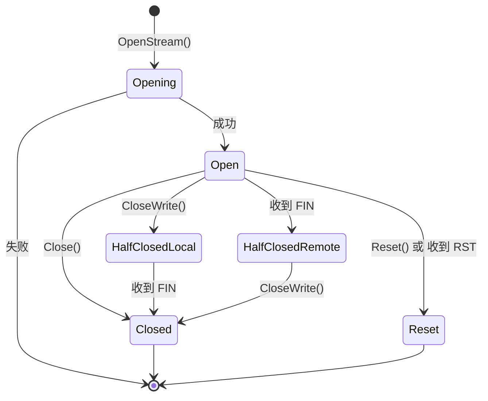
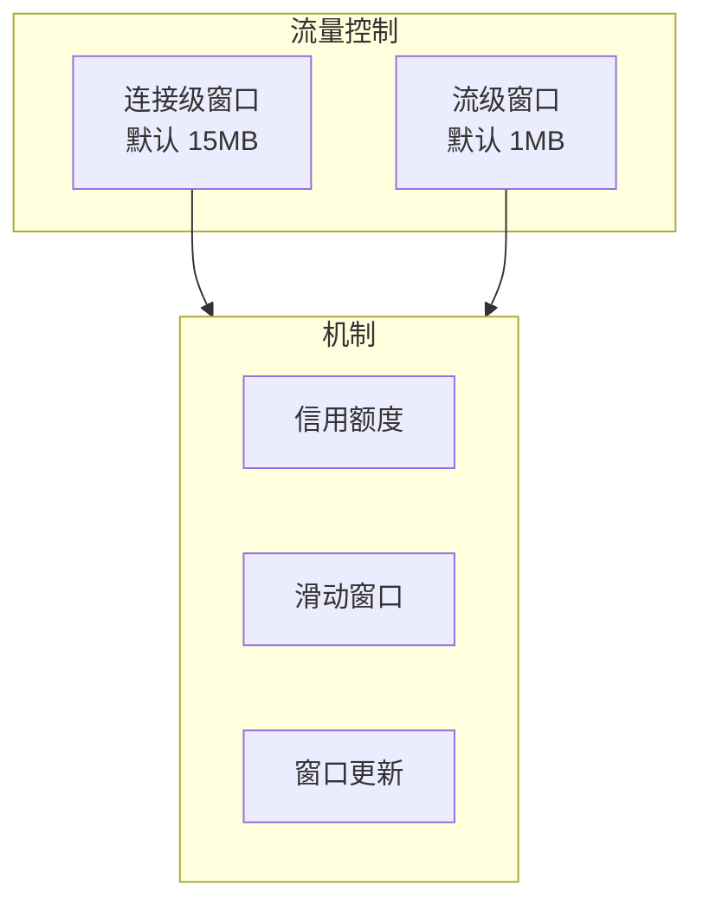

# REQ-TRANS-003: 流多路复用

## 1. 元数据

| 属性 | 值 |
|------|---|
| **ID** | REQ-TRANS-003 |
| **标题** | 流多路复用 |
| **类型** | generic |
| **层级** | F2: 传输层 |
| **优先级** | P1 |
| **状态** | implementing |
| **创建日期** | 2026-01-11 |
| **更新日期** | 2026-01-18 |

---

## 2. 需求描述

DeP2P 利用 QUIC 原生的流多路复用能力，在单个连接上支持大量并发流，实现无队头阻塞的数据传输。

---

## 3. 背景与动机

### 3.1 问题陈述

传统 TCP 连接的多路复用存在问题：

1. **队头阻塞**：单流丢包阻塞所有数据
2. **需要额外协议**：yamux、mplex 等
3. **效率损失**：应用层多路复用开销

### 3.2 目标

利用 QUIC 原生多路复用，实现：
- 无队头阻塞
- 高效的流管理
- 灵活的流控制

### 3.3 竞品参考

| 产品 | 多路复用 | 实现 |
|------|----------|------|
| **iroh** | QUIC 原生 | 无额外开销 |
| **go-libp2p** | yamux/mplex | 应用层实现 |
| **torrent** | 无 | 每连接单流 |

**选择**：使用 QUIC 原生多路复用。

---

## 4. 需求详情

### 4.1 功能要求

1. **双向流**：支持双向数据传输
2. **单向流**：支持只发或只收
3. **并发流**：单连接支持大量并发流
4. **流控**：连接级和流级流量控制
5. **优先级**：可选的流优先级

### 4.2 流接口定义

```go
// Stream 双向流
type Stream interface {
    // Read 读取数据
    Read(p []byte) (n int, err error)
    
    // Write 写入数据
    Write(p []byte) (n int, err error)
    
    // Close 关闭流
    Close() error
    
    // CloseRead 关闭读端
    CloseRead() error
    
    // CloseWrite 关闭写端
    CloseWrite() error
    
    // Reset 重置流（发送错误）
    Reset() error
    
    // ID 流 ID
    ID() StreamID
    
    // SetDeadline 设置超时
    SetDeadline(t time.Time) error
    SetReadDeadline(t time.Time) error
    SetWriteDeadline(t time.Time) error
}

// SendStream 单向发送流
type SendStream interface {
    Write(p []byte) (n int, err error)
    Close() error
    Reset() error
    ID() StreamID
    SetWriteDeadline(t time.Time) error
}

// ReceiveStream 单向接收流
type ReceiveStream interface {
    Read(p []byte) (n int, err error)
    Close() error
    ID() StreamID
    SetReadDeadline(t time.Time) error
}

// StreamID 流标识
type StreamID uint64
```

### 4.3 流生命周期



### 4.4 流控制



### 4.5 使用模式

#### 请求-响应模式

```go
// 客户端
stream, _ := conn.OpenStream(ctx)
defer stream.Close()

// 发送请求
stream.Write(request)
stream.CloseWrite() // 表示请求结束

// 读取响应
response, _ := io.ReadAll(stream)
```

#### 流式传输模式

```go
// 服务端
stream, _ := conn.AcceptStream(ctx)
defer stream.Close()

// 持续读取数据
for {
    n, err := stream.Read(buf)
    if err == io.EOF {
        break
    }
    process(buf[:n])
}
```

#### 双向流模式

```go
// 双向通信
stream, _ := conn.OpenStream(ctx)

go func() {
    // 持续发送
    for data := range sendChan {
        stream.Write(data)
    }
    stream.CloseWrite()
}()

go func() {
    // 持续接收
    for {
        n, err := stream.Read(buf)
        if err == io.EOF {
            break
        }
        recvChan <- buf[:n]
    }
}()
```

### 4.6 配置选项

```go
// 流配置
type StreamConfig struct {
    // MaxIncomingStreams 最大入站流数
    MaxIncomingStreams int64 // 默认 100
    
    // MaxIncomingUniStreams 最大入站单向流数
    MaxIncomingUniStreams int64 // 默认 100
    
    // StreamReceiveWindow 流接收窗口
    StreamReceiveWindow uint64 // 默认 1MB
    
    // ConnectionReceiveWindow 连接接收窗口
    ConnectionReceiveWindow uint64 // 默认 15MB
}
```

### 4.7 错误处理

| 场景 | 错误 | 说明 |
|------|------|------|
| 流数达上限 | `ErrStreamLimitReached` | 等待或拒绝 |
| 流被重置 | `ErrStreamReset` | 对方发送 RST |
| 流已关闭 | `ErrStreamClosed` | 操作已关闭的流 |
| 读取超时 | `ErrReadTimeout` | 读取超时 |
| 写入超时 | `ErrWriteTimeout` | 写入超时 |

---

## 5. 验收标准

- [ ] 支持双向流的打开和接受
- [ ] 支持单向流的打开和接受
- [ ] 单连接支持 100+ 并发流
- [ ] 流级和连接级流控正常工作
- [ ] 正确处理半关闭状态
- [ ] Reset 正确传播错误
- [ ] 超时设置生效
- [ ] 无队头阻塞（丢包不影响其他流）

---

## 6. 非功能要求

| 维度 | 要求 |
|------|------|
| **性能** | 流打开 < 1ms |
| **并发** | 单连接 1000+ 流 |
| **内存** | 每流 < 1KB 开销 |

---

## 7. 关联文档

| 类型 | 链接 |
|------|------|
| **竞品** | [iroh 分析](../../references/individual/iroh.md) |
| **竞品** | [传输协议对比](../../references/comparison/transport/01-transport-protocols.md) |
| **需求** | [REQ-TRANS-001](REQ-TRANS-001.md): QUIC 传输 |
| **需求** | [REQ-PROTO-003](../F6_protocol/REQ-PROTO-003.md): 流式通信 |

---

## 8. 实现追踪

### 8.1 代码引用

| 文件 | 符号 | 状态 |
|------|------|------|
| `pkg/interfaces/host.go` | `Stream` | ✅ 已实现 |
| `internal/core/transport/quic/stream.go` | `Stream` | ✅ 已实现 |
| `internal/core/swarm/stream.go` | `SwarmStream` | ✅ 已实现 |
| `internal/protocol/streams/stream.go` | `streamWrapper` | ✅ 已实现 |

### 8.2 已修复的问题

| 问题 | 状态 | 说明 |
|------|------|------|
| 半关闭能力缺失 | ✅ 已修复 | 添加 `CloseWrite()`/`CloseRead()` 方法 |
| 超时控制缺失 | ✅ 已修复 | 添加 `SetDeadline` 系列方法 |
| 跨机器私聊失败 | ✅ 已修复 | 使用 `CloseWrite()` 替代 `Close()` |

### 8.3 测试证据

| 测试文件 | 测试函数 | 状态 |
|----------|----------|------|
| `internal/protocol/streams/stream_test.go` | `TestStreamWrapper_CloseWrite` | ✅ 已实现 |
| `internal/core/swarm/stream_test.go` | 多个测试 | ✅ 已实现 |

---

## 9. 变更历史

| 日期 | 版本 | 变更说明 |
|------|------|----------|
| 2026-01-11 | 1.0 | 初始版本 |
| 2026-01-18 | 1.1 | 更新实现状态，添加已修复问题说明 |
