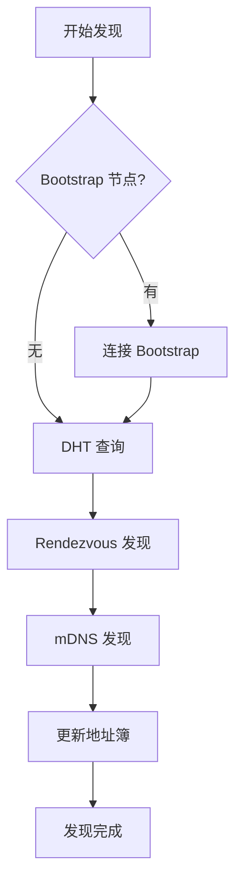
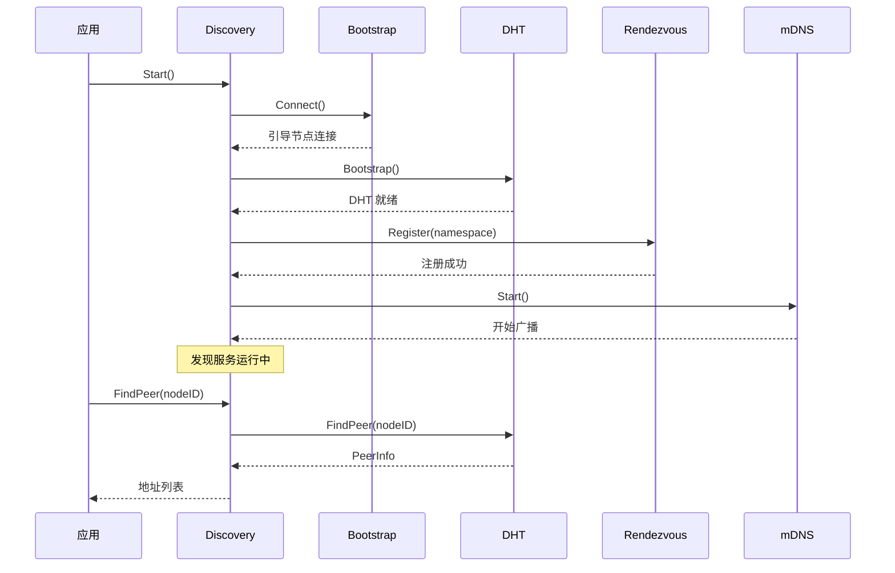

# REQ-NET-001: 节点发现

## 1. 元数据

| 属性 | 值 |
|------|---|
| **ID** | REQ-NET-001 |
| **标题** | 节点发现 |
| **类型** | generic |
| **层级** | F3: 网络层 |
| **优先级** | P0 |
| **状态** | draft |
| **创建日期** | 2026-01-11 |
| **更新日期** | 2026-01-23 |

---

## 2. 需求描述

DeP2P 需要支持多种节点发现机制，包括 Bootstrap、DHT、Rendezvous 和 mDNS，实现节点地址的发现和解析。

---

## 3. 背景与动机

### 3.1 问题陈述

P2P 网络中的节点发现面临以下挑战：

1. **冷启动问题**：新节点如何找到网络入口
2. **动态地址**：节点地址可能变化
3. **NAT 后节点**：无法直接被发现
4. **不同场景**：公网、局域网、私有网络

### 3.2 目标

设计多机制组合的发现系统，实现：
- 快速的网络引导
- 可靠的节点解析
- 支持多种网络环境
- 地址信息的维护

### 3.3 竞品参考

| 产品 | 发现机制 | 特点 |
|------|----------|------|
| **iroh** | DNS + DHT (Pkarr) + mDNS | 多机制组合 |
| **go-libp2p** | DHT + mDNS + Rendezvous | 可插拔设计 |
| **torrent** | Tracker + DHT + PEX | BitTorrent 特色 |

**选择**：采用 Bootstrap + DHT + Rendezvous + mDNS 组合。

---

## 4. 需求详情

### 4.1 功能要求

1. **Bootstrap 发现**：静态引导节点
2. **DHT 发现**：分布式节点路由
3. **Rendezvous 发现**：命名空间服务发现
4. **mDNS 发现**：局域网自动发现
5. **Relay 地址簿查询**：从 Relay 获取在线成员地址（新增）
6. **地址簿**：本地地址缓存

### 4.2 地址来源优先级

地址发现时按以下优先级获取：

| 优先级 | 来源 | 说明 | 时效性 |
|--------|------|------|--------|
| 1 | 本地缓存 | 最近验证过的地址 | 高 |
| 2 | **Relay 地址簿** | 在线成员地址 | 实时 |
| 3 | DHT 查询 | 持久化的地址记录 | 中（TTL 内有效） |
| 4 | mDNS | 局域网发现 | 实时 |
| 5 | Rendezvous | 命名空间发现 | 中 |

**Relay 地址簿优先于 DHT 的理由**：
- Relay 维护实时的在线成员地址
- DHT 记录可能已过期（TTL 24h）
- Relay 查询响应更快（单点 vs 分布式查询）

详见 [ADR-0008 §优先级策略](../../decisions/ADR-0008-discovery-strategy.md)。

### 4.3 发现机制优先级



### 4.4 Discovery 接口

```go
// Discovery 发现服务接口
type Discovery interface {
    // Start 启动发现服务
    Start(ctx context.Context) error
    
    // Stop 停止发现服务
    Stop() error
    
    // FindPeer 查找指定节点的地址
    FindPeer(ctx context.Context, nodeID NodeID) ([]Multiaddr, error)
    
    // Announce 宣布自己的存在
    Announce(ctx context.Context) error
    
    // Discover 发现节点（命名空间）
    Discover(ctx context.Context, namespace string) (<-chan PeerInfo, error)
}

// PeerInfo 节点信息
type PeerInfo struct {
    NodeID NodeID
    Addrs  []Multiaddr
}
```

### 4.5 Bootstrap 发现

#### 4.4.1 极简配置原则

Bootstrap 节点采用**极简配置**设计（详见 [ADR-0009](../../decisions/ADR-0009-bootstrap-simplified.md)）：

- **用户配置**：仅需一个开关 `true/false`
- **参数管理**：所有参数使用内置默认值，用户不可配置
- **概念变更**：不是"成为 Bootstrap 节点"，而是"启用 Bootstrap 能力"

#### 4.4.2 Bootstrap 接口

```go
// Bootstrap 引导发现
type Bootstrap interface {
    // Peers 返回引导节点列表
    Peers() []PeerInfo
    
    // Connect 连接引导节点
    Connect(ctx context.Context) error
}
```

#### 4.4.3 作为客户端（连接 Bootstrap 节点）

```go
// 配置引导节点地址
dep2p.WithBootstrapPeers([]string{
    "/ip4/1.2.3.4/udp/4001/quic-v1/p2p/12D3KooW...",
    "/ip4/5.6.7.8/udp/4001/quic-v1/p2p/12D3KooW...",
})
```

#### 4.4.4 作为服务端（启用 Bootstrap 能力）

```go
// 启动时配置（极简开关）
node, _ := dep2p.NewNode(ctx, dep2p.EnableBootstrap(true))

// 运行时 API
node.EnableBootstrap(ctx)   // 启用
node.DisableBootstrap(ctx)  // 禁用
node.IsBootstrapEnabled()   // 查询状态
```

#### 4.4.5 内置默认值（用户不可配置）

| 参数 | 默认值 | 说明 |
|------|--------|------|
| MaxNodes | 50000 | 最大存储节点数 |
| PersistPath | `${DataDir}/bootstrap.db` | 持久化路径 |
| ProbeInterval | 5 分钟 | 存活探测间隔 |
| DiscoveryInterval | 10 分钟 | 主动发现间隔 |
| NodeExpireTime | 24 小时 | 节点过期时间 |
| ResponseK | 20 | FIND_NODE 返回节点数 |

#### 4.4.6 前置条件

| 条件 | 类型 | 说明 |
|------|------|------|
| 公网可达 | 硬性 | 必须有公网 IP 或域名 |

### 4.6 DHT 发现

```go
// DHT 分布式哈希表发现
type DHT interface {
    // FindPeer 查找节点
    FindPeer(ctx context.Context, nodeID NodeID) (PeerInfo, error)
    
    // FindClosestPeers 查找最近的节点
    FindClosestPeers(ctx context.Context, key []byte, count int) ([]PeerInfo, error)
    
    // Provide 宣布提供内容
    Provide(ctx context.Context, key []byte) error
    
    // FindProviders 查找提供者
    FindProviders(ctx context.Context, key []byte) (<-chan PeerInfo, error)
    
    // Bootstrap 引导 DHT
    Bootstrap(ctx context.Context) error
    
    // RoutingTableSize 路由表大小
    RoutingTableSize() int
}

// DHT 模式
type DHTMode int

const (
    DHTModeClient DHTMode = iota // 仅查询
    DHTModeServer                 // 提供路由
    DHTModeAuto                   // 自动选择
)
```

### 4.7 Rendezvous 发现

```go
// Rendezvous 命名空间发现
type Rendezvous interface {
    // Register 注册到命名空间
    Register(ctx context.Context, namespace string, ttl time.Duration) error
    
    // Unregister 取消注册
    Unregister(namespace string) error
    
    // Discover 在命名空间中发现节点
    Discover(ctx context.Context, namespace string, limit int) (<-chan PeerInfo, error)
}

// 使用（配合 Realm）
// 命名空间格式: dep2p/realm/<realmID>
rendezvous.Register(ctx, "dep2p/realm/my-app", 1*time.Hour)
```

### 4.8 mDNS 发现

```go
// MDNS 局域网发现
type MDNS interface {
    // Start 启动 mDNS 服务
    Start(ctx context.Context) error
    
    // Stop 停止 mDNS 服务
    Stop() error
    
    // Peers 返回发现的节点
    Peers() []PeerInfo
}

// 配置
dep2p.WithMDNS(true) // 启用 mDNS
```

### 4.9 地址簿

```go
// AddressBook 地址簿
type AddressBook interface {
    // AddAddr 添加地址
    AddAddr(nodeID NodeID, addr Multiaddr, ttl time.Duration)
    
    // AddAddrs 批量添加地址
    AddAddrs(nodeID NodeID, addrs []Multiaddr, ttl time.Duration)
    
    // GetAddrs 获取地址
    GetAddrs(nodeID NodeID) []Multiaddr
    
    // ClearAddrs 清除地址
    ClearAddrs(nodeID NodeID)
    
    // PeersWithAddrs 有地址的节点
    PeersWithAddrs() []NodeID
}
```

### 4.10 发现流程



### 4.11 DHT 发布约束

DHT 发布的地址必须是**可达地址**：

| 地址类型 | 是否可发布 | 说明 |
|---------|-----------|------|
| 已验证的公网地址 | ✅ | 经过 dial-back 验证 |
| Relay 地址 | ✅ | 保证可达 |
| 未验证的观察地址 | ❌ | 可能不可达 |
| 本地 LAN 地址 | ❌ | 外网不可达 |

**DHT 发布地址 vs 打洞交换地址**：

| 场景 | 地址来源 | 说明 |
|------|---------|------|
| DHT 发布 | 已验证直连 + Relay | 持久化，供全网查询 |
| 打洞交换 | 观察地址 + STUN | 临时，用于打洞协调 |

**DHT 发布生命周期**：

| 参数 | 值 | 说明 |
|------|-----|------|
| DHT 记录 TTL | 24 小时 | 发布的地址记录有效期 |
| 续期间隔 | 12 小时 | TTL / 2，定期续期 |

详见 [概念澄清文档 §6.2.1](../../../_discussions/20260123-nat-relay-concept-clarification.md)。

### 4.12 配置选项

```go
// 发现配置
dep2p.WithDiscovery(dep2p.DiscoveryConfig{
    // Bootstrap
    BootstrapPeers: []string{...},
    
    // DHT
    EnableDHT: true,
    DHTMode:   dep2p.DHTModeAuto,
    
    // Rendezvous
    EnableRendezvous: true,
    
    // mDNS
    EnableMDNS: true,
    
    // 地址簿
    AddressTTL: 1 * time.Hour,
})
```

### 4.13 错误处理

| 场景 | 错误 | 说明 |
|------|------|------|
| 节点未找到 | `ErrPeerNotFound` | DHT 查询失败 |
| 无引导节点 | `ErrNoBootstrapPeers` | 无法引导 |
| DHT 未就绪 | `ErrDHTNotReady` | DHT 未完成引导 |
| 发现超时 | `ErrDiscoveryTimeout` | 发现操作超时 |

---

## 5. 验收标准

- [ ] Bootstrap 节点连接成功
- [ ] DHT 引导和路由正常
- [ ] FindPeer 正确返回地址
- [ ] Rendezvous 注册和发现正常
- [ ] mDNS 局域网发现正常
- [ ] 地址簿正确缓存和过期
- [ ] 多机制并行工作
- [ ] 错误场景正确处理

---

## 6. 非功能要求

| 维度 | 要求 |
|------|------|
| **性能** | FindPeer < 5s |
| **可用性** | 任一机制可用即可发现 |
| **资源** | DHT 路由表 < 10MB |

---

## 7. 关联文档

| 类型 | 链接 |
|------|------|
| **概念澄清** | [NAT/Relay 概念澄清](../../../_discussions/20260123-nat-relay-concept-clarification.md) |
| **ADR** | [ADR-0008: 多机制发现策略](../../decisions/ADR-0008-discovery-strategy.md) |
| **ADR** | [ADR-0009: Bootstrap 极简配置](../../decisions/ADR-0009-bootstrap-simplified.md) |
| **竞品** | [节点发现对比](../../references/comparison/network/01-discovery.md) |
| **竞品** | [iroh 分析](../../references/individual/iroh.md) |
| **竞品** | [libp2p 分析](../../references/individual/libp2p.md) |
| **需求** | [REQ-NET-003](REQ-NET-003.md): Relay 中继（地址簿） |
| **需求** | [REQ-TRANS-002](../F2_transport/REQ-TRANS-002.md): 连接管理 |

---

## 8. 实现追踪

### 8.1 代码引用

| 文件 | 符号 | 状态 |
|------|------|------|
| `internal/core/discovery/discovery.go` | `Discovery` | ⏳ 待实现 |
| `internal/core/discovery/dht.go` | `DHT` | ⏳ 待实现 |
| `internal/core/discovery/rendezvous.go` | `Rendezvous` | ⏳ 待实现 |
| `internal/core/discovery/mdns.go` | `MDNS` | ⏳ 待实现 |

### 8.2 测试证据

| 测试文件 | 测试函数 | 状态 |
|----------|----------|------|
| `internal/core/discovery/discovery_test.go` | `TestFindPeer` | ⏳ 待实现 |
| `internal/core/discovery/dht_test.go` | `TestDHTBootstrap` | ⏳ 待实现 |

---

## 9. 变更历史

| 日期 | 版本 | 变更说明 |
|------|------|----------|
| 2026-01-11 | 1.0 | 初始版本 |
| 2026-01-16 | 1.1 | 添加 Bootstrap 极简配置设计（ADR-0009） |
| 2026-01-23 | 1.2 | 根据概念澄清文档同步：补充 Relay 地址簿作为发现来源、地址来源优先级、DHT 发布约束（可达地址、24h TTL） |