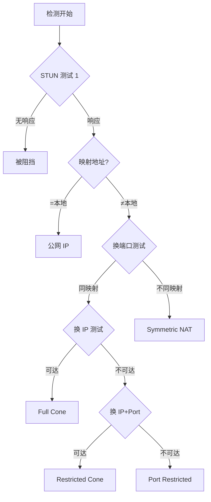
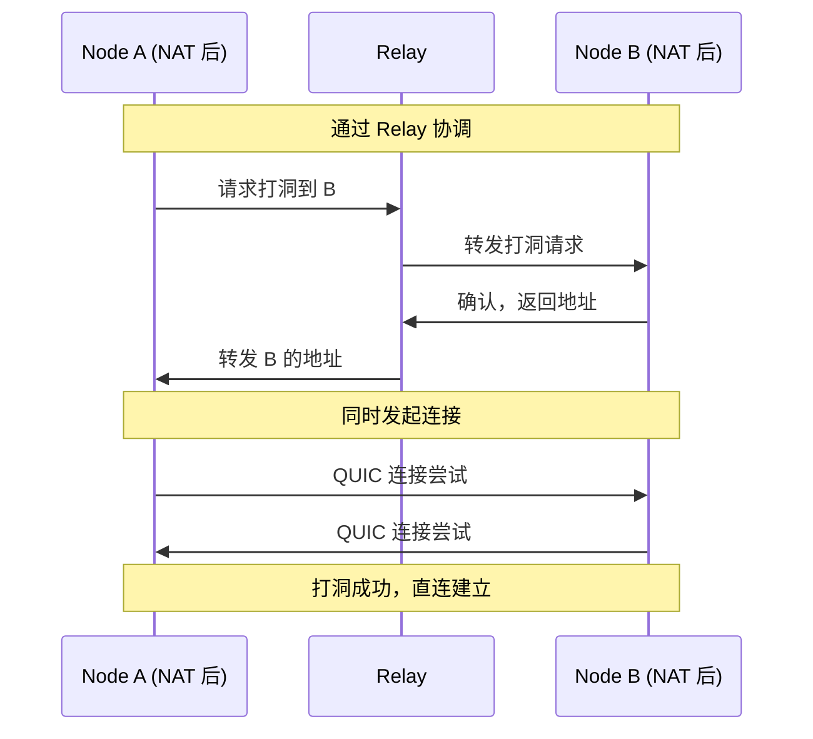
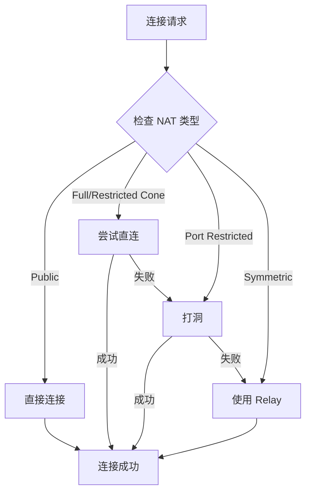

# REQ-NET-002: NAT 穿透

## 1. 元数据

| 属性 | 值 |
|------|---|
| **ID** | REQ-NET-002 |
| **标题** | NAT 穿透 |
| **类型** | generic |
| **层级** | F3: 网络层 |
| **优先级** | P1 |
| **状态** | draft |
| **创建日期** | 2026-01-11 |
| **更新日期** | 2026-01-23 |

---

## 2. 需求描述

DeP2P 需要支持 NAT 穿透能力，包括 NAT 类型检测、UDP/TCP 打洞、UPnP/NAT-PMP 端口映射，实现 NAT 后节点的直连。

---

## 3. 背景与动机

### 3.1 问题陈述

大多数节点位于 NAT 后，面临以下问题：

1. **不可直达**：外部无法直接连接
2. **类型多样**：不同 NAT 类型穿透难度不同
3. **性能损失**：通过 Relay 中继增加延迟

### 3.2 目标

实现智能的 NAT 穿透，尽可能建立直连：
- 准确的 NAT 类型检测
- 高效的打洞协调
- 自动端口映射
- 优雅降级到 Relay

### 3.3 竞品参考

| 产品 | NAT 穿透 | 特点 |
|------|----------|------|
| **iroh** | QAD + 打洞 | QUIC 地址发现 |
| **go-libp2p** | AutoNAT + DCUtR | 完善的协调机制 |
| **torrent** | UPnP + 打洞 | 基础支持 |

**选择**：结合 iroh 的现代设计和 libp2p 的成熟机制。

---

## 4. 需求详情

### 4.1 功能要求

1. **NAT 类型检测**：识别 NAT 类型（**值得实现**，用于优化打洞决策）
2. **UDP 打洞**：UDP 协调打洞（DeP2P 主要方式，基于 QUIC）
3. **TCP 打洞**：TCP 同时连接打洞（**不实现**，成功率低且复杂）
4. **UPnP/NAT-PMP**：端口映射
5. **可达性状态**：维护可达性信息（事件驱动 + 定期检测）

> **设计决策**：NAT 类型检测值得实现。收益包括：优化打洞决策（Symmetric NAT 跳过打洞直接用 Relay）、指导连接超时设置、辅助网络诊断。详见 [概念澄清文档 §17.4](../../../_discussions/20260123-nat-relay-concept-clarification.md)。

### 4.2 NAT 类型分类

| 类型 | 可穿透性 | 说明 |
|------|----------|------|
| **Full Cone** | 高 | 任何外部地址可访问 |
| **Restricted Cone** | 中 | 需要先发出包 |
| **Port Restricted** | 中 | IP + Port 限制 |
| **Symmetric** | 低 | 每连接不同映射 |
| **Public** | - | 公网 IP |



### 4.3 NAT 服务接口

```go
// NATService NAT 服务
type NATService interface {
    // GetNATType 获取 NAT 类型
    GetNATType() NATType
    
    // GetExternalAddr 获取外部地址
    GetExternalAddr() (Multiaddr, error)
    
    // Reachability 返回可达性状态
    Reachability() Reachability
    
    // Probe 主动探测
    Probe(ctx context.Context) error
}

// NATType NAT 类型
type NATType int

const (
    NATTypeUnknown NATType = iota
    NATTypePublic
    NATTypeFullCone
    NATTypeRestrictedCone
    NATTypePortRestricted
    NATTypeSymmetric
)

// Reachability 可达性
type Reachability int

const (
    ReachabilityUnknown Reachability = iota
    ReachabilityPublic   // 公网可达
    ReachabilityPrivate  // 需要穿透或 Relay
)
```

### 4.4 打洞协调

```go
// HolePuncher 打洞服务
type HolePuncher interface {
    // DirectConnect 尝试直连
    DirectConnect(ctx context.Context, nodeID NodeID, addrs []Multiaddr) (Connection, error)
    
    // AcceptHolePunch 接受打洞请求
    AcceptHolePunch(ctx context.Context) error
}
```

### 4.5 打洞流程



### 4.6 UDP vs TCP 打洞

DeP2P 选择 **仅实现 UDP 打洞**（基于 QUIC 传输）：

| 特性 | UDP 打洞 | TCP 打洞 |
|------|----------|---------|
| 成功率 | 较高（~70%） | 较低（~30%） |
| 实现复杂度 | 中等 | 高（需要 simultaneous open） |
| NAT 兼容性 | 大多数 NAT 支持 | 部分 NAT 不支持 |
| 状态保持 | NAT 映射保持 ~30s | 映射时间更短 |
| DeP2P 选择 | ✅ 主要方式（QUIC） | ❌ 不实现 |

**理由**：
1. DeP2P 以 QUIC（UDP）为主传输协议（见 [ADR-0006](../../decisions/ADR-0006-quic-transport.md)）
2. UDP 打洞成功率更高，实现更简单
3. TCP 打洞需要 simultaneous open，实现复杂且依赖 OS 支持
4. 打洞失败时直接降级到 Relay，无需 TCP 打洞作为中间方案

### 4.7 打洞地址适用条件

观察到的外部地址用于打洞需满足以下条件：

| 条件 | 说明 |
|------|------|
| **NAT 类型** | 非 Symmetric NAT（Symmetric NAT 每次连接映射不同端口，观察地址无效） |
| **协议匹配** | UDP 地址用于 QUIC 打洞，不能混用 TCP/UDP |
| **地址时效** | 地址未过期（建议缓存 TTL ≤ 30 秒） |
| **多源验证** | 至少 2 个不同来源确认一致（防止污染） |

**打洞决策矩阵**：

| 发起方 NAT ╲ 目标方 NAT | Full Cone | Restricted | Symmetric |
|------------------------|-----------|------------|-----------|
| **Full Cone** | 直连优先 | 打洞优先 | 打洞尝试 |
| **Restricted** | 打洞优先 | 打洞尝试 | Relay |
| **Symmetric** | 打洞尝试 | Relay | Relay |

> ★ 双方都是 Symmetric NAT 时，**直接使用 Relay**，不浪费时间打洞。

### 4.8 观察地址一致性

观察地址可能来自多个来源，需要验证一致性：

**来源**：
- STUN 服务器探测结果
- 连接时对端报告的观察地址（Identify 协议）
- Relay 连接时的地址信息

**一致性策略**：
1. **多源验证**：至少 2 个独立来源报告相同地址才采信
2. **可信节点优先**：STUN 服务器 > Bootstrap 节点 > 普通 Peer
3. **时间窗口**：同一时间窗口（30s）内的地址视为一致
4. **异常检测**：如果来源间地址不一致，标记为 Symmetric NAT 或地址污染

**防止污染**：
- 恶意节点可能报告错误地址
- 通过多源交叉验证降低风险
- 异常地址记录日志供诊断

### 4.9 端口映射

```go
// PortMapper 端口映射
type PortMapper interface {
    // AddMapping 添加映射
    AddMapping(ctx context.Context, protocol string, internalPort int) (externalPort int, err error)
    
    // DeleteMapping 删除映射
    DeleteMapping(protocol string, internalPort int) error
    
    // Mappings 当前映射
    Mappings() []PortMapping
}

// PortMapping 端口映射信息
type PortMapping struct {
    Protocol     string // "udp" or "tcp"
    InternalPort int
    ExternalPort int
    ExternalIP   net.IP
    Lifetime     time.Duration
}
```

### 4.10 穿透策略



### 4.11 可达性检测策略

采用 **事件驱动 + 定期检测** 的自适应策略：

**事件驱动（立即检测）**：
- 节点启动时
- 网络接口变化（4G/WiFi 切换）
- 本地 IP 地址变化
- 连接失败且怀疑地址变化时

**定期检测**：
| 参数 | 值 | 说明 |
|------|-----|------|
| 基础间隔 | 5 分钟 | 网络稳定时 |
| 最小间隔 | 1 分钟 | 防止过度检测 |
| 最大间隔 | 15 分钟 | 确保地址及时更新 |

**自适应策略**：
- 地址稳定 → 逐渐延长间隔（5min → 10min → 15min）
- 地址变化 → 缩短间隔回到 5min
- 连续 N 次稳定后才延长间隔

**检测方法优先级**：
1. STUN 探测（获取外部地址）
2. AutoNAT dialback（验证可达性）
3. 观察地址收集（作为补充验证）

说明：NAT 类型检测为独立流程，启动时异步触发，用于打洞策略。

### 4.12 IPv6 策略

IPv6 环境下的 NAT 穿透策略：

```
IPv6 特点：
• 通常无 NAT（全球可达地址）
• 但可能存在防火墙阻断入站连接
• 某些 ISP 仍使用 NAT64/DS-Lite
```

**配置选项**：

| 模式 | 说明 | 适用场景 |
|------|------|---------|
| `full` | 完整 NAT 检测流程 | 保守模式 |
| `simplified` | 跳过 NAT 类型检测，保留可达性检测 | **推荐默认** |
| `disabled` | 完全跳过 NAT 穿透 | 确认纯 IPv6 无防火墙环境 |

**IPv6 Only 简化流程**：
1. 跳过 STUN NAT 类型检测（IPv6 通常无 NAT）
2. 直接尝试直连（假设全球可达）
3. 直连失败 → 可达性检测（AutoNAT dialback）
4. 不可达 → 使用 Relay（可能是防火墙阻断）

**双栈环境**：
- 同时探测 IPv4 和 IPv6 地址
- 连接时并行尝试（Happy Eyeballs 风格）
- 优先使用成功建立的连接

### 4.13 配置选项

```go
// NAT 配置
dep2p.WithNAT(dep2p.NATConfig{
    // 启用 NAT 服务
    Enabled: true,
    
    // 启用 UPnP
    EnableUPnP: true,
    
    // 启用 NAT-PMP
    EnableNATPMP: true,
    
    // 可达性检测间隔（自适应范围）
    ProbeIntervalMin: 1 * time.Minute,
    ProbeIntervalBase: 5 * time.Minute,
    ProbeIntervalMax: 15 * time.Minute,
    
    // 打洞超时（建议范围 5-30s）
    HolePunchTimeout: 10 * time.Second,
    
    // IPv6 NAT 穿透模式
    IPv6NATMode: "simplified", // full | simplified | disabled
})
```

### 4.14 重试策略

地址更新失败时采用 **指数退避**：

| 参数 | 值 | 说明 |
|------|-----|------|
| 初始间隔 | 1s | InitialInterval |
| 退避因子 | 2 | Multiplier |
| 最大间隔 | 30s | MaxInterval |
| 最大重试 | 5 次 | MaxRetries |
| 抖动因子 | ±20% | Jitter |

**重试序列示例**：
```
第 1 次：1s × (1 ± 0.2) = 0.8s ~ 1.2s
第 2 次：2s × (1 ± 0.2) = 1.6s ~ 2.4s
第 3 次：4s × (1 ± 0.2) = 3.2s ~ 4.8s
第 4 次：8s × (1 ± 0.2) = 6.4s ~ 9.6s
第 5 次：16s × (1 ± 0.2) = 12.8s ~ 19.2s
（最大 30s 封顶）
```

**适用场景**：
- DHT 地址发布失败
- Relay 预留续租失败
- STUN 探测失败

### 4.15 错误处理

| 场景 | 错误 | 说明 |
|------|------|------|
| 无法检测 | `ErrNATDetectionFailed` | STUN 失败 |
| 打洞失败 | `ErrHolePunchFailed` | 无法穿透 |
| 映射失败 | `ErrPortMappingFailed` | UPnP 失败 |
| Symmetric NAT | `ErrSymmetricNAT` | 需要 Relay |
| 地址不一致 | `ErrAddressInconsistent` | 多源验证失败 |
| 重试耗尽 | `ErrMaxRetriesExceeded` | 达到最大重试次数 |

---

## 5. 验收标准

- [ ] NAT 类型检测准确
- [ ] Full Cone NAT 可直接穿透
- [ ] Restricted Cone NAT 打洞成功率 > 80%
- [ ] Port Restricted NAT 打洞成功率 > 60%
- [ ] Symmetric NAT 正确降级到 Relay
- [ ] UPnP/NAT-PMP 映射正常工作
- [ ] 可达性状态正确维护
- [ ] 错误场景正确处理

---

## 6. 非功能要求

| 维度 | 要求 |
|------|------|
| **性能** | 打洞 < 5s |
| **成功率** | 整体穿透率 > 70% |
| **资源** | 探测开销 < 1KB/s |

---

## 7. 关联文档

| 类型 | 链接 |
|------|------|
| **概念澄清** | [NAT/Relay 概念澄清](../../../_discussions/20260123-nat-relay-concept-clarification.md) |
| **ADR** | [ADR-0006: QUIC 传输选择](../../decisions/ADR-0006-quic-transport.md) |
| **竞品** | [NAT 穿透对比](../../references/comparison/network/02-nat-traversal.md) |
| **需求** | [REQ-NET-003](REQ-NET-003.md): Relay 中继 |
| **需求** | [REQ-NET-006](REQ-NET-006.md): 可达性验证 |
| **需求** | [REQ-TRANS-002](../F2_transport/REQ-TRANS-002.md): 连接管理 |

---

## 8. 实现追踪

### 8.1 代码引用

| 文件 | 符号 | 状态 |
|------|------|------|
| `internal/core/nat/service.go` | `NATService` | ⏳ 待实现 |
| `internal/core/nat/holepunch.go` | `HolePuncher` | ⏳ 待实现 |
| `internal/core/nat/portmap.go` | `PortMapper` | ⏳ 待实现 |

### 8.2 测试证据

| 测试文件 | 测试函数 | 状态 |
|----------|----------|------|
| `internal/core/nat/service_test.go` | `TestNATTypeDetection` | ⏳ 待实现 |
| `internal/core/nat/holepunch_test.go` | `TestHolePunch` | ⏳ 待实现 |

---

## 9. 变更历史

| 日期 | 版本 | 变更说明 |
|------|------|----------|
| 2026-01-11 | 1.0 | 初始版本 |
| 2026-01-23 | 1.1 | 根据概念澄清文档同步：补充 UDP vs TCP 打洞对比、打洞地址适用条件、观察地址一致性验证、可达性检测策略（自适应 5-15min）、IPv6 策略、重试策略参数 |
