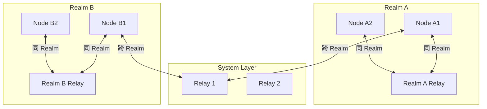
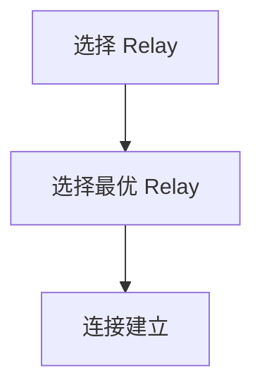
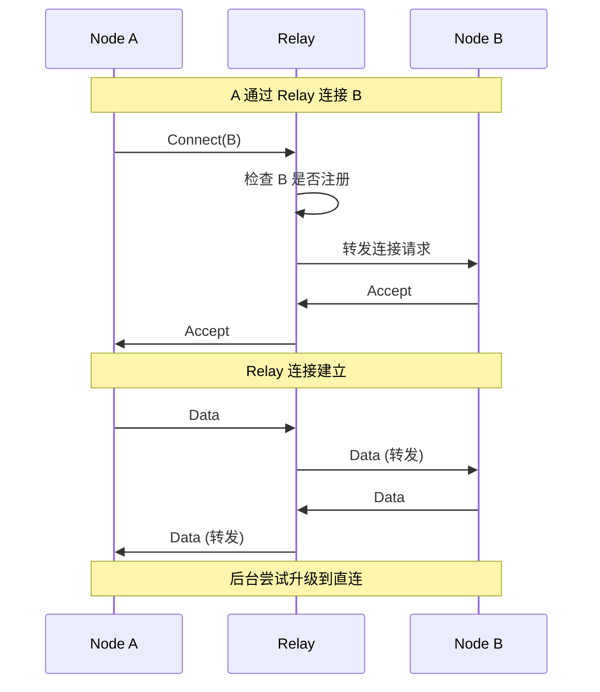

# REQ-NET-003: Relay 中继

## 1. 元数据

| 属性 | 值 |
|------|---|
| **ID** | REQ-NET-003 |
| **标题** | Relay 中继 |
| **类型** | generic |
| **层级** | F3: 网络层 |
| **优先级** | P0 |
| **状态** | draft |
| **创建日期** | 2026-01-11 |
| **更新日期** | 2026-01-24 |

---

## 2. 需求描述

> **统一 Relay 注记**：文中仅保留 Relay 单一概念，不再使用分层命名。

DeP2P 采用统一 Relay 架构，确保任意节点间的连通性，同时支持业务级别的隔离和优化。

---

## 3. 背景与动机

### 3.1 问题陈述

NAT 穿透并非总能成功，需要 Relay 作为保底：

1. **Symmetric NAT**：无法打洞
2. **企业防火墙**：阻止直连
3. **冷启动**：打洞前需要通道

### 3.2 目标

设计统一 Relay 架构，实现：
- 任意节点可达
- Realm 级别隔离
- 智能 Relay 选择
- 从 Relay 升级到直连

### 3.3 竞品参考

| 产品 | Relay 设计 | 特点 |
|------|------------|------|
| **iroh** | Home Relay | 固定 Relay，简化管理 |
| **go-libp2p** | Circuit Relay v2 | 协议化，去中心化 |
| **torrent** | 无 | 不支持 Relay |

**选择**：**统一 Relay（DeP2P 独有）**
- Relay：系统级/业务级统一承载，通过协议与成员认证隔离

---

## 4. 需求详情

### 4.1 功能要求

> **v2.0 核心变化**：DHT 是权威目录，Relay 地址簿是缓存加速层

1. **Relay**：统一中继服务（**缓存加速层** + 打洞协调 + 数据转发兜底）
2. **Relay 角色**：部署方可由项目方或业务方承担
3. **Relay 客户端**：连接和使用 Relay
4. **Relay 地址簿**：维护连接成员的地址信息（**缓存层，非权威**）
5. **自动选择**：选择最优 Relay（发布的 Relay = 使用的 Relay）
6. **路径升级**：从 Relay 升级到直连，**打洞成功后保留 Relay 作为备用**

**三层架构（v2.0）**：
- Layer 1: **DHT（★ 权威目录）** — 存储签名 PeerRecord
- Layer 2: **缓存加速层** — Peerstore / MemberList / Relay 地址簿
- Layer 3: **连接策略** — 直连 → 打洞 → Relay 兜底

### 4.2 统一架构（历史示意）



### 4.3 Relay 接口

```go
// RelayClient Relay 客户端
type RelayClient interface {
    // Connect 通过 Relay 连接到目标
    Connect(ctx context.Context, relay Multiaddr, target NodeID) (Connection, error)
    
    // ListRelays 可用的 Relay 列表
    ListRelays() []RelayInfo
    
    // BestRelay 最佳 Relay
    BestRelay(target NodeID) (RelayInfo, error)
}

// RelayServer Relay 服务端
type RelayServer interface {
    // Start 启动 Relay 服务
    Start(ctx context.Context) error
    
    // Stop 停止 Relay 服务
    Stop() error
    
    // Stats 统计信息
    Stats() RelayStats
}

// RelayInfo Relay 信息
type RelayInfo struct {
    NodeID   NodeID
    Addr     Multiaddr
    Latency  time.Duration
    Load     float64      // 负载 0-1
}
```

### 4.4 Relay 选择策略



### 4.5 Relay 协议

```go
// Relay 协议 ID
const (
    RelayHopProtocolID  = "/dep2p/relay/1.0.0/hop"
    RelayStopProtocolID = "/dep2p/relay/1.0.0/stop"
)

// Relay 消息类型
const (
    RelayMsgConnect    = 0x01 // 连接请求
    RelayMsgAccept     = 0x02 // 接受连接
    RelayMsgReject     = 0x03 // 拒绝连接
    RelayMsgData       = 0x04 // 数据转发
    RelayMsgClose      = 0x05 // 关闭连接
    RelayMsgPing       = 0x06 // 心跳
    RelayMsgPong       = 0x07 // 心跳响应
    
    // 地址簿相关
    RelayMsgAddressRegister  = 0x10 // 注册/更新地址
    RelayMsgAddressQuery     = 0x11 // 查询成员地址
    RelayMsgAddressResponse  = 0x12 // 返回地址信息
    RelayMsgAddressUpdate    = 0x13 // 地址变更通知
)
```

### 4.6 Relay 地址簿（v2.0 定位：缓存层）

> **v2.0 核心变化**：Relay 地址簿是**本地缓存加速层**，DHT 是权威目录

```go
// AddressBookEntry 地址簿条目
type AddressBookEntry struct {
    NodeID      NodeID         // 节点标识
    DirectAddrs []Multiaddr    // 直连地址列表
    NATType     NATType        // NAT 类型
    Online      bool           // 在线状态
    LastSeen    time.Time      // 最后活跃时间
}

// RelayAddressBook Relay 地址簿接口
type RelayAddressBook interface {
    // Register 注册/更新地址
    Register(entry AddressBookEntry) error
    
    // Query 查询成员地址
    Query(nodeID NodeID) (AddressBookEntry, error)
    
    // List 列出在线成员
    List() []AddressBookEntry
    
    // Subscribe 订阅地址变更
    Subscribe(nodeID NodeID) <-chan AddressBookEntry
}
```

**用途（v2.0 更新）**：
1. **缓存加速**：缓存连接到本 Relay 的成员地址，加速本地查询
2. **打洞协调**：交换打洞所需的地址信息
3. **在线状态**：快速判断成员是否在线
4. **NAT 信息**：用于打洞决策
5. **DHT 回退**：仅在 DHT 查询失败时作为回退来源

**与 DHT 的区别（v2.0 更新）**：

| 特性 | Relay 地址簿 | DHT |
|------|-------------|-----------|
| **权威性** | **缓存层** | **★ 权威目录** |
| 范围 | 仅连接到该 Relay 的成员 | 全 Realm |
| 跨 Relay | ❌ 不支持 | ✅ 支持 |
| 签名验证 | 无 | ✅ PeerRecord 签名 |
| 时效性 | 实时（在线成员） | 中（TTL 内有效） |
| 用途 | 本地缓存加速 | 权威地址解析 |

**地址发现优先级（v2.0）**：
```
Peerstore → MemberList → DHT（★权威） → Relay 地址簿（缓存回退）
```

### 4.7 连接流程



### 4.8 路径升级

```go
// 路径升级策略
// 1. 通过 Relay 建立连接
// 2. 后台交换直连地址
// 3. 尝试打洞建立直连
// 4. 成功后切换到直连
// 5. 保留 Relay 作为后备（关键！）
```

**打洞成功后保留 Relay 连接**：

| 理由 | 说明 |
|------|------|
| **其他节点需要** | A-B 打洞成功，但 A-C、A-D 可能仍需借助 Relay |
| **信令通道** | Relay 连接用于打洞协调信令 |
| **网络变化** | 直连可能因网络变化断开，Relay 作为 fallback |
| **重建成本** | 重建 Relay 连接有成本（握手、预留） |

**连接状态机**：

```
RelayOnly → [打洞成功] → DirectPrimary + RelayBackup
                              │
                              ↓ [直连断开]
                          RelayOnly → [重试打洞]
```

详见 [概念澄清文档 §17.3](../../../_discussions/20260123-nat-relay-concept-clarification.md)。

### 4.9 多 Relay 选择策略

**核心原则**：发布地址时选择的 Relay = 连接时使用的 Relay

```
理由：
1. DHT 发布的 Relay 地址格式：/p2p/QmRelay.../p2p-circuit/p2p/QmTarget
2. 连接方按此地址连接，必须经过指定的 Relay
3. 目标节点只在该 Relay 上有预留，其他 Relay 无法转发
```

**选择策略**：

| 步骤 | 操作 |
|------|------|
| 1 | 启动时向所有已知 Relay 发送探测包，测量 RTT |
| 2 | 选择 RTT 最低 + 地理最近的 Relay 作为"主 Relay" |
| 3 | 在主 Relay 上建立预留 |
| 4 | 在 DHT 发布主 Relay 的地址 |
| 5 | 可选在第二 Relay 建立预留（高可用场景） |

**多 Relay 地址发布（高可用）**：
- 可以在 DHT 发布多个 Relay 地址
- 连接方按顺序尝试，第一个失败则尝试第二个
- 增加可用性，但增加预留维护成本

**Relay 切换策略**：
- 主 Relay 故障时，切换到备用 Relay
- 重新在 DHT 发布新的 Relay 地址
- 已建立的连接继续使用旧 Relay 直到断开

### 4.10 配置选项

```go
// Relay 配置
dep2p.WithRelays([]string{
    "/ip4/relay1.dep2p.io/udp/4001/quic-v1/p2p/12D3KooW...",
    "/ip4/relay2.dep2p.io/udp/4001/quic-v1/p2p/12D3KooW...",
})

// Relay 服务配置
dep2p.WithRelayService(dep2p.RelayServiceConfig{
    Enabled:        true,
    MaxReservations: 100,    // 最大预留数
    MaxCircuits:     50,     // 总最大电路数
    MaxCircuitsPerPeer: 4,  // 每节点最大电路数
    MaxDuration:     1*time.Hour,
    MaxData:         1 * GB,
})

// 自动 Relay 配置
dep2p.WithAutoRelay(true)
```

### 4.11 资源限制与 TTL

| 限制 | 默认值 | 说明 |
|------|--------|------|
| 最大预留数 | 100 | 每 Relay 最大客户端 |
| 最大电路数 | 50 | 同时中继的连接数 |
| **预留 TTL** | **1 小时** | 预留过期时间 |
| **续租间隔** | **30 分钟** | TTL / 2，定期续租 |
| 单连接数据量 | 1 GB | 超限断开 |

**预留续租策略**：

| 参数 | 值 | 说明 |
|------|-----|------|
| 预留 TTL | 3600s（1h） | 预留过期时间 |
| 续租间隔 | 1800s（30min） | TTL / 2 |
| 续租窗口 | TTL 前 5min | 开始尝试续租 |
| 最大续租失败 | 3 次 | 之后重新建立预留 |

**续租流程**：
```
1. 定时器在 TTL/2 时触发续租请求
2. 成功 → 重置 TTL 计时器
3. 失败 → 指数退避重试（1s→30s）
4. 连续失败超过阈值 → 重新建立预留
```

**时间线示例（TTL=1h）**：
```
0min    30min         55min      60min
  ├────────┼────────────┼──────────┤
  │        │            │          │
  预留     续租         续租窗口   过期
  建立     触发         开始       (应避免)
```

详见 [概念澄清文档 §17.1](../../../_discussions/20260123-nat-relay-concept-clarification.md)。

### 4.12 错误处理

| 场景 | 错误 | 说明 |
|------|------|------|
| 无可用 Relay | `ErrNoRelayAvailable` | 所有 Relay 不可达 |
| 目标未注册 | `ErrTargetNotFound` | 目标不在 Relay |
| Relay 拒绝 | `ErrRelayRejected` | 达到限制 |
| 连接超时 | `ErrRelayTimeout` | 中继超时 |
| 预留过期 | `ErrReservationExpired` | 需要重新建立预留 |
| 续租失败 | `ErrRenewalFailed` | 续租请求失败 |

---

## 5. 验收标准

- [ ] Relay 连接正常
- [ ] 自动选择最优 Relay
- [ ] 同 Realm 场景可用
- [ ] 跨 Realm 场景可用
- [ ] 路径升级正常工作
- [ ] 资源限制生效
- [ ] 错误场景正确处理

---

## 6. 非功能要求

| 维度 | 要求 |
|------|------|
| **性能** | Relay 延迟增加 < 50ms |
| **可用性** | 多 Relay 容错 |
| **可扩展** | 单 Relay 支持 1000+ 连接 |

---

## 7. 关联文档

| 类型 | 链接 |
|------|------|
| **概念澄清** | [NAT/Relay 概念澄清](../../../_discussions/20260123-nat-relay-concept-clarification.md) |
| **ADR** | [ADR-0003: 惰性中继策略](../../decisions/ADR-0003-relay-first-connect.md) |
| **ADR** | [ADR-0005: Relay 部署模型](../../decisions/ADR-0005-relay-deployment-models.md) |
| **ADR** | [ADR-0010: Relay 明确配置](../../decisions/ADR-0010-relay-explicit-config.md) |
| **竞品** | [Relay 设计对比](../../references/comparison/transport/03-relay.md) |
| **竞品** | [iroh 分析](../../references/individual/iroh.md) |
| **需求** | [REQ-REALM-003](../F5_realm/REQ-REALM-003.md): Relay |
| **需求** | [REQ-NET-002](REQ-NET-002.md): NAT 穿透 |
| **需求** | [REQ-TRANS-002](../F2_transport/REQ-TRANS-002.md): 连接管理 |

---

## 8. 实现追踪

### 8.1 代码引用

| 文件 | 符号 | 状态 |
|------|------|------|
| `internal/core/relay/client.go` | `RelayClient` | ⏳ 待实现 |
| `internal/core/relay/server.go` | `RelayServer` | ⏳ 待实现 |
| `internal/core/relay/protocol.go` | `RelayProtocol` | ⏳ 待实现 |

### 8.2 测试证据

| 测试文件 | 测试函数 | 状态 |
|----------|----------|------|
| `internal/core/relay/client_test.go` | `TestRelayConnect` | ⏳ 待实现 |
| `internal/core/relay/server_test.go` | `TestRelayService` | ⏳ 待实现 |

---

## 9. 变更历史

| 日期 | 版本 | 变更说明 |
|------|------|----------|
| 2026-01-11 | 1.0 | 初始版本 |
| 2026-01-23 | 1.1 | 根据概念澄清文档同步：补充 Relay 地址簿功能、预留 TTL/续租策略（1h TTL, 30min 续租）、多 Relay 选择策略（发布=使用）、打洞成功后保留 Relay 作为备用 |
| 2026-01-24 | **2.0** | **v2.0 DHT 权威模型对齐**：更新 Relay 地址簿定位（从"地址发现中心"改为"缓存加速层"）、添加三层架构说明、更新功能要求和地址发现优先级 |
