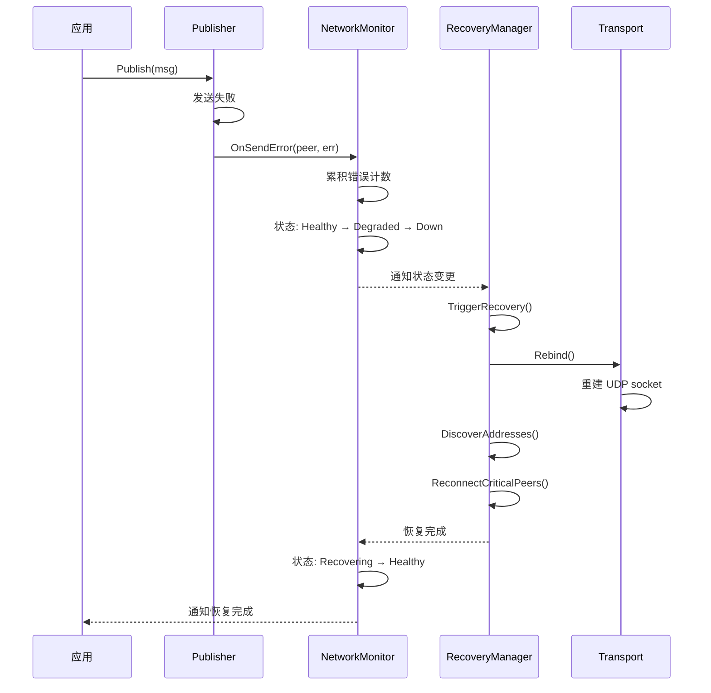

# REQ-NET-005: 网络弹性与恢复

## 1. 元数据

| 属性 | 值 |
|------|---|
| **ID** | REQ-NET-005 |
| **标题** | 网络弹性与恢复 (Network Resilience) |
| **类型** | generic |
| **层级** | F3 |
| **优先级** | P0 |
| **状态** | draft |
| **创建日期** | 2026-01-18 |
| **更新日期** | 2026-01-23 |
| **来源** | 旧代码分析 |

---

## 2. 需求描述

节点必须能够自动检测网络状态变化、在网络故障时自动恢复、并在恢复后继续正常工作。

---

## 3. 背景与动机

### 3.1 问题陈述

当前存在的关键问题：

1. **网络断开后无法恢复**：节点在网络切换（Wi-Fi 切换、睡眠唤醒）后，旧的 UDP socket 失效，但程序继续尝试使用，导致永久失败
2. **Publish 静默成功**：`GossipSub.Publish` 在没有连接时返回 `nil`，用户误以为发送成功
3. **无网络变化感知**：程序无法感知操作系统级别的网络变化事件

### 3.2 目标

实现完整的网络弹性机制：

1. **错误驱动检测**：通过发送错误触发状态转换
2. **状态机管理**：Healthy → Degraded → Down → Recovering
3. **自动恢复**：Transport rebind + 地址重发现 + 关键节点重连
4. **闭环集成**：与消息投递、连接管理等模块协同

### 3.3 竞品参考

| 产品 | 做法 | 启示 |
|------|------|------|
| iroh | `network_change()` API + magicsock rebind | 显式网络变化通知，自动 rebind |
| go-libp2p | 无内置网络弹性 | 需要上层应用自己处理 |
| 旧 dep2p | IMPL-NETWORK-RESILIENCE 6 Phase | 完整的设计和实现，可直接复用 |

---

## 4. 需求详情

### 4.1 功能要求

#### 4.1.1 网络状态机 (NetworkMonitor)

```
状态转换：
    ┌────────────────────────────────────────────┐
    │                                            │
    ▼                                            │
 Healthy ──(错误累积)──▶ Degraded ──(阈值)──▶ Down
    ▲                                            │
    │                                            │
    └───────────(恢复成功)──── Recovering ◀──────┘
```

| 状态 | 条件 | 行为 |
|------|------|------|
| **Healthy** | 正常运行 | 监控错误 |
| **Degraded** | 错误计数超阈值 | 准备恢复 |
| **Down** | 连续失败超阈值 | 触发恢复 |
| **Recovering** | 恢复中 | 执行恢复流程 |

#### 4.1.2 恢复管理器 (RecoveryManager)

恢复流程：

1. **Rebind 传输层**：关闭旧 UDP socket，重新创建
2. **重新发现地址**：执行 STUN 探测，获取新外部地址
3. **更新本地缓存**：更新本地地址缓存
4. **通知 Relay 地址簿**：发送 AddressRegister 消息更新地址
5. **DHT 重新发布**：仅发布已验证地址 + Relay 地址
6. **重建关键连接**：优先 Bootstrap、Relay，然后其他关键节点
7. **恢复 Mesh**：重新加入 GossipSub mesh

**地址更新流程**（与 REQ-NET-004 一致）：

```
恢复触发
    │
    ▼
1. Rebind 传输层
    │
    ▼
2. STUN 重新探测
    │
    ▼
3. 更新本地缓存
    │
    ▼
4. 通知 Relay 地址簿
    │
    ▼
5. DHT 重新发布
    │
    ▼
6. 重建关键连接
```

#### 4.1.3 系统事件监听 (SystemWatcher)

| 事件类型 | 说明 |
|----------|------|
| `InterfaceUp` | 网络接口启用 |
| `InterfaceDown` | 网络接口禁用 |
| `AddressAdded` | 地址添加 |
| `AddressRemoved` | 地址移除 |
| `RouteChanged` | 路由变化 |

### 4.2 接口定义

```go
// NetworkMonitor 网络状态监控器
type NetworkMonitor interface {
    // Start 启动监控
    Start(ctx context.Context) error
    
    // OnSendError 上报发送错误
    OnSendError(peer types.NodeID, err error)
    
    // Subscribe 订阅状态变更
    Subscribe() <-chan NetworkStateChange
    
    // State 获取当前状态
    State() NetworkState
}

// RecoveryManager 恢复管理器
type RecoveryManager interface {
    // TriggerRecovery 触发恢复
    TriggerRecovery(ctx context.Context, reason RecoveryReason) (*RecoveryResult, error)
    
    // IsRecovering 是否正在恢复
    IsRecovering() bool
    
    // OnRecoveryComplete 注册恢复完成回调
    OnRecoveryComplete(callback func(RecoveryResult))
}

// Rebinder 可重绑定的传输
type Rebinder interface {
    // Rebind 重新绑定 socket
    Rebind(ctx context.Context) error
    
    // IsRebindNeeded 检查是否需要 rebind
    IsRebindNeeded() bool
}
```

### 4.3 流程说明



### 4.4 错误处理

| 场景 | 错误 | 处理 |
|------|------|------|
| Rebind 失败 | `ErrRebindFailed` | 记录日志，继续尝试后续步骤 |
| 地址发现失败 | `ErrAddressDiscoveryFailed` | 使用已知地址继续 |
| 所有重连失败 | `ErrRecoveryFailed` | 返回错误，等待下次触发 |

---

## 5. 验收标准

### 5.1 网络恢复

- [ ] 网络断开后 30 秒内自动检测到
- [ ] 网络恢复后 60 秒内自动重建连接
- [ ] Publish 在无连接时返回 `ErrNoConnectedPeers`，不再静默成功
- [ ] 支持配置关键节点，优先恢复连接
- [ ] 提供状态变更事件订阅
- [ ] 单元测试覆盖所有状态转换

### 5.2 断开检测（v1.1 新增，与 REQ-NET-007 关联）

- [ ] 非优雅断开检测延迟 < 10s（直连）
- [ ] 非优雅断开检测延迟 < 15s（Relay）
- [ ] 分区场景误判率 < 5%
- [ ] 误判后恢复延迟 < 30s（通过重连宽限期）

---

## 6. 非功能要求

| 维度 | 要求 |
|------|------|
| **性能** | 状态检测延迟 < 5s |
| **资源** | 监控线程占用 < 1% CPU |
| **可用性** | 恢复成功率 > 95% |

---

## 7. 关联文档

| 类型 | 链接 |
|------|------|
| **相关需求** | [REQ-NET-007](REQ-NET-007.md): 快速断开检测（v1.1 关联） |
| **相关需求** | [REQ-NET-004](REQ-NET-004.md): 网络变化处理 |
| **相关需求** | [REQ-NET-003](REQ-NET-003.md): Relay 中继 |
| **相关需求** | [REQ-NET-002](REQ-NET-002.md): NAT 穿透 |
| **行为设计** | [断开检测流程](../../../../03_architecture/L3_behavioral/disconnect_detection.md) |
| **旧代码设计** | `IMPL-NETWORK-RESILIENCE` |
| **旧代码** | `internal/core/netmon/monitor.go` (~654 行) |
| **旧代码** | `internal/core/recovery/recovery.go` (~509 行) |

---

## 8. 实现追踪

### 8.1 代码引用

| 文件 | 符号 | 状态 |
|------|------|------|
| `internal/core/netmon/` | `Monitor` | ⏳ 待迁移 |
| `internal/core/recovery/` | `Manager` | ⏳ 待迁移 |

### 8.2 测试证据

| 测试文件 | 测试函数 | 状态 |
|----------|----------|------|
| `netmon/monitor_test.go` | `TestStateTransitions` | ⏳ 待迁移 |
| `recovery/recovery_test.go` | `TestRecoveryFlow` | ⏳ 待迁移 |

---

## 9. 变更历史

| 日期 | 版本 | 变更说明 |
|------|------|----------|
| 2026-01-18 | 1.0 | 初始版本，基于旧代码分析创建 |
| 2026-01-23 | 1.1 | 根据概念澄清文档同步：补充地址更新流程（本地缓存→Relay 地址簿→DHT）、恢复流程详细步骤 |
| 2026-01-28 | 1.2 | 补充断开检测验收标准，关联 REQ-NET-007 |
