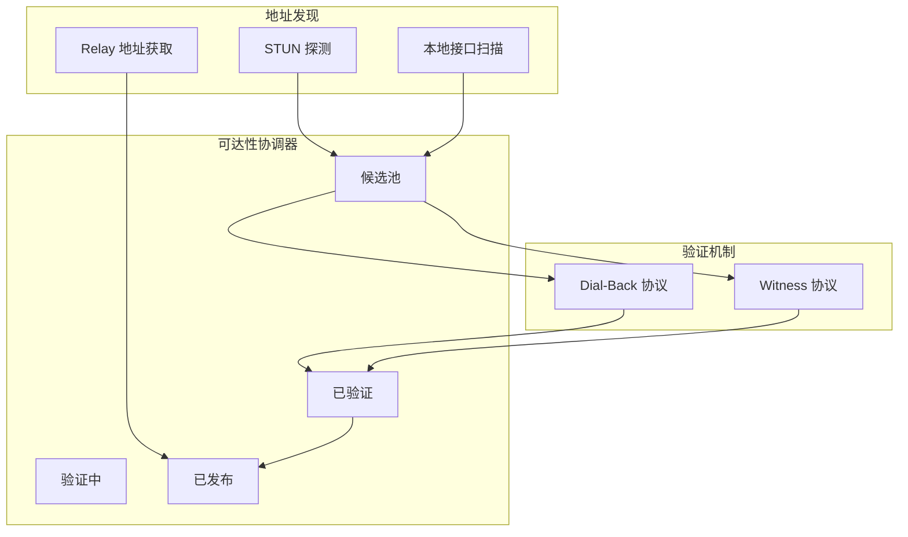

# REQ-NET-006: 可达性验证

## 1. 元数据

| 属性 | 值 |
|------|---|
| **ID** | REQ-NET-006 |
| **标题** | 可达性验证 (Reachability Verification) |
| **类型** | generic |
| **层级** | F3 |
| **优先级** | P1 |
| **状态** | draft |
| **创建日期** | 2026-01-18 |
| **更新日期** | 2026-01-23 |
| **来源** | 旧代码分析 |

---

## 2. 需求描述

节点必须能够验证自身地址的真实可达性，避免发布不可达的地址，并支持通过 dial-back 和 witness 协议进行验证。

---

## 3. 背景与动机

### 3.1 问题陈述

1. **地址可达性不确定**：STUN 探测的地址可能因 NAT 类型或防火墙规则不可达
2. **Relay 地址混淆**：直连地址和 Relay 地址优先级不明确
3. **地址验证缺失**：发布地址前没有验证其真实可达性

### 3.2 目标

实现"可达性优先"策略：

1. **先保证连得上**：Relay 地址作为兜底
2. **再争取更优路径**：验证后的直连地址优先
3. **地址分级管理**：候选 → 验证中 → 已验证

### 3.3 竞品参考

| 产品 | 做法 | 启示 |
|------|------|------|
| iroh | Home Relay 优先 | 保证基本可达性 |
| go-libp2p | AutoNAT + dial-back | 通过第三方验证 |
| 旧 dep2p | Reachability Coordinator | 完整的验证框架 |

---

## 4. 需求详情

### 4.1 功能要求

#### 4.1.1 候选地址来源

候选地址可能来自以下来源：

| 来源 | 说明 | 可信度 | 备注 |
|------|------|--------|------|
| **STUN 探测** | 通过 STUN 服务器获取的外部地址 | 高 | 可信服务器 |
| **观察地址** | 对端连接时报告的地址（Identify 协议） | 中 | 可能被伪造 |
| **本地接口** | 本地网络接口扫描 | 低（外网不可达） | 仅 LAN 有效 |
| **Relay 报告** | Relay 连接时报告的客户端地址 | 高 | 可信基础设施 |

#### 4.1.2 地址分类管理

| 类别 | 说明 | 发布策略 |
|------|------|----------|
| **Relay 地址** | 通过 RelayManager 获得 | 立即发布 |
| **候选地址** | STUN/观察地址/本地发现 | 不发布，等待验证 |
| **已验证地址** | 通过 dial-back 验证的地址 | 发布，高优先级 |

#### 4.1.3 多源验证策略

为防止地址污染和欺骗，采用多源验证策略：

```
┌─────────────────────────────────────────────────────────────────────────────┐
│                    多源验证策略                                               │
├─────────────────────────────────────────────────────────────────────────────┤
│                                                                             │
│  验证要求：                                                                  │
│  ──────────                                                                 │
│  • 至少 2 个独立来源报告相同地址才采信                                       │
│  • 可信节点优先：STUN 服务器 > Bootstrap > Relay > 普通 Peer                │
│  • 同一时间窗口（30s）内的地址视为一致                                       │
│                                                                             │
│  异常检测：                                                                  │
│  ──────────                                                                 │
│  • 如果来源间地址不一致，可能是：                                            │
│    - Symmetric NAT（正常情况）                                               │
│    - 地址污染（恶意节点）                                                    │
│    - 多路径/多出口                                                           │
│  • 不一致时：不采信，等待更多验证或使用 Relay                                │
│                                                                             │
│  防污染措施：                                                                │
│  ────────────                                                               │
│  • 恶意节点可能报告错误地址                                                  │
│  • 通过多源交叉验证降低风险                                                  │
│  • 与 STUN 结果交叉验证观察地址                                             │
│                                                                             │
└─────────────────────────────────────────────────────────────────────────────┘
```

详见 [概念澄清文档 §4.2](../../../_discussions/20260123-nat-relay-concept-clarification.md)。

#### 4.1.4 Dial-Back 验证协议

```
协议 ID: /dep2p/sys/dialback/1.0.0

流程：
1. 节点 A 请求节点 B 对地址 X 进行 dial-back
2. 节点 B 尝试连接地址 X
3. 节点 B 返回验证结果给 A
4. 如果成功，A 将地址 X 标记为"已验证"
```

#### 4.1.5 Witness 验证协议

```
协议 ID: /dep2p/sys/witness/1.0.0

原理：
- 多个节点同时证明某地址可达
- 达到阈值后视为验证通过
- 防止单点欺骗

配置：
- witness_threshold: 2 (默认需要 2 个证人)
- witness_timeout: 30s
```

### 4.2 接口定义

```go
// ReachabilityCoordinator 可达性协调器
type ReachabilityCoordinator interface {
    // Start 启动协调器
    Start(ctx context.Context) error
    
    // Stop 停止协调器
    Stop() error
    
    // GetPublishableAddresses 获取可发布的地址（已验证 + Relay）
    GetPublishableAddresses() []Address
    
    // AddCandidateAddress 添加候选地址
    AddCandidateAddress(addr Address)
    
    // OnAddressChange 注册地址变更回调
    OnAddressChange(callback func([]Address))
    
    // ForceVerify 强制验证某地址
    ForceVerify(ctx context.Context, addr Address) (bool, error)
}

// DialBackService Dial-Back 验证服务
type DialBackService interface {
    // RequestDialBack 请求远端验证本地地址
    RequestDialBack(ctx context.Context, peer NodeID, localAddr Address) (bool, error)
    
    // HandleDialBackRequest 处理 dial-back 请求
    HandleDialBackRequest(ctx context.Context, req DialBackRequest) DialBackResponse
}

// WitnessService 证人验证服务
type WitnessService interface {
    // RequestWitness 请求证人验证
    RequestWitness(ctx context.Context, addr Address) (int, error)
    
    // RecordWitness 记录证人证据
    RecordWitness(addr Address, witness NodeID, success bool)
    
    // IsVerified 检查地址是否已通过 witness 验证
    IsVerified(addr Address) bool
}
```

### 4.3 流程说明



### 4.4 地址优先级

| 优先级 | 地址类型 | 说明 |
|--------|----------|------|
| 1 (最高) | 已验证的公网地址 | dial-back 成功 |
| 2 | 已验证的本地地址 | 同局域网 |
| 3 | Relay 地址 | 保证可达 |
| 4 (最低) | 未验证地址 | 不发布 |

---

## 5. 验收标准

- [ ] STUN 发现的地址默认为候选，不直接发布
- [ ] Relay 地址立即发布，保证基本可达性
- [ ] dial-back 验证成功后地址升级为"已验证"
- [ ] witness 验证达到阈值后地址升级
- [ ] 地址变更时自动通知订阅者
- [ ] 提供强制验证 API

---

## 6. 非功能要求

| 维度 | 要求 |
|------|------|
| **延迟** | dial-back 验证 < 10s |
| **可靠性** | witness 阈值可配置，默认 2 |
| **安全性** | 防止地址欺骗攻击 |

---

## 7. 关联文档

| 类型 | 链接 |
|------|------|
| **概念澄清** | [NAT/Relay 概念澄清](../../../_discussions/20260123-nat-relay-concept-clarification.md) |
| **旧代码设计** | `Reachability Coordinator` |
| **旧代码** | `internal/core/reachability/coordinator.go` (~1380 行) |
| **旧代码** | `internal/core/reachability/dialback.go` |
| **旧代码** | `internal/core/reachability/witness.go` |
| **相关需求** | [REQ-NET-001](REQ-NET-001.md): 节点发现 |
| **相关需求** | [REQ-NET-002](REQ-NET-002.md): NAT 穿透 |
| **相关需求** | [REQ-NET-003](REQ-NET-003.md): Relay 中继 |

---

## 8. 实现追踪

### 8.1 代码引用

| 文件 | 符号 | 状态 |
|------|------|------|
| `internal/core/reachability/` | `Coordinator` | ⏳ 待迁移 |
| `internal/core/reachability/` | `DialBackService` | ⏳ 待迁移 |
| `internal/core/reachability/` | `WitnessService` | ⏳ 待迁移 |

---

## 9. 变更历史

| 日期 | 版本 | 变更说明 |
|------|------|----------|
| 2026-01-18 | 1.0 | 初始版本，基于旧代码分析创建 |
| 2026-01-23 | 1.1 | 根据概念澄清文档同步：补充候选地址来源（STUN、观察地址、本地接口、Relay）、多源验证策略（防污染、交叉验证） |
