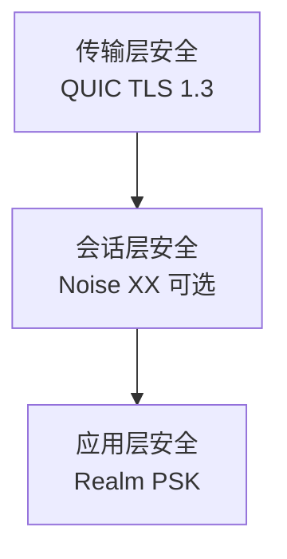

# F4: 安全层需求

> 定义 DeP2P 的传输加密和身份验证能力

---

## 需求列表

| ID | 标题 | 优先级 | 状态 |
|----|------|--------|------|
| [REQ-SEC-001](REQ-SEC-001.md) | 传输加密 | P0 | draft |
| [REQ-SEC-002](REQ-SEC-002.md) | 身份验证 | P1 | draft |

---

## 核心设计

- **强制加密**：所有连接必须加密
- **TLS 1.3**：QUIC 内置现代加密
- **身份绑定**：NodeID = Hash(PublicKey)

---

## 安全分层

---

## 关键竞品参考

| 竞品 | 特点 | DeP2P 借鉴 |
|------|------|------------|
| iroh | TLS 1.3、0-RTT | 传输安全 |
| libp2p | Noise XX | 可选认证层 |

---

**最后更新**：2026-01-11
