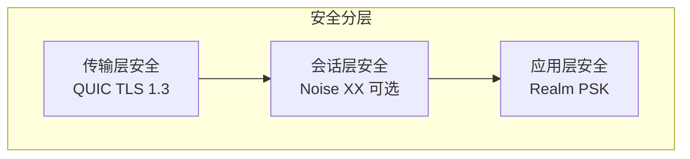
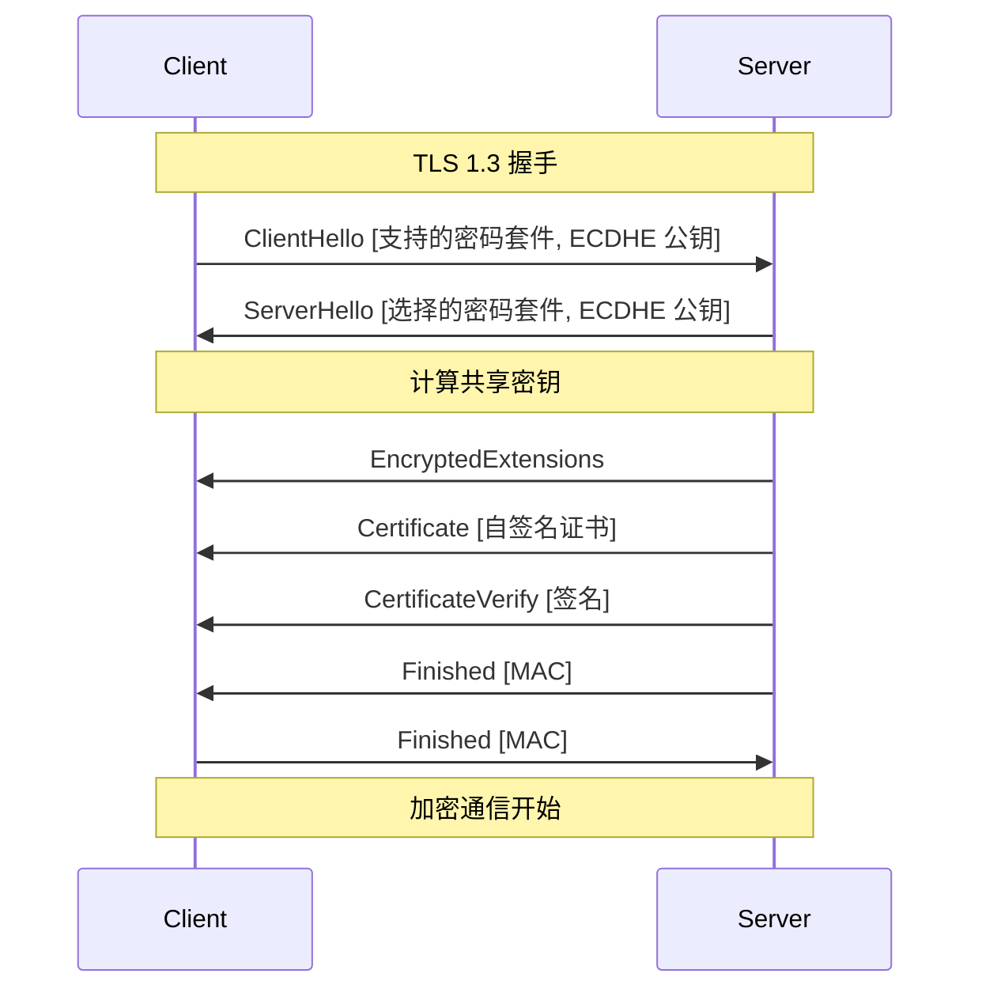
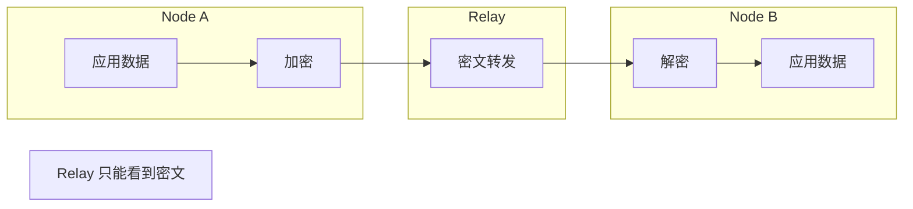

# REQ-SEC-001: 传输加密

## 1. 元数据

| 属性 | 值 |
|------|---|
| **ID** | REQ-SEC-001 |
| **标题** | 传输加密 |
| **类型** | generic |
| **层级** | F4: 安全层 |
| **优先级** | P0 |
| **状态** | draft |
| **创建日期** | 2026-01-11 |
| **更新日期** | 2026-01-11 |

---

## 2. 需求描述

DeP2P 必须对所有传输进行加密，采用 QUIC TLS 1.3 作为传输层安全，可选 Noise XX 作为应用层认证，确保数据的机密性、完整性和真实性。

---

## 3. 背景与动机

### 3.1 问题陈述

P2P 网络面临以下安全威胁：

1. **窃听**：明文数据被截获
2. **篡改**：数据被中间人修改
3. **伪装**：攻击者冒充合法节点
4. **重放**：旧数据被重新发送

### 3.2 目标

实现端到端加密，保证：
- **机密性**：数据不可被窃听
- **完整性**：数据不可被篡改
- **真实性**：通信方身份可验证
- **前向安全**：密钥泄露不影响历史会话

### 3.3 竞品参考

| 产品 | 加密方式 | 特点 |
|------|----------|------|
| **iroh** | TLS 1.3 (QUIC) | 现代，0-RTT |
| **go-libp2p** | Noise XX / TLS | 灵活选择 |
| **torrent** | MSE (可选) | 较弱，仅混淆 |

**选择**：QUIC TLS 1.3（必选）+ Noise XX（可选）

---

## 4. 需求详情

### 4.1 功能要求

1. **强制加密**：所有连接必须加密
2. **TLS 1.3**：QUIC 内置 TLS
3. **证书管理**：自签名证书支持
4. **密码套件**：现代密码学
5. **前向安全**：ECDHE 密钥交换

### 4.2 安全分层



### 4.3 TLS 1.3 配置

```go
// TLS 配置
type TLSConfig struct {
    // 证书（自签名）
    Certificate tls.Certificate
    
    // 支持的密码套件
    CipherSuites []uint16
    
    // 最低 TLS 版本
    MinVersion uint16 // TLS 1.3
    
    // ALPN 协议
    NextProtos []string
}

// 默认密码套件
var DefaultCipherSuites = []uint16{
    tls.TLS_AES_256_GCM_SHA384,
    tls.TLS_AES_128_GCM_SHA256,
    tls.TLS_CHACHA20_POLY1305_SHA256,
}
```

### 4.4 密钥交换



### 4.5 证书管理

```go
// CertificateManager 证书管理器
type CertificateManager interface {
    // GenerateCertificate 生成自签名证书
    GenerateCertificate(privateKey ed25519.PrivateKey) (tls.Certificate, error)
    
    // VerifyCertificate 验证证书
    VerifyCertificate(cert *x509.Certificate, expectedNodeID NodeID) error
    
    // LoadCertificate 加载证书
    LoadCertificate(path string) (tls.Certificate, error)
    
    // SaveCertificate 保存证书
    SaveCertificate(cert tls.Certificate, path string) error
}
```

### 4.6 证书格式

```go
// 自签名证书规范
// Subject: CN=<NodeID-Base58>
// Validity: 1 year
// Key Usage: Digital Signature, Key Encipherment
// Extended Key Usage: Client Auth, Server Auth
// SAN: 无（使用 NodeID 验证）

// 证书验证流程
// 1. 解析证书
// 2. 从 Subject CN 提取 NodeID
// 3. 验证 NodeID == Hash(证书公钥)
// 4. 验证签名
```

### 4.7 Noise XX（可选）

```go
// NoiseConfig Noise 配置
type NoiseConfig struct {
    // 启用 Noise
    Enabled bool
    
    // 本地密钥
    PrivateKey ed25519.PrivateKey
}

// Noise XX 握手模式
// -> e
// <- e, ee, s, es
// -> s, se
```

### 4.8 端到端加密



### 4.9 配置选项

```go
// 安全配置
dep2p.WithSecurity(dep2p.SecurityConfig{
    // TLS 配置
    TLSConfig: &tls.Config{
        MinVersion:   tls.VersionTLS13,
        CipherSuites: DefaultCipherSuites,
    },
    
    // 证书路径（可选，自动生成）
    CertFile: "/path/to/cert.pem",
    KeyFile:  "/path/to/key.pem",
    
    // Noise 配置（可选）
    EnableNoise: false,
})
```

### 4.10 错误处理

| 场景 | 错误 | 说明 |
|------|------|------|
| 握手失败 | `ErrHandshakeFailed` | TLS 握手失败 |
| 证书无效 | `ErrInvalidCertificate` | 证书验证失败 |
| 身份不匹配 | `ErrIdentityMismatch` | NodeID 不匹配 |
| 密码套件不支持 | `ErrNoCipherSuite` | 无共同密码套件 |

---

## 5. 验收标准

- [ ] 所有连接强制加密
- [ ] 使用 TLS 1.3
- [ ] 支持现代密码套件（AES-GCM, ChaCha20）
- [ ] 自签名证书正确生成和验证
- [ ] NodeID 与证书绑定验证
- [ ] 前向安全（ECDHE）
- [ ] Relay 转发时端到端加密
- [ ] 错误场景正确处理

---

## 6. 非功能要求

| 维度 | 要求 |
|------|------|
| **安全强度** | 256 位对称密钥 |
| **性能** | 握手 < 50ms |
| **兼容性** | 标准 TLS 1.3 |

---

## 7. 关联文档

| 类型 | 链接 |
|------|------|
| **竞品** | [加密对比](../../references/comparison/security/02-encryption.md) |
| **需求** | [REQ-SEC-002](REQ-SEC-002.md): 身份验证 |
| **需求** | [REQ-ID-001](../F1_identity/REQ-ID-001.md): NodeID 设计 |
| **需求** | [REQ-TRANS-001](../F2_transport/REQ-TRANS-001.md): QUIC 传输 |

---

## 8. 实现追踪

### 8.1 代码引用

| 文件 | 符号 | 状态 |
|------|------|------|
| `internal/core/security/tls.go` | `TLSConfig` | ⏳ 待实现 |
| `internal/core/security/certificate.go` | `CertificateManager` | ⏳ 待实现 |
| `internal/core/security/noise.go` | `NoiseTransport` | ⏳ 待实现 |

### 8.2 测试证据

| 测试文件 | 测试函数 | 状态 |
|----------|----------|------|
| `internal/core/security/tls_test.go` | `TestTLSHandshake` | ⏳ 待实现 |
| `internal/core/security/certificate_test.go` | `TestCertificateGeneration` | ⏳ 待实现 |

---

## 9. 变更历史

| 日期 | 版本 | 变更说明 |
|------|------|----------|
| 2026-01-11 | 1.0 | 初始版本 |
