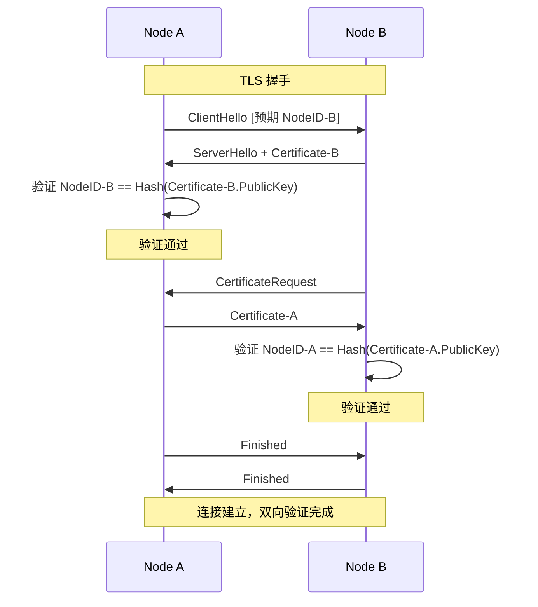

# REQ-SEC-002: 身份验证

## 1. 元数据

| 属性 | 值 |
|------|---|
| **ID** | REQ-SEC-002 |
| **标题** | 身份验证 |
| **类型** | generic |
| **层级** | F4: 安全层 |
| **优先级** | P1 |
| **状态** | draft |
| **创建日期** | 2026-01-11 |
| **更新日期** | 2026-01-11 |

---

## 2. 需求描述

DeP2P 必须在连接建立时验证对端身份，确保连接到的节点确实拥有声称的 NodeID 对应的私钥。

---

## 3. 背景与动机

### 3.1 问题陈述

P2P 网络中存在身份伪造风险：

1. **中间人攻击**：攻击者冒充目标节点
2. **Sybil 攻击**：创建大量虚假身份
3. **身份窃取**：使用他人的 NodeID

### 3.2 目标

实现可靠的身份验证：
- 连接时验证对端身份
- 确保 NodeID 与密钥对应
- 支持 Realm PSK 验证（关联 REQ-REALM-002）

### 3.3 竞品参考

| 产品 | 身份验证 | 特点 |
|------|----------|------|
| **iroh** | 公钥证书 | TLS 握手中验证 |
| **go-libp2p** | Noise 签名 | 握手中交换签名 |
| **torrent** | 无 | 仅 PeerID 匹配 |

**选择**：TLS 证书验证 + 可选 Noise 签名

---

## 4. 需求详情

### 4.1 功能要求

1. **连接时验证**：握手时验证身份
2. **公钥签名**：证明密钥所有权
3. **NodeID 绑定**：NodeID = Hash(PublicKey)
4. **双向验证**：客户端和服务端互相验证

### 4.2 验证流程



### 4.3 验证接口

```go
// IdentityVerifier 身份验证器
type IdentityVerifier interface {
    // VerifyPeer 验证对端身份
    VerifyPeer(conn Connection, expectedID NodeID) error
    
    // ExtractNodeID 从连接中提取 NodeID
    ExtractNodeID(conn Connection) (NodeID, error)
}

// 验证错误
var (
    ErrIdentityMismatch   = errors.New("identity mismatch")
    ErrInvalidCertificate = errors.New("invalid certificate")
    ErrNoIdentity         = errors.New("no identity presented")
)
```

### 4.4 证书身份绑定

```go
// 证书中的身份信息
// Subject.CommonName = NodeID (Base58)
// 
// 验证步骤：
// 1. 解析证书获取公钥
// 2. 计算 NodeID = SHA256(PublicKey)
// 3. 比较 NodeID == 证书 CN
// 4. 比较 NodeID == 预期 NodeID

func VerifyCertificateIdentity(cert *x509.Certificate, expectedID NodeID) error {
    // 1. 提取公钥
    pubKey, ok := cert.PublicKey.(ed25519.PublicKey)
    if !ok {
        return ErrInvalidCertificate
    }
    
    // 2. 计算 NodeID
    computedID := NodeIDFromPublicKey(pubKey)
    
    // 3. 验证 CN
    cnID, err := ParseNodeID(cert.Subject.CommonName)
    if err != nil || cnID != computedID {
        return ErrIdentityMismatch
    }
    
    // 4. 验证预期 ID
    if computedID != expectedID {
        return ErrIdentityMismatch
    }
    
    return nil
}
```

### 4.5 握手扩展

```go
// 握手扩展用于传递额外验证信息

// HandshakeExtension 握手扩展
type HandshakeExtension struct {
    // Nonce 随机数（防重放）
    Nonce []byte
    
    // Timestamp 时间戳
    Timestamp time.Time
    
    // Signature 签名
    Signature []byte
}

// 签名内容 = Nonce || Timestamp || LocalNodeID || RemoteNodeID
```

### 4.6 Realm PSK 验证（扩展）

```go
// RealmPSKVerifier Realm PSK 验证（关联 REQ-REALM-002）
type RealmPSKVerifier interface {
    // VerifyRealmMembership 验证 Realm 成员身份
    VerifyRealmMembership(conn Connection, realmID RealmID) error
}

// PSK 验证在身份验证之后进行
// 1. 完成基础身份验证
// 2. 交换 Realm 握手
// 3. 验证 PSK 派生的 MAC
```

### 4.7 连接钩子

```go
// 连接验证钩子
type ConnectionHooks interface {
    // BeforeConnect 连接前
    BeforeConnect(ctx context.Context, remoteID NodeID) error
    
    // AfterHandshake 握手后
    AfterHandshake(conn Connection) error
}

// 使用
dep2p.WithConnectionHooks(hooks)
```

### 4.8 拒绝策略

```go
// PeerGater 节点过滤
type PeerGater interface {
    // AllowConnect 是否允许连接
    AllowConnect(nodeID NodeID) bool
    
    // Block 屏蔽节点
    Block(nodeID NodeID, duration time.Duration, reason string)
    
    // Unblock 解除屏蔽
    Unblock(nodeID NodeID)
    
    // IsBlocked 是否被屏蔽
    IsBlocked(nodeID NodeID) bool
}
```

### 4.9 配置选项

```go
// 身份验证配置
dep2p.WithIdentityVerification(dep2p.VerificationConfig{
    // 强制双向验证
    MutualAuth: true,
    
    // 允许的节点列表（可选）
    AllowList: []NodeID{...},
    
    // 屏蔽的节点列表
    BlockList: []NodeID{...},
})
```

### 4.10 错误处理

| 场景 | 错误 | 说明 |
|------|------|------|
| 身份不匹配 | `ErrIdentityMismatch` | NodeID 与证书不符 |
| 证书无效 | `ErrInvalidCertificate` | 证书格式错误 |
| 无身份信息 | `ErrNoIdentity` | 对端未提供身份 |
| 节点被屏蔽 | `ErrPeerBlocked` | 在屏蔽列表中 |
| 签名无效 | `ErrInvalidSignature` | 签名验证失败 |

---

## 5. 验收标准

- [ ] 连接时验证对端 NodeID
- [ ] NodeID 与公钥正确绑定
- [ ] 双向验证正常工作
- [ ] 身份不匹配时拒绝连接
- [ ] 支持节点屏蔽
- [ ] 支持允许列表
- [ ] 错误场景正确处理

---

## 6. 非功能要求

| 维度 | 要求 |
|------|------|
| **安全** | 防止身份伪造 |
| **性能** | 验证 < 10ms |
| **可用性** | 验证失败明确报错 |

---

## 7. 关联文档

| 类型 | 链接 |
|------|------|
| **竞品** | [身份对比](../../references/comparison/security/01-identity.md) |
| **需求** | [REQ-ID-001](../F1_identity/REQ-ID-001.md): NodeID 设计 |
| **需求** | [REQ-SEC-001](REQ-SEC-001.md): 传输加密 |
| **需求** | [REQ-REALM-002](../F5_realm/REQ-REALM-002.md): Realm PSK 认证 |

---

## 8. 实现追踪

### 8.1 代码引用

| 文件 | 符号 | 状态 |
|------|------|------|
| `internal/core/security/verifier.go` | `IdentityVerifier` | ⏳ 待实现 |
| `internal/core/security/gater.go` | `PeerGater` | ⏳ 待实现 |

### 8.2 测试证据

| 测试文件 | 测试函数 | 状态 |
|----------|----------|------|
| `internal/core/security/verifier_test.go` | `TestIdentityVerification` | ⏳ 待实现 |
| `internal/core/security/verifier_test.go` | `TestIdentityMismatch` | ⏳ 待实现 |

---

## 9. 变更历史

| 日期 | 版本 | 变更说明 |
|------|------|----------|
| 2026-01-11 | 1.0 | 初始版本 |
