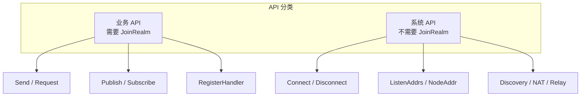
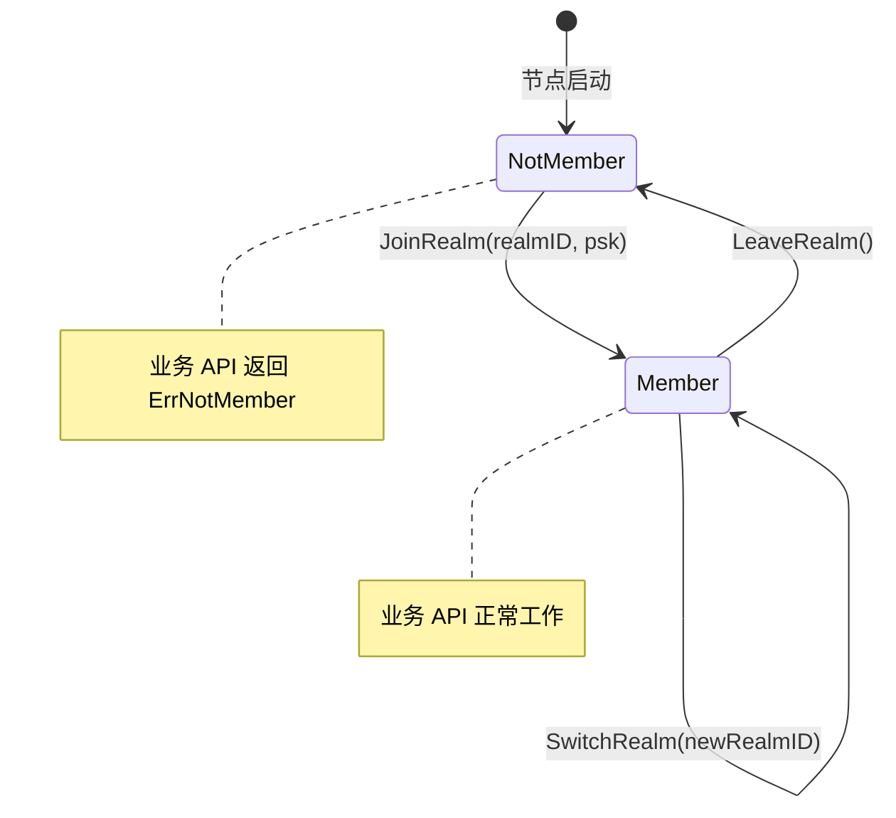

# REQ-REALM-001: Realm 强制隔离

## 1. 元数据

| 属性 | 值 |
|------|---|
| **ID** | REQ-REALM-001 |
| **标题** | Realm 强制隔离 |
| **类型** | dep2p-specific |
| **层级** | F5: Realm 层 |
| **优先级** | P0 |
| **状态** | draft |
| **创建日期** | 2026-01-11 |
| **更新日期** | 2026-01-11 |

---

## 2. 需求描述

Realm 是 DeP2P 的业务隔离域，未加入 Realm 的节点调用业务 API 时必须返回 `ErrNotMember` 错误，确保不同业务域之间的隔离。

---

## 3. 背景与动机

### 3.1 问题陈述

在多租户/多业务场景下，需要确保：

1. **数据隔离**：应用 A 的消息不应被应用 B 收到
2. **安全隔离**：恶意节点不能伪装成其他业务成员
3. **简化编程**：用户不需要在每次调用时传递 tenantID

### 3.2 目标

设计 Realm 作为业务隔离单元，类似于：
- Kubernetes 的 Namespace
- 云厂商的 VPC
- 数据库的 Schema

### 3.3 竞品参考

| 产品 | 隔离机制 | 评价 |
|------|----------|------|
| **iroh** | 无 | 不支持业务隔离 |
| **go-libp2p** | 无原生支持 | 需应用层实现 |
| **torrent** | InfoHash | 仅限种子隔离 |

**结论**：Realm 是 DeP2P 的**独有创新**。

---

## 4. 需求详情

### 4.1 核心原则

1. **单 Realm 模型**：每个节点同一时间只能加入一个 Realm
2. **业务 API 受限**：业务 API 必须先 JoinRealm 才能使用
3. **系统 API 不受限**：系统 API 不需要 JoinRealm

### 4.2 API 分类



| 分类 | API | 需要 JoinRealm |
|------|-----|----------------|
| **业务 API** | `Send`, `Request`, `Publish`, `Subscribe` | ✅ 是 |
| **系统 API** | `Connect`, `Disconnect`, `ListenAddrs` | ❌ 否 |
| **系统 API** | `Discovery`, `NAT`, `Relay` 服务 | ❌ 否 |

### 4.3 Realm 状态机



### 4.4 接口定义

```go
// RealmID 表示 Realm 唯一标识
type RealmID string

// RealmManager 管理 Realm 成员状态
type RealmManager interface {
    // JoinRealm 加入 Realm
    JoinRealm(ctx context.Context, realmID RealmID, psk []byte) error
    
    // LeaveRealm 离开当前 Realm
    LeaveRealm(ctx context.Context) error
    
    // CurrentRealm 返回当前 Realm（如果已加入）
    CurrentRealm() (RealmID, bool)
    
    // IsMember 检查是否已加入 Realm
    IsMember() bool
}

// Node 接口中的 Realm 相关方法
type Node interface {
    // JoinRealm 加入 Realm
    JoinRealm(ctx context.Context, realmID RealmID, psk []byte) error
    
    // LeaveRealm 离开当前 Realm
    LeaveRealm(ctx context.Context) error
    
    // CurrentRealm 返回当前 Realm
    CurrentRealm() (RealmID, bool)
    
    // ... 其他方法
}
```

### 4.5 业务 API 守卫

```go
// 业务 API 实现模式
func (n *node) Send(ctx context.Context, to NodeID, proto string, data []byte) error {
    // 守卫：检查 Realm 成员状态
    if !n.realm.IsMember() {
        return ErrNotMember
    }
    
    // 正常处理...
}
```

### 4.6 错误处理

| 场景 | 错误 | 说明 |
|------|------|------|
| 未 JoinRealm 调用业务 API | `ErrNotMember` | 必须先加入 Realm |
| 已加入 Realm 再次 JoinRealm | `ErrAlreadyJoined` | 需要先 LeaveRealm |
| Realm ID 无效 | `ErrInvalidRealm` | 格式或权限问题 |
| PSK 验证失败 | `ErrInvalidPSK` | PSK 不匹配 |

### 4.7 使用示例

```go
// 正确用法
node, _ := dep2p.NewNode(opts...)
defer node.Close()

// 1. 必须先 JoinRealm
err := node.JoinRealm(ctx, "my-realm", psk)
if err != nil {
    log.Fatal(err)
}

// 2. 然后才能使用业务 API
err = node.Send(ctx, targetID, "/app/msg", []byte("hello"))

// 3. 切换 Realm
err = node.LeaveRealm(ctx)
err = node.JoinRealm(ctx, "another-realm", anotherPSK)
```

```go
// 错误用法
node, _ := dep2p.NewNode(opts...)

// 直接调用 Send 会返回 ErrNotMember
err := node.Send(ctx, targetID, "/app/msg", []byte("hello"))
// err == ErrNotMember
```

---

## 5. 验收标准

- [ ] 未 JoinRealm 调用 `Send` 返回 `ErrNotMember`
- [ ] 未 JoinRealm 调用 `Request` 返回 `ErrNotMember`
- [ ] 未 JoinRealm 调用 `Publish` 返回 `ErrNotMember`
- [ ] 未 JoinRealm 调用 `Subscribe` 返回 `ErrNotMember`
- [ ] JoinRealm 后业务 API 正常工作
- [ ] LeaveRealm 后业务 API 返回 `ErrNotMember`
- [ ] 已加入 Realm 再次 JoinRealm 返回 `ErrAlreadyJoined`
- [ ] 系统 API 不需要 JoinRealm
- [ ] CurrentRealm 正确返回当前 Realm

---

## 6. 非功能要求

| 维度 | 要求 |
|------|------|
| **性能** | IsMember 检查 < 1μs |
| **可用性** | JoinRealm/LeaveRealm 原子操作 |

---

## 7. 关联文档

| 类型 | 链接 |
|------|------|
| **决策** | ADR-002: Realm 隔离 |
| **需求** | [REQ-REALM-002](REQ-REALM-002.md): Realm PSK 认证 |
| **需求** | [REQ-REALM-003](REQ-REALM-003.md): Relay |
| **架构** | L5: Realm 层 |

---

## 8. 实现追踪

### 8.1 代码引用

| 文件 | 符号 | 状态 |
|------|------|------|
| `pkg/dep2p/node.go` | `Node.JoinRealm` | ⏳ 待实现 |
| `pkg/dep2p/node.go` | `Node.LeaveRealm` | ⏳ 待实现 |
| `internal/core/realm/manager.go` | `RealmManager` | ⏳ 待实现 |

### 8.2 测试证据

| 测试文件 | 测试函数 | 状态 |
|----------|----------|------|
| `tests/realm/realm_test.go` | `TestSendWithoutJoinRealm` | ⏳ 待实现 |
| `tests/realm/realm_test.go` | `TestSendAfterJoinRealm` | ⏳ 待实现 |
| `tests/realm/realm_test.go` | `TestLeaveRealm` | ⏳ 待实现 |

---

## 9. 变更历史

| 日期 | 版本 | 变更说明 |
|------|------|----------|
| 2026-01-11 | 1.0 | 初始版本，从归档文档迁移并增强 |
