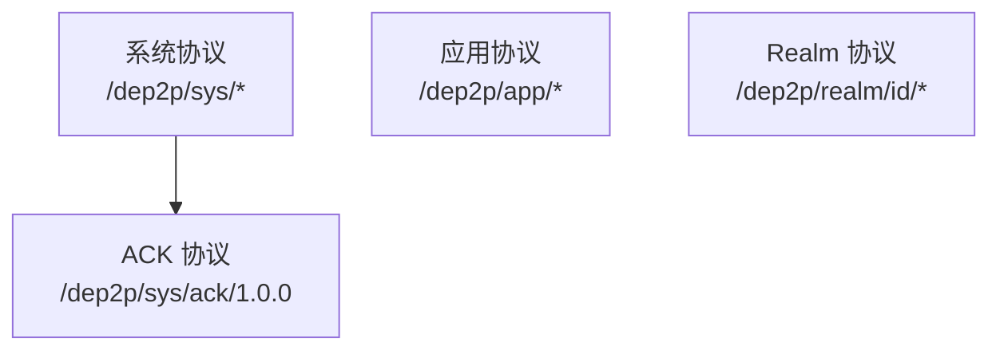

# F6: 协议层需求

> 定义 DeP2P 的协议命名、消息格式、通信模式和可靠投递

---

## 需求列表

| ID | 标题 | 优先级 | 状态 | 来源 |
|----|------|--------|------|------|
| [REQ-PROTO-001](REQ-PROTO-001.md) | 协议命名空间 | P1 | draft | 竞品分析 |
| [REQ-PROTO-002](REQ-PROTO-002.md) | 消息格式 | P2 | draft | 竞品分析 |
| [REQ-PROTO-003](REQ-PROTO-003.md) | 流式通信 | P1 | draft | 竞品分析 |
| [REQ-PROTO-004](REQ-PROTO-004.md) | **可靠消息投递** | **P0** | draft | **旧 dep2p** |

---

## 核心设计

- **层次化命名**：`/dep2p/{domain}/{protocol}/{version}`
- **Protobuf 序列化**：高效、可扩展
- **多种通信模式**：请求-响应、流式、双向
- **★ 可靠投递**：消息队列 + ACK 确认 + 自动重试

---

## 协议分类

---

## 关键竞品参考

| 竞品 | 特点 | DeP2P 借鉴 |
|------|------|------------|
| libp2p | multistream-select | 协议协商 |
| gRPC | 四种通信模式 | 流式通信 |
| MQTT | QoS 0/1/2 | 分级投递语义 |
| **旧 dep2p** | **ReliablePublisher + ACK** | **可靠消息投递** |

---

## 2026-01-18 新增需求说明

### REQ-PROTO-004: 可靠消息投递

解决 GossipSub `Publish` best-effort 语义的问题：
- 消息队列：网络不可用时缓存消息
- ACK 确认：支持关键节点确认
- 自动重试：超时后自动重发
- 分级语义：best-effort / queued / acked

---

**最后更新**：2026-01-18
